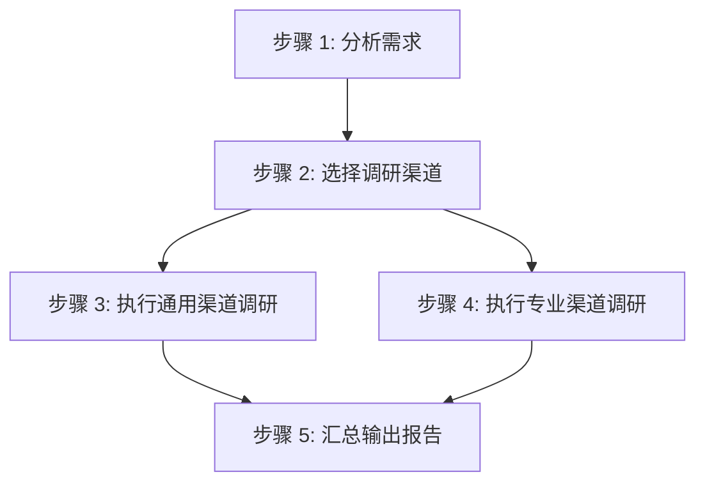

# Spec: 添加 researcher agent（Phase 1 调研）

## 背景

当前 uluo-skill-creator 只有一个运行时 agent（grader.md，质量评分）。Phase 1 调研环节在 SKILL.md 中仅作为流程节点，无独立 agent 承载。调研工作需要大量信息收集（现有 skill、技术方案、最佳实践），会消耗大量 token 并污染主流程上下文，适合用子代理隔离。

**核心挑战**：uluo-skill-creator 创建的 skill 领域不确定（可能是前端/后端/数据处理/文档处理等），调研渠道需要灵活适配，不能预设固定渠道。

## 目标

### 新增 researcher agent

**文件**：`agents/researcher.md`

**单一职责**：只做综合调研，不设计/编写/评分。调研现有类似 skill、技术方案、最佳实践，输出结构化调研报告。

**语言**：全中文（专有名词除外），与 grader.md 保持一致。

### 分层调研渠道设计

**解决"领域不确定"问题**：采用分层渠道策略——通用渠道脚本固化 + 专业渠道按需推荐。

| 层级 | 类型 | 承载方式 | 说明 |
|------|------|---------|------|
| L1 通用渠道 | 脚本固化 | `scripts/research.js` | 所有 skill 都适用的调研渠道（GitHub search、本地 skill 扫描、anthropics/skills 参考） |
| L2 专业渠道 | agent 推荐 | `researcher.md` 内置推荐规则 | 根据 skill 领域推荐对应文档/资源（前端→MDN、后端→Node.js 文档等） |
| L3 按需扩展 | 用户指定 | agent 运行时接收 | 用户在需求中指定的特定资源 |

### researcher agent 流程



**步骤详解**：
1. **分析需求**——从 skill 需求描述中提取领域关键词、技术栈、目标场景
2. **选择调研渠道**——L1 通用渠道必选 + L2 专业渠道按领域匹配 + L3 用户指定资源
3. **执行通用渠道调研**——调用 `scripts/research.js` 或直接使用 WebSearch/Grep
4. **执行专业渠道调研**——按推荐的 L2 渠道调研
5. **汇总输出报告**——结构化 JSON 报告

### 通用渠道脚本（scripts/research.js）

**职责**：固化 L1 通用调研渠道，提供确定性调研结果。

**功能**：
- 扫描本地 skills/ 目录，查找类似 skill
- 扫描 anthropics/skills 仓库（本地缓存或 GitHub raw）
- 输出 JSON 格式的类似 skill 列表

**输入**：skill 需求关键词
**输出**：类似 skill 列表 JSON

### 专业渠道推荐规则（researcher.md 内置）

**领域识别关键词 → 推荐渠道**：

| 领域 | 识别关键词 | 推荐渠道 |
|------|-----------|---------|
| 前端 | React/Vue/Angular/CSS/HTML/组件 | MDN、caniuse、对应框架官方文档 |
| 后端 | API/server/数据库/Node.js/Python | 对应语言官方文档、框架文档 |
| 数据处理 | pandas/numpy/sql/ETL | 对应库官方文档 |
| 文档处理 | PDF/Word/Excel/markdown | 对应工具文档（pypdf、docx 等） |
| DevOps | Docker/K8s/CI/CD | Docker/K8s 官方文档 |
| AI/ML | model/training/inference | Hugging Face、OpenAI API 文档 |
| 通用 | 未匹配 | WebSearch 通用搜索 |

**规则**：agent 根据需求关键词匹配领域，推荐对应渠道。未匹配时回退到通用 WebSearch。

### 输出格式（调研报告 JSON）

```json
{
  "skill_domain": "前端",
  "similar_skills": [
    {
      "name": "existing-skill-name",
      "source": "local | github | anthropics",
      "relevance": "high | medium | low",
      "summary": "skill 简要说明"
    }
  ],
  "technical_solutions": [
    {
      "solution": "技术方案名称",
      "source": "渠道来源",
      "applicability": "适用场景说明"
    }
  ],
  "best_practices": [
    {
      "practice": "最佳实践描述",
      "source": "渠道来源",
      "reason": "推荐理由"
    }
  ],
  "recommended_channels": [
    {
      "channel": "渠道名称",
      "url": "渠道地址",
      "type": "L1 通用 | L2 专业 | L3 用户指定"
    }
  ]
}
```

## 修改范围

| 文件 | 修改内容 |
|------|---------|
| `agents/researcher.md` | 新建——researcher agent 指令文件，全中文 |
| `scripts/research.js` | 新建——L1 通用渠道调研脚本（本地 skill 扫描） |
| `scripts/__tests__/research.test.js` | 新建——research.js 测试 |
| `references/agents-decision.md` | 更新——运行时 agent 示例增加 researcher |
| `references/agent-creation-guide.md` | 检查——是否需补充多 agent 协作说明 |
| `SKILL.md` | 更新——Phase 1 引用 researcher agent，references 引用时机表更新 |
| `scripts/grade-skill.js` | 检查——agents/ 目录评分逻辑是否需调整（当前不强制要求 agents/） |

## 非目标

- 不修改 grader.md（已完成的 agent 保持不变）
- 不修改 Phase 0 需求收集（仍由主流程与用户交互）
- 不强制要求所有 skill 都有 agents/（简单 skill 仍可跳过）
- 不预设固定专业渠道（按需求推荐，保持灵活）

## 规范适用范围

**关键**：本 spec 的规范不仅适用于 uluo-skill-creator 自身，更适用于**用户使用 uluo-skill-creator 创建的所有 skill**。

| 规范 | 适用对象 |
|------|---------|
| researcher agent 设计模式（分层渠道 + 综合调研） | uluo-skill-creator 自身 |
| 调研渠道分层策略（L1 通用 + L2 专业 + L3 按需） | uluo-skill-creator 自身 + 产出的 skill（若需要调研环节） |
| agent 文件名简短 + 全中文 + 单一职责 | uluo-skill-creator 自身 + 产出的 skill |

**agent-creation-guide.md 更新后**：用户创建需要调研环节的 skill 时，可参考 researcher.md 作为设计范例。
