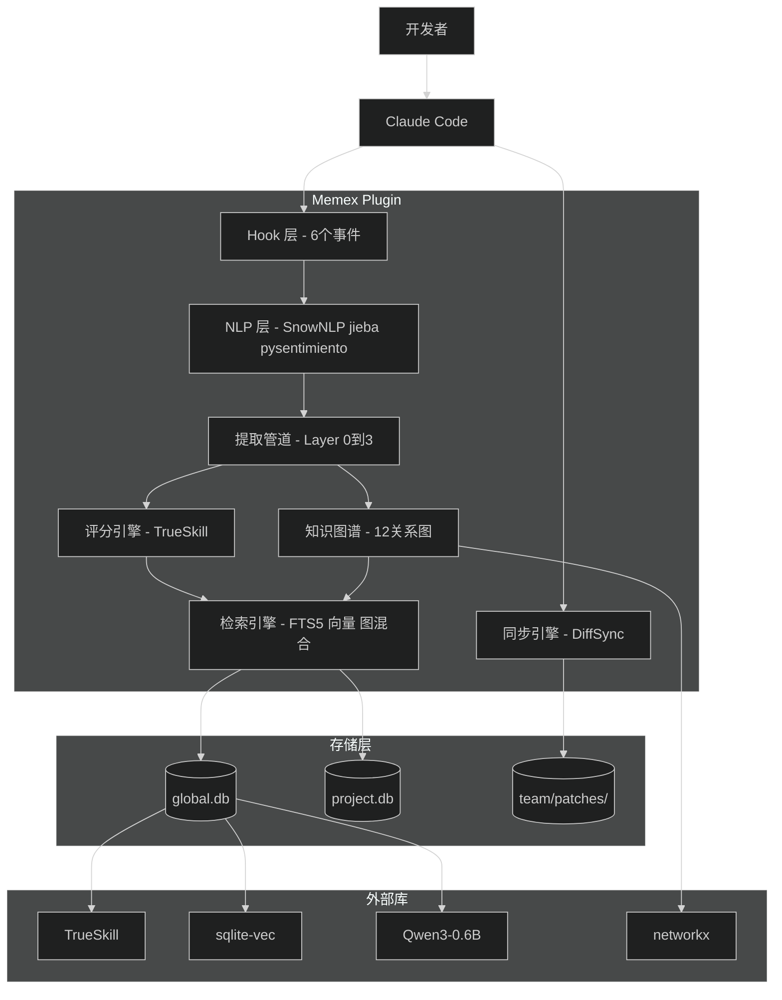
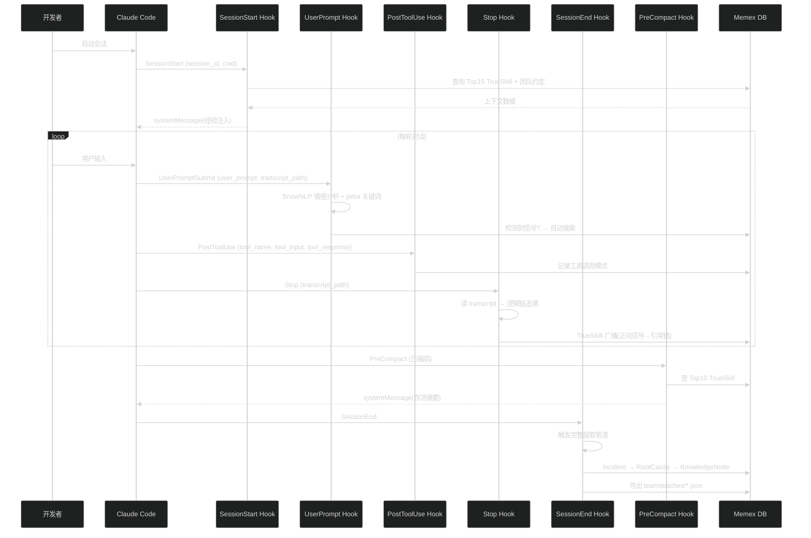
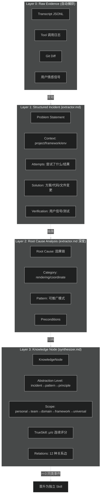
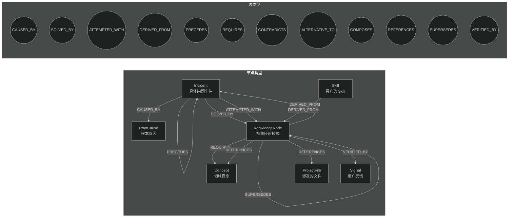
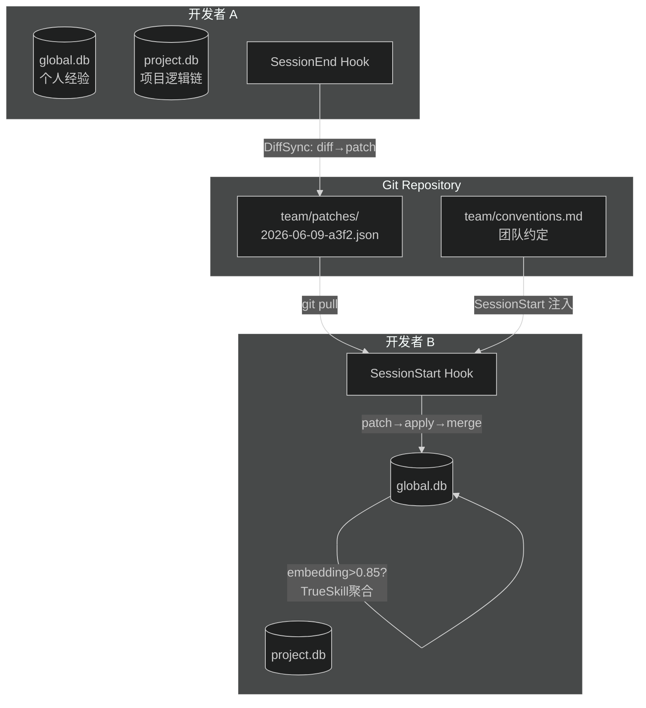
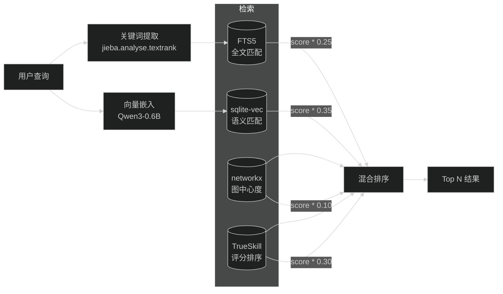
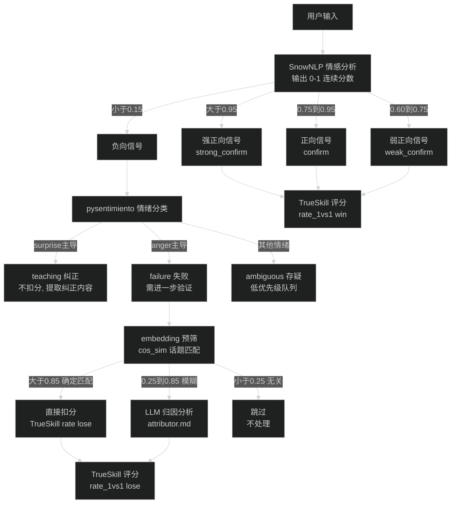
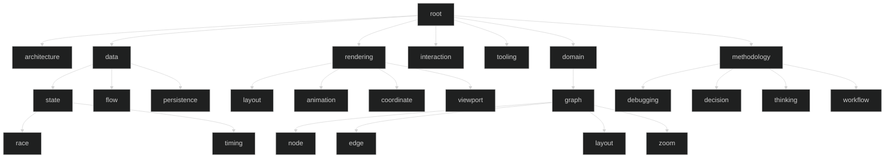

# Memex — Claude Code 长期经验记忆插件

> **原则：站在巨人肩膀上，不手搓轮子。** 每项设计都有成熟库或研究论文背书。
>
> *"As We May Think" — Vannevar Bush, The Atlantic, 1945*

---

## 目录

1. [架构总览（Mermaid）](#架构总览mermaid)
2. [这是什么](#这是什么)
3. [可行性：Hook 能拿到什么](#可行性hook-能拿到什么)
4. [核心设计 #1：TrueSkill 贝叶斯连续评分](#核心设计-1trueskill-贝叶斯连续评分)
5. [核心设计 #2：巴普洛夫情感强化](#核心设计-2巴普洛夫情感强化)
6. [核心设计 #3：混合检索（FTS5 + 向量 + 图）](#核心设计-3混合检索fts5--向量--图)
7. [核心设计 #4：上下文注入与压缩存活](#核心设计-4上下文注入与压缩存活)
8. [核心设计 #5：交互式知识图谱可视化](#核心设计-5交互式知识图谱可视化)
9. [核心设计 #6：知识提取与层级架构](#核心设计-6知识提取与层级架构)
10. [核心设计 #7：知识图谱与逻辑链](#核心设计-7知识图谱与逻辑链)
11. [核心设计 #8：技术边界与整体架构评估](#核心设计-8技术边界与整体架构评估)
12. [核心设计 #9：知识作用域与团队自动协作](#核心设计-9知识作用域与团队自动协作)
13. [核心设计 #10：冷启动与增量回溯](#核心设计-10冷启动与增量回溯)
14. [Python 依赖与权威背书](#python-依赖与权威背书)
15. [LLM 调用策略](#llm-调用策略)
16. [插件结构与文件清单](#插件结构与文件清单)
17. [分层实施](#分层实施)
18. [设计决策表](#设计决策表)
19. [验证](#验证)

---

## 架构总览（Mermaid）

### 系统全景



### 运行时数据流



### 四层知识提取管道



### 知识图谱 Schema



### 双层存储 + 差分同步



### 混合检索排序



### 巴普洛夫情感信号流



### 层级分类树



---

## 这是什么

一个 Claude Code 插件，**自动从对话中学习**：

- 你随口说"完美！解决了！"→ 系统自动加强相关的经验评分（巴普洛夫条件反射）
- 你纠正说"不对，应该是先改 A"→ 系统提取纠正当新经验，不扣分
- 你说"还是不行"→ 系统先 embedding 匹配话题，确认同问题才扣分
- 每次解决问题，自动四层提取：**原始证据 → 结构化事件 → 根因分析 → 知识节点**
- 所有知识自动组网：**因果链 CAUSED_BY、方案 SOLVED_BY、矛盾 CONTRADICTS** 等 12 种关系
- 支持"画布拖出界"语义搜索到"SVG viewBox 坐标映射"（中英混合 + 图增强排序）
- 每次新会话启动，自动注入最相关经验；压缩时关键经验存活不丢失

**一句话**：巴普洛夫条件反射 × TrueSkill 连续评分 × 四层知识提取 × 12 关系知识图谱 × 混合向量检索。

---

## 可行性：Hook 能拿到什么

### 权威来源交叉验证

| # | 来源 | 链接 |
|---|------|------|
| 1 | Anthropic 官方 Hook 文档 | [code.claude.com/docs/en/hooks](https://code.claude.com/docs/en/hooks) |
| 2 | ClaudeBuddy 技术博客（2026，真实 payload） | [claudebuddy.art](https://www.claudebuddy.art/blog/claude-code-hooks-complete-guide) |
| 3 | Matthew Sanabria（含 Go 代码实现，Stop hook 读 transcript） | [matthewsanabria.dev](https://matthewsanabria.dev/posts/running-jujutsu-with-claude-code-hooks/) |
| 4 | disler/claude-code-hooks-mastery | [github.com/disler](https://github.com/disler/claude-code-hooks-mastery) |
| 5 | Steve Kinney 课程 | [stevekinney.com](https://stevekinney.com/courses/ai-development/claude-code-hook-control-flow) |

### 关键 Hook 事件及数据

#### PostToolUse — 含完整 tool 输入输出

```json
{
  "session_id": "abc-123",
  "transcript_path": "~/.claude/projects/<proj>/abc-123.jsonl",
  "cwd": "/project/path",
  "hook_event_name": "PostToolUse",
  "tool_name": "Bash",
  "tool_input": { "command": "npm test" },
  "tool_response": { "exitCode": 0, "stdout": "All passed", "stderr": "" }
}
```

#### UserPromptSubmit — 含用户原始输入

```json
{
  "session_id": "abc-123",
  "cwd": "/project/path",
  "hook_event_name": "UserPromptSubmit",
  "user_prompt": "帮我修复 ReactFlow 边线消失的问题",
  "transcript_path": "~/.claude/projects/<proj>/abc-123.jsonl"
}
```

#### Stop / SessionStart / SessionEnd

```json
// Stop: { session_id, cwd, transcript_path }
// SessionStart: { session_id, cwd, resume }
// SessionEnd: { session_id, cwd, transcript_path }
```

### 诚实限制

| 能拿到 | 拿不到 |
|--------|--------|
| `transcript_path` → fopen JSONL 读取全部对话 | 子代理内部对话（独立 session） |
| `tool_input` + `tool_response` 完整数据 | Transcript 可能滞后（hook 时行未 flush） |
| `user_prompt` 原始文本 | Transcript 默认 30 天清理 |

---

## 核心设计 #1：TrueSkill 贝叶斯连续评分

### 权威背书

**[Microsoft Research, Herbrich et al. 2007](https://www.microsoft.com/en-us/research/project/trueskill-ranking-system/)** — Xbox Live 数百万玩家验证的评分系统。理论基础来自 Bradley-Terry 模型 + 贝叶斯推断。

### 为什么不手搓公式

手搓公式的问题：
- 颗粒度粗：只有 ~30 个整数档位
- 47 次验证和 3 次验证可能得分相同
- 不量化不确定性
- 负反馈一刀切扣分

TrueSkill 的核心思想：每条经验是一个 "player"，用户反馈是 "game result"。

```python
from trueskill import Rating, rate_1vs1

# 初始化：μ=25（估计分），σ=8.333（不确定性）
lesson = Rating()

# 用户说"完美！解决了！" → lesson "赢了"
lesson, _ = rate_1vs1(lesson, Rating())
# lesson.mu=27.3, lesson.sigma=7.2  ← 分数微升，不确定度下降

# 50 次正向验证后
# lesson.mu=34.2, lesson.sigma=1.8  ← 高分+高确定性

# 排序用保守估计：μ - 2σ（97.5% 概率不低于此值）
```

### 颗粒度对比

| 维度 | 手搓公式 | TrueSkill |
|------|---------|-----------|
| 分数范围 | 0-30 整数 | μ∈(-∞,+∞) 浮点，常规 ~5-45 |
| 颗粒度 | ~30 档 | **IEEE 754 float64 无限精度** |
| 不确定度 | 无 | σ，越小越确定 |
| 样本效应 | 1 次 = 50 次 | σ 自适应，新经验调幅大 |
| 保守排序 | 无 | `μ - 2σ` 可按"至少 97.5% 概率"排序 |

### 信号到评分更新

```python
def apply_signal(rating, signal_type, intensity, confidence):
    """intensity 和 confidence 都是 0-1 连续值"""
    q = min(intensity * confidence, 1.0)
    
    if signal_type == "confirm":
        rating, _ = rate_1vs1(rating, Rating(), quality=q)
    elif signal_type == "failure":
        _, rating = rate_1vs1(Rating(), rating, quality=q)
    elif signal_type == "correction":
        # 不扣分，但增大不确定性（可能不完整）
        rating = Rating(mu=rating.mu, sigma=min(rating.sigma * 1.1, 8.333))
    
    return rating
```

### 检索排序整合

```python
final_rank = (
    (lesson.conservative_score / 50.0) * 0.30   # TrueSkill 保守估计
    + normalized_vec_similarity * 0.35            # 语义相似
    + normalized_fts5_score * 0.25                # 关键词匹配
    + graph_boost * 0.10                          # 图中心度
)
```

**参考**：
- [TrueSkill 论文 (NeurIPS 2007)](https://papers.nips.cc/paper_files/paper/2006/hash/f44ee263952e65b3610b8ba51229d1f9-Abstract.html)
- [trueskill PyPI](https://pypi.org/project/trueskill/) — 纯 Python，~10KB
- [Coulom. "Bayesian Elo Rating." 2005.](https://www.remi-coulom.fr/Bayesian-Elo/) — 贝叶斯评分的数学基础

---

## 核心设计 #2：巴普洛夫情感强化

### 设计理念

用户对话中**自然流露**的评价是最高质量反馈——比任何显式评分真实。像巴普洛夫条件反射一样自动建立"信号→知识调整"映射。

**关键原则：负反馈必须归因验证**。"不对"可能指经验有误、场景不同、或完全无关。

### Layer 1：NLP 信号检测（不用 LLM）

**不手搓正则**。使用 [SnowNLP](https://github.com/isnowfy/snownlp)（4.5k★，中文情感分析）+ [jieba](https://github.com/fxsjy/jieba)（25k★，分词）+ [pysentimiento](https://github.com/pysentimiento/pysentimiento)（EMNLP 2021）。

```python
from snownlp import SnowNLP
from pysentimiento import create_analyzer
import jieba.analyse

def detect(text):
    s = SnowNLP(text)                      # 0-1 连续情感
    keywords = jieba.analyse.textrank(text, topK=5)
    
    if s.sentiments > 0.95:
        # 强正向，但还需要确认是不是针对 AI 方案的反馈
        return ("confirm", abs(s.sentiments - 0.5) * 2)
    elif s.sentiments < 0.15:
        # 需要区分纠正 vs 失败 vs 误解
        emotion = create_analyzer(task="emotion", lang="zh")
        result = emotion.predict(text)
        # surprise 主导 → 这是纠正（teaching），不扣分！
        # anger 主导   → 这是失败（failure），需要扣分
        return classify_negative(result, s.sentiments)
```

**pysentimiento 区分否定性质**（关键创新）：

| 用户说 | pysentimiento 输出 | 归类 | 动作 |
|--------|-------------------|------|------|
| "不对，应该是先改 A 再改 B" | surprise=0.45 | **teaching** | 不扣分，提取纠正 |
| "还是不行，完全没变化" | anger=0.52 | **failure** | 需扣分（送归因验证） |
| "不对，我说的不是这个意思" | surprise=0.38 | **misunderstanding** | 不处理 |

### 减少 LLM 调用的预筛

**只在模糊区间调 LLM**。两端直接用规则：

```python
def should_use_llm(neg_signal, db):
    topic_vec = embed(neg_signal.text)
    best = db.search_vec(topic_vec, top=1)
    cos_sim = cosine_similarity(topic_vec, best.embedding)
    
    if cos_sim > 0.85:    return "direct_penalize"   # 确定匹配，不调 LLM
    elif cos_sim < 0.25:  return "direct_skip"        # 确定无关，不调 LLM
    else:                 return "defer_to_llm"       # 模糊区间，调 LLM

# 估计只有 ~30% 负向信号需要 LLM 归因
```

### Layer 2：LLM 归因（Agent，仅模糊区间）

`agents/attributor.md` — 四问分析：

| 问题 | 输出 |
|------|------|
| Q1: 反馈针对什么具体方案/工具/思路？ | `target_topic` |
| Q2: 知识库中存在匹配的经验吗？ | `matched_ids[]` + `match_confidence` |
| Q3: 什么性质的否定？teaching / failure / misunderstanding / unrelated | `deny_type` |
| Q4: 上下文（问题背景、环境、约束）和经验记录时一致吗？ | `context_match` + `context_diff` |

**归因决策矩阵**：

| deny_type | context_match | confidence | 动作 |
|-----------|:---:|-----------|------|
| `teaching` | — | — | 不扣分，提取纠正为新经验 |
| `failure` | ✅ | ≥0.7 | TrueSkill `rate_1vs1(lose, quality=intensity×confidence)` |
| `failure` | ❌ | — | **不扣分**（环境不同，经验可能仍有效） |
| `misunderstanding` | — | — | 不处理 |
| `unrelated` | — | — | 不处理 |
| `failure` | ✅ | 0.4-0.7 | 降低 quality 参数 |

### 逻辑链追溯

正向信号不只给最后一步加分，**广播到本轮引用的所有经验**：

```
user: "ReactFlow 边线出界了"
AI:  [search #12 SVG坐标系] → [Edit src/Graph.tsx]
user: "好了！！确实出来了！" ← SnowNLP→0.962

stop.py 读 transcript → 识别引用了 #12
→ #12 收到 TrueSkill: rate_1vs1(win, q=0.96)
→ #12 关联经验也收到弱广播
```

**参考**：[ClaudeMemory](https://github.com/codenamev/claude_memory) fact chain + [Engram](https://github.com/20alexl/claude-engram) pain memory 跨文件关联。

---

## 核心设计 #3：混合检索（FTS5 + 向量 + 图）

### 嵌入模型：中英混合

**权威基准**：[MTEB Leaderboard](https://huggingface.co/spaces/mteb/leaderboard) + [C-MTEB](https://github.com/FlagOpen/FlagEmbedding)。

| 优先级 | 模型 | 维度 | MTEB | C-MTEB | 引用 |
|--------|------|------|------|--------|------|
| **默认** | [Qwen3-Embedding-0.6B](https://huggingface.co/Qwen/Qwen3-Embedding-0.6B) | 1024 (MRL) | 64.33 | 66.33 | [阿里](https://arxiv.org/abs/2507.04136) |
| CN-EN | [MiniCPM-Embedding-Light](https://huggingface.co/openbmb/MiniCPM-Embedding) | 1024 (MRL) | — | **72.71** | 清华 OpenBMB |
| 轻量 | [EmbeddingGemma-300M](https://huggingface.co/google/embeddinggemma-300m) | 768 (MRL) | 61.15 | — | Google |
| 生态 | [BGE-M3](https://huggingface.co/BAAI/bge-m3) | 1024 | 59.56 | ~63 | [BAAI](https://arxiv.org/abs/2402.03216) |

**[MRL](https://arxiv.org/abs/2205.13147)** 存储 512 维（1024→512 精度损失 <3%，存储减半）。

### 混合排序公式

```python
# 参考 ClaudeMemory 的 Reciprocal Rank Fusion
final = (
    TrueSkill.conservative_score / 50.0 * 0.30
    + normalized_vec_similarity * 0.35
    + normalized_fts5_score * 0.25
    + graph_pagerank_boost * 0.10
)
```

### 技术方案

[sqlite-vec](https://github.com/asg017/sqlite-vec)（38KB，SQLite 官方推荐）+ [sentence-transformers](https://github.com/UKPLab/sentence-transformers)（UKP Lab，EMNLP 2019）。

---

## 核心设计 #4：上下文注入与压缩存活

### SessionStart 注入

```python
# hooks/session_start.py → systemMessage 字段
"""🔮 Memex
μ=34.2 σ=1.8 | #12 ReactFlow viewBox 必须显式设置
μ=31.7 σ=2.1 | #8  CSS transform vs SVG 坐标系
习惯: BEM命名(12), wb-前缀(8) | 偏好: icon_library=lucide"""
```

### PreCompact 存活

Claude Code 压缩上下文时会删除旧内容。PreCompact hook 在压缩前把 Top10 TrueSkill 经验保存为 survival block。

**参考**：[Engram compact survival](https://github.com/20alexl/claude-engram)（6/6 测试通过）。

---

## 核心设计 #5：交互式知识图谱可视化

### 设计理念

知识图谱不只是数据——应该能**看、摸、拓展**。像大脑神经元连接一样，点击一个节点展开它的因果链和关联，拖拽探索知识网络。

### 技术方案：[pyvis](https://github.com/WestHealth/pyvis)

Python 封装了 [vis.js](https://visjs.org/)，一行代码从 networkx Graph 生成交互式 HTML：

```python
from pyvis.network import Network
import networkx as nx

G = build_memex_graph(db)  # 已有的 networkx DiGraph

net = Network(height="100%", width="100%", bgcolor="#1a1a2e", font_color="white")
net.from_nx(G)

# 节点样式按类型
for node in net.nodes:
    if node["type"] == "KnowledgeNode":
        node["color"] = "#4ecdc4"        # 青绿 — 知识节点
        node["size"] = node["mu"] / 2     # TrueSkill 分数映射节点大小
        node["title"] = f"μ={node['mu']:.1f} σ={node['sigma']:.1f}"
    elif node["type"] == "Incident":
        node["color"] = "#ff6b6b"         # 红 — 事件
    elif node["type"] == "RootCause":
        node["color"] = "#f9ca24"         # 黄 — 根因
    elif node["type"] == "Concept":
        node["color"] = "#7bed9f"         # 绿 — 概念

# 边样式按关系类型
for edge in net.edges:
    if edge["relation"] == "CAUSED_BY":
        edge["color"] = "#ff6b6b"         # 红虚线 — 因果
        edge["dashes"] = True
    elif edge["relation"] == "SOLVED_BY":
        edge["color"] = "#4ecdc4"         # 青绿实线 — 方案
    elif edge["relation"] == "CONTRADICTS":
        edge["color"] = "#ff0000"         # 粗红线 — 矛盾
        edge["width"] = 3

net.show("memex-graph.html")
# 单个 HTML 文件，浏览器直接打开，零服务器
```

### 交互能力

| 操作 | 实现 | 效果 |
|------|------|------|
| **缩放/平移** | vis.js 内置 | 滚轮缩放，拖拽平移 |
| **节点拖拽** | vis.js physics | 力导向布局，可手动调整 |
| **点击展开** | vis.js events + Python | 点击节点 → 高亮邻居 → 显示详情面板 |
| **搜索过滤** | vis.js navigation | 搜索框输入 → 高亮匹配节点 |
| **按类型筛选** | vis.js groups | 左侧面板：只看 KnowledgeNode / 只看 Incident / 只看 CAUSED_BY 边 |
| **聚焦逻辑链** | Python 预处理 | 选择一个 Incident → 只显示 CAUSED_BY → SOLVED_BY → VERIFIED_BY 完整链路 |

### 三种视图

```
1. 全局视图（默认）
   └── 所有 KnowledgeNode + Incident 的力导向布局
       ├── 节点颜色 = 类型, 大小 = TrueSkill μ
       ├── 边颜色 = 关系类型
       └── 社区（Louvain）用半透明底色区分

2. 逻辑链视图
   └── 选择一个 Incident → 展开完整推理链
       Incident → [CAUSED_BY] → RootCause
               → [ATTEMPTED_WITH] → 尝试过的方案（灰色，失败）
               → [SOLVED_BY] → KnowledgeNode
                   → [VERIFIED_BY] → Signal
                   → [REFERENCES] → ProjectFile

3. 脑图视图
   └── 中心节点 = 选中 KnowledgeNode
       第一层邻居 = 直接关联节点
       第二层邻居 = 间接关联（可折叠）
       └── 类似 Obsidian 的图谱视图
```

### 数据规模与性能

| 规模 | pyvis 表现 | 优化策略 |
|------|-----------|---------|
| <500 节点 | 流畅 | 直接渲染 |
| 500-2000 节点 | 可用 | 按社区分组折叠、只渲染 TopN PageRank |
| >2000 节点 | 需优化 | 默认只显示 Top200 PageRank + 选中节点的局部图 |

### CLI 命令

```bash
# 生成交互式 HTML
python scripts/graph_viewer.py --output memex-graph.html

# 聚焦某个 Incident 的逻辑链
python scripts/graph_viewer.py --focus-incident 42 --output incident-42.html

# 只看某个分类
python scripts/graph_viewer.py --category rendering/coordinate

# 启动本地服务器（支持实时更新）
python scripts/graph_viewer.py --serve --port 8765
```

### 依赖

| 库 | 用途 | 大小 |
|----|------|------|
| [pyvis](https://github.com/WestHealth/pyvis) | networkx → 交互式 HTML | ~200KB |
| vis.js | 浏览器端力导向布局 | ~300KB（内嵌在 HTML 中） |

**零额外服务**——生成的 HTML 是自包含的单文件，可以直接发给别人用浏览器打开。

---

## 核心设计 #6：知识提取与层级架构

### 设计理念

用户解决一个问题不是"一句话总结"能概括的。每次对话包含丰富信息：**现象 → 诊断 → 尝试 → 失败 → 纠正 → 成功 → 验证**。直接 dump 原文等于没存。需要逐层抽象。

**参考**：[Zettelkasten 方法](https://en.wikipedia.org/wiki/Zettelkasten)（Niklas Luhmann，6 万条原子笔记互连） + [5 Whys 根因分析法](https://en.wikipedia.org/wiki/Five_whys)（Toyota 生产方式）。核心理念：**原子性**（每条笔记只包含一个想法）和 **显式连接**（每条笔记必须通过链接与其他笔记关联）。

### 四层抽象架构

```
Layer 3: Knowledge Node (知识节点)
  ├── 抽象模式、可跨项目复用
  ├── 连接其他节点形成图谱
  └── 可能晋升为独立 Skill
      ↑ 归纳（LLM agent: synthesizer.md）
Layer 2: Root Cause Analysis (根因分析)
  ├── 为什么发生？因果链追溯
  ├── 所属分类（层级分类树）
  └── 可推广的模式
      ↑ 抽象（LLM agent: extractor.md）
Layer 1: Structured Incident (结构化事件)
  ├── 问题描述 + 背景环境
  ├── 尝试过程 + 最终方案
  └── 验证证据（用户反馈 / 测试通过 / diff）
      ↑ 提取（LLM agent: extractor.md）
Layer 0: Raw Evidence (原始证据)
  ├── Transcript 摘录 + tool 调用 + git diff
  ├── 用户原话 + 情感信号
  └── 自动捕获，无需 LLM
```

### Layer 0 → Layer 1：从原始证据到结构化事件

这是最关键的一步——从散乱对话中提取结构化信息。由 `agents/extractor.md` 完成：

**输入**：transcript JSONL + tool 日志 + git diff + 情感信号

**输出**：结构化 Incident JSON

```json
{
  "incident": {
    "problem_statement": "ReactFlow 边线在缩放平移时消失",
    "context": {
      "project": "skill-diagram-editor",
      "framework": "React 18 + ReactFlow 11",
      "environment": "SVG 渲染器，CSS transform 用于缩放",
      "related_files": ["src/Graph.tsx", "src/EdgeRenderer.tsx"]
    },
    "symptoms": [
      "默认加载时边线正常显示",
      "缩放或平移画布后边线消失",
      "控制台无报错"
    ],
    "attempts": [
      {"approach": "检查 Edge 组件是否正确渲染", "result": "failed", "why": "组件渲染正常，数据流没问题"},
      {"approach": "调整 z-index", "result": "failed", "why": "不是层级遮挡问题"},
      {"approach": "显式设置 viewBox", "result": "success"}
    ],
    "solution": {
      "description": "在 SVG 容器上显式设置 viewBox 属性",
      "code_snippet": "viewBox={`0 0 ${width} ${height}`}",
      "file_changes": ["src/Graph.tsx:+42"],
      "verification": {
        "type": "strong_confirm",
        "evidence": "用户说：好了！！确实出来了！",
        "sentiment_score": 0.962
      }
    },
    "tags_auto": ["ReactFlow", "SVG", "viewBox", "缩放"],
    "category_auto": "rendering/coordinate"
  }
}
```

**关键**：这个结构不是手工填的——`extractor.md` agent 从 transcript 中自动提取。只有模糊项才请求用户确认。

### Layer 1 → Layer 2：根因分析

由 `agents/extractor.md`（深度模式）或 `agents/synthesizer.md`（跨事件模式）完成：

```json
{
  "root_cause": {
    "statement": "SVG viewBox 未显式设置时，浏览器使用默认视口，CSS transform 的缩放变换会改变坐标映射关系，导致边线的渲染坐标超出可见区域",
    "causal_chain": [
      "SVG 容器未设置 viewBox",
      "→ 浏览器使用默认 viewBox (0,0,300,150)",
      "→ CSS transform: scale(2) 将逻辑坐标放大 2 倍",
      "→ 边线坐标 (e.g. x=400) 超出默认 viewBox 范围",
      "→ 边线不可见"
    ],
    "category_path": "rendering/coordinate",
    "generalizable_pattern": "涉及 SVG/CSS transform 组合时，必须显式控制坐标映射",
    "preconditions": ["使用 SVG 渲染", "使用 CSS transform 缩放", "内容可能超出初始视口"],
    "related_concepts": [
      {"concept": "SVG 坐标系统", "relation": "核心机制"},
      {"concept": "CSS transform 矩阵", "relation": "交互因素"},
      {"concept": "viewBox 映射", "relation": "直接原因"}
    ]
  }
}
```

**参考**：[5 Whys](https://en.wikipedia.org/wiki/Five_whys) + [因果图](https://en.wikipedia.org/wiki/Causal_graph)（Judea Pearl）。因果链不是"因为 X 所以 Y"一句话，而是可追溯的 AND/OR 链。

### Layer 2 → Layer 3：知识节点

由 `agents/synthesizer.md` 完成。多个相关 Incident 共享同一根因时，自动合并为抽象 Knowledge Node：

```json
{
  "knowledge_node": {
    "title": "SVG 渲染中使用 CSS transform 时必须显式控制坐标映射",
    "abstraction_level": "pattern",   // incident → pattern → principle → meta
    "scope": "cross-framework",       // project → framework → cross-framework → universal
    "source_incidents": [12, 27, 53],  // 3 次独立事件都归因于此
    "true_skill": {"mu": 34.2, "sigma": 1.8},
    "derived_skills": ["svg-coordinate-system"],
    "related_nodes": [
      {"node": "CSS transform vs SVG 坐标系", "relation": "DERIVED_FROM", "weight": 0.9},
      {"node": "Canvas 缩放 vs SVG 缩放", "relation": "ALTERNATIVE_TO", "weight": 0.5}
    ]
  }
}
```

### 层级分类树（Taxonomy）

不是扁平标签，而是层级路径。参考 [ACM Computing Classification System](https://en.wikipedia.org/wiki/ACM_Computing_Classification_System) 的树形结构：

```
root
├── architecture/              # 架构设计
│   ├── boundary/              #   模块边界
│   ├── dependency/            #   依赖关系
│   └── pattern/               #   设计模式
├── data/                      # 数据处理
│   ├── state/
│   │   ├── race/              #   竞态条件
│   │   └── timing/            #   时序问题
│   ├── flow/                  #   数据流
│   └── persistence/           #   持久化
├── rendering/                 # 渲染
│   ├── layout/                #   布局
│   ├── animation/             #   动画
│   ├── coordinate/            #   坐标系（SVG/Canvas/CSS transform）
│   └── viewport/              #   视口/裁剪
├── interaction/               # 交互
│   ├── event/                 #   事件处理
│   └── feedback/              #   反馈
├── tooling/                   # 工具链
│   ├── build/                 #   构建
│   ├── cli/                   #   命令行
│   └── config/                #   配置
├── methodology/               # 方法论
│   ├── debugging/             #   调试方法
│   ├── decision/              #   决策框架
│   ├── thinking/              #   思维方式
│   └── workflow/              #   工作流
└── domain/                    # 领域特定
    ├── graph/                 #   图可视化
    │   ├── node/
    │   ├── edge/
    │   ├── layout/
    │   └── zoom/
    └── [project-specific]/    #   项目特定扩展
```

**聚类方式**：用 `sentence-transformers` 对 incident 做 embedding → `sklearn.DBSCAN` 聚类 → 为新 incident 自动推荐分类路径。

---

## 核心设计 #7：知识图谱与逻辑链

### 设计理念

不是简单的"相关"标签。棋谱能重现每一步走法，Memex 的知识图谱能重现每个问题的**完整推理链路**：现象 → 诊断 → 根因 → 方案 → 验证 → 归纳。

**参考**：[Microsoft GraphRAG](https://arxiv.org/abs/2404.16130)（Edge et al. 2024）的实体-关系建模 + [Neo4j GraphRAG](https://neo4j.com/docs/neo4j-graphrag-python/current/) 的图检索模式。

### 图 Schema

#### 节点类型

| 类型 | 示例 | 来源 |
|------|------|------|
| `Incident` | "ReactFlow 边线出界 #42" | 自动提取 |
| `KnowledgeNode` | "SVG+CSS transform 必须显式控制坐标" | 归纳合并 |
| `RootCause` | "viewBox 未设置导致坐标映射错误" | 根因分析 |
| `ProjectFile` | "src/Graph.tsx" | git diff |
| `Tool` | "ReactFlow v11.10" | package.json |
| `Concept` | "SVG 坐标系统" | 概念提取 |
| `Signal` | "用户 strong_confirm @2026-06-09" | 情感检测 |
| `Skill` | "svg-coordinate-system" | 晋升 |

#### 边类型（关系）

| 关系 | 含义 | 方向 | 例子 |
|------|------|------|------|
| `CAUSED_BY` | 问题由根因导致 | Incident → RootCause | 边线消失 → viewBox 未设置 |
| `SOLVED_BY` | 通过方案解决 | Incident → KnowledgeNode | #42 → "显式设置 viewBox" |
| `ATTEMPTED_WITH` | 尝试了某个方案 | Incident → KnowledgeNode | #42 → "调整 z-index" (result: failed) |
| `DERIVED_FROM` | 从具体事件归纳 | KnowledgeNode → Incident | "SVG+transform 模式" → [#12, #27, #42] |
| `PRECEDES` | 时间先后 | Incident → Incident | #12 → #42 |
| `REQUIRES` | 前置条件 | KnowledgeNode → Concept | "显式 viewBox" → "知道容器尺寸" |
| `CONTRADICTS` | 矛盾/冲突 | KnowledgeNode → KnowledgeNode | "CSS transform + SVG" vs "纯 Canvas" |
| `ALTERNATIVE_TO` | 替代方案 | KnowledgeNode → KnowledgeNode | "绝对定位" → "flex 布局" |
| `COMPOSES` | 组合关系 | KnowledgeNode → KnowledgeNode | "SVG 优化" 包含 "显式 viewBox" |
| `REFERENCES` | 引用 | 任意 → ProjectFile/Tool/Concept | 方案 → "src/Graph.tsx" |
| `SUPERSEDES` | 新方案替代旧方案 | KnowledgeNode → KnowledgeNode | "流式处理" → "批量处理" |
| `VERIFIED_BY` | 验证证据 | Solution → Signal | 方案 → strong_confirm |

### 逻辑链：项目级可追溯

一个完整的问题解决链路：

```
Incident #42 "ReactFlow 边线缩放消失"
  │
  ├── CAUSED_BY ──→ RootCause "SVG viewBox 未显式设置"
  │     ├── REFERENCES ──→ Concept "SVG 坐标系统"
  │     ├── REFERENCES ──→ Concept "CSS transform 矩阵"
  │     └── PRECEDES ──→ RootCause "缩放后坐标映射失效" (更深层)
  │
  ├── ATTEMPTED_WITH ──→ "检查 Edge 组件渲染" [result: failed]
  │     └── why: "组件渲染正常，不是数据流问题"
  │
  ├── ATTEMPTED_WITH ──→ "调整 z-index" [result: failed]
  │     └── why: "不是层级遮挡，是坐标超出视口"
  │
  ├── SOLVED_BY ──→ KnowledgeNode "显式设置 viewBox"
  │     ├── REFERENCES ──→ ProjectFile "src/Graph.tsx:+42"
  │     ├── REQUIRES ──→ Concept "容器实际尺寸已知"
  │     ├── VERIFIED_BY ──→ Signal "strong_confirm (μ=0.96)"
  │     └── DERIVED_FROM ──→ [Incident #12, Incident #27] (同类问题)
  │
  └── PRECEDES ──→ Incident #53 "缩放后边线又出界"
        └── SOLVED_BY ──→ KnowledgeNode "动态更新 viewBox"
              └── SUPERSEDES ──→ "静态 viewBox" (部分替代)
```

### 图遍历查询

用户可以通过自然语言查询，系统自动映射为图遍历：

| 用户问 | 图遍历 | SQL/Cypher 等价 |
|--------|--------|----------------|
| "这个问题怎么解决的？" | Incident → SOLVED_BY → KnowledgeNode | — |
| "这个根因导致过哪些问题？" | RootCause ← CAUSED_BY ← Incident | — |
| "这个方案在哪些文件用过？" | KnowledgeNode → REFERENCES → ProjectFile | — |
| "有没有矛盾的经验？" | KnowledgeNode → CONTRADICTS → KnowledgeNode | — |
| "完整推理链" | Incident → [CAUSED_BY, ATTEMPTED_WITH, SOLVED_BY, VERIFIED_BY] | — |
| "这个分类下有什么？" | Category ← 所有 KnowledgeNode | — |

### 实现方案

用 [networkx](https://github.com/networkx/networkx) 构建有向加权图：

```python
import networkx as nx

G = nx.DiGraph()

# 构建逻辑链
G.add_node("Incident_42", type="Incident", title="ReactFlow 边线缩放消失")
G.add_node("RootCause_viewBox", type="RootCause", statement="viewBox 未显式设置")
G.add_node("Solution_viewBox", type="KnowledgeNode", title="显式设置 viewBox", mu=34.2, sigma=1.8)

G.add_edge("Incident_42", "RootCause_viewBox", relation="CAUSED_BY")
G.add_edge("Incident_42", "Solution_viewBox", relation="SOLVED_BY")

# 查询：这个根因导致过哪些问题？
caused_problems = [n for n in G.predecessors("RootCause_viewBox") 
                   if G.nodes[n]["type"] == "Incident"]

# 查询：完整推理链
paths = list(nx.all_simple_paths(G, "Incident_42", "Solution_viewBox"))

# PageRank 用于知识节点重要性排序
pr = nx.pagerank(G, weight="weight")

# Louvain 社区检测
from networkx.algorithms.community import louvain_communities
communities = louvain_communities(G.to_undirected())
```

**图增强检索**：搜索结果中的每个 KnowledgeNode 附带其 `pagerank` 值乘以 `clustering_coefficient`，作为排序因子之一。

**参考**：
- [Microsoft GraphRAG](https://arxiv.org/abs/2404.16130) — 实体-关系-社区三层图索引
- [networkx PageRank](https://networkx.org/documentation/stable/reference/algorithms/generated/networkx.algorithms.link_analysis.pagerank_alg.pagerank.html)
- [Louvain community detection](https://networkx.org/documentation/stable/reference/algorithms/generated/networkx.algorithms.community.louvain.louvain_communities.html)

---

## 核心设计 #8：技术边界与整体架构评估

### 每项技术的边界

诚实面对每项技术的上限，不做越界设计：

| 技术 | 能做什么 | **不能做什么** |
|------|---------|---------------|
| **SQLite** | 个人本地存储、FTS5、WAL 模式 | 多写者同步、网络分发、二进制 merge |
| **Git** | 文本版本控制、分布式分发、团队协作 | merge 二进制（SQLite）、实时同步 |
| **Markdown** | 人可读、git-mergeable、PR reviewable | 自动更新、结构化查询、大量条目管理 |
| **JSON Patches** | 确定性合并、git 友好、无冲突 | 语义冲突解决（A说X有效 B说X无效） |
| **TrueSkill** | 多源评分聚合、不确定性量化 | 处理矛盾证据（需要人判断） |
| **networkx + pyvis** | 图算法、单文件 HTML 可视化 | 分布式图、实时更新 |
| **SnowNLP** | 中文情感（0-1 连续）、本地离线 | 英文、其他语言 |
| **sqlite-vec** | 向量搜索、零配置本地 | 10万+向量的扩展性 |
| **Claude Code Hook** | stdin JSON 接收、stdout 写入 | 访问其他用户进程、网络通信 |

**核心结论：SQLite 不能做多写者同步。这是硬边界。团队知识必须用 git 分发 JSON Patches。**

### 什么能自动化，什么不能

```
Auto (100%自动)                     Manual (需要人)
|-- Incident 提取                    |-- 团队约定制定
|-- KnowledgeNode 归纳               |-- 矛盾知识裁决
|-- TrueSkill 评分更新               |-- scope 手动调整(personal->team)
|-- 信号检测 + 归因                  |-- 经验分享到社区
|-- 向量语义搜索                     |-- git commit/push(轻量)
|-- 上下文注入
|-- 图谱可视化生成
|-- 团队 patch 导出/导入
```

---

## 核心设计 #9：知识作用域与团队自动协作

### 五层作用域

| 作用域 | 存储 | 共享 | 晋升条件 |
|--------|------|------|---------|
| `universal` | `~/.claude/memex/global.db` | 可选导出 | 跨>=3项目+跨框架自动晋升 |
| `framework` | `~/.claude/memex/global.db` | 可选导出 | 跨>=3同栈项目晋升 |
| `domain` | `~/.claude/memex/global.db` | 可选导出 | 跨>=3同领域项目晋升 |
| `team` | `<project>/.claude/memex/team/patches/` | **git自动** | 每成员自动导出 |
| `personal` | `~/.claude/memex/global.db` | **永不共享** | 仅自己 |

**personal -> team 不自动**：防止个人偏好污染团队经验。

### 团队自动合并（不是手动PR）

team 知识用 **JSON Patches + git**，SessionEnd 自动导出，SessionStart 自动导入：

```
开发者A                          开发者B
  |                                 |
  | SessionEnd:                      |
  |   新KnowledgeNode(scope=team)    |
  |   -> 导出JSON patch              |
  |     team/patches/2026-06-09-a3f2.json
  |   -> git add + commit + push     |
  |                                 |
  |                          git pull
  |                           |
  |                      SessionStart:
  |                        扫描team/patches/*.json
  |                        导入未应用patch
  |                        与本地KnowledgeNode合并
  |                          - 同embedding -> TrueSkill聚合
  |                          - 新增 -> 插入本地global.db
```

**为什么可以自动合并**：KnowledgeNode 来自证据（Incident + 正向signal），不是主观判断。两条嵌入相似度>0.85就是同一模式。TrueSkill天然支持多源聚合——每个来源的signal都是独立的"game"。

**为什么不选 CRDT**：[CRDT](https://en.wikipedia.org/wiki/Conflict-free_replicated_data_type)（如 Yjs、Automerge）设计目标是实时协同编辑（毫秒级、按键级同步）。Memex 是会话级同步（分钟级），不需要实时的复杂度。[Google 的 Differential Synchronization](https://research.google/pubs/pub35605/)（Fraser 2009）用 diff→patch 周期同步，复杂度低得多。JSON Patch（[RFC 6902](https://datatracker.ietf.org/doc/html/rfc6902)）是其标准实现。

**冲突消解**：TrueSkill 天然解决评分冲突（多源 signal → 加权聚合）。知识内容冲突（A 纠正 B 的 KnowledgeNode）由 `attributor.md` 处理。不需要 Last-Write-Wins 或手动 merge 面板。[PowerSync 2026](https://powersync.com/blog/offline-first-apps-with-tanstack-db-and-powersync) 指出："CRDTs guarantee a resolution, not that you will like it"——对于知识合并，TrueSkill 的数学收敛优于 CRDT 的机械合并。

```python
# SessionEnd: 自动导出
def export_team_patches(project_db, team_dir):
    new_knowledge = project_db.get_team_scope_nodes(since_last_export)
    for kn in new_knowledge:
        patch = {
            "format_version": 1,
            "source_user": os.getlogin(),
            "source_project": project_db.name,
            "timestamp": now().isoformat(),
            "knowledge_node": kn.to_dict()  # 含embedding+TrueSkill+scope
        }
        write_json(f"{team_dir}/patches/{timestamp}-{uuid4()[:4]}.json", patch)

# SessionStart: 自动导入+合并
def import_team_patches(global_db, team_dir):
    applied = load_applied_patch_ids(global_db)
    for patch_file in list_patch_files(team_dir):
        patch = read_json(patch_file)
        if patch["id"] in applied:
            continue
        existing = global_db.search_vec(patch["embedding"], threshold=0.85)
        if existing:
            # 同一知识的多源发现 -> TrueSkill自然聚合
            existing.trueskill.update(patch["trueskill"])
            existing.source_incidents.extend(patch["source_incidents"])
        else:
            global_db.insert(patch["knowledge_node"])
        mark_applied(global_db, patch["id"])
```

### 什么仍需要人

| 场景 | 自动化？ | 理由 |
|------|---------|------|
| Incident->KnowledgeNode | 自动 | extractor.md agent |
| 多人发现的同一知识合并 | 自动 | embedding匹配+TrueSkill聚合 |
| 团队约定的制定和修改 | **人工** | "用BEM命名"是决策不是发现 |
| 矛盾知识(A说有效B说无效) | **人工** | 只有人知道上下文差异 |
| scope提升(personal->team) | **人工** | 防止个人偏好污染团队 |

### 存储路径

```
~/.claude/memex/
|-- global.db                     # 个人全局(universal/framework/domain/personal)
|-- habits.json                   # 个人偏好(永不共享)

<project>/.claude/memex/
|-- project.db                    # 个人项目逻辑链(gitignore)
|-- team/                         # 团队共享(git跟踪)
|   |-- conventions.md            #   团队约定(人工维护)
|   |-- patches/                  #   知识补丁(自动导出/导入)
|   |   |-- 2026-06-09-a3f2.json
|   |   |-- 2026-06-10-b7c1.json
|   |-- applied.json              #   已应用补丁记录
|-- personal/                     # 个人项目偏好(gitignore)
```

---

## 核心设计 #10：冷启动与增量回溯

### 设计理念

新项目和老项目的知识积累策略天然不同。不做一次性全量历史导入（噪音大），而是**当前触发 → 回溯验证**——只有当你今天遇到一个问题，Memex 才去历史中找"这事以前发生过吗"。

### 策略对比

| | 一次性全量导入 | 增量回溯（本设计） |
|---|---|---|
| 触发时机 | 插件安装时跑一次 | 每次 Incident 产生时自动 |
| 新项目 | 空跑 | 无历史，无需操作 |
| 老项目 | 全量扫描，噪音大 | 只搜索和当前 Incident 相关的历史 |
| 质量 | 无上下文验证，低置信度 | 有当前事件印证，置信度高 |
| 用户感知 | "初始化中..." | 无感知，用了就有效果 |
| 渐进性 | 一次性 | 随使用频率自然收敛 |

### 核心机制

```python
# 每次新 Incident 产生后自动触发
def incremental_bootstrap(incident, project_db, git_repo):
    # 用 jieba 提取 Incident 的关键词
    keywords = incident.keywords  # ["ReactFlow", "边线", "消失", "缩放"]

    # 搜索 git log 中相关 commit
    similar = git_repo.log(
        grep="|".join(keywords),
        since="2 years ago",
        max_count=20
    )

    historical = []
    for commit in similar:
        if project_db.has_incident_for_commit(commit.hash):
            continue  # 已经导入过，跳过

        # 创建轻量级 historical Incident
        historical.append({
            "problem_statement": commit.message,
            "files_changed": commit.files,
            "timestamp": commit.date,
            "source": "git_history",
            "confidence": 0.5,        # 历史证据，置信度打折
            "triggered_by": incident.id,
            "is_historical": True     # 标记，不参与实时评分广播
        })

    project_db.insert_batch(historical)

    # 效果：如果历史中有 3+ 个同类 commit
    #  → 不需要等未来再遇到，立刻满足 >=3 阈值
    #  → synthesizer.md 直接产出 KnowledgeNode
```

### 新项目 vs 老项目的自然差异

```
新项目:
  Incident #1 → git log 回溯 → 无匹配
  → TrueSkill 正常积累，σ 不加速缩小
  → 需要 3+ 次真实遇到才晋升

已有经验被导入的老项目:
  今天遇到 "ReactFlow 边线消失"
  Incident #42 → git log 回溯 → 找到 4 个历史 fix commit
  → 自动创建 4 个 historical Incident (confidence=0.5)
  → synthesizer 看到: 1 个当前 + 4 个历史 = 5 个
  → 立刻满足 >=3 阈值 → KnowledgeNode "SVG viewBox 必须显式设置"
  → 但 historical Incident 的 confidence 打折
  → TrueSkill 初始 μ=25, σ=8.333（正常起点）
  → 当前用户 strong_confirm → 第一次 rate_1vs1(win) → μ 快速上升
  → 因为已有历史证据支撑，σ 下降更快

新项目第一次遇到:
  今天遇到 "ReactFlow 边线消失"
  Incident #1 → git log 回溯 → 无匹配
  → 只有 1 个 Incident
  → 需要再遇到 2 次才达标
  → 正常积累，几个月后也能晋升
```

**关键**：不是老项目一次性追上新项目的积累速度，而是老项目中**反复出现过的模式**被更快识别。新项目的一次性 bug 也自然只产生一个 Incident，不会被噪声污染。

### 其他回溯源

```
git log (已实现)          → 修 bug 的历史
  │
  ├── PR descriptions     → [可选] 为什么不选 D3 而选 ReactFlow
  ├── issue tracker       → [可选] 这个边线问题被报告过 12 次
  └── 代码注释 warnings   → [可选] "// 千万不要在 render 里 setState"
```

**MVP 只做 git log**。PR/issues/注释是增量功能，不影响核心闭环。

### 历史证据的权重

历史 Incident 和实时 Incident 在评分中的权重不同：

| 来源 | confidence | TrueSkill 参与方式 |
|------|-----------|-------------------|
| 实时对话 | 1.0 | `rate_1vs1(win, quality=intensity)` |
| git log 回溯 | 0.5 | 只参与归纳（计数 +1），不参与 `rate_1vs1` |
| 实时对话确认 | 1.0 | 覆盖历史 → 晋升 KnowledgeNode 时合并 |

**历史证据帮你"发现"模式，但不帮你"验证"模式。验证只来自实时对话中的用户 strong_confirm。**

这个设计避免了历史噪音污染 TrueSkill 的评分质量。

---

## Python 依赖与权威背书

### 技术选型对比（每项均横向比较）

#### 中文 NLP

| 方案 | 特点 | 速度 | 大小 | 结论 |
|------|------|------|------|------|
| **jieba v0.42.1** | 分词+TextRank 关键词 | 2314KB/s 最快 | 15MB | ✅ 25k★, 中文 NLP 事实标准 |
| THULAC | 精度更高 | 中等 | 30MB | 精度优先备选 |
| HanLP v2.x | 全栈(TF2) | 慢 | ~1GB | 太重 |
| **SnowNLP v0.12.3** | 中文情感 0-1 | — | 5MB | ✅ 一行 s.sentiments |
| **pysentimiento v0.7+** | 6情绪分类 | — | 200MB | ✅ EMNLP 2021 |

> pysentimiento 的 surprise/anger 区分是 Memex 归因分析的关键——surprise 主导=纠正(不扣分)，anger 主导=失败(需扣分)。

#### 评分系统

| 方案 | ops/sec | 许可证 | 生产验证 | 结论 |
|------|---------|--------|---------|------|
| **TrueSkill v0.4.5** | 2,962 | 专利保护 | ✅ 15年 Xbox Live | ✅ 最成熟，API 极简 |
| OpenSkill TMPart | 38,666 | MIT | ❌ | 备选：cos_sim 0.994 vs TrueSkill 0.987 |

> 基准: [OpenSkill paper](https://arxiv.org/abs/2401.05451) + [philihp.com](https://www.philihp.com/2020/openskill.html)。单个经验更新 TrueSkill 2,962 ops/sec 已是瞬时。

#### 向量存储

| 方案 | 类型 | 结论 |
|------|------|------|
| **sqlite-vec** | SQLite 扩展 | ✅ 零配置、单文件、ClaudeMemory/Turso 验证 |
| FAISS | C++ 库 | 备选加速：>10K 向量时 `pip install faiss-cpu` |
| ChromaDB/LanceDB/pgvector | 独立服务 | 不需要：零服务原则 |

> 基准: [Firecrawl 2026](https://www.firecrawl.dev/blog/best-vector-databases)

#### 图可视化

| 方案 | 渲染 | <500节点 | 结论 |
|------|------|---------|------|
| **pyvis v0.3+** (vis.js v9) | Canvas | ✅ 流畅 | ✅ Python API 一行生成 HTML |
| Sigma.js v3 | WebGL | — | 备选：>1K 节点时替代 |

> 基准: [Memgraph 2025](https://memgraph.com/blog/you-want-a-fast-easy-to-use-and-popular-graph-visualization-tool)

#### JSON 处理

| 方案 | 序列化(s) | 反序列化(s) | 结论 |
|------|-----------|-------------|------|
| **orjson v3.10** | **0.418** | 1.273 | ✅ 4x stdlib，Hook 每轮用 |
| msgspec v0.18 | 0.490 | 0.931 | 备选 |
| json (stdlib) | 1.617 | 1.616 | 基准线 |

> 基准: [dev.to July 2025](https://dev.to/kanakos01/benchmarking-python-json-libraries-33bb)。注意 orjson 输出 `bytes`。

#### 嵌入模型

| 模型 | 维度 | MTEB | C-MTEB | 结论 |
|------|------|------|--------|------|
| **Qwen3-Emb-0.6B** | 1024 MRL | 64.33 | 66.33 | ✅ 综合最强，Apache 2.0 |
| MiniCPM-Emb-Light | 1024 MRL | — | **72.71** | CN-EN 专项首选 |
| BGE-M3 | 1024 | 59.56 | ~63 | 生态最成熟 |
| EmbeddingGemma | 768 MRL | 61.15 | — | 轻量首选 200MB |

> 基准: [MTEB Leaderboard](https://huggingface.co/spaces/mteb/leaderboard) + [C-MTEB](https://github.com/FlagOpen/FlagEmbedding)

### requirements.txt

```
trueskill==0.4.5
snownlp==0.12.3
jieba==0.42.1
pysentimiento[transformers]==0.7.3
sqlite-vec>=0.1.0
sentence-transformers>=3.0.0
networkx>=3.0
pyvis>=0.3.0
orjson==3.10.0
diskcache>=5.6
tiktoken>=0.7.0
jsonpatch>=1.33
# faiss-cpu>=1.8.0  # 可选: >10K 向量加速
```

**总大小（不含嵌入模型）**：~300MB（主要是 pysentimiento 200MB + jieba 15MB + sentence-transformers 100MB）。Qwen3-0.6B 额外 ~400MB 首次自动下载。

---

## LLM 调用策略

**目标：尽可能少调 LLM**。大部分工作由成熟 Python 库完成：

| 任务 | 方案 | LLM 调用？ |
|------|------|:---:|
| 情感分数 | SnowNLP `s.sentiments()` | ❌ |
| 情绪分类 | pysentimiento `emotion.predict()` | ❌ |
| 中文分词+关键词 | jieba `analyse.textrank()` | ❌ |
| 话题匹配 | sentence-transformers `cosine_similarity()` | ❌ |
| TrueSkill 评分更新 | `rate_1vs1()` 纯数学 | ❌ |
| JSONL 解析+正则提取 | transcript_indexer.py | ❌ |
| 归因分析（模糊区间） | agents/attributor.md | 🔶 仅 ~30% 负向信号 |
| 经验提取（复杂场景） | agents/extractor.md | 🔶 低频率 |
| 模式综合 | agents/synthesizer.md | 🔶 手动触发 |

---

## 插件结构与文件清单

```
memex/
├── .claude-plugin/
│   └── plugin.json                  # name: "memex", version: "1.0.0"
├── SKILL.md                         # AI 编排指令（<200 行）
├── requirements.txt                 # Python 依赖
├── hooks/
│   ├── hooks.json                   # SessionStart, UserPromptSubmit, PostToolUse,
│   │                                #   Stop, SessionEnd, PreCompact
│   ├── lib.py                       # stdin/stdout/transcript 共享工具
│   ├── session_start.py             # Top15 TrueSkill 注入
│   ├── user_prompt_submit.py        # SnowNLP + jieba 信号检测
│   ├── post_tool_use.py             # tool 调用记录
│   ├── stop.py                      # 逻辑链追溯 + TrueSkill 广播
│   ├── session_end.py               # 归档 + retro_scan
│   └── pre_compact.py               # 压缩存活
├── scripts/
│   ├── rating_engine.py             # TrueSkill 封装
│   ├── sentiment_detector.py        # SnowNLP + pysentimiento 封装
│   ├── vec_store.py                 # sqlite-vec + embedding + 混合搜索
│   ├── transcript_indexer.py        # JSONL 解析（Layer 0）
│   ├── hierarchy.py                 # 四层知识提取管道（Layer 1-3）
│   ├── knowledge_graph.py           # 12 关系图构建 + 遍历（networkx）
│   ├── context_injector.py          # 上下文注入引擎
│   ├── db_schema.py                 # SQLite schema（incidents/nodes/edges/vec/transcript）
│   ├── db_ops.py                    # CRUD + FTS5 搜索
│   ├── db_graph.py                  # PageRank/Louvain/最短路径
│   └── db_taxonomy.py               # 层级分类树 + 自动归类
├── agents/
│   ├── attributor.md                # 归因分析（四问法）
│   ├── extractor.md                 # 四层提取（原始→结构化→根因→节点）
│   ├── synthesizer.md               # 跨事件模式综合 + 晋升检测
│   └── grapher.md                   # 知识图谱自动扩边 + 社区检测
├── references/
│   └── architecture.md              # 架构参考
└── evals/
    └── evals.json
```

**要点**：
- 不继承 `knowledge-garden/` 的任何结构——全新设计
- 不保留旧 `db_signals.py` 的手搓整数评分——用 TrueSkill 替代
- 不保留旧 SKILL.md 的信号关键词匹配表——用 SnowNLP + pysentimiento 替代
- 保留的设计模式：薄 SKILL.md + scripts + agents + evals

---

## 分层实施

### Phase 1：骨架 + 依赖（1-2天）
- `.claude-plugin/plugin.json` + `hooks/hooks.json` + `requirements.txt`
- stub hook 验证插件加载
- SnowNLP/jieba/trueskill/pysentimiento 环境验证
- `db_schema.py`：全新 schema（incidents/knowledge_nodes/root_causes/edges/vec/transcript/categories）
- [参考] [Claude Code Plugin 文档](https://code.claude.com/docs/en/plugins)

### Phase 2：TrueSkill + DB + 混合检索（2-3天）
- `rating_engine.py`：TrueSkill 封装，替换手搓分数
- `db_ops.py`：CRUD + FTS5 + TrueSkill 排序查询
- `vec_store.py`：sqlite-vec + Qwen3-Embedding-0.6B + 混合排序公式
- `db_graph.py`：networkx PageRank/Louvain 图算法（复用旧知识库成熟代码）
- `db_taxonomy.py`：层级分类树管理 + embedding 自动归类
- [参考] [TrueSkill](https://pypi.org/project/trueskill/) + [sqlite-vec](https://github.com/asg017/sqlite-vec) + [MTEB](https://huggingface.co/spaces/mteb/leaderboard)

### Phase 3：NLP 信号检测（2-3天）
- `sentiment_detector.py`：SnowNLP + jieba + pysentimiento
- `hooks/user_prompt_submit.py`：NLP 信号检测 + 强度计算
- `hooks/stop.py`：逻辑链追溯 + TrueSkill 广播
- embedding 预筛减少 LLM 调用（仅 30% 负向信号触发 LLM 归因）
- [参考] [SnowNLP](https://github.com/isnowfy/snownlp) + [pysentimiento](https://arxiv.org/abs/2106.09462)

### Phase 4：知识提取管道（2-3天）
- `hierarchy.py`：四层提取管道引擎（Layer 0→1→2→3）
- `agents/extractor.md`：transcript → Incident → RootCause → KnowledgeNode
- `agents/attributor.md`：四问归因（teaching/failure/misunderstanding/unrelated）
- `agents/synthesizer.md`：跨事件模式综合 + 晋升检测
- 层级分类树自动归类（embedding + DBSCAN 聚类）
- [参考] [Zettelkasten](https://en.wikipedia.org/wiki/Zettelkasten) + [5 Whys](https://en.wikipedia.org/wiki/Five_whys) + [LLM-KG Construction Survey](https://arxiv.org/abs/2510.20345)

### Phase 5：知识图谱（2-3天）
- `knowledge_graph.py`：12 关系有向图构建
- `agents/grapher.md`：自动扩边 + 社区检测 + 桥接节点
- 图遍历查询（CAUSED_BY / SOLVED_BY / CONTRADICTS / 完整推理链）
- 图增强检索（PageRank 作为排序因子）
- [参考] [Microsoft GraphRAG](https://arxiv.org/abs/2404.16130) + [networkx](https://networkx.org/)

### Phase 6：上下文注入 + 存活 + 端到端（1-2天）
- `hooks/session_start.py`：Top15 TrueSkill + 项目逻辑链注入
- `hooks/pre_compact.py`：压缩存活
- `hooks/session_end.py`：归档 + 触发完整提取管道
- 全链路端到端测试 + evals.json
- [参考] [ClaudeMemory](https://github.com/codenamev/claude_memory) + [Engram](https://github.com/20alexl/claude-engram)

---

## 设计决策表

| 决策 | 理由 | 背书 |
|------|------|------|
| 完全重做 | 旧 scoring/signal 设计有结构问题，不值得修 | — |
| TrueSkill 替代整数评分 | 连续精度 + 不确定性量化 + 60 年统计基础 | [Microsoft Research](https://www.microsoft.com/en-us/research/project/trueskill-ranking-system/) |
| SnowNLP + pysentimiento 替代正则 | 连续输出 + 情绪区分 + 零 LLM 成本 | [SnowNLP](https://github.com/isnowfy/snownlp) / [pysentimiento](https://arxiv.org/abs/2106.09462) |
| 四层知识提取 | 原始→结构化→根因→知识节点，逐层抽象 | [Zettelkasten](https://en.wikipedia.org/wiki/Zettelkasten) + [5 Whys](https://en.wikipedia.org/wiki/Five_whys) |
| 12 关系知识图谱 | 因果链/方案/矛盾/前提/替代等，不只"相关" | [Microsoft GraphRAG](https://arxiv.org/abs/2404.16130) + [networkx](https://networkx.org/) |
| 差分同步 (Differential Sync) | SessionEnd diff→patch→git push; SessionStart git pull→patch→merge。不需要 CRDT 的实时复杂度 | [Fraser 2009](https://research.google/pubs/pub35605/) + [RFC 6902](https://datatracker.ietf.org/doc/html/rfc6902) |
| TrueSkill 作为冲突消解器 | 多源评分自然聚合——每个来源的 signal 是独立的 game，不需要 LWW 或手动 merge | [Herbrich 2007](https://www.microsoft.com/en-us/research/project/trueskill-ranking-system/) |
| 五层知识作用域 | universal/framework/domain/team/personal，不同范围不同共享策略 | — |
| 团队知识 git 分发 | JSON Patches 可 git merge，Team Conventions 用 Markdown | — |
| 不能自动化的事 | 团队约定(决策)、矛盾知识(需人判断)、scope提升personal→team(防污染) | [PowerSync 2026](https://powersync.com/blog/offline-first-apps-with-tanstack-db-and-powersync): "CRDTs guarantee a resolution, not that you will like it" |
| 层级分类树 | 不是扁平标签，支持路径如 rendering/coordinate | [ACM CCS](https://en.wikipedia.org/wiki/ACM_Computing_Classification_System) |
| embedding 预筛减 LLM | cos_sim 两端直接规则判定，省 ~70% LLM 调用 | — |
| Qwen3-Embedding-0.6B | 中英混合，MTEB #1，Apache 2.0 | [MTEB](https://huggingface.co/spaces/mteb/leaderboard) |
| sqlite-vec | 零服务、单文件、与 SQLite 天生一体 | [asg017](https://github.com/asg017/sqlite-vec) |
| MRL 512 维 | 精度 < 3%，存储减半 | [Kusupati 2022](https://arxiv.org/abs/2205.13147) |
| corrective_deny 不扣分 | 纠正是教学信号不是失败信号 | — |
| PreCompact 存活 | 压缩丢上下文，必须提前保存 | [Engram](https://github.com/20alexl/claude-engram) |
| DBSCAN 自动归类 | embedding 聚类 + 层级树匹配 | sklearn + sentence-transformers |

---

## 验证

### Eval 用例

| 用例 | 验证点 | 依赖 |
|------|--------|------|
| `snownlp-sentiment` | "完美！！"→>0.95 / "还是不行"→<0.1 | [SnowNLP](https://github.com/isnowfy/snownlp) |
| `pysentimiento-emotion` | "不对应该是X"→surprise / "又错了"→anger | [pysentimiento](https://github.com/pysentimiento/pysentimiento) |
| `trueskill-update` | confirm→μ↑σ↓ / failure→μ↓ / correction→σ↑ | [trueskill](https://pypi.org/project/trueskill/) |
| `trueskill-granularity` | 50次正向 μ 显著 ≠ 3次正向 μ | — |
| `prescreen-cos` | >0.85→direct / 0.3-0.8→llm / <0.25→skip | sentence-transformers |
| `attributor-teaching` | 纠正→不扣分+提取 | — |
| `attributor-failure` | 失败+同上下文→扣分 | — |
| `chain-trace` | 正向广播到本轮所有引用 | — |
| `vec-search` | 语义搜索命中 | [sqlite-vec](https://github.com/asg017/sqlite-vec) |
| `hybrid-search` | TrueSkill×vec×FTS5×graph 排序 | — |
| `knowledge-graph` | 12关系图构建 + CAUSED_BY/SOLVED_BY/PRECEDES 遍历 | [networkx](https://networkx.org/) |
| `graph-pagerank` | PageRank 对 KnowledgeNode 排序 | — |
| `graph-communities` | Louvain 社区检测 | — |
| `extraction-pipeline` | Layer 0→1→2→3 完整提取管道 | — |
| `taxonomy-auto-classify` | embedding+DBSCAN 自动推荐分类路径 | [sklearn](https://scikit-learn.org/) |
| `compact-survival` | PreCompact 后关键经验仍可见 | — |

### 端到端

1. 安装插件 → SessionStart 注入 Top15 + 项目逻辑链
2. "记住这个：useEffect 清理必须返回函数" → SnowNLP→0.97
3. AI 解决 ReactFlow 边线问题 → 触发完整提取管道 → 产出 Incident → RootCause → KnowledgeNode
4. 用户"完美！！"→ TrueSkill `rate(win, q=0.96)` + 链路广播 + 自动组网（CAUSED_BY/SOLVED_BY/REFERENCES）
5. AI 用旧经验失败 → 用户"还是不行" → anger→归因→同上下文→`rate(lose, q=0.8)` → 添加 CONTRADICTS 边
6. "不对，Handler 不能直接调 Repository" → surprise→teaching，不扣分，提取为新 Incident
7. 同一根因出现 3 次 → synthesizer.md 自动合并为 KnowledgeNode（DERIVED_FROM 三个来源）
8. 语义查询"画布出界"→ 混合搜索命中"SVG viewBox 坐标映射" + 图增强排序
9. PreCompact → 关键经验 + 逻辑链摘要存活
