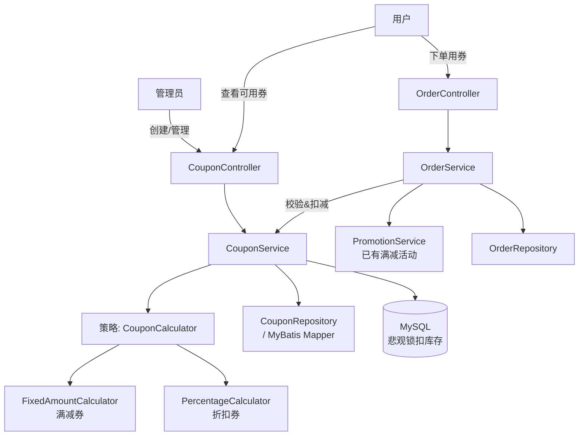

# 优惠券模块 执行计划

> 日期: 2026-06-08 | 作者: AI | 关联 spec: [../spec.md](../spec.md)

## 架构概览

优惠券模块作为新的独立子域，遵循项目现有三层架构（controller → service → repository → domain），与 promotion/ 模块平级。在 OrderService 下单流程中新增优惠券校验和折扣计算环节，策略模式处理两种券类型的计算逻辑。



## 关键设计决策

### 决策 1: 并发库存扣减——MySQL 悲观锁

- **选择**: `SELECT ... FOR UPDATE` + `@Transactional` 事务内原子扣减
- **原因**: 
  1. 项目已有 MySQL InnoDB（支持行级锁），无需引入新基础设施
  2. 初期 QPS 预估 ≤ 100，悲观锁性能足够
  3. promotion/ 模块未使用 Redis，保持技术栈一致
- **替代方案**: 
  - Redis Lua 脚本 —— 性能更高但需要引入 Redis，初期过度设计
  - MySQL 乐观锁 —— 冲突重试用户体验差（需要 409 错误处理）
- **影响**: 用券事务耗时会轻微增加（锁等待），需严格控制事务范围，只锁扣库存一步

### 决策 2: 优惠券类型——策略模式

- **选择**: `CouponCalculator` 接口 + `FixedAmountCalculator` + `PercentageCalculator`，通过 `Map<String, CouponCalculator>` 注入
- **原因**: 
  1. 符合开闭原则——未来新增券类型（如运费券）只需新增 Calculator 类
  2. Spring 依赖注入原生支持 Map 注入，实现零额外代码的类型路由
  3. 与 promotion/ 模块可能存在的策略复用（如 promotion 也有不同活动规则）
- **替代方案**: 
  - if-else 分支 —— 简单但不利于扩展
  - 工厂模式 —— 比策略模式多一层工厂类，无额外收益
- **影响**: 新增 `calculator/` 子包，Service 层通过 Map 查找对应 Calculator

### 决策 3: 数据模型——单表 + type 枚举

- **选择**: 一张 `coupons` 表 + type 字段（FIXED / PERCENTAGE），通用 value 字段表示金额或比例
- **原因**:
  1. 只有两种券类型，字段差异极小（都需 value、min_amount 等）
  2. 单表查询简单，索引高效
  3. 与 promotion/ 模块的表设计风格一致
- **替代方案**: 
  - 多表继承 —— 两个类型仅差异一个字段意义，过度设计
  - JSON 字段 —— 与 MyBatis 映射风格冲突
- **影响**: value 字段的语义由 type 决定；满减券 value 代表减免金额（分），折扣券 value 代表折扣率（如 80 表示 8 折），discount_ceiling 字段仅在折扣券时有效

### 决策 4: 优惠券与满减活动叠加计算

- **选择**: 先计算满减活动优惠，再计算优惠券优惠
- **原因**:
  1. 满减活动是商家主动促销（全局），优惠券是用户持有的权益，先全局后个人的顺序更合理
  2. promotion/ 模块已独立工作，不依赖优惠券模块，叠加时只需在 OrderService 中顺序调用
- **替代方案**: 
  - 先优惠券再满减 —— 可能导致满减条件不再满足（券后金额低于满减门槛），用户体验差
  - 不允许叠加 —— 限制营销组合灵活性，运营不接受
- **影响**: OrderService 需要调整折扣计算流程，确保两个折扣的先后顺序
- **风险**: 如果叠加后订单金额变负——需设定兜底逻辑：最终支付金额 = max(1, 原价 - 满减 - 优惠券)

### 决策 5: 优惠券发放方式

- **选择**: 本期仅支持管理员在后台向指定用户发放优惠券（管理端创建活动 → 向用户分配），不开放用户自助领取
- **原因**:
  1. 减少并发复杂度（自助领券需要额外的库存扣减场景）
  2. 运营初期更适合定向发放，营销更精准
- **替代方案**: 用户主动领取 —— 需要独立的领券接口和领券扣库存逻辑，可留作下期
- **影响**: 用户获取券的接口不在本期范围内，user_coupons 表由管理端写入

## 代码库分析

### 现有架构约束

| 层级 | 当前实现方式 | 新模块适配策略 |
|------|-------------|--------------|
| Controller | `@RestController` + `@RequestMapping` + 统一 `ApiResponse` 包装 | 沿用——coupon/controller/ 下创建 Controller 类 |
| Service | 接口 + 实现类模式，`@Service` 注入 | 沿用——CouponService 接口 + CouponServiceImpl |
| Repository | MyBatis Mapper 接口 + XML 映射文件 | 沿用——CouponMapper.java + CouponMapper.xml |
| Entity | Lombok `@Data` + 手写 DDL | 沿用——Coupon, UserCoupon, OrderCoupon 三个 Entity |
| 错误处理 | 全局异常处理器 + 错误码枚举 | 沿用——common/ 下新增优惠券错误码 |

### 锚点模块分析

**参考模块**: `src/main/java/com/shop/promotion/`（满减活动模块）

| 分析维度 | 发现 |
|---------|------|
| 目录结构 | promotion/controller/、service/、repository/、domain/ 四子包 |
| 命名规范 | Controller 以 Controller 结尾；Service 接口无后缀 + Impl 实现类；Repository 接口以 Mapper 结尾 |
| 错误处理 | 自定义 BusinessException + 错误码枚举；全局 @ExceptionHandler 统一返回 ApiResponse.error() |
| 日志/监控 | SLF4J + Lombok @Slf4j；关键方法打 log.info/log.error |
| 测试风格 | JUnit 5 + Mockito；Service 层单测 Mock Mapper 依赖 |

### 可复用清单

| 已有模块/工具 | 路径 | 复用方式 |
|-------------|------|---------|
| ApiResponse 统一响应体 | `common/ApiResponse.java` | 直接引用 |
| 全局异常处理器 | `common/exception/GlobalExceptionHandler.java` | 直接引用，新增优惠券错误码 |
| BusinessException | `common/exception/BusinessException.java` | 直接注入使用 |
| OrderService.placeOrder() | `service/OrderService.java` | 在方法内部增加优惠券校验和折扣计算步骤 |
| Order 实体 | `domain/Order.java` | 新增 couponId 字段 |
| UserService | `service/UserService.java` | 校验用户是否存在时调用 |

### 需要变更的已有模块

| 模块 | 变更类型 | 原因 | 风险 |
|------|---------|------|------|
| OrderService.placeOrder() | 新增方法参数 + 内部逻辑 | 下单时需支持优惠券参数，增加校验和折扣计算 | 中——需确保不破坏现有下单逻辑 |
| Order 实体 | 新增字段 | 需要关联优惠券 ID | 低——新增字段不影响已有逻辑 |
| common/ 错误码 | 新增枚举值 | 优惠券场景需要专属错误码 | 低 |

## 模块/组件设计

### coupon/controller/CouponController
- **职责**: 管理员创建/管理优惠券活动的 REST 接口
- **对外接口**: 
  - `POST /api/admin/coupons` — 创建优惠券活动
  - `GET /api/admin/coupons` — 分页查询活动列表（支持状态筛选）
  - `GET /api/admin/coupons/{id}` — 查询活动详情
  - `PUT /api/admin/coupons/{id}/terminate` — 终止活动
  - `GET /api/coupons/available` — 用户查看可用优惠券
- **依赖**: CouponService
- **数据流**: HTTP 请求 → 参数校验 → CouponService → ApiResponse

### coupon/service/CouponService
- **职责**: 优惠券业务逻辑——创建、查询、校验、库存扣减
- **对外接口**:
  - `createCoupon(CreateCouponRequest request)` → Coupon
  - `listCoupons(CouponQuery query)` → Page<Coupon>
  - `getCouponDetail(Long id)` → Coupon
  - `terminateCoupon(Long id)` → void
  - `getAvailableCoupons(Long userId)` → List<UserCouponVO>
  - `validateAndDeduct(Long userId, Long couponId, BigDecimal orderAmount)` → DeductResult
- **依赖**: CouponMapper, UserCouponMapper, OrderCouponMapper, coupon/calculator/
- **数据流**: 业务请求 → 校验参数 → MyBatis Mapper → DB

### coupon/calculator/（策略模式子包）
- **职责**: 根据券类型计算优惠金额
- **对外接口**:
  - `CouponCalculator` 接口 —— `BigDecimal calculate(BigDecimal orderAmount, Coupon coupon)`
  - `FixedAmountCalculator` —— `orderAmount - coupon.value`（不低于 1 分）
  - `PercentageCalculator` —— `orderAmount * coupon.value / 100`（不超过 discountCeiling）
- **依赖**: 无外部依赖
- **数据流**: 订单金额 + 优惠券 → 计算 → 优惠后金额

### coupon/repository/
- **职责**: 数据访问层
- **CouponMapper**: coupons 表 CRUD + `SELECT ... FOR UPDATE` 行锁查询
- **UserCouponMapper**: user_coupons 表，按用户查券、记录发放
- **OrderCouponMapper**: order_coupons 表，记录使用、唯一性约束
- **依赖**: MyBatis Framework
- **数据流**: Mapper 接口 → XML SQL → DB

### coupon/domain/
- **职责**: 数据实体和 DTO
- **Coupon**: id, name, type(enum), value, totalQuantity, usedQuantity, minAmount, discountCeiling, startTime, endTime, status(enum)
- **UserCoupon**: id, userId, couponId, status(UNUSED/USED/EXPIRED), obtainTime, usedTime
- **OrderCoupon**: id, orderId, couponId, discountAmount, usedTime  (UNIQUE on order_id)
- **枚举**: CouponType{FIXED, PERCENTAGE}, CouponStatus{PENDING, ACTIVE, ENDED, TERMINATED}, UserCouponStatus{UNUSED, USED, EXPIRED}
- **DTO**: CreateCouponRequest, CouponQuery, UserCouponVO, DeductResult

## 数据模型

### 新增表

```sql
-- 优惠券活动表
CREATE TABLE coupons (
    id BIGINT AUTO_INCREMENT PRIMARY KEY,
    name VARCHAR(100) NOT NULL COMMENT '活动名称',
    type VARCHAR(20) NOT NULL COMMENT '券类型: FIXED/PERCENTAGE',
    value INT NOT NULL COMMENT '优惠值: 满减券为减免金额(分), 折扣券为折扣率(1-99)',
    total_quantity INT NOT NULL COMMENT '总发行量',
    used_quantity INT NOT NULL DEFAULT 0 COMMENT '已使用数量',
    min_amount INT NOT NULL DEFAULT 0 COMMENT '最低消费金额(分)',
    discount_ceiling INT NULL COMMENT '折扣券优惠上限(分), 仅 PERCENTAGE 类型使用',
    start_time DATETIME NOT NULL COMMENT '有效期开始',
    end_time DATETIME NOT NULL COMMENT '有效期结束',
    status VARCHAR(20) NOT NULL DEFAULT 'PENDING' COMMENT '状态: PENDING/ACTIVE/ENDED/TERMINATED',
    created_by VARCHAR(64) COMMENT '创建人',
    created_at DATETIME NOT NULL DEFAULT CURRENT_TIMESTAMP,
    updated_at DATETIME NOT NULL DEFAULT CURRENT_TIMESTAMP ON UPDATE CURRENT_TIMESTAMP,
    INDEX idx_status (status),
    INDEX idx_start_end (start_time, end_time)
) ENGINE=InnoDB DEFAULT CHARSET=utf8mb4 COMMENT='优惠券活动表';

-- 用户优惠券表
CREATE TABLE user_coupons (
    id BIGINT AUTO_INCREMENT PRIMARY KEY,
    user_id BIGINT NOT NULL COMMENT '用户ID',
    coupon_id BIGINT NOT NULL COMMENT '优惠券ID',
    status VARCHAR(20) NOT NULL DEFAULT 'UNUSED' COMMENT '状态: UNUSED/USED/EXPIRED',
    obtain_time DATETIME NOT NULL DEFAULT CURRENT_TIMESTAMP COMMENT '获取时间',
    used_time DATETIME NULL COMMENT '使用时间',
    UNIQUE KEY uk_user_coupon (user_id, coupon_id),
    INDEX idx_user_status (user_id, status)
) ENGINE=InnoDB DEFAULT CHARSET=utf8mb4 COMMENT='用户优惠券表';

-- 订单优惠券使用记录表
CREATE TABLE order_coupons (
    id BIGINT AUTO_INCREMENT PRIMARY KEY,
    order_id BIGINT NOT NULL COMMENT '订单ID',
    coupon_id BIGINT NOT NULL COMMENT '优惠券ID',
    discount_amount INT NOT NULL COMMENT '实际优惠金额(分)',
    used_time DATETIME NOT NULL DEFAULT CURRENT_TIMESTAMP COMMENT '使用时间',
    UNIQUE KEY uk_order (order_id),
    INDEX idx_coupon (coupon_id)
) ENGINE=InnoDB DEFAULT CHARSET=utf8mb4 COMMENT='订单优惠券使用记录表';
```

| 关键字段 | 类型 | 说明 | 约束 |
|------|------|------|------|
| coupons.type | VARCHAR(20) | 券类型：FIXED或PERCENTAGE | NOT NULL |
| coupons.value | INT | 满减券=减免分，折扣券=折扣率(1-99) | NOT NULL, > 0 |
| coupons.used_quantity | INT | 已使用数量，扣库存通过此字段自增 | NOT NULL, DEFAULT 0 |
| coupons.discount_ceiling | INT | 折扣券优惠上限分，满减券为 NULL | NULLABLE |
| user_coupons.uk_user_coupon | UK | 同一用户对同一活动只能领一次 | UNIQUE |
| order_coupons.uk_order | UK | 一个订单只能用一张券 | UNIQUE |
| 金额字段 | INT | 所有金额以"分"为单位存储，避免浮点精度问题 | NOT NULL |

### 变更表

| 表名 | 变更类型 | 说明 |
|------|---------|------|
| orders | ADD COLUMN | 新增 coupon_id BIGINT NULL（可为空，下单时未用券则为 NULL） |

## API 契约

### 创建优惠券活动

```http
POST /api/admin/coupons
```

**请求**:
```json
{
  "name": "618满减券",
  "type": "FIXED",
  "value": 1000,
  "totalQuantity": 1000,
  "minAmount": 5000,
  "startTime": "2026-06-18T00:00:00",
  "endTime": "2026-06-30T23:59:59"
}
```

| 参数 | 类型 | 必填 | 说明 |
|------|------|------|------|
| name | String | 是 | 活动名称，1-100 字符 |
| type | String | 是 | FIXED 或 PERCENTAGE |
| value | Integer | 是 | FIXED:减免分，PERCENTAGE:折扣率1-99 |
| totalQuantity | Integer | 是 | 总发行量，> 0 |
| minAmount | Integer | 是 | 最低消费分，>= 0 |
| discountCeiling | Integer | 否 | 折扣券优惠上限分，仅 PERCENTAGE 有效 |
| startTime | DateTime | 是 | 有效期开始，不能早于当前 |
| endTime | DateTime | 是 | 有效期结束，必须大于 startTime |

**响应** (200):
```json
{
  "code": 200,
  "data": {
    "id": 1,
    "name": "618满减券",
    "type": "FIXED",
    "value": 1000,
    "totalQuantity": 1000,
    "usedQuantity": 0,
    "minAmount": 5000,
    "discountCeiling": null,
    "startTime": "2026-06-18T00:00:00",
    "endTime": "2026-06-30T23:59:59",
    "status": "ACTIVE",
    "createdAt": "2026-06-08T10:00:00"
  }
}
```

**错误码**:

| 状态码 | 错误码 | 说明 |
|--------|--------|------|
| 400 | INVALID_COUPON_TYPE | 券类型不是 FIXED 或 PERCENTAGE |
| 400 | INVALID_COUPON_VALUE | 满减券 value <= 0 或折扣券 value 不在 1-99 |
| 400 | INVALID_TIME_RANGE | 开始时间 >= 结束时间 |
| 400 | AMOUNT_EXCEEDS_MIN | 满减券的优惠金额 >= 最低消费金额 |

### 用户下单选用优惠券（OrderService 内部方法）

此接口集成在 `OrderService.placeOrder()` 中，通过以下调用链实现：

```java
// OrderService.placeOrder() 内部调用
DeductResult result = couponService.validateAndDeduct(userId, couponId, orderTotalAmount);
```

validateAndDeduct 方法内部逻辑：
1. 查询 user_coupons 确认用户持有且状态为 UNUSED
2. 查询 coupon 确认在有效期且 status=ACTIVE
3. 校验 orderTotalAmount >= coupon.minAmount
4. **事务内**: SELECT coupon ... FOR UPDATE → 校验 usedQuantity < totalQuantity → UPDATE usedQuantity + 1
5. INSERT order_coupons + UPDATE user_coupons status=USED
6. 调用 CouponCalculator 计算实际优惠金额

**错误码**:

| 状态码 | 错误码 | 说明 |
|--------|--------|------|
| 400 | COUPON_NOT_FOUND | 优惠券不存在 |
| 400 | COUPON_EXPIRED | 已过期 |
| 400 | COUPON_MIN_AMOUNT_NOT_MET | 未达到最低消费 |
| 400 | COUPON_OUT_OF_STOCK | 库存不足 |
| 400 | COUPON_ALREADY_USED | 已被使用 |
| 400 | COUPON_NOT_OWNED | 用户未持有该券 |

## 迁移策略

N/A —— 本次新增表，不涉及数据迁移。DDL 通过 Flyway/Liquibase 或手动执行 SQL 脚本部署。

## 测试策略

| 测试层级 | 覆盖范围 | 工具 |
|---------|---------|------|
| 单元测试 | CouponCalculator 计算逻辑（边界值测试）；CouponService 校验逻辑（Mock Mapper） | JUnit 5 + Mockito |
| 集成测试 | CouponController API 端到端流程；OrderService 下单用券完整链路 | JUnit 5 + MockMvc + H2 |
| 并发测试 | 多线程同时对库存为 1 的券执行 validateAndDeduct，验证仅 1 成功 | JUnit 5 + ExecutorService |
| 压力测试 | 模拟 100 QPS 用券请求，验证 P99 < 200ms | JMeter (可选) |

## 时间/工作量估算

| 任务 | 预估工时 | 依赖 |
|------|---------|------|
| Phase 1: 数据模型与基础设施 | 3h | 无 |
| Phase 2: 核心业务逻辑 | 5h | Phase 1 |
| Phase 3: API 与集成 | 4h | Phase 2 |
| Phase 4: 测试与收尾 | 4h | Phase 3 |
| **总计** | **16h (2 天)** | |

## 回滚方案

- **数据库回滚**: DDL 为新增表，回滚时 `DROP TABLE IF EXISTS coupons, user_coupons, order_coupons;` 并移除 orders 表的 coupon_id 字段
- **代码回滚**: 优惠券模块为独立新增，不影响原有功能（除 OrderService 新增的 couponId 参数），回滚时 revert 相关 commit 即可
- **功能开关**: 在 OrderService 中增加条件判断 `if (couponId != null)`，如优惠券模块故障，用户不传 couponId 即可走原有下单流程，不影响正常业务
