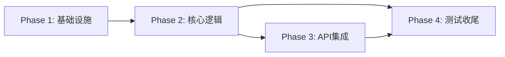

# 优惠券模块 任务总览

> 日期: 2026-06-08 | 作者: AI | 关联: [../plans/README.md](../plans/README.md)

## 全局统计

| 指标 | 值 |
|------|-----|
| 总任务数 | 16 |
| 总 phase 数 | 4 |
| 预估总工时 | 16h (2 天) |
| 关键路径 | phase1 → phase2 → phase3 → phase4 |

## Phase 清单

| Phase | 文件 | 任务数 | 预估 |
|-------|------|--------|------|
| Phase 1: 基础设施与数据层 | [phase1-infrastructure.md](./phase1-infrastructure.md) | 5 | 3h |
| Phase 2: 核心业务逻辑 | [phase2-core-logic.md](./phase2-core-logic.md) | 5 | 5h |
| Phase 3: API 接口与集成 | [phase3-api-integration.md](./phase3-api-integration.md) | 4 | 4h |
| Phase 4: 测试与文档收尾 | [phase4-testing-docs.md](./phase4-testing-docs.md) | 2 | 4h |

## 跨阶段依赖图

| 目标 Phase | 依赖 Phase | 说明 |
|-----------|-----------|------|
| phase2 | phase1 | 需要 Entity、Mapper、DDL 就绪 |
| phase3 | phase2 | 需要 CouponService 可用 |
| phase3 | phase1 | 需要错误码定义就绪 |
| phase4 | phase2, phase3 | 需要所有业务代码完成后做集成测试和并发测试 |

## 全局风险任务

| Phase | 任务 | 风险 | 应对 |
|-------|------|------|------|
| Phase 2 | T2.3 - CouponService.validateAndDeduct() | 悲观锁实现不当导致死锁或性能问题 | 严格控制事务范围，仅锁扣库存一步；增加事务超时配置 |
| Phase 3 | T3.3 - OrderService.placeOrder() 集成 | 改动现有下单核心流程，可能引入回归 bug | 新增参数默认为 null，不改现有逻辑分支；充分回归测试 |
| Phase 4 | T4.2 - 并发测试 | 并发测试的断言精度依赖测试框架支持 | 使用 CountDownLatch + ThreadPoolExecutor 精确控制并发；多次运行验证一致性 |
