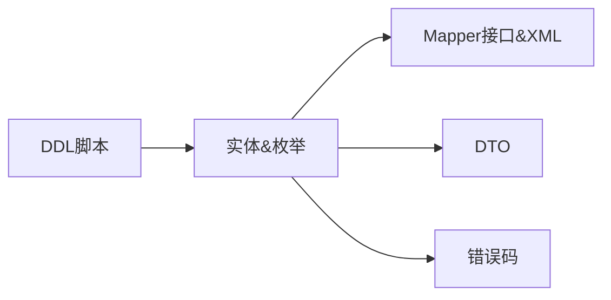

# 优惠券模块 Phase 1: 基础设施与数据层 任务清单

> 日期: 2026-06-08 | 作者: AI | 关联: [../plans/README.md](../plans/README.md) | 下一阶段: [phase2-core-logic.md](./phase2-core-logic.md)

## 本阶段任务

- [ ] **T1.1**: 创建 DDL 迁移脚本
  - **描述**: 编写 coupons、user_coupons、order_coupons 三张表的 CREATE TABLE SQL 脚本，以及 orders 表的 ADD COLUMN 脚本
  - **产出物**: `src/main/resources/db/migration/V2__coupon_module.sql`（新增，或按项目习惯命名路径）
  - **参考**: 参考 promotion/ 模块对应的 DDL 脚本风格
  - **复用**: N/A（新表）
  - **验收**: DDL 在本地 MySQL 执行成功，字段类型和约束与 plan 中的数据模型一致；orders 表新增 coupon_id 字段（BIGINT NULL）
  - **预估**: 0.5h
  - **依赖**: 无

- [ ] **T1.2**: 定义优惠券领域实体和枚举
  - **描述**: 创建 Coupon、UserCoupon、OrderCoupon 三个实体类及对应的枚举类型 CouponType、CouponStatus、UserCouponStatus
  - **产出物**: 
    - `coupon/domain/Coupon.java`（新增）
    - `coupon/domain/UserCoupon.java`（新增）
    - `coupon/domain/OrderCoupon.java`（新增）
    - `coupon/domain/enums/CouponType.java`（新增）
    - `coupon/domain/enums/CouponStatus.java`（新增）
    - `coupon/domain/enums/UserCouponStatus.java`（新增）
  - **参考**: 参考 `order/domain/Order.java` 和 `promotion/domain/` 的 Lombok 注解风格
  - **复用**: Lombok @Data, @Builder, @NoArgsConstructor, @AllArgsConstructor
  - **验收**: 实体类字段与 DDL 表结构一致，包含所有必要字段；枚举类型使用 String 值（FIXED/PERCENTAGE, PENDING/ACTIVE/ENDED/TERMINATED, UNUSED/USED/EXPIRED）
  - **预估**: 1h
  - **依赖**: T1.1（DDL 确定后才知最终字段）

- [ ] **T1.3**: 创建 MyBatis Mapper 接口与 XML 映射
  - **描述**: 创建 CouponMapper、UserCouponMapper、OrderCouponMapper 三个 Mapper 接口及对应的 XML 映射文件，包含基本 CRUD 和业务查询方法
  - **产出物**: 
    - `coupon/repository/CouponMapper.java` + `src/main/resources/mapper/CouponMapper.xml`（新增）
    - `coupon/repository/UserCouponMapper.java` + `src/main/resources/mapper/UserCouponMapper.xml`（新增）
    - `coupon/repository/OrderCouponMapper.java` + `src/main/resources/mapper/OrderCouponMapper.xml`（新增）
  - **参考**: 参考 `promotion/repository/` 的 Mapper 接口定义风格和 XML 命名规范
  - **复用**: 复用 MyBatis 的 resultMap 和 parameterType 配置模式
  - **特别关注**: CouponMapper.xml 必须包含 `selectByIdForUpdate` 方法——SELECT ... FOR UPDATE 行锁查询
  - **验收**: 
    - CouponMapper 包含: insert, selectById, selectByIdForUpdate, selectPage, updateStatus, updateUsedQuantity
    - UserCouponMapper 包含: insert, selectByUserId, selectByUserAndCoupon, updateStatus
    - OrderCouponMapper 包含: insert, selectByOrderId
  - **预估**: 1.5h
  - **依赖**: T1.2（需要实体类定义完整）

- [ ] **T1.4**: 定义优惠券相关 DTO
  - **描述**: 创建请求/响应 DTO——CreateCouponRequest、CouponQuery、UserCouponVO、DeductResult
  - **产出物**: 
    - `coupon/domain/dto/CreateCouponRequest.java`（新增）
    - `coupon/domain/dto/CouponQuery.java`（新增）
    - `coupon/domain/dto/UserCouponVO.java`（新增）
    - `coupon/domain/dto/DeductResult.java`（新增）
  - **参考**: 参考 `promotion/domain/dto/` 的 DTO 风格（如有），或参考 `common/dto/` 的分页请求基类
  - **复用**: ApiResponse 统一响应包装（common/）
  - **验收**: CreateCouponRequest 包含校验注解（@NotBlank, @NotNull, @Min）；DeductResult 包含 success/errorCode/discountAmount 字段；UserCouponVO 包含券信息和可读的描述文案
  - **预估**: 0.5h
  - **依赖**: T1.2（实体/枚举定义完成后才知道 DTO 映射关系）

- [ ] **T1.5**: 扩展公共错误码和异常
  - **描述**: 在 common/ 模块下新增优惠券相关错误码枚举（如 COUPON_NOT_FOUND, COUPON_EXPIRED 等），确认全局异常处理器可以正确处理
  - **产出物**: `common/exception/CouponErrorCode.java` 或追加到现有错误码枚举（修改）
  - **参考**: 参考 `common/exception/` 现有错误码枚举的风格
  - **复用**: BusinessException 和 GlobalExceptionHandler（已有）
  - **验收**: 所有 plan 中列出的错误码均已定义，每个包含 code/message/httpStatus；全局异常处理器能够正确解析
  - **预估**: 0.5h
  - **依赖**: 无

## 本阶段预估

| 指标 | 值 |
|------|-----|
| 任务数 | 5 |
| 预估总工时 | 4h |
| 可并行任务 | T1.4 和 T1.5 可与 T1.3 并行（都依赖 T1.2） |

## 本阶段内依赖

> T1.4 和 T1.5 可在 T1.3 完成的同时进行。T1.1 是整个 Phase 的前置，建表完成后才能编写实体类。
