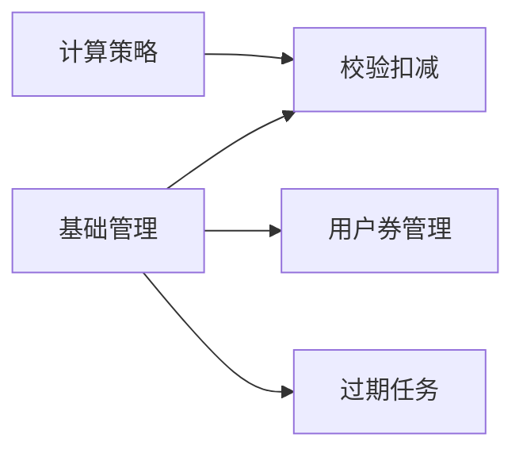

# 优惠券模块 Phase 2: 核心业务逻辑 任务清单

> 日期: 2026-06-08 | 作者: AI | 关联: [../plans/README.md](../plans/README.md) | 上一阶段: [phase1-infrastructure.md](./phase1-infrastructure.md) | 下一阶段: [phase3-api-integration.md](./phase3-api-integration.md)

## 本阶段任务

- [ ] **T2.1**: 实现优惠券计算策略（策略模式）
  - **描述**: 创建 CouponCalculator 接口和两个实现类——FixedAmountCalculator（满减券满减计算）和 PercentageCalculator（折扣券百分比计算）
  - **产出物**: 
    - `coupon/service/calculator/CouponCalculator.java`（新增，接口）
    - `coupon/service/calculator/FixedAmountCalculator.java`（新增）
    - `coupon/service/calculator/PercentageCalculator.java`（新增）
  - **参考**: 遵循项目策略模式的惯用写法（如 promotion/ 模块中可能存在类似的策略实现）
  - **复用**: 使用 BigDecimal 做精确计算（Java 标准库）
  - **验收**: 
    - 满减券：订单金额 10000(分) → 满减券 value=1000 → 优惠 1000，优惠后 9000
    - 满减券：订单金额 500(分) → 满减券 value=1000 → 优惠 500（不超过订单金额），优惠后 1
    - 折扣券：订单金额 10000(分) → 8折 value=80 → 优惠 2000，有 ceiling=1500 → 实际优惠 1500
    - 折扣券：订单金额 10000(分) → 8折 value=80 → 优惠 2000，无 ceiling → 优惠 2000
    - 所有金额运算使用 BigDecimal，结果向上取整（ROUND_CEILING）
  - **预估**: 1.5h
  - **依赖**: T1.2（Coupon 实体和 CouponType 枚举）

- [ ] **T2.2**: 实现 CouponService 基础管理方法
  - **描述**: 实现 CouponService 接口和 CouponServiceImpl，包含优惠券活动的 CRUD 管理方法
  - **产出物**: 
    - `coupon/service/CouponService.java`（新增，接口）
    - `coupon/service/CouponServiceImpl.java`（新增，实现类）
  - **参考**: 参考 `promotion/service/PromotionService.java` + `PromotionServiceImpl.java` 的实现风格（接口+实现类、@Service 注解、@Transactional）
  - **复用**: 
    - CouponMapper, UserCouponMapper, OrderCouponMapper（Phase 1 产出）
    - BusinessException + 错误码（Phase 1 产出）
  - **验收**: 
    - createCoupon() 参数校验（type 合法、value > 0、时间范围正确、满减券 value < minAmount）
    - listCoupons() 支持分页和状态筛选
    - getCouponDetail() 返回单个活动完整信息
    - 所有方法使用 @Slf4j 记录关键操作日志
  - **预估**: 1.5h
  - **依赖**: T1.3（Mapper）, T1.4（DTO）, T1.5（错误码）

- [ ] **T2.3**: 实现优惠券校验与库存扣减核心方法
  - **描述**: 实现 `validateAndDeduct(Long userId, Long couponId, BigDecimal orderAmount)` 方法——用券时的核心逻辑，包含多步校验和事务内库存原子扣减
  - **产出物**: `coupon/service/CouponServiceImpl.java` 中的 validateAndDeduct 方法（新增到上述实现类）
  - **参考**: 参考 `order/service/OrderServiceImpl.java` 中的事务处理风格
  - **复用**: 
    - CouponMapper.selectByIdForUpdate() 行锁
    - CouponMapper.updateUsedQuantity() 库存自增
    - UserCouponMapper.updateStatus() 标记已使用
    - OrderCouponMapper.insert() 记录关联
  - **实现要点**:
    1. 查询 user_coupons 确认用户持有且状态 UNUSED
    2. 查询 coupon 确认在有效期且 status=ACTIVE
    3. 校验 orderAmount >= coupon.minAmount
    4. **开始事务** → SELECT coupon FOR UPDATE → 校验 usedQuantity < totalQuantity → UPDATE usedQuantity + 1 → INSERT order_coupons → UPDATE user_coupons status=USED → **提交事务**
    5. 调用 CouponCalculator 计算实际优惠金额并返回 DeductResult
  - **验收**: 
    - 正常用券返回 DeductResult(success=true, discountAmount)
    - 库存不足返回 DeductResult(success=false, errorCode=COUPON_OUT_OF_STOCK)
    - 已过期返回 DeductResult(success=false, errorCode=COUPON_EXPIRED)
    - 金额不满足返回 DeductResult(success=false, errorCode=COUPON_MIN_AMOUNT_NOT_MET)
    - 事务回滚时库存不被扣减（插入失败 → 库存回滚）
  - **预估**: 2h
  - **依赖**: T2.1（CouponCalculator）, T2.2（基础 Service 方法）

- [ ] **T2.4**: 实现用户优惠券管理方法
  - **描述**: 实现给用户发放优惠券和查询用户可用优惠券的方法
  - **产出物**: `coupon/service/CouponServiceImpl.java` 中的 grantCoupon 和 getAvailableCoupons 方法（追加到现有实现类）
  - **参考**: 参考 `promotion/` 中用户活动关联的实现方式
  - **复用**: 
    - UserCouponMapper.insert() 发放
    - UserCouponMapper.selectByUserId() 查询
  - **验收**: 
    - grantCoupon() 校验用户是否存在、券活动是否存在且有效，同一用户同一活动不能重复发券
    - getAvailableCoupons() 只返回状态 UNUSED 且在有效期内的券，附带计算好的可读描述（如"满80减10"、"8折，最高减20"）
  - **预估**: 1h
  - **依赖**: T2.2（基础 Service 方法）

- [ ] **T2.5**: 实现优惠券状态自动过期任务
  - **描述**: 实现定期检查并将已过期的用户优惠券标记为 EXPIRED 的逻辑，以及将过期的优惠券活动标记为 ENDED
  - **产出物**: `coupon/service/CouponScheduler.java`（新增，定时任务）
  - **参考**: 参考项目中是否已有定时任务的实现模式（@Scheduled）
  - **复用**: 
    - UserCouponMapper.updateStatus()
    - CouponMapper.updateStatus()
  - **验收**: 
    - 每 5 分钟执行一次过期检查
    - 将 end_time < now() 的 PENDING/ACTIVE 券活动状态更新为 ENDED
    - 将对应活动的、用户未使用的券状态更新为 EXPIRED
  - **预估**: 0.5h
  - **依赖**: T2.2（基础 Service 方法）

## 本阶段预估

| 指标 | 值 |
|------|-----|
| 任务数 | 5 |
| 预估总工时 | 6.5h |
| 可并行任务 | T2.5 可与 T2.4 并行 |

## 本阶段内依赖

> T2.3 是本阶段最关键的任务——悲观锁实现必须正确，事务边界必须精准。建议 T2.3 完成并通过手动测试后再推进 T2.4 和 T2.5。
