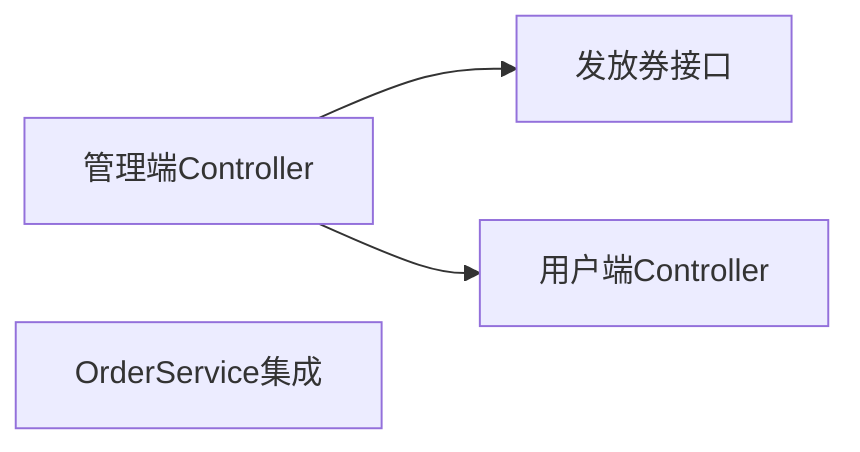

# 优惠券模块 Phase 3: API 接口与集成 任务清单

> 日期: 2026-06-08 | 作者: AI | 关联: [../plans/README.md](../plans/README.md) | 上一阶段: [phase2-core-logic.md](./phase2-core-logic.md) | 下一阶段: [phase4-testing-docs.md](./phase4-testing-docs.md)

## 本阶段任务

- [ ] **T3.1**: 实现管理员优惠券管理 Controller
  - **描述**: 创建 CouponAdminController，暴露管理端优惠券活动的 REST API
  - **产出物**: `coupon/controller/CouponAdminController.java`（新增）
  - **参考**: 参考 `promotion/controller/PromotionController.java` 的风格（@RestController、@RequestMapping、ApiResponse 统一包装、@Valid 参数校验）
  - **复用**: 
    - ApiResponse 统一响应（common/）
    - @Valid 注解（javax.validation）
    - CouponService（Phase 2 产出）
  - **接口列表**:
    - `POST /api/admin/coupons` — 创建优惠券活动
    - `GET /api/admin/coupons` — 分页查询活动列表（支持 status 参数筛选）
    - `GET /api/admin/coupons/{id}` — 查询活动详情
    - `PUT /api/admin/coupons/{id}/terminate` — 终止活动
  - **验收**: 所有接口返回统一的 ApiResponse；参数校验错误返回 400 + 具体错误信息；管理端接口需要管理员权限（后续对接认证框架）
  - **预估**: 1.5h
  - **依赖**: T2.2（CouponService 基础管理方法）

- [ ] **T3.2**: 实现用户优惠券 Controller
  - **描述**: 创建 CouponController，暴露用户端查询可用优惠券的接口
  - **产出物**: `coupon/controller/CouponController.java`（新增）
  - **参考**: 参考 `order/controller/OrderController.java` 中获取当前用户信息的方式
  - **复用**: 
    - ApiResponse（common/）
    - CouponService.getAvailableCoupons()（Phase 2 产出）
  - **接口列表**:
    - `GET /api/coupons/available` — 查看当前用户可用优惠券列表
  - **验收**: 正确返回用户持有的可用券（UNUSED + 在有效期内 + 库存未用完）；空列表时返回 200 + 空数组而非错误
  - **预估**: 0.5h
  - **依赖**: T2.4（getAvailableCoupons 方法）

- [ ] **T3.3**: 集成 OrderService —— 下单用券
  - **描述**: 修改 OrderService.placeOrder() 方法，新增 couponId 参数，在下单流程中集成优惠券校验和折扣计算
  - **产出物**: `service/OrderServiceImpl.java`（修改）
  - **参考**: 参考项目中是否已有 promotion 折扣计算的集成方式
  - **复用**: 
    - CouponService.validateAndDeduct()（Phase 2 产出）
    - 现有 OrderService 折扣计算逻辑
  - **实现要点**:
    1. placeOrder() 新增 `Long couponId` 参数（nullable）
    2. 如果 couponId != null，调用 couponService.validateAndDeduct()
    3. 如果扣减失败（success=false），抛出对应 BusinessException
    4. 如果扣减成功，使用返回的 discountAmount 计算最终支付金额
    5. 叠加逻辑：先计算 promotion/ 满减折扣 → 再计算优惠券折扣
    6. 兜底：最终支付金额 = max(1, 原价 - 满减 - 优惠券)
    7. 订单 entity 设置 couponId、discountAmount
  - **验收**: 
    - 不用券时下单流程不受影响（couponId == null）
    - 用满减券时订单金额正确扣减
    - 用折扣券时订单金额正确扣减
    - 叠加满减活动时两段折扣顺序正确
    - 用券失败时抛出的异常被全局异常处理器捕获并返回对应错误码
  - **预估**: 2h
  - **依赖**: T2.3（validateAndDeduct）, T1.1（orders 表 couponId 字段需已就绪）

- [ ] **T3.4**: 实现管理员发放优惠券接口
  - **描述**: 在 CouponAdminController 中新增给指定用户发放优惠券的接口
  - **产出物**: `coupon/controller/CouponAdminController.java` 中新增方法（追加到 T3.1 产出文件）
  - **参考**: 同上 T3.1
  - **复用**: 
    - CouponService.grantCoupon()（Phase 2 产出）
  - **接口列表**:
    - `POST /api/admin/coupons/{id}/grant` — 给指定用户发放优惠券
    - 请求体: `{ "userId": 1001 }`
  - **验收**: 成功发放返回 200；重复发放返回 400 + "用户已领取该券"；不存在的用户返回 404
  - **预估**: 0.5h
  - **依赖**: T2.4（grantCoupon 方法）

## 本阶段预估

| 指标 | 值 |
|------|-----|
| 任务数 | 4 |
| 预估总工时 | 4.5h |
| 可并行任务 | T3.2 和 T3.4 可在 T3.1 完成后并行（不同 Controller 方法） |

## 本阶段内依赖

> T3.3 是风险最高的任务——改动 OrderService 核心流程。务必确保 couponId 为 null 时走原有逻辑，不做任何额外操作。建议代码审查时重点关注事务边界。
