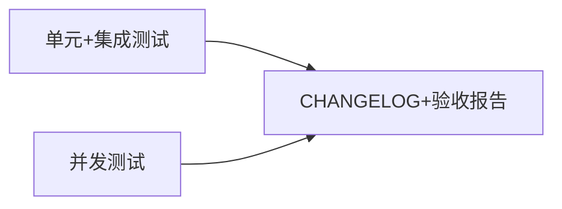

# 优惠券模块 Phase 4: 测试与文档收尾 任务清单

> 日期: 2026-06-08 | 作者: AI | 关联: [../plans/README.md](../plans/README.md) | 上一阶段: [phase3-api-integration.md](./phase3-api-integration.md)

## 本阶段任务

- [ ] **T4.1**: 编写单元测试和集成测试
  - **描述**: 为优惠券模块所有层级编写测试用例，覆盖正常流程、边界条件和异常路径
  - **产出物**: 
    - `src/test/java/com/shop/coupon/calculator/CouponCalculatorTest.java`（新增）
    - `src/test/java/com/shop/coupon/service/CouponServiceTest.java`（新增）
    - `src/test/java/com/shop/coupon/controller/CouponAdminControllerTest.java`（新增）
    - `src/test/java/com/shop/coupon/controller/CouponControllerTest.java`（新增）
    - `src/test/java/com/shop/service/OrderServiceCouponTest.java`（新增）
  - **参考**: 参考现有测试的 JUnit 5 + Mockito 风格
  - **复用**: JUnit 5（jupiter）、Mockito、MockMvc、H2 内存数据库
  - **测试用例覆盖**:
    
    **CouponCalculatorTest（单元测试）**:
    - 满减券：正常扣减、优惠金额 > 订单金额时兜底为 1 分
    - 折扣券：8折计算、有 ceiling 上限、无 ceiling
    - 折扣券：折扣率 1（打1折即扣减 90%）、99（打99折即扣减 1%）
    - 精度：订单金额 9999 分 × 85% = 8499.15，向上取整 = 8499

    **CouponServiceTest（单元测试，Mock Mapper）**:
    - createCoupon() 参数校验：type 非法、value <= 0、时间范围错误
    - validateAndDeduct()：正常通过、库存不足、已过期、未达最低消费、已使用
    - grantCoupon()：正常发放、重复发放抛异常
    - getAvailableCoupons()：返回过滤后的列表

    **CouponAdminControllerTest（集成测试，MockMvc + H2）**:
    - 创建满减券 API → 200 + 返回券信息
    - 创建折扣券 API → 200 + 返回券信息
    - 无效参数 → 400
    - 列表查询 + 状态筛选 → 200 + 分页数据
    - 终止活动 → 200，再次查询活动状态为 TERMINATED

    **OrderServiceCouponTest（集成测试）**:
    - 不用券下单 → 流程不受影响，金额不变
    - 用券下单 → 订单金额正确扣减
    - 用券失败（库存不足）→ 下单失败，返回错误码
    - 叠加满减活动 → 折扣计算顺序正确
  - **验收**: 
    - 所有测试类位于 `src/test/java/com/shop/coupon/` 对应子包
    - CouponCalculatorTest 覆盖满减和折扣两种计算器的所有边界（含精度向上取整）
    - CouponServiceTest Mock 所有 Mapper 依赖，覆盖正常+异常路径
    - CouponAdminControllerTest 使用 MockMvc + H2，验证 4 个管理端 API
    - OrderServiceCouponTest 验证下单用券集成，含不用券的回归验证
    - 所有测试 `mvn test` 执行通过，覆盖率 ≥ 80%
  - **预估**: 3h
  - **依赖**: Phase 2 和 Phase 3 所有业务代码完成

- [ ] **T4.2**: 编写并发库存扣减测试
  - **描述**: 编写多线程并发测试，验证库存扣减在并发场景下的正确性——100 线程对库存 1 的券执行用券，仅 1 成功
  - **产出物**: `src/test/java/com/shop/coupon/service/CouponServiceConcurrencyTest.java`（新增）
  - **参考**: 无项目内参考（新增测试类型），遵循 JUnit 5 规范
  - **复用**: JUnit 5, ExecutorService, CountDownLatch
  - **实现要点**:
    1. 准备数据：创建一张库存为 1 的券，100 个用户各持有一张该券
    2. 使用 CountDownLatch 保证 100 个线程同时启动
    3. 每个线程调用 couponService.validateAndDeduct()
    4. 等待所有线程完成，统计 success=true 的结果数
  - **验收**: 
    - 成功数 == 1
    - 失败数 == 99，且错误码均为 COUPON_OUT_OF_STOCK
    - coupons 表 used_quantity == 1
    - 重复运行 5 次结果一致
  - **预估**: 1.5h
  - **依赖**: T2.3（validateAndDeduct 方法）

- [ ] **T4.3**: 追加 CHANGELOG 和编写验收报告
  - **描述**: 在项目根 CHANGELOG.md 追加本次优惠券模块的变更记录；编写验收报告逐条对照 spec 验收标准
  - **产出物**: 
    - `CHANGELOG.md`（修改——追加条目）
    - `specs/coupon-module/verification-report.md`（新增）
  - **参考**: CHANGELOG 模板和验收报告模板（uluo-doc-standards）
  - **复用**: N/A
  - **验收**: 
    - CHANGELOG 遵循 Keep a Changelog 格式，包含 Added/Changed/Security 分类
    - CHANGELOG 中优惠券相关条目包含 6 条 Added、1 条 Changed、2 条 Security
    - 验收报告逐条对照 spec 中 12 条 AC，填写测试结果和通过/失败状态
    - 验收报告结论明确（三选一）
  - **预估**: 0.5h
  - **依赖**: T4.1, T4.2（测试完成后才能写验收报告）

## 本阶段预估

| 指标 | 值 |
|------|-----|
| 任务数 | 3 |
| 预估总工时 | 5h |
| 可并行任务 | T4.1 中 CalculatorTest 和 ServiceTest 可并行编写 |

## 本阶段内依赖

> T4.2 并发测试是验证 spec 中 AC-8（并发正确性）的关键任务。如果发现悲观锁实现有缺陷，需要回退到 T2.3 修改。建议 T4.1 完成基本用例后立即开始 T4.2，避免收尾阶段才发现并发问题。
