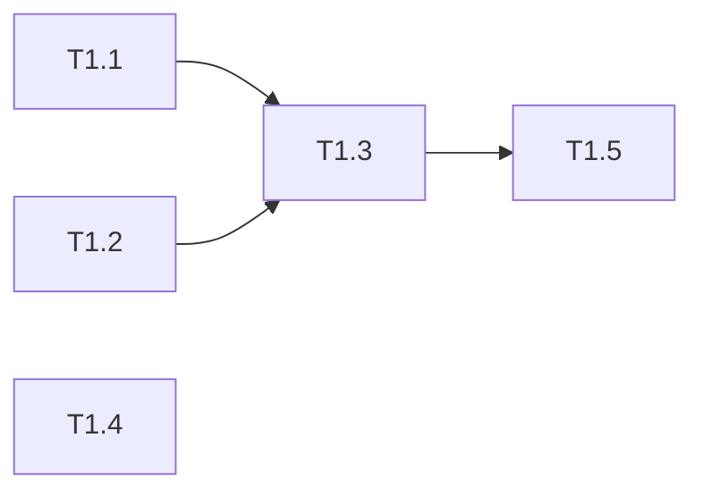
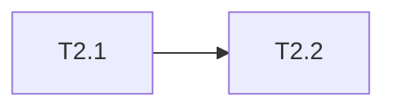

# 支付回调竞态条件修复 任务清单

> 日期: 2026-06-08 | 作者: AI Assistant | 关联: [spec.md](./spec.md)

## 全局统计

| 指标 | 值 |
|------|-----|
| 总任务数 | 7 |
| 总 phase 数 | 2 |
| 预估总工时 | 6h |
| 关键路径 | Phase 1 → Phase 2 |

## Phase 清单

| Phase | 任务数 | 预估 |
|-------|--------|------|
| Phase 1: 核心修复 | 5 | 4.5h |
| Phase 2: 验证与记录 | 2 | 1.5h |

---

# Phase 1: 核心修复

> 日期: 2026-06-08 | 作者: AI Assistant | 关联: [spec.md](./spec.md)

## 本阶段任务

- [ ] **T1.1**: OrderRepo 新增加锁查询方法
  - **描述**: 在 `repository/OrderRepo.java` 中新增 `findByIdForUpdate(Long orderId)` 方法，使用 `@Select("SELECT * FROM orders WHERE id = #{id} FOR UPDATE")` 注解，确保查询时对订单行加行级排他锁
  - **产出物**: `repository/OrderRepo.java`（修改）
  - **参考**: 遵循现有 `OrderRepo` 中 `findById()` 的命名和参数风格
  - **复用**: 无（新增方法）
  - **验收**: 方法可编译通过；确认 MyBatis Mapper XML 无需额外配置（纯注解方式即可）
  - **预估**: 0.5h
  - **依赖**: 无

- [ ] **T1.2**: PaymentRepo 新增幂等检查方法
  - **描述**: 在 `repository/PaymentRepo.java` 中新增两个方法：(a) `existsByTransactionId(String transactionId)` — 查询指定交易号是否已存在处理记录；(b) `insertIdempotentRecord(String transactionId, Long orderId)` — 插入幂等记录
  - **产出物**: `repository/PaymentRepo.java`（修改）
  - **参考**: 遵循现有 `PaymentRepo` 中的 MyBatis 注解风格
  - **复用**: 无（新增方法）
  - **验收**: 两个方法可编译通过；`insertIdempotentRecord` 在同一事务中可正常插入
  - **预估**: 1h
  - **依赖**: 无

- [ ] **T1.3**: PaymentService.processCallback() 重构
  - **描述**: 重构 `service/PaymentService.java` 中的 `processCallback()` 方法，实现三层防护逻辑：
    1. **幂等检查**: 首先调用 `paymentRepo.existsByTransactionId(transactionId)`，若已处理则记录 WARN 日志并直接返回成功
    2. **加锁查询**: 调用 `orderRepo.findByIdForUpdate(orderId)` 替代原有的 `findById()`，在事务内获取订单行锁
    3. **扣款与记录**: 正常执行余额扣减逻辑，扣减成功后调用 `paymentRepo.insertIdempotentRecord()` 写入幂等记录（与扣款在同一事务中）
    4. **异常处理**: 捕获 `DuplicateKeyException`（幂等记录唯一约束冲突）——说明并发中已被另一事务先处理，记录 WARN 日志并返回成功；捕获 `CannotAcquireLockException`（锁超时）——事务回滚，记录 ERROR 日志，返回 200（网关将重试）
  - **产出物**: `service/PaymentService.java`（修改）
  - **参考**: 遵循现有 `processCallback()` 的事务注解和日志风格
  - **复用**: 调用 `orderRepo.findByIdForUpdate()`（T1.1 新增）、`paymentRepo.existsByTransactionId()` 和 `paymentRepo.insertIdempotentRecord()`（T1.2 新增）；继续调用现有余额扣减逻辑
  - **验收**: 并发场景下同一订单只被扣款一次；日志中正确区分正常流程/重复拦截/锁超时
  - **预估**: 2h
  - **依赖**: T1.1, T1.2

- [ ] **T1.4**: 数据库唯一约束 DDL
  - **描述**: 编写 Flyway/Liquibase 迁移脚本（或手动 DDL），在 `payment_records` 表的 `transaction_id` 列上创建唯一索引。需注意：若历史数据中存在 NULL 值，MySQL 唯一索引默认允许 NULL 值重复，无需特殊处理；若存在空字符串则需先清洗
  - **产出物**: `db/migration/V{next}__add_unique_transaction_id.sql`（新增，如使用 Flyway）
  - **参考**: 遵循项目现有的数据库迁移文件命名和组织方式
  - **复用**: 无
  - **验收**: 索引创建成功（`SHOW INDEX FROM payment_records` 确认）；尝试插入重复 `transaction_id` 被数据库拒绝
  - **预估**: 1h
  - **依赖**: 无（可与 T1.1-T1.3 并行）

- [ ] **T1.5**: 日志与监控埋点
  - **描述**: 在 `processCallback()` 的关键路径上补充日志：(a) 幂等命中 → WARN + 计数器；(b) 锁获取成功 → DEBUG；(c) 锁超时 → ERROR + 告警指标；(d) 唯一约束冲突 → WARN + 计数器。确保生产环境可观测
  - **产出物**: `service/PaymentService.java`（修改，与 T1.3 同文件）
  - **参考**: 遵循项目现有日志格式（SLF4J + 占位符）
  - **复用**: 无
  - **验收**: 日志输出格式正确；可通过日志区分四种并发场景
  - **预估**: 0.5h（可与 T1.3 合并执行）
  - **依赖**: T1.3

## 本阶段预估

| 指标 | 值 |
|------|-----|
| 任务数 | 5 |
| 预估总工时 | 5h（含并行节约 0.5h） |
| 可并行任务 | T1.1, T1.2, T1.4 可并行 |

## 本阶段内依赖

---

# Phase 2: 验证与记录

> 日期: 2026-06-08 | 作者: AI Assistant | 关联: [spec.md](./spec.md) | 上一阶段: Phase 1

## 本阶段任务

- [ ] **T2.1**: 并发测试与回归验证
  - **描述**: 编写并发集成测试（或使用 JMeter/ab 脚本），验证修复效果：
    1. 并发场景：100 线程同时发起相同 `transactionId` 的回调 → 验证余额只扣减 1 次
    2. 重复通知场景：先后两次发送相同 `transactionId` → 第二次被幂等拦截
    3. 正常场景：单一回调请求 → 端到端流程正常
    4. 回归：现有支付相关测试全部通过
  - **产出物**: `test/.../PaymentCallbackConcurrencyTest.java`（新增，可选）；测试执行报告
  - **参考**: 遵循项目现有集成测试框架（JUnit 5 + SpringBootTest）
  - **复用**: 复用现有测试基础设施中的数据库初始化脚本
  - **验收**: 所有测试用例通过；并发测试中余额扣减次数严格等于 1
  - **预估**: 1h
  - **依赖**: Phase 1 全部完成

- [ ] **T2.2**: 更新 CHANGELOG
  - **描述**: 在项目根 `CHANGELOG.md` 中追加本次修复条目，遵循 Keep a Changelog 格式，归入 `### Fixed` 分类，注明引用 spec 编号
  - **产出物**: `CHANGELOG.md`（修改，项目根）
  - **参考**: 遵循现有 CHANGELOG 格式
  - **复用**: 无
  - **验收**: 条目格式正确；一句话说清修复内容
  - **预估**: 0.5h
  - **依赖**: T2.1（验证通过后再记录）

## 本阶段预估

| 指标 | 值 |
|------|-----|
| 任务数 | 2 |
| 预估总工时 | 1.5h |
| 可并行任务 | 无 |

## 本阶段内依赖

