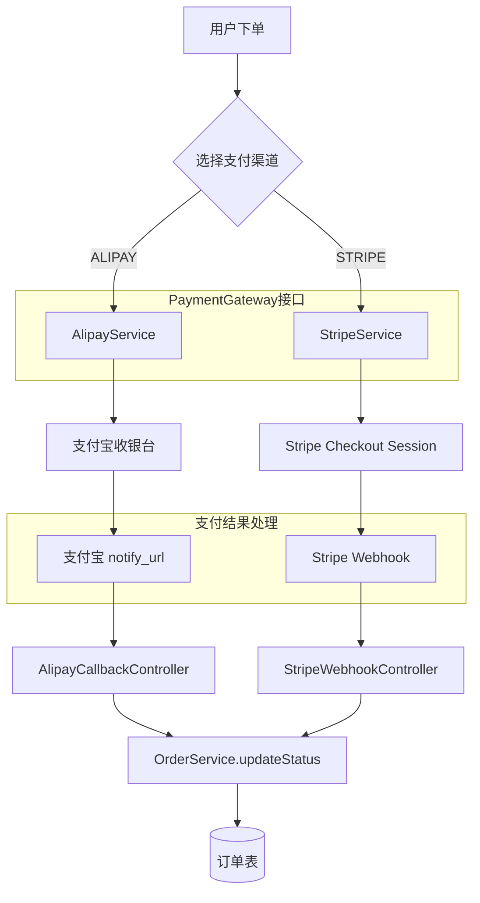

# Stripe 支付网关集成 执行计划

> 日期: 2026-06-08 | 作者: AI | 关联 spec: [../spec.md](../spec.md)

## 架构概览

引入 Stripe 作为第二个支付渠道，与现有支付宝并存。核心思路：提取统一支付网关抽象层（策略模式），Stripe 使用 Checkout Sessions（跳转模式，对标支付宝页面跳转），Webhook 作为唯一可靠的支付结果回调通道。



**数据流：**

```
创建支付: Controller → PaymentGatewayFactory(Channel) → StripeService/AlipayService → 第三方 API → 返回跳转 URL → 前端重定向
支付回调: Stripe Webhook → StripeWebhookController(验签) → PaymentEventHandler → OrderService.updateStatus → DB
退款处理: AdminController → StripeService.refund() → Stripe Refund API → Webhook charge.refunded → OrderService.updateStatus
```

## 关键设计决策

### 决策 1: 选择 Checkout Sessions 而非 Payment Intents

- **选择**: Stripe Checkout Sessions（Stripe 托管支付页面，重定向模式）
- **原因**:
  1. **与现有支付宝模式一致**：支付宝使用页面跳转→用户支付→回调模式，Checkout Session 完全对标，前端改动最小，只需一个重定向
  2. **PCI 合规负担最低**：SAQ-A 级别，Stripe 托管支付页面处理所有敏感卡信息
  3. **自动适配多设备**：Stripe Checkout 自动适配移动端/桌面端，内置 40+ 支付方式（信用卡、Apple Pay、Google Pay、Alipay 等），无需额外开发
  4. **Spring Boot 集成简单**：后端只需创建 Session + 处理 Webhook，无需管理前端 Stripe.js
- **替代方案**: Payment Intents + Stripe Elements——灵活度最高但需前端嵌入 Stripe.js、自定义 UI、处理 SCA 认证流程，开发量 2-3 倍
- **影响**: 前端只需一个重定向链接，不需要引入 Stripe.js SDK；后端简化，不处理前端支付表单

### 决策 2: Webhook 为唯一可靠回调通道（不同于支付宝双通道模式）

- **选择**: Webhook 驱动订单状态变更；success_url 仅用于前端展示，不做业务逻辑
- **原因**:
  1. Stripe 官方明确推荐："Never fulfill orders based solely on the redirect URL after payment — users can close the browser tab before the redirect completes"（DigitalApplied 2026）
  2. 支付宝的 `notify_url` + `return_url` 双通道模式在 Stripe 环境下不适用——Stripe Checkout 的 `success_url` 没有签名验证机制
  3. Stripe Webhook 提供 at-least-once 投递保证（24h 重试）+ HMAC-SHA256 签名验证，是可靠的异步通知机制
- **替代方案**: success_url + 前端轮询——不可靠（用户关闭浏览器），不作为主通道
- **影响**: 订单状态更新存在几秒到数十秒延迟（Webhook 投递延迟），需要增加"支付处理中"中间状态；需要 ngrok/Stripe CLI 做本地 Webhook 测试

### 决策 3: 引入统一支付网关抽象层（策略模式）

- **选择**: `PaymentGateway` 接口 + `PaymentGatewayFactory` 工厂路由
- **原因**:
  1. 项目已有两个支付渠道（支付宝 + Stripe），未来可能更多（微信支付、PayPal 等），现在就应该建立抽象
  2. 策略模式是业界标准做法（GitHub: VivekGits7/Stripe-Payment-Integration 采用相同模式）
  3. 与 Spring 依赖注入天然契合：`Map<String, PaymentGateway>` 自动注入所有实现
- **替代方案**: 不抽象，独立实现——短期快但代码重复，两个渠道已有充分理由抽象
- **影响**: 需对现有 `AlipayService` 做一次接口提取重构（侵入小，只增加 `implements` 声明）

### 决策 4: 幂等键设计——ORDER_{orderId}

- **选择**: 所有 Stripe API 创建请求携带 `Idempotency-Key: ORDER_{orderId}`
- **原因**:
  1. Stripe 官方文档确认：相同幂等键的重复请求返回缓存结果，不产生重复操作
  2. 使用业务实体 ID（orderId）而非随机 UUID：确保前端重试/网络超时重发时能正确去重
  3. Monstarlab 生产实践确认："Keys must be stable across retries and tied to a business entity"
- **替代方案**: 每次请求生成随机 UUID——无法防止网络重试导致的重复支付
- **影响**: 创建 Session 时需检查订单是否已有活跃的 Session ID

### 决策 5: SDK 版本锁定策略

- **选择**: 使用 `stripe-java` 最新稳定版（建议 25.6+），Maven 中精确锁定版本号
- **原因**: Context7 Migration Guides 显示 SDK 有多次破坏性 API 变更（v8 事件反序列化、v23 StripeClient 模式、v29 v1() 命名空间），不锁定可能导致意外升级
- **替代方案**: 使用版本范围 `[25.0,26.0)`——不推荐，可能引入不兼容的 minor 版本
- **影响**: 须在 CI 中测试 SDK 升级；定期检查安全修复

## 代码库分析

### 现有架构约束

基于任务描述中给出的项目技术栈和支付宝模块结构进行分析：

| 层级 | 当前实现方式 | 新模块适配策略 |
|------|-------------|--------------|
| Controller | `@RestController` + 统一响应体 | 沿用——StripeWebhookController 使用相同模式 |
| Service | 接口+实现类，通过 `@Service` 注入 | 沿用——StripeService 实现 PaymentGateway 接口 |
| Config | 配置类 `@Configuration` + `@Value` 注入 | 沿用——参照 AlipayConfig 模式创建 StripeConfig |
| Repository | MyBatis Mapper + 自定义 XML | 沿用——Stripe 支付记录复用订单表，新增 Stripe 相关字段 |
| Entity | Lombok `@Data` | 沿用——新增 Stripe 相关实体字段 |

### 锚点模块分析

**参考模块**: `payment/alipay/`（AlipayService、AlipayConfig）

| 分析维度 | 发现（基于任务描述推断） |
|---------|----------------------|
| 目录结构 | `payment/alipay/` 分层：Config、Service、Controller |
| 命名规范 | 驼峰命名，Service 接口+实现类 |
| 支付流程 | 创建订单 → 调用支付宝 API 生成支付链接 → 重定向到支付宝收银台 → 支付宝 notify_url 回调 → 验签 → 更新订单状态 |
| 配置管理 | 独立 Config 类，`@Value` 注入配置项 |

### 可复用清单

| 已有模块/工具 | 路径（预计） | 复用方式 |
|-------------|------|---------|
| 订单支付状态机 | `order/` 模块 | 直接复用——Stripe 支付订单使用相同的状态枚举和转换逻辑 |
| 订单实体与服务 | `order/domain/Order.java`、`order/service/OrderService.java` | 直接注入调用 `updatePaymentStatus()` |
| 支付宝配置模式 | `payment/alipay/AlipayConfig.java` | 参考配置结构创建 StripeConfig |
| 统一响应体 | `common/dto/ApiResponse.java` | 引用——Webhook 返回也使用统一格式 |
| 日志框架 | 项目现有日志组件（SLF4J/Logback） | 直接使用 |

### 需要变更的已有模块

| 模块 | 变更类型 | 原因 | 风险 |
|------|---------|------|------|
| AlipayService | 提取接口 | 提取 `PaymentGateway` 接口，AlipayService 实现之 | 低——只增加接口声明，不改变实现逻辑 |
| OrderService | 新增方法 | 增加 `channel` 参数支持，支付回调需要区分渠道 | 低——新增重载方法，不修改现有方法签名 |
| 订单实体（Order） | 新增字段 | 增加 `payment_channel` 字段区分支付渠道 | 低——新增字段，不影响现有数据 |
| 前端下单页面 | 新增 UI | 支付方式选择器 | 中——需与前端协调 |

## 模块/组件设计

### PaymentGateway 接口（新增 `payment/common/`）

- **职责**: 统一支付网关抽象，定义支付创建、查询、退款、回调验证标准接口
- **对外接口**:
  ```java
  public interface PaymentGateway {
      // 创建支付（返回重定向 URL）
      CreatePaymentResult createPayment(CreatePaymentRequest request);
      
      // 查询支付状态
      PaymentStatusResult queryPaymentStatus(String paymentId);
      
      // 发起退款
      RefundResult refund(RefundRequest request);
      
      // 获取支持的支付渠道标识
      PaymentChannel getChannel();
  }
  ```
- **依赖**: 无（接口不依赖具体实现）
- **数据流**: 输入 CreatePaymentRequest(订单信息) → 各实现类调用第三方 API → 输出 CreatePaymentResult(跳转 URL)

### StripeConfig（新增 `payment/stripe/`）

- **职责**: Stripe 配置管理，初始化 StripeClient
- **对外接口**: `stripeClient()` Bean 注册
- **依赖**: 环境变量/配置中心提供的 `stripe.api-key`
- **参考**: `payment/alipay/AlipayConfig.java` 的配置模式

```java
@Configuration
public class StripeConfig {
    @Value("${stripe.secret-key}")
    private String secretKey;
    
    @Value("${stripe.webhook-secret}")
    private String webhookSecret;
    
    @Bean
    public StripeClient stripeClient() {
        return new StripeClient(secretKey);
    }
}
```

### StripeService（新增 `payment/stripe/`）

- **职责**: Stripe 支付网关实现
- **对外接口**: 实现 `PaymentGateway` 接口
- **依赖**: `StripeClient`、`OrderService`、`PaymentEventRepository`
- **数据流**:
  ```
  createPayment() → SessionCreateParams(line_items, success_url, cancel_url, metadata{orderId})
                 → client.v1().checkout().sessions().create()
                 → 返回 session.getUrl()
  ```

### StripeWebhookController（新增 `payment/stripe/`）

- **职责**: 接收 Stripe Webhook 事件，验签，路由处理
- **对外接口**: `POST /api/payment/stripe/webhook`
- **依赖**: `Webhook.constructEvent()`、`PaymentEventHandler`
- **数据流**:
  ```
  POST 接收 → 读取 Stripe-Signature → constructEvent(payload, sig, secret)
           → 验签通过 → 根据 event.type 分发 → checkout.session.completed → 更新订单状态
           → 返回 200
  ```

### PaymentEventHandler（新增 `payment/common/`）

- **职责**: 支付事件处理编排（独立于 Controller，便于测试）
- **对外接口**: `handleEvent(Event event)`
- **依赖**: `OrderService`、`PaymentEventRepository`（事件去重）
- **核心逻辑**:
  ```java
  public void handleEvent(Event event) {
      // 1. 去重检查：event_id 是否已处理
      if (eventRepo.existsByEventId(event.getId())) return;
      
      // 2. 提取订单号：从 event metadata 获取 orderId
      String orderId = extractOrderId(event);
      
      // 3. 根据事件类型处理
      switch (event.getType()) {
          case "checkout.session.completed":
              orderService.markAsPaid(orderId, extractPaymentIntentId(event));
              break;
          case "charge.refunded":
              orderService.markAsRefunded(orderId);
              break;
          // ... 其他事件类型
      }
      
      // 4. 记录已处理事件
      eventRepo.save(new PaymentEvent(event.getId(), event.getType(), orderId));
  }
  ```

### PaymentGatewayFactory（新增 `payment/common/`）

- **职责**: 根据支付渠道路由到具体的 PaymentGateway 实现
- **对外接口**: `PaymentGateway getGateway(PaymentChannel channel)`
- **实现方式**: Spring `Map<String, PaymentGateway>` 自动注入所有实现类
- **依赖**: Spring IoC 容器
- **参考**: 标准 Spring 策略模式实现（非本项目特有的模式）

## 数据模型

### 新增表: `payment_events`（Webhook 事件去重）

```sql
CREATE TABLE payment_events (
    id BIGINT AUTO_INCREMENT PRIMARY KEY,
    event_id VARCHAR(255) NOT NULL UNIQUE COMMENT 'Stripe event ID，如 evt_xxx',
    event_type VARCHAR(100) NOT NULL COMMENT '事件类型，如 checkout.session.completed',
    order_id VARCHAR(64) NOT NULL COMMENT '关联订单号',
    channel VARCHAR(20) NOT NULL COMMENT '支付渠道: STRIPE/ALIPAY',
    raw_payload TEXT COMMENT '原始事件 JSON（备查）',
    processed_at DATETIME NOT NULL DEFAULT CURRENT_TIMESTAMP COMMENT '处理时间',
    INDEX idx_order_id (order_id),
    INDEX idx_event_type (event_type)
) ENGINE=InnoDB DEFAULT CHARSET=utf8mb4 COMMENT='支付事件记录表（Webhook去重）';
```

| 字段 | 类型 | 说明 | 约束 |
|------|------|------|------|
| id | BIGINT | 自增主键 | PK |
| event_id | VARCHAR(255) | Stripe 事件 ID | UNIQUE, NOT NULL |
| event_type | VARCHAR(100) | 事件类型 | NOT NULL |
| order_id | VARCHAR(64) | 关联订单号 | NOT NULL |
| channel | VARCHAR(20) | 支付渠道 | NOT NULL |
| raw_payload | TEXT | 原始事件 JSON | NULLABLE |
| processed_at | DATETIME | 处理时间 | NOT NULL |

### 变更表: `orders`

| 表名 | 变更类型 | 说明 |
|------|---------|------|
| orders | ADD COLUMN `payment_channel` VARCHAR(20) NOT NULL DEFAULT 'ALIPAY' | 支付渠道标识（ALIPAY/STRIPE） |
| orders | ADD COLUMN `stripe_session_id` VARCHAR(255) NULL | Stripe Checkout Session ID |
| orders | ADD COLUMN `stripe_payment_intent_id` VARCHAR(255) NULL | Stripe PaymentIntent ID（支付成功后回填） |

## API 契约

### 创建 Stripe 支付

```
POST /api/payment/create
```

**请求**:
```json
{
  "orderId": "ORD20260608001",
  "channel": "STRIPE",
  "amount": 9900,
  "currency": "usd",
  "description": "Premium Subscription - 1 Year"
}
```
| 参数 | 类型 | 必填 | 说明 |
|------|------|------|------|
| orderId | String | 是 | 订单号 |
| channel | String | 是 | 支付渠道：ALIPAY / STRIPE |
| amount | Long | 是 | 支付金额，单位为分（cents） |
| currency | String | 是 | 币种，如 usd、eur、cny |
| description | String | 否 | 订单描述，展示在 Stripe 支付页 |

**响应**:
```json
{
  "code": 0,
  "message": "success",
  "data": {
    "paymentUrl": "https://checkout.stripe.com/c/pay/cs_test_xxx",
    "sessionId": "cs_test_xxx"
  }
}
```

**错误码**:
| 状态码 | 错误码 | 说明 |
|--------|--------|------|
| 400 | INVALID_CHANNEL | 不支持的支付渠道 |
| 400 | ORDER_NOT_FOUND | 订单不存在 |
| 409 | ORDER_ALREADY_PAID | 订单已支付（幂等键重复） |
| 500 | STRIPE_API_ERROR | Stripe API 调用失败 |

### Stripe Webhook 回调

```
POST /api/payment/stripe/webhook
```

**请求头**:
```
Stripe-Signature: t=1492774577,v1=5257a869e7ecebeda32affa62cdca3fa51cad7e77a...,v1=...
Content-Type: application/json
```

**请求体**: 标准 Stripe Event JSON（由 Stripe 发送，结构见 [Stripe Event Object](https://docs.stripe.com/api/events/object)）

**响应**:
```json
{
  "received": true
}
```
注意：Webhook 响应需在 Stripe 超时前返回（通常 < 20s），业务逻辑异步处理。

| 状态码 | 说明 |
|--------|------|
| 200 | 接收成功 |
| 400 | 签名验证失败 |
| 500 | 服务内部错误（Stripe 会重试） |

### 发起退款

```
POST /api/payment/refund
```

**请求**:
```json
{
  "orderId": "ORD20260608001",
  "amount": 5000,
  "reason": "requested_by_customer"
}
```
| 参数 | 类型 | 必填 | 说明 |
|------|------|------|------|
| orderId | String | 是 | 订单号 |
| amount | Long | 否 | 退款金额（分），不传则全额退款 |
| reason | String | 否 | 退款原因：duplicate, fraudulent, requested_by_customer |

**响应**:
```json
{
  "code": 0,
  "message": "退款已提交",
  "data": {
    "refundId": "re_xxx",
    "orderId": "ORD20260608001",
    "amount": 5000,
    "status": "pending"
  }
}
```

## 迁移策略

N/A —— 本次为新功能，不涉及数据迁移或灰度发布。

但需注意：
- 上线时支付宝功能不受影响，两个渠道独立运行
- 建议通过配置开关（feature flag）控制 Stripe 渠道的可见性：`payment.stripe.enabled=true/false`
- 先对内部测试账号开放 Stripe，观察 1-2 天后再全量放开

## 测试策略

| 测试层级 | 覆盖范围 | 工具 |
|---------|---------|------|
| 单元测试 | StripeService.createPayment()、PaymentEventHandler.handleEvent()、Webhook 签名验证逻辑 | JUnit 5 + Mockito |
| 集成测试 | StripeWebhookController 端到端验签流程、PaymentGatewayFactory 路由正确性、订单状态变更一致性 | Spring Boot Test + Stripe 沙箱环境 |
| Webhook 测试 | 使用 Stripe CLI `stripe trigger checkout.session.completed` 模拟事件 | Stripe CLI + ngrok |
| 幂等性测试 | 同一订单号重复发起支付请求、同一 Webhook event_id 重复推送 | JUnit 5 + Stripe 沙箱 |
| 异常测试 | Stripe API 网络超时、无效 API Key、签名错误、订单状态异常转换 | Mockito + WireMock |
| E2E 测试 | 完整支付流程：创建订单 → 选择 Stripe → 跳转支付 → 测试卡支付 → Webhook 回调 → 订单状态更新 | Stripe 测试卡号 + ngrok |

**Stripe 测试卡号（沙箱环境）：**
- 支付成功: `4242 4242 4242 4242`
- 需要 3D Secure: `4000 0025 0000 3155`
- 支付被拒: `4000 0000 0000 0002`

## 时间/工作量估算

| 任务 | 预估工时 | 依赖 |
|------|---------|------|
| 提取 PaymentGateway 接口 + AlipayService 适配 | 4h | 无 |
| StripeConfig + StripeClient Bean 配置 | 2h | Stripe 账号就绪 |
| StripeService 实现（Checkout Session 创建） | 6h | PaymentGateway 接口 |
| StripeWebhookController + 签名验证 | 4h | StripeService |
| PaymentEventHandler + 事件去重 | 4h | payment_events 表 |
| 订单表新增字段 + Mapper 更新 | 2h | 无 |
| 退款处理（StripeService.refund） | 3h | StripeService |
| 前端支付方式选择 + 跳转适配 | 4h | 前端资源 |
| 单元测试 + 集成测试 | 6h | 核心功能完成 |
| Stripe 沙箱联调 + Webhook 测试 | 4h | ngrok + Stripe CLI 就绪 |
| 文档 + 日志 + 告警配置 | 2h | 无 |
| **合计** | **41h (~5 工作日)** | |

## 回滚方案

1. **功能开关即时回滚**：通过配置 `payment.stripe.enabled=false` 立即隐藏 Stripe 支付选项，所有用户回退到仅支付宝支付模式
2. **数据库回滚**：`orders` 表新增字段均为 NULLABLE 或有默认值，不影响现有数据和已有订单查询
3. **代码回滚**：Stripe 模块完全独立于 `payment/stripe/` 目录，支付宝模块仅有接口提取变更（`implements PaymentGateway`），回滚时恢复即可
4. **未支付订单处理**：回滚时若有处于"支付处理中"的 Stripe 订单，可手动查询 Stripe Dashboard 确认支付状态后进行补偿处理
5. **Stripe 侧**：即使本项目关闭了 Stripe 支付入口，已创建的 Checkout Session（24h 有效）仍可能收到 Webhook 回调，Webhook endpoint 需保持运行直到所有进行中的 Session 过期或完成
