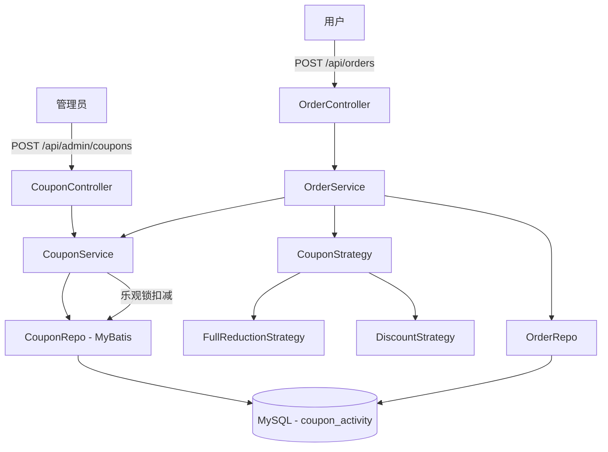

# 优惠券模块 执行计划

> 日期: 2026-06-08 | 作者: huyongle | 关联 spec: [../spec.md](../spec.md)

## 架构概览

在现有 Spring Boot + MyBatis 分层架构基础上，新增独立的 `coupon/` 模块，包含 Controller、Service、Repository、Domain 四层。优惠券策略使用策略模式实现满减和折扣两种计算逻辑。OrderService 在下单流程中织入优惠券校验和库存扣减，通过 MyBatis 乐观锁保证并发安全。



## 关键设计决策

### 决策 1: 库存扣减使用乐观锁（version 字段）
- **选择**: 在 coupon_activity 表增加 version 字段，update 语句加 WHERE version = #{version} AND stock > 0
- **原因**: MyBatis 天然支持乐观锁——通过检查 update 影响行数判断冲突；与项目现有技术栈一致；无需引入额外中间件。业界主流方案（ruoyi-vue-pro、美团优惠券系统均采用此方案）
- **替代方案**: Redis 预扣减——需要额外中间件，引入数据一致性问题，本模块非秒杀场景不需要；SELECT FOR UPDATE 悲观锁——阻塞并发事务，吞吐量比乐观锁低
- **影响**: 影响 coupon_activity 表结构（新增 version 列）、CouponRepo 的扣减方法需检查影响行数、CouponService 需实现重试逻辑

### 决策 2: 优惠券类型使用策略模式
- **选择**: 定义 CouponStrategy 接口，FullReductionStrategy 和 DiscountStrategy 各自实现 calculateDiscount 方法
- **原因**: 项目已有 promotion/ 模块的满减逻辑，策略模式与项目代码风格一致；新增券种只需新增策略类，符合开闭原则
- **替代方案**: 单一类 if-else 分支——券种增多后代码膨胀，不符合项目惯用风格
- **影响**: 新增 coupon/strategy/ 包，CouponService 通过策略工厂获取对应策略

### 决策 3: 订单表冗余优惠券快照
- **选择**: 在 Order 实体中新增 coupon_id、coupon_type、original_amount、discount_amount、final_amount 字段
- **原因**: 优惠券规则可能后续变更，快照保证历史订单金额可追溯；避免跨表 JOIN 查询历史订单的优惠券信息。GitHub 同类电商项目均采用此做法
- **替代方案**: 仅存 coupon_id 外键——优惠券被删除或修改后，历史订单数据丢失
- **影响**: Order 表和 Entity 各新增 5 个字段；OrderRepo 无需变更（已有动态 SQL）；OrderService.createOrder 方法需填充快照字段

## 代码库分析

### 现有架构约束

| 层级 | 当前实现方式 | 新模块适配策略 |
|------|-------------|--------------|
| Controller | @RestController + 统一响应体 ApiResponse + @Validated 参数校验 | 沿用，新增 CouponController |
| Service | 接口+实现类（如 OrderService + OrderServiceImpl），@Service 注解，@Transactional 事务 | 沿用，新增 CouponService 接口 + CouponServiceImpl |
| Repository | MyBatis Mapper 接口 + XML 映射文件，@Mapper 注解 | 沿用，新增 CouponRepo Mapper |
| Entity | Lombok @Data，字段对应数据库列（下划线转驼峰），金额字段用 BigDecimal | 沿用，新增 Coupon/CouponActivity Entity |

### 锚点模块分析

**参考模块**: `promotion/` (现有满减活动模块)

| 分析维度 | 发现 |
|---------|------|
| 目录结构 | promotion/ 下按 controller/service/repository/domain 分包，非按功能分包 |
| 命名规范 | 类名 PascalCase、方法名 camelCase；Service 接口名无 I 前缀，实现类加 Impl 后缀 |
| 错误处理 | 自定义 BusinessException(code, message)，Controller 通过 @ExceptionHandler 全局处理 |
| 日志/监控 | 使用 @Slf4j，关键方法入口打印 INFO 日志含参数 |
| 测试风格 | 使用 JUnit 5 + Mockito，Service 层 Mock Repository 做单元测试 |

### 可复用清单

| 已有模块/工具 | 路径 | 复用方式 |
|-------------|------|---------|
| ApiResponse 统一响应体 | `common/dto/ApiResponse.java` | 直接引用，Controller 返回包装 |
| BusinessException 业务异常 | `common/exception/BusinessException.java` | 直接 throw，全局异常处理捕获 |
| UserService.findById | `service/UserService.java` | 直接注入调用，验证管理员角色 |
| OrderService.createOrder | `service/OrderService.java` | 修改——织入优惠券处理逻辑 |
| OrderRepo 订单持久层 | `repository/OrderRepo.java` | 不修改 mapper，仅扩展 Entity 字段 |

### 需要变更的已有模块

| 模块 | 变更类型 | 原因 | 风险 |
|------|---------|------|------|
| OrderService (createOrder) | 新增优惠券校验和扣减逻辑 | 下单流程需支持优惠券 | 中等——需确保原有下单流程不被破坏 |
| Order Entity | 新增 5 个字段 | 存储优惠券快照 | 低——新增字段不影响已有查询 |

## 模块/组件设计

### CouponController（新增）
- **职责**: 管理员创建/查询优惠券活动的 REST 接口入口
- **对外接口**:
  - `POST /api/admin/coupons` — 创建优惠券活动（需管理员角色）
  - `GET /api/admin/coupons` — 分页查询活动列表（需管理员角色）
  - `GET /api/coupons/available?orderAmount={amount}` — 用户获取可用优惠券
- **依赖**: CouponService
- **数据流**: HTTP 请求 → @Validated 校验 → CouponService → ApiResponse 返回

### CouponService（新增）
- **职责**: 优惠券核心业务逻辑：活动创建、可用券查询、库存扣减、优惠计算
- **对外接口**:
  - `CouponActivity createActivity(CreateCouponRequest request)`
  - `PageResult<CouponActivity> listActivities(PageRequest request, CouponStatus status)`
  - `List<CouponActivity> getAvailableCoupons(BigDecimal orderAmount)`
  - `CouponDeductionResult deductStock(Long couponId)`
- **依赖**: CouponRepo, CouponStrategyFactory
- **数据流**: 参数校验 → 查询数据库 → 策略计算 → 返回结果

### CouponStrategyFactory + Strategy（新增）
- **职责**: 根据优惠券类型获取对应计算策略
- **对外接口**:
  - `CouponStrategy getStrategy(CouponType type)`
  - `interface CouponStrategy { BigDecimal calculate(BigDecimal orderAmount, CouponActivity coupon); }`
- **依赖**: FullReductionStrategy, DiscountStrategy
- **数据流**: 券类型 → 工厂选择策略 → 策略计算优惠金额

### OrderService（修改）
- **职责**: 下单流程中新增：校验优惠券有效性 → 计算折后金额 → 扣减库存 → 填充快照到订单
- **变更点**: createOrder 方法中，在金额计算阶段织入优惠券处理
- **依赖**: CouponService
- **数据流**: 订单请求含 couponId → CouponService 校验+扣减 → 优惠后金额写入 Order Entity

## 数据模型

### 新增表/集合

```sql
-- 表名: coupon_activity
CREATE TABLE coupon_activity (
    id            BIGINT       PRIMARY KEY AUTO_INCREMENT COMMENT '主键',
    name          VARCHAR(128) NOT NULL              COMMENT '活动名称',
    coupon_type   VARCHAR(16)  NOT NULL              COMMENT '券类型: FULL_REDUCTION / DISCOUNT',
    min_amount    DECIMAL(10,2) NOT NULL DEFAULT 0.00 COMMENT '最低消费金额',
    discount_amount DECIMAL(10,2) DEFAULT NULL       COMMENT '满减金额(满减券专用)',
    discount_rate DECIMAL(3,2)  DEFAULT NULL         COMMENT '折扣率(折扣券专用, 如 0.85)',
    total_stock   INT          NOT NULL              COMMENT '初始库存',
    remaining_stock INT        NOT NULL              COMMENT '剩余库存',
    start_time    DATETIME     NOT NULL              COMMENT '有效期开始',
    end_time      DATETIME     NOT NULL              COMMENT '有效期结束',
    status        VARCHAR(16)  NOT NULL DEFAULT 'ACTIVE' COMMENT '活动状态: ACTIVE / PAUSED / ENDED',
    version       INT          NOT NULL DEFAULT 0    COMMENT '乐观锁版本号',
    created_at    DATETIME     NOT NULL DEFAULT CURRENT_TIMESTAMP,
    updated_at    DATETIME     NOT NULL DEFAULT CURRENT_TIMESTAMP ON UPDATE CURRENT_TIMESTAMP,
    INDEX idx_status_start_end (status, start_time, end_time),
    INDEX idx_remaining_stock (remaining_stock)
) ENGINE=InnoDB DEFAULT CHARSET=utf8mb4 COMMENT='优惠券活动';
```

| 字段 | 类型 | 说明 | 约束 |
|------|------|------|------|
| id | BIGINT | 主键 | PK, AUTO_INCREMENT |
| name | VARCHAR(128) | 活动名称 | NOT NULL |
| coupon_type | VARCHAR(16) | FULL_REDUCTION / DISCOUNT | NOT NULL |
| min_amount | DECIMAL(10,2) | 最低消费金额 | NOT NULL, DEFAULT 0.00 |
| discount_amount | DECIMAL(10,2) | 满减金额（满减券） | NULL（折扣券为 NULL） |
| discount_rate | DECIMAL(3,2) | 折扣率（折扣券） | NULL（满减券为 NULL） |
| total_stock | INT | 初始库存 | NOT NULL |
| remaining_stock | INT | 剩余库存 | NOT NULL |
| start_time | DATETIME | 有效期开始 | NOT NULL |
| end_time | DATETIME | 有效期结束 | NOT NULL |
| status | VARCHAR(16) | ACTIVE / PAUSED / ENDED | NOT NULL |
| version | INT | 乐观锁版本号 | NOT NULL, DEFAULT 0 |

### 变更表/集合

| 表名 | 变更类型 | 说明 |
|------|---------|------|
| `order` 表 | ADD COLUMN | 新增 coupon_id BIGINT, coupon_type VARCHAR(16), original_amount DECIMAL(10,2), discount_amount DECIMAL(10,2), final_amount DECIMAL(10,2) |

## API 契约

### POST /api/admin/coupons — 创建优惠券活动

**请求**:
```json
{
  "name": "618满减券",
  "couponType": "FULL_REDUCTION",
  "minAmount": 100.00,
  "discountAmount": 20.00,
  "totalStock": 1000,
  "startTime": "2026-06-18T00:00:00",
  "endTime": "2026-06-25T23:59:59"
}
```
| 参数 | 类型 | 必填 | 说明 |
|------|------|------|------|
| name | String | 是 | 活动名称 |
| couponType | String | 是 | FULL_REDUCTION / DISCOUNT |
| minAmount | BigDecimal | 是 | 最低消费金额，>= 0 |
| discountAmount | BigDecimal | 条件必填 | 满减金额（couponType=FULL_REDUCTION 时必填） |
| discountRate | BigDecimal | 条件必填 | 折扣率（couponType=DISCOUNT 时必填，0 < rate < 1） |
| totalStock | Integer | 是 | 总库存，> 0 |
| startTime | DateTime | 是 | 有效期开始 |
| endTime | DateTime | 是 | 有效期结束，必须晚于 startTime |

**响应**:
```json
{
  "code": 200,
  "message": "success",
  "data": {
    "id": 1,
    "name": "618满减券",
    "couponType": "FULL_REDUCTION",
    "minAmount": 100.00,
    "discountAmount": 20.00,
    "remainingStock": 1000,
    "status": "ACTIVE"
  }
}
```

**错误码**:
| 状态码 | 错误码 | 说明 |
|--------|--------|------|
| 400 | INVALID_PARAM | 参数校验失败（类型不匹配、折扣率无效等） |
| 400 | INVALID_DATE_RANGE | 结束时间早于开始时间 |
| 403 | FORBIDDEN | 非管理员角色 |

### GET /api/coupons/available — 获取可用优惠券

**请求参数**: `?orderAmount=150.00`

**响应**:
```json
{
  "code": 200,
  "message": "success",
  "data": [
    {
      "id": 1,
      "name": "618满减券",
      "couponType": "FULL_REDUCTION",
      "minAmount": 100.00,
      "discountAmount": 20.00,
      "remainingStock": 999
    }
  ]
}
```

**错误码**:
| 状态码 | 错误码 | 说明 |
|--------|--------|------|
| 400 | INVALID_PARAM | orderAmount 参数缺失或格式错误 |

### POST /api/orders — 下单（集成优惠券，修改已有接口）

**请求**（新增的优惠券相关字段）:
```json
{
  "couponId": 1
}
```

**错误码**（新增）:
| 状态码 | 错误码 | 说明 |
|--------|--------|------|
| 400 | COUPON_EXPIRED | 优惠券已过期 |
| 400 | COUPON_MIN_AMOUNT | 未达到优惠券使用门槛 |
| 404 | COUPON_NOT_FOUND | 优惠券不存在 |
| 409 | COUPON_OUT_OF_STOCK | 优惠券库存不足（含乐观锁重试失败） |

## 迁移策略

N/A（本次为全新模块，无存量数据迁移需求）

## 测试策略

| 测试层级 | 覆盖范围 | 工具 |
|---------|---------|------|
| 单元测试 | CouponService 各方法、CouponStrategy 各实现、CouponController 参数校验 | JUnit 5 + Mockito |
| 集成测试 | 优惠券创建/查询/使用完整链路、并发库存扣减正确性、事务回滚 | SpringBootTest + TestContainers (MySQL) |
| E2E 测试 | 管理员创建优惠券 → 用户查看可用券 → 用户下单使用 → 库存扣减验证 | N/A（本期不做） |

## 时间/工作量估算

| 任务 | 预估工时 | 依赖 |
|------|---------|------|
| 数据表 DDL + Entity 创建 | 2h | 无 |
| CouponRepo Mapper + XML | 2h | Entity |
| CouponService 核心逻辑 | 4h | Repo |
| CouponStrategy 策略实现 | 3h | Entity |
| CouponController 接口 | 2h | Service |
| OrderService 优惠券集成 | 3h | CouponService |
| 并发库存扣减 + 乐观锁 | 2h | Repo |
| 单元测试 + 集成测试 | 4h | 全部功能 |
| 合计 | 22h | — |

## 回滚方案

- 优惠券模块为独立新增模块，无侵入性修改原有核心逻辑（仅在 OrderService.createOrder 中新增可选流程）
- 如需回滚：部署上一版本代码即可，不支持优惠券的订单数据兼容——coupon 相关字段为 NULL 时按原价处理
- 建议使用 feature flag `coupon.enabled` 控制优惠券功能开关，true 开启优惠券处理、false 跳过优惠券逻辑，实现无需部署的回滚
