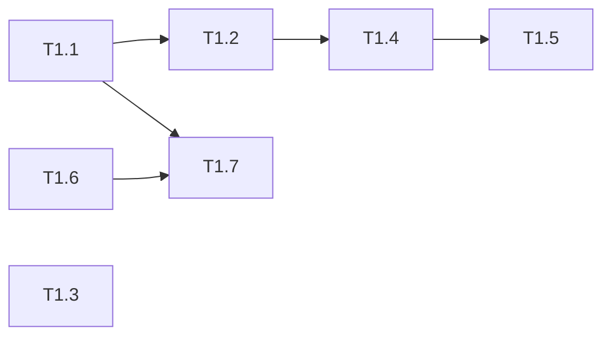

# 优惠券模块 Phase 1: 基础设施与数据层 任务清单

> 日期: 2026-06-08 | 作者: huyongle | 关联: [../plans/README.md](../plans/README.md)

## 本阶段任务

- [ ] **T1.1**: 创建 coupon_activity 数据表 DDL
  - **描述**: 编写 CREATE TABLE 语句，包含 id/name/coupon_type/min_amount/discount_amount/discount_rate/total_stock/remaining_stock/start_time/end_time/status/version/created_at/updated_at 全部字段，以及 status_start_end 和 remaining_stock 索引
  - **产出物**: `resources/db/migration/V2__create_coupon_activity.sql`（新增）
  - **参考**: 参考 `promotion/` 模块已有的 DDL 脚本风格，字段命名沿用 project 的下划线命名规范
  - **复用**: N/A
  - **验收**: DDL 可正常执行，执行后 coupon_activity 表存在且包含 version 字段和两张索引
  - **预估**: 1h
  - **依赖**: 无

- [ ] **T1.2**: 创建 CouponActivity Entity
  - **描述**: 使用 Lombok @Data 创建实体类，字段与 coupon_activity 表一一对应（驼峰命名），金额字段使用 BigDecimal，时间字段使用 LocalDateTime
  - **产出物**: `coupon/domain/CouponActivity.java`（新增）
  - **参考**: 参考 `domain/Order.java` 的 Lombok @Data 风格、BigDecimal 金额字段写法、LocalDateTime 日期字段写法
  - **复用**: N/A
  - **验收**: Entity 字段与数据库表一一对应，Lombok 注解完整，BigDecimal 字段无 float/double
  - **预估**: 1h
  - **依赖**: T1.1

- [ ] **T1.3**: 创建 CouponType 枚举、CouponStatus 枚举
  - **描述**: CouponType 枚举含 FULL_REDUCTION 和 DISCOUNT 两种值；CouponStatus 枚举含 ACTIVE/PAUSED/ENDED 三种值
  - **产出物**: `coupon/domain/CouponType.java`, `coupon/domain/CouponStatus.java`（新增）
  - **参考**: 参考项目中已有枚举类的定义风格（如 promotion/ 下的枚举）
  - **复用**: N/A
  - **验收**: 枚举类可编译通过，枚举值完整，符合 MyBatis TypeHandler 注册要求
  - **预估**: 0.5h
  - **依赖**: 无

- [ ] **T1.4**: 创建 CouponRepo Mapper 接口
  - **描述**: 定义 MyBatis @Mapper 接口：insert 新增活动，selectById 按 ID 查询，selectAvailable 查询可用券列表（状态=ACTIVE、在有效期内、库存>0、满足最低消费），deductStock 乐观锁扣减库存（update coupon_activity SET remaining_stock = remaining_stock - 1, version = version + 1 WHERE id = #{id} AND version = #{version} AND remaining_stock > 0），selectPage 分页查询活动列表
  - **产出物**: `coupon/repository/CouponRepo.java`（新增）
  - **参考**: 参考 `repository/OrderRepo.java` 的 @Mapper 注解风格、@Param 参数绑定方式
  - **复用**: N/A
  - **验收**: 方法签名与 XML 映射一致，deductStock 返回 int（影响行数，0 表示冲突/失败）
  - **预估**: 1.5h
  - **依赖**: T1.2

- [ ] **T1.5**: 创建 CouponRepo Mapper XML
  - **描述**: 编写 MyBatis XML 映射文件：insert 全字段插入、selectById 基准查询、selectAvailable 动态 SQL（\<if\> 标签按 min_amount/status/stock/时间过滤）、deductStock 乐观锁 update 语句、selectPage 分页查询
  - **产出物**: `resources/mapper/CouponRepo.xml`（新增）
  - **参考**: 参考 `resources/mapper/OrderRepo.xml` 的 XML 结构、\<if\> 标签用法、resultMap 配置风格
  - **复用**: N/A
  - **验收**: deductStock SQL 包含 WHERE version = #{version} AND remaining_stock > 0 条件；selectAvailable 正确过滤已过期和无库存的券
  - **预估**: 2h
  - **依赖**: T1.4

- [ ] **T1.6**: 修改 Order Entity 新增优惠券快照字段
  - **描述**: 在 Order Entity 中新增 couponId(Long)、couponType(String)、originalAmount(BigDecimal)、discountAmount(BigDecimal)、finalAmount(BigDecimal) 五个字段
  - **产出物**: `domain/Order.java`（修改）
  - **参考**: 遵循现有 Order Entity 的字段声明风格和 Lombok 注解方式
  - **复用**: N/A
  - **验收**: 字段添加后原有测试通过，新增字段不影响已有查询和序列化
  - **预估**: 0.5h
  - **依赖**: 无

- [ ] **T1.7**: 编写 Order 表 ALTER TABLE DDL
  - **描述**: 为 order 表新增 coupon_id/coupon_type/original_amount/discount_amount/final_amount 五个列
  - **产出物**: `resources/db/migration/V3__alter_order_add_coupon.sql`（新增）
  - **参考**: 沿用项目已有的 DDL 命名规范
  - **复用**: N/A
  - **验收**: DDL 可执行，order 表新增五个可为 NULL 的列
  - **预估**: 0.5h
  - **依赖**: T1.6

## 本阶段预估

| 指标 | 值 |
|------|-----|
| 任务数 | 7 |
| 预估总工时 | 7h |
| 可并行任务 | T1.1/T1.3/T1.6, T1.4/T1.7 |

## 本阶段内依赖

