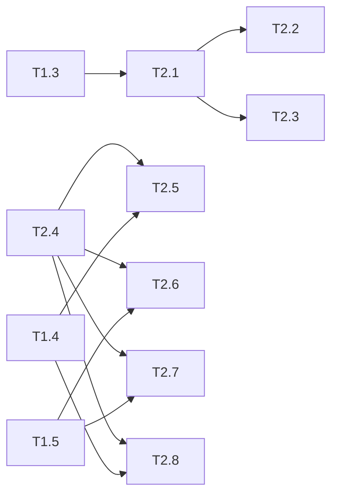

# 优惠券模块 Phase 2: 核心业务逻辑 任务清单

> 日期: 2026-06-08 | 作者: huyongle | 关联: [../plans/README.md](../plans/README.md) | 上一阶段: [phase1-infrastructure.md](./phase1-infrastructure.md)

## 本阶段任务

- [ ] **T2.1**: 实现 CouponStrategy 接口和策略工厂
  - **描述**: 定义 CouponStrategy 接口（BigDecimal calculate(BigDecimal orderAmount, CouponActivity coupon)），实现 CouponStrategyFactory 工厂类（根据 CouponType 返回对应策略实例）
  - **产出物**: `coupon/strategy/CouponStrategy.java`, `coupon/strategy/CouponStrategyFactory.java`（新增）
  - **参考**: 参考项目中已有的策略模式实现风格（如 payment/strategy/ 的 PaymentStrategy 模式）
  - **复用**: 注入 CouponType 枚举直接做工厂匹配
  - **验收**: 工厂根据 CouponType 正确返回对应策略实例，传入未知类型抛异常
  - **预估**: 1h
  - **依赖**: T1.3

- [ ] **T2.2**: 实现 FullReductionStrategy（满减券计算）
  - **描述**: 满减券计算逻辑：判断 orderAmount >= coupon.minAmount，若满足则优惠金额 = coupon.discountAmount，否则返回 0
  - **产出物**: `coupon/strategy/FullReductionStrategy.java`（新增）
  - **参考**: 参考现有 promotion/ 模块的满减计算逻辑，保证计算风格一致
  - **复用**: 直接使用 CouponActivity 实体的 getDiscountAmount() 方法
  - **验收**: 订单金额 150 用满 100 减 20 券返回 20；订单金额 50 用满 100 减 20 券返回 0
  - **预估**: 0.5h
  - **依赖**: T2.1

- [ ] **T2.3**: 实现 DiscountStrategy（折扣券计算）
  - **描述**: 折扣券计算逻辑：判断 orderAmount >= coupon.minAmount，若满足则优惠金额 = orderAmount * (1 - coupon.discountRate)，结果使用 BigDecimal HALF_UP 保留两位小数；不满足返回 0
  - **产出物**: `coupon/strategy/DiscountStrategy.java`（新增）
  - **参考**: 遵循 FullReductionStrategy 的代码结构，保持策略类风格一致
  - **复用**: 使用 BigDecimal.multiply + setScale(2, HALF_UP) 处理精度
  - **验收**: 订单金额 200 用满 200 打 8 折券返回 40.00；订单金额 199 用满 200 打 8 折券返回 0.00；使用 compareTo 而非 equals 比较金额
  - **预估**: 1h
  - **依赖**: T2.1

- [ ] **T2.4**: 创建 CouponService 接口
  - **描述**: 定义 CouponService 接口：createActivity(CreateCouponRequest)、getAvailableCoupons(BigDecimal orderAmount)、deductStock(Long id, Integer version)、listActivities(PageRequest, CouponStatus)
  - **产出物**: `coupon/service/CouponService.java`（新增）
  - **参考**: 参考 `service/OrderService.java` 的接口定义风格（方法命名、参数注解、返回值类型）
  - **复用**: N/A
  - **验收**: 接口方法签名与 plan 设计一致，每个方法的 JavaDoc 注释完整
  - **预估**: 0.5h
  - **依赖**: T1.2

- [ ] **T2.5**: 实现 CouponServiceImpl — 创建优惠券活动
  - **描述**: 校验 CreateCouponRequest 参数逻辑（满减券 discountAmount > 0 且 discountRate 为 null，折扣券 discountRate 在 0-1 之间且 discountAmount 为 null），构建 CouponActivity Entity 并调用 Repo.insert
  - **产出物**: `coupon/service/CouponServiceImpl.java`（新增 createActivity 方法）
  - **参考**: 参考 `service/OrderServiceImpl.java` 的 @Transactional 用法、营业异常抛出方式
  - **复用**: 注入 CouponRepo.insert 完成持久化
  - **验收**: 满减券 discountAmount 为负数抛 BusinessException；折扣券 discountRate=1.5 抛 BusinessException；创建成功后返回含 ID 的 CouponActivity
  - **预估**: 1.5h
  - **依赖**: T1.4, T2.4

- [ ] **T2.6**: 实现 CouponServiceImpl — 获取可用优惠券
  - **描述**: 调用 CouponRepo.selectAvailable 查询有效券列表（状态 ACTIVE、在有效期内、库存>0、minAmount <= orderAmount），按优惠力度降序排列（满减按 discountAmount DESC，折扣折合为金额比较）
  - **产出物**: `coupon/service/CouponServiceImpl.java`（新增 getAvailableCoupons 方法）
  - **参考**: 参考项目中已有 Service 的查询逻辑风格
  - **复用**: 注入 CouponRepo.selectAvailable
  - **验收**: 传入订单金额 150 返回满 100 减 20 + 满 150 打 8 折等满足条件的券；过期的券不在列表中；库存 0 的券不在列表中
  - **预估**: 1.5h
  - **依赖**: T1.5, T2.4

- [ ] **T2.7**: 实现 CouponServiceImpl — 库存扣减（乐观锁 + 重试）
  - **描述**: 调用 CouponRepo.deductStock，检查影响行数：> 0 返回成功；= 0 表示乐观锁冲突，最多重试 3 次（每次重新读取最新 version 后再 UPDATE），全部失败抛 BusinessException("COUPON_OUT_OF_STOCK")
  - **产出物**: `coupon/service/CouponServiceImpl.java`（新增 deductStock 方法）
  - **参考**: 参考 MyBatis 官方文档中乐观锁的实现范式，以及 Spring 事务重试机制
  - **复用**: 注入 CouponRepo.deductStock（T1.5）和 CouponRepo.selectById（T1.4）
  - **验收**: 单线程正常扣减成功返回扣减结果（含 newStock）；并发 10 线程扣 3 库存仅 3 个成功、7 个抛异常；重试日志有 INFO 级别记录
  - **预估**: 2h
  - **依赖**: T1.5, T2.4

- [ ] **T2.8**: 实现 CouponServiceImpl — 分页查询活动列表
  - **描述**: 调用 CouponRepo.selectPage 分页查询，支持按 CouponStatus 筛选，返回 PageResult 封装
  - **产出物**: `coupon/service/CouponServiceImpl.java`（新增 listActivities 方法）
  - **参考**: 参考项目中已有 Service 的分页查询模式
  - **复用**: 注入 CouponRepo.selectPage（T1.4），复用已有 PageResult DTO
  - **验收**: 不带 status 筛选返回全部活动；带 ACTIVE 筛选仅返回 ACTIVE 状态；分页参数正确传递
  - **预估**: 1h
  - **依赖**: T1.4, T2.4

## 本阶段预估

| 指标 | 值 |
|------|-----|
| 任务数 | 8 |
| 预估总工时 | 9h |
| 可并行任务 | T2.2/T2.3 可并行 |

## 本阶段内依赖

