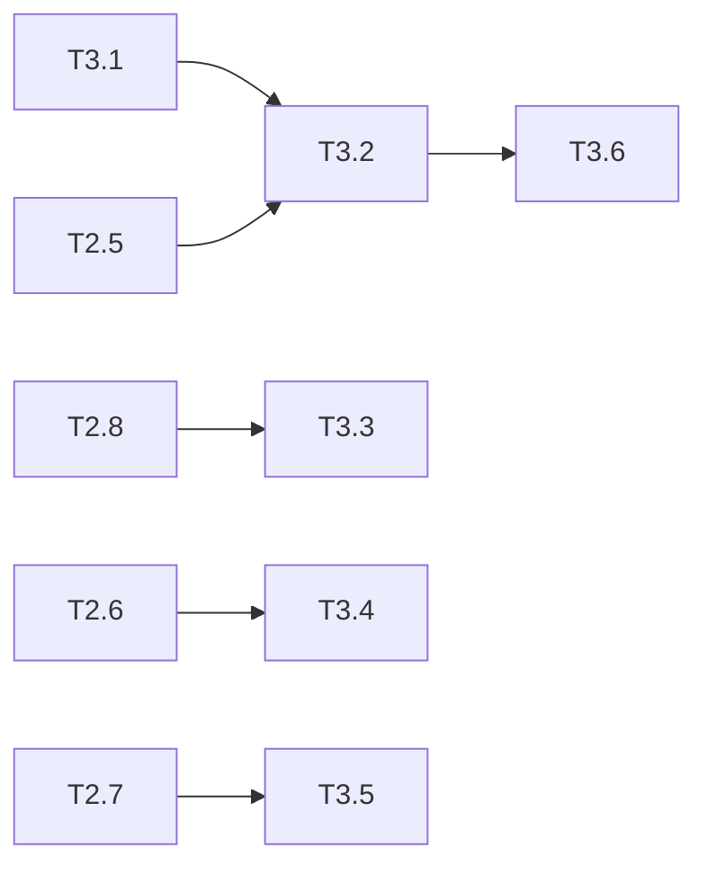

# 优惠券模块 Phase 3: 接口与集成层 任务清单

> 日期: 2026-06-08 | 作者: huyongle | 关联: [../plans/README.md](../plans/README.md) | 上一阶段: [phase2-core-logic.md](./phase2-core-logic.md)

## 本阶段任务

- [ ] **T3.1**: 创建 CreateCouponRequest / PageRequest DTO
  - **描述**: 创建 CreateCouponRequest（含 @NotNull/@DecimalMin/@Size 等校验注解）和分页查询 DTO，参数校验注解明确错误消息
  - **产出物**: `coupon/dto/CreateCouponRequest.java`, `coupon/dto/CouponPageRequest.java`（新增）
  - **参考**: 参考项目中已有 DTO 的 @Validated 注解使用风格和字段命名规范
  - **复用**: 复用已有的 PageResult 公共 DTO
  - **验收**: 空 name 字段触发校验异常；discountRate=0 触发校验异常；开始时间晚于结束时间触发校验异常
  - **预估**: 1h
  - **依赖**: T1.3

- [ ] **T3.2**: 实现 CouponController — 管理员创建优惠券接口
  - **描述**: POST /api/admin/coupons，@Validated 校验请求体，调用 CouponService.createActivity，返回 ApiResponse<CouponActivity>
  - **产出物**: `coupon/controller/CouponController.java`（新增 createActivity 方法）
  - **参考**: 参考 `controller/OrderController.java` 的 @RestController/@PostMapping/@Validated 注解风格、ApiResponse 响应包装方式
  - **复用**: 注入 CouponService，复用 ApiResponse 包装
  - **验收**: 合法请求返回 200 + 含 id 的 CouponActivity；非法请求返回 400 + 明确错误描述；非管理员角色返回 403
  - **预估**: 1h
  - **依赖**: T2.5, T3.1

- [ ] **T3.3**: 实现 CouponController — 管理员分页查询接口
  - **描述**: GET /api/admin/coupons，接收分页参数和可选 status 筛选，调用 CouponService.listActivities，返回 ApiResponse<PageResult<CouponActivity>>
  - **产出物**: `coupon/controller/CouponController.java`（新增 listActivities 方法）
  - **参考**: 参考项目已有 Controller 的分页查询接口实现风格
  - **复用**: 注入 CouponService，复用 ApiResponse 和 PageResult
  - **验收**: 分页查询返回正确 total 和 list；status=ACTIVE 筛选生效
  - **预估**: 1h
  - **依赖**: T2.8

- [ ] **T3.4**: 实现 CouponController — 用户获取可用优惠券接口
  - **描述**: GET /api/coupons/available?orderAmount={amount}，@RequestParam 接收订单金额，调用 CouponService.getAvailableCoupons，返回 ApiResponse<List<CouponActivity>>
  - **产出物**: `coupon/controller/CouponController.java`（新增 getAvailableCoupons 方法）
  - **参考**: 参考项目已有 Controller 的 GET 接口写法
  - **复用**: 注入 CouponService
  - **验收**: 传入有效金额返回可用券列表按优惠力度降序排列；不传 orderAmount 返回 400
  - **预估**: 0.5h
  - **依赖**: T2.6

- [ ] **T3.5**: 修改 OrderService.createOrder 织入优惠券处理
  - **描述**: 在 createOrder 方法中：如果请求含 couponId，依次调用 CouponService.deductStock（扣减库存）→ CouponStrategyFactory 计算优惠金额 → 设置 Order 的优惠券快照字段 → 继续原有下单逻辑。如果 deductStock 抛异常则事务回滚。整个处理在现有 @Transactional 范围内执行
  - **产出物**: `service/OrderServiceImpl.java`（修改 createOrder 方法）
  - **参考**: 保持现有 createOrder 方法的代码结构和 @Transactional 注解不变，在金额计算阶段插入优惠券处理
  - **复用**: 注入 CouponService 和 CouponStrategyFactory；修改 Order Entity 的 setter 调用填充快照字段
  - **验收**: 带有效 couponId 下单成功，返回的 Order 含正确的优惠券快照和折后金额；无效 couponId 下单抛 BusinessException 事务回滚；不传 couponId 正常下单不受影响
  - **预估**: 2h
  - **依赖**: T2.7, T2.2, T2.3, T1.6

- [ ] **T3.6**: 配置管理员角色权限拦截
  - **描述**: 在 SecurityConfig 或已有权限拦截器中，为 /api/admin/coupons/** 路径配置管理员角色要求
  - **产出物**: `config/SecurityConfig.java`（修改，或在已有权限配置类中新增规则）
  - **参考**: 参考项目中已有的管理员接口权限配置方式
  - **复用**: 复用已有的角色判断逻辑
  - **验收**: 普通用户 token 调用 POST /api/admin/coupons 返回 403；管理员 token 调用成功
  - **预估**: 0.5h
  - **依赖**: T3.2

## 本阶段预估

| 指标 | 值 |
|------|-----|
| 任务数 | 6 |
| 预估总工时 | 6h |
| 可并行任务 | T3.2/T3.3/T3.4 可在 Controller 类中并行开发 |

## 本阶段内依赖

