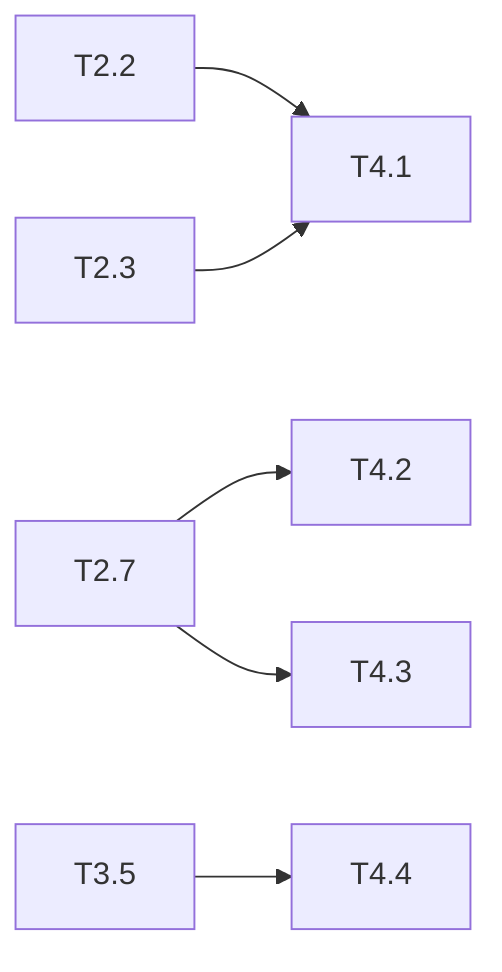

# 优惠券模块 Phase 4: 测试与收尾 任务清单

> 日期: 2026-06-08 | 作者: huyongle | 关联: [../plans/README.md](../plans/README.md) | 上一阶段: [phase3-api-integration.md](./phase3-api-integration.md)

## 本阶段任务

- [ ] **T4.1**: 编写 CouponStrategy 单元测试
  - **描述**: 使用 JUnit 5 + Mockito，对 FullReductionStrategy 和 DiscountStrategy 编写单元测试，覆盖：满足条件计算正确、不满足条件返回 0、边界金额（0、刚好等于 minAmount）、折扣精度验证（BigDecimal 精度保留两位）
  - **产出物**: `coupon/strategy/FullReductionStrategyTest.java`, `coupon/strategy/DiscountStrategyTest.java`（新增）
  - **参考**: 参考项目中已有单元测试的 JUnit 5 @Test 注解风格、Mockito 使用方式、测试命名规范
  - **复用**: 直接实例化策略类，无需 Mock
  - **验收**: 所有测试用例通过；边界条件覆盖完整；金额精度验证使用 compareTo 比较
  - **预估**: 1h
  - **依赖**: T2.2, T2.3

- [ ] **T4.2**: 编写 CouponServiceImpl 单元测试
  - **描述**: Mock CouponRepo 和 CouponStrategyFactory，测试 createActivity（参数校验逻辑）、getAvailableCoupons（查询和排序）、deductStock（乐观锁重试成功/全部失败/一次重试后成功）、listActivities（分页和筛选）
  - **产出物**: `coupon/service/CouponServiceImplTest.java`（新增）
  - **参考**: 参考项目中已有 Service 单元测试的 Mockito @Mock/@InjectMocks 用法、verify 验证调用次数
  - **复用**: Mock CouponRepo 和 CouponStrategyFactory
  - **验收**: 所有测试用例通过；deductStock 重试逻辑得到充分覆盖（0 行/1 次重试成功/3 次全部失败）；异常场景覆盖率 > 80%
  - **预估**: 2h
  - **依赖**: T2.5, T2.6, T2.7, T2.8

- [ ] **T4.3**: 编写并发库存扣减集成测试
  - **描述**: 使用 SpringBootTest + TestContainers MySQL，先插入一条库存为 3 的优惠券记录，启动 10 个线程（CountDownLatch）并发调用 deductStock，验证最终库存为 0 且扣除成功次数 = 3
  - **产出物**: `coupon/service/CouponDeductStockConcurrencyTest.java`（新增）
  - **参考**: 参考项目中已有集成测试的 @SpringBootTest 配置、数据库初始化方式
  - **复用**: 注入真实 CouponService 和 CouponRepo，使用 TestContainers MySQL
  - **验收**: 10 线程并发扣减 3 库存，最终库存 = 0，成功扣减次数 = 3，无超卖；剩余 7 个请求均返回异常
  - **预估**: 2h
  - **依赖**: T2.7

- [ ] **T4.4**: 编写 OrderService 优惠券集成测试
  - **描述**: 使用 SpringBootTest，测试：带有效 couponId 下单成功（验证订单优惠券快照字段）、带无效 couponId 下单抛异常（验证事务回滚、库存未扣减）、不带 couponId 正常下单不受影响、过期券下单抛异常、库存为 0 券下单抛异常
  - **产出物**: `service/OrderServiceCouponIntegrationTest.java`（新增）
  - **参考**: 参考项目中已有的 OrderService 集成测试风格
  - **复用**: 注入真实 OrderService、CouponService，Mock 或使用 TestContainers
  - **验收**: 所有场景通过；事务回滚验证库存数字正确；快照字段值与优惠券记录一致
  - **预估**: 2h
  - **依赖**: T3.5

- [ ] **T4.5**: 追加 CHANGELOG 条目
  - **描述**: 在项目根 CHANGELOG.md 按照 Keep a Changelog 规范追加优惠券模块条目，使用 Added 分类
  - **产出物**: `CHANGELOG.md`（修改——追加条目）
  - **参考**: 参考 CHANGELOG 模板中的 Keep a Changelog 规范
  - **复用**: N/A
  - **验收**: 版本号格式为 ## [x.y.z] - YYYY-MM-DD；分类使用 Added；每条描述一句话
  - **预估**: 0.5h
  - **依赖**: 无

## 本阶段预估

| 指标 | 值 |
|------|-----|
| 任务数 | 5 |
| 预估总工时 | 7.5h |
| 可并行任务 | T4.1/T4.5 可并行 |

## 本阶段内依赖

