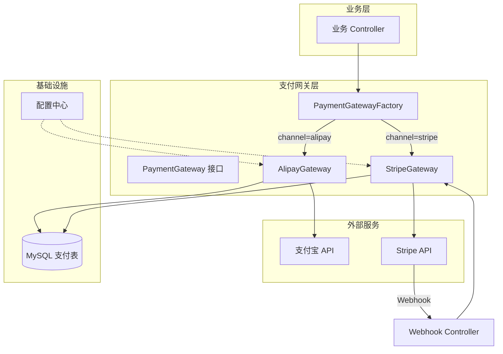

# Stripe 支付网关对接 执行计划

> 日期: 2026-06-08 | 作者: AI Researcher | 关联 spec: [../spec.md](../spec.md) | 子 plan: N/A（单 slice 后端方案）

## 架构概览

整体方案：在现有支付宝支付模块之上抽象统一支付网关接口（`PaymentGateway`），新增 Stripe 支付实现。通过工厂模式按渠道路由，业务层无感知切换支付方式。Stripe 侧使用 PaymentIntent API 实现支付创建、确认、回调、退款全流程。



## 关键设计决策

### 决策 1: 策略模式统一多支付网关
- **选择**: 策略模式（Strategy Pattern）——定义 `PaymentGateway` 接口，`AlipayGateway` 和 `StripeGateway` 分别实现，`PaymentGatewayFactory` 根据 `channel` 参数返回对应实现
- **原因**: 业界多支付网关的标准实践（GitHub 多个开源项目采用）；Spring IoC 容器天然支持策略模式注入（`Map<String, PaymentGateway>` 自动收集所有实现）；符合开闭原则——新增支付渠道只需新增一个实现类
- **替代方案**: 适配器模式单独使用——仅做 API 适配不做策略路由，多网关切换时需在不同适配器间手动选择，代码侵入性大
- **影响**: `payment/alipay/` 模块需提取接口并实现 `PaymentGateway`；`payment/stripe/` 全新模块；业务层调用方式从直接注入支付宝 Service 改为注入工厂

### 决策 2: 使用 Stripe PaymentIntent API（非 Checkout Session）
- **选择**: PaymentIntent API——服务端创建支付意图，前端用 client_secret 完成支付
- **原因**: PaymentIntent 提供完整支付流程控制（创建→确认→捕获→退款），与支付宝对接模式一致；支持自定义 UI 而非跳转 Stripe 托管页面，确保与支付宝统一的用户体验；支持手动捕获（capture_method=manual）以满足先冻结后扣款的业务场景
- **替代方案**: Checkout Session——开箱即用但 UI 托管在 Stripe 域，与支付宝自定义流程割裂，不满足统一体验要求
- **影响**: 前端需要集成 Stripe.js（或 Stripe Elements）来收集信用卡信息并完成支付确认；服务端需处理 PaymentIntent 状态机的各种状态转换

### 决策 3: Webhook + 轮询双通道状态同步
- **选择**: Webhook 为主通道（实时更新），定时任务轮询为兜底（补偿 Webhook 延迟/丢失）
- **原因**: Webhook 实时性最优，但网络不可靠时可能延迟或丢失；定时轮询作为补偿机制，确保最终一致性；Stripe 官方推荐此模式
- **替代方案**: 仅依赖 Webhook——不可靠，生产环境已多次验证 Webhook 存在延迟
- **影响**: 需要部署 Webhook Endpoint（HTTPS 公网可达）；需要配置定时任务（建议间隔 5 分钟，查询最近 30 分钟内 pending 状态的支付单）

### 决策 4: 数据库新建 Stripe 支付表（非扩展现有表）
- **选择**: 新建 `stripe_payment` 表存储 Stripe 特有字段（payment_intent_id, client_secret, stripe_status 等），通过 `order_id` 或 `payment_id` 与现有支付记录关联
- **原因**: Stripe 与支付宝的数据模型差异较大（Stripe 有 payment_intent_id、refund_id 等特有字段）；新建表避免修改已有支付宝支付表结构，降低回归风险；遵循"最小侵入"原则
- **替代方案**: 扩展通用 `payment` 表增加 JSON 字段存储网关特有数据——简单但查询不便，且 JSON 字段不适合建索引
- **影响**: 新增两张表（stripe_payment、stripe_refund）；查询时需要 JOIN 或分两次查询

## 代码库分析

### 现有架构约束

| 层级 | 当前实现方式（基于 payment/alipay/ 分析） | 新模块适配策略 |
|------|--------------------------------------|--------------|
| Controller | `@RestController` + 统一响应体 | 沿用——Stripe Webhook Controller 独立新建；业务 Controller 通过工厂调用不直接依赖网关 |
| Service | 接口+实现类，通过 `@Service` 注入 | 沿用——PaymentGateway 接口 + StripeGateway 实现类 |
| Repository | MyBatis Mapper + 自定义 XML | 沿用——新建 StripePaymentMapper 和对应 XML |
| Entity | Lombok @Data + MyBatis 映射 | 沿用——新建 StripePayment 等 Entity |
| 配置 | `application.yml` / `application.properties` | 沿用——新增 `stripe.*` 配置前缀 |

### 锚点模块分析

**参考模块**: `payment/alipay/`（已有支付宝支付对接模块）

| 分析维度 | 发现 |
|---------|------|
| 目录结构 | 按功能分层：controller / service / mapper / entity / config |
| 命名规范 | 类名：`AlipayXxx` 前缀；方法名：驼峰命名，动词开头（createOrder、queryStatus）；包名：全小写 |
| 错误处理 | 自定义 `PaymentException` + 错误码枚举；全局异常处理器统一返回格式 |
| 日志/监控 | SLF4J + Logback；关键操作记录 info 日志（请求参数、响应、耗时） |
| 测试风格 | JUnit 5 + Mockito；单元测试覆盖 Service 层；集成测试覆盖完整支付链路 |

### 可复用清单

| 已有模块/工具 | 路径 | 复用方式 |
|-------------|------|---------|
| 支付宝支付 Service（支付逻辑） | `payment/alipay/service/AlipayService.java` | 提取 PaymentGateway 接口后实现接口，逻辑不变 |
| 统一响应体 | `common/dto/ApiResponse.java` | 直接引用 |
| 全局异常处理器 | `common/exception/GlobalExceptionHandler.java` | 新增 Stripe 错误码后自动生效 |
| 支付异常类 | `payment/common/exception/PaymentException.java` | 直接复用 |
| 配置属性绑定 | Spring `@ConfigurationProperties` | Stripe 配置类采用相同模式 |

### 需要变更的已有模块

| 模块 | 变更类型 | 原因 | 风险 |
|------|---------|------|------|
| payment/alipay/ | 提取接口 | 将 AlipayService 核心方法签名提取到 PaymentGateway 接口 | 低——仅提取接口不修改实现逻辑，需回归测试 |
| 业务调用方 | 修改注入方式 | 从直接注入 AlipayService 改为注入 PaymentGatewayFactory | 中——需逐个确认调用方，建议分 PR 合入 |

## 模块/组件设计

### PaymentGateway 接口（payment/gateway/）
- **职责**: 定义支付网关的统一行为契约
- **对外接口**:
  ```java
  public interface PaymentGateway {
      PaymentResponse createPayment(CreatePaymentRequest request);
      PaymentResponse queryPayment(String paymentId);
      PaymentResponse handleCallback(Map<String, String> params);
      RefundResponse refund(RefundRequest request);
      String getChannel(); // 返回渠道标识，如 "alipay"、"stripe"
  }
  ```
- **依赖**: 无外部依赖（纯接口）
- **数据流**: 业务层 → Factory.getGateway(channel) → Gateway.createPayment() → 返回统一 PaymentResponse

### PaymentGatewayFactory（payment/gateway/）
- **职责**: 根据支付渠道参数返回对应的 PaymentGateway 实现
- **对外接口**:
  ```java
  @Component
  public class PaymentGatewayFactory {
      private final Map<String, PaymentGateway> gatewayMap;
      // Spring 自动注入所有 PaymentGateway 实现
      public PaymentGateway getGateway(String channel);
  }
  ```
- **依赖**: 所有 PaymentGateway 的 Spring Bean
- **数据流**: 接收 channel 字符串 → 从 Map 查找对应实现 → 返回

### StripeGateway（payment/stripe/）
- **职责**: Stripe 支付网关的完整实现
- **对外接口**: 实现 PaymentGateway 接口的全部方法
- **依赖**: Stripe Java SDK（`com.stripe:stripe-java`）、StripePaymentMapper（MyBatis）、已有 PaymentException
- **数据流**:
  ```
  createPayment: 请求参数 → Stripe PaymentIntent.create() → 保存 stripe_payment 记录 → 返回 PaymentResponse
  handleCallback: Webhook payload → 签名验证 → 解析事件 → 更新 stripe_payment 状态 → 更新业务订单
  refund: 退款请求 → Stripe Refund.create() → 保存 stripe_refund 记录 → 返回 RefundResponse
  ```

### Stripe Webhook Controller（payment/stripe/）
- **职责**: 接收 Stripe Webhook 事件，验证签名后路由到 StripeGateway.handleCallback()
- **对外接口**:
  ```
  POST /api/payment/stripe/webhook
  ```
- **依赖**: StripeGateway
- **数据流**: HTTP POST（Stripe 推送） → 提取签名头 → Webhook.constructEvent() → 分发到 StripeGateway

### StripeConfig（payment/stripe/）
- **职责**: 管理 Stripe 相关配置
- **对外接口**: Spring `@ConfigurationProperties(prefix = "stripe")`
- **依赖**: 配置中心 / application.yml
- **数据流**: 应用启动时从配置加载 secretKey、webhookSecret、connectTimeout 等

## 数据模型

### 新增表

```sql
-- 表名: stripe_payment
CREATE TABLE stripe_payment (
    id BIGINT AUTO_INCREMENT PRIMARY KEY,
    order_id BIGINT NOT NULL COMMENT '业务订单ID',
    payment_intent_id VARCHAR(64) NOT NULL COMMENT 'Stripe PaymentIntent ID',
    client_secret VARCHAR(255) COMMENT '前端支付所需 client_secret',
    amount BIGINT NOT NULL COMMENT '支付金额（分）',
    currency VARCHAR(3) NOT NULL DEFAULT 'usd' COMMENT '币种代码',
    status VARCHAR(32) NOT NULL DEFAULT 'CREATED' COMMENT '本地支付状态',
    stripe_status VARCHAR(32) COMMENT 'Stripe 侧状态',
    idempotency_key VARCHAR(64) COMMENT '幂等键',
    metadata JSON COMMENT '扩展数据',
    created_at DATETIME NOT NULL DEFAULT CURRENT_TIMESTAMP,
    updated_at DATETIME NOT NULL DEFAULT CURRENT_TIMESTAMP ON UPDATE CURRENT_TIMESTAMP,
    UNIQUE KEY uk_payment_intent_id (payment_intent_id),
    UNIQUE KEY uk_order_channel (order_id, 'stripe')
) COMMENT='Stripe 支付记录表';
```

| 字段 | 类型 | 说明 | 约束 |
|------|------|------|------|
| id | BIGINT | 主键 | PK, AUTO_INCREMENT |
| order_id | BIGINT | 关联业务订单ID | NOT NULL |
| payment_intent_id | VARCHAR(64) | Stripe PaymentIntent ID | UNIQUE, NOT NULL |
| client_secret | VARCHAR(255) | 前端支付凭证 | NULLABLE |
| amount | BIGINT | 支付金额（最小货币单位，如分） | NOT NULL |
| currency | VARCHAR(3) | 币种代码（USD/EUR/GBP 等） | NOT NULL |
| status | VARCHAR(32) | 本地支付状态（CREATED/PENDING/SUCCESS/FAILED/REFUNDED） | NOT NULL |
| stripe_status | VARCHAR(32) | Stripe 侧原始状态（requires_payment_method/succeeded 等） | NULLABLE |
| idempotency_key | VARCHAR(64) | 幂等键 | NULLABLE |
| metadata | JSON | 扩展数据 | NULLABLE |
| created_at | DATETIME | 创建时间 | NOT NULL |
| updated_at | DATETIME | 更新时间 | NOT NULL |

```sql
-- 表名: stripe_refund
CREATE TABLE stripe_refund (
    id BIGINT AUTO_INCREMENT PRIMARY KEY,
    payment_id BIGINT NOT NULL COMMENT '关联 stripe_payment.id',
    refund_id VARCHAR(64) NOT NULL COMMENT 'Stripe Refund ID',
    amount BIGINT NOT NULL COMMENT '退款金额（分）',
    reason VARCHAR(255) COMMENT '退款原因',
    status VARCHAR(32) NOT NULL DEFAULT 'CREATED' COMMENT '退款状态',
    created_at DATETIME NOT NULL DEFAULT CURRENT_TIMESTAMP,
    updated_at DATETIME NOT NULL DEFAULT CURRENT_TIMESTAMP ON UPDATE CURRENT_TIMESTAMP,
    UNIQUE KEY uk_refund_id (refund_id)
) COMMENT='Stripe 退款记录表';
```

| 字段 | 类型 | 说明 | 约束 |
|------|------|------|------|
| id | BIGINT | 主键 | PK, AUTO_INCREMENT |
| payment_id | BIGINT | 关联 stripe_payment.id | FK, NOT NULL |
| refund_id | VARCHAR(64) | Stripe Refund ID | UNIQUE, NOT NULL |
| amount | BIGINT | 退款金额（分） | NOT NULL |
| reason | VARCHAR(255) | 退款原因 | NULLABLE |
| status | VARCHAR(32) | 退款状态 | NOT NULL |

### 变更表/集合

| 表名 | 变更类型 | 说明 |
|------|---------|------|
| N/A | N/A | 不修改已有支付表，新建独立表 |

## API 契约

### POST /api/payment/create (扩展)

```text
POST /api/payment/create
```

**请求**:
```json
{
  "orderId": 12345,
  "amount": 9900,
  "currency": "usd",
  "channel": "stripe",
  "description": "Order #12345 payment"
}
```
| 参数 | 类型 | 必填 | 说明 |
|------|------|------|------|
| orderId | Long | 是 | 业务订单ID |
| amount | Long | 是 | 支付金额（分，最小货币单位） |
| currency | String | 是 | 币种代码（USD/EUR/GBP 等） |
| channel | String | 是 | 支付渠道（alipay/stripe） |
| description | String | 否 | 支付描述 |

**响应**:
```json
{
  "code": 200,
  "data": {
    "paymentId": 67890,
    "channel": "stripe",
    "paymentIntentId": "pi_3Nxxxxxx",
    "clientSecret": "pi_3Nxxxxxx_secret_xxxxxx",
    "status": "CREATED",
    "amount": 9900,
    "currency": "usd"
  }
}
```

**错误码**:
| 状态码 | 错误码 | 说明 |
|--------|--------|------|
| 400 | INVALID_AMOUNT | 金额无效（<=0） |
| 400 | UNSUPPORTED_CURRENCY | 不支持的币种 |
| 400 | UNKNOWN_CHANNEL | 未知支付渠道 |
| 500 | STRIPE_API_ERROR | Stripe API 调用失败 |

### POST /api/payment/stripe/webhook

```text
POST /api/payment/stripe/webhook
Header: Stripe-Signature: t=xxxxxx,v1=xxxxxx
```

**请求**: Stripe 自动推送的 JSON payload（无需业务方构造）

**响应**:
```text
HTTP 200  (成功处理)
HTTP 400  (签名验证失败)
```

**处理的事件类型**:
| 事件类型 | 处理逻辑 |
|---------|---------|
| payment_intent.succeeded | 更新 stripe_payment.status=SUCCESS, 更新业务订单为已支付 |
| payment_intent.payment_failed | 更新 stripe_payment.status=FAILED, 记录失败原因 |
| payment_intent.canceled | 更新 stripe_payment.status=CANCELED |
| charge.refunded | 处理退款完成，更新 stripe_refund.status |

### GET /api/payment/query

```text
GET /api/payment/query?paymentId=67890
```

**响应**:
```json
{
  "code": 200,
  "data": {
    "paymentId": 67890,
    "channel": "stripe",
    "paymentIntentId": "pi_3Nxxxxxx",
    "status": "SUCCESS",
    "amount": 9900,
    "currency": "usd",
    "stripeStatus": "succeeded",
    "createdAt": "2026-06-08T10:30:00Z",
    "updatedAt": "2026-06-08T10:30:05Z"
  }
}
```

### POST /api/payment/refund

```text
POST /api/payment/refund
```

**请求**:
```json
{
  "paymentId": 67890,
  "amount": 5000,
  "reason": "customer_request"
}
```
| 参数 | 类型 | 必填 | 说明 |
|------|------|------|------|
| paymentId | Long | 是 | 支付记录ID |
| amount | Long | 否 | 退款金额（分），不传则全额退款 |
| reason | String | 否 | 退款原因 |

**响应**:
```json
{
  "code": 200,
  "data": {
    "refundId": 10001,
    "paymentId": 67890,
    "stripeRefundId": "re_3Nxxxxxx",
    "amount": 5000,
    "status": "SUCCEEDED"
  }
}
```

**错误码**:
| 状态码 | 错误码 | 说明 |
|--------|--------|------|
| 400 | REFUND_EXCEEDS_PAYMENT | 退款金额超过支付金额 |
| 400 | PAYMENT_NOT_SUCCESS | 支付单状态非已支付，无法退款 |
| 500 | STRIPE_REFUND_FAILED | Stripe 退款失败 |

## 迁移策略

N/A（新增功能，不涉及数据迁移）

## 测试策略

| 测试层级 | 覆盖范围 | 工具 |
|---------|---------|------|
| 单元测试 | StripeGateway 各方法（Mock Stripe API 响应）；PaymentGatewayFactory 路由逻辑；Webhook 签名验证逻辑 | JUnit 5 + Mockito |
| 集成测试 | 创建支付 → 模拟 Webhook → 状态同步完整链路；退款流程；幂等性验证 | Spring Boot Test + WireMock（模拟 Stripe API） |
| E2E 测试 | 前端 → 后端 → Stripe 测试环境 → Webhook 回调完整闭环 | Stripe 测试模式（Test Mode + 测试卡号） |

**测试数据**:
- Stripe 测试卡号：`4242 4242 4242 4242`（成功）、`4000 0000 0000 0002`（拒付）
- Stripe 测试 Webhook：使用 Stripe CLI 触发本地 Webhook 事件

## 时间/工作量估算

| 任务 | 预估工时 | 依赖 |
|------|---------|------|
| PaymentGateway 接口定义 + 支付宝适配 | 4h | 支付宝模块代码完整 |
| StripeGateway 核心实现（create/query） | 8h | PaymentGateway 接口稳定 |
| Stripe Webhook Controller + 签名验证 | 4h | StripeGateway 核心完成 |
| Stripe 退款实现 | 3h | 支付流程已完成 |
| 数据库表设计 + MyBatis Mapper | 3h | 数据模型定稿 |
| 定时任务兜底查询 | 2h | StripeGateway 核心完成 |
| 单元测试 + 集成测试 | 6h | 所有功能开发完成 |
| 文档 + 配置说明 | 2h | 功能稳定 |
| **合计** | **32h（约 4 人天）** | |

## 回滚方案

- **功能开关**: 通过配置 `stripe.enabled=true/false` 控制 Stripe 支付渠道的启用/禁用。禁用时工厂返回"渠道不可用"错误，不影响支付宝支付
- **数据库回滚**: 新增表独立，不影响已有表，如需回滚直接删表即可
- **代码回滚**: StripeGateway 和 payment/stripe/ 模块独立，支付宝模块仅提取接口未修改逻辑，回滚风险低
- **Webhook 停止**: 在 Stripe Dashboard 中禁用 Webhook Endpoint 即可停止 Stripe 侧回调
- **优雅降级**: Stripe API 调用异常时，前端展示"支付渠道暂不可用，请使用其他方式"，不阻塞业务
