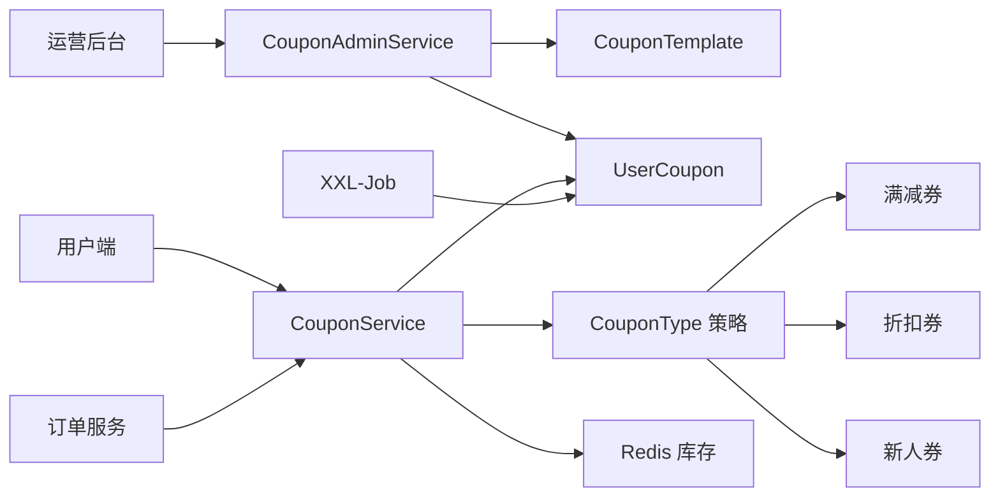

# 优惠券模块 执行计划

> 日期: 2026-06-25 | 作者: huyongle | 关联 spec: [../spec.md](../spec.md) | 调研报告: [../research-report.md](../research-report.md)

## 架构概览

优惠券模块采用领域驱动设计，以 `CouponService` 为核心领域服务，通过策略模式抽象三种券类型的优惠计算逻辑。库存扣减采用 Redis Lua 原子操作 + DB 乐观锁双保险，过期处理由 XXL-Job 定时任务兜底。模块与订单服务通过本地事务集成，核销与订单创建在同一事务内完成。



## 关键设计决策

### 决策 1: 优惠券类型抽象采用策略模式
- **选择**: 定义 `CouponType` 接口，满减券、折扣券、新人券为实现类，通过工厂 `CouponTypeFactory` 根据类型字段路由
- **原因**: 调研报告 KG-1 结论显示策略模式符合开闭原则，新增券类型无需改核心核销逻辑；GitHub: vhr、mall 均采用此模式，成熟度高
- **替代方案**: 单表 + type 字段 + if-else 分支（简单但扩展性差，新增类型需改核心代码）；JPA 继承体系（MyBatis-Plus 不友好，多态查询复杂）
- **影响**: 新增 `coupon/type/` 包，含接口与 3 个实现类；`CouponService.calculateDiscount()` 方法委托给策略实现

### 决策 2: 库存扣减采用 Redis Lua + DB 乐观锁双写
- **选择**: 领券时先 Redis Lua 原子扣减（主），再异步落库 DB（带乐观锁兜底）；对账任务每小时校验 Redis 与 DB 一致性
- **原因**: 调研报告 KG-2 结论显示 Redis 方案 QPS > 10k，远超本项目 1k 目标；DB 乐观锁兜底防止 Redis 故障时超发；GitHub: mall-swarm 验证可行
- **替代方案**: 纯 DB 乐观锁（QPS < 500，性能不足）；Redis + MQ 异步落库（项目无 MQ，引入成本高）；Redisson 分布式锁（性能一般，锁竞争开销）
- **影响**: 新增 `CouponStockManager` 组件，封装 Redis Lua 脚本与 DB 兜底逻辑；需维护 Redis-DB 一致性对账任务

### 决策 3: 过期处理采用定时任务 + Redis 过期事件双保险
- **选择**: XXL-Job 每 5 分钟分页扫描过期券（兜底）+ Redis Key 过期事件监听（前置清理）
- **原因**: 调研报告 KG-4 结论显示定时任务可靠但有延迟，Redis 过期事件实时但不可靠，双保险互补；项目已集成 XXL-Job，无新依赖
- **替代方案**: RocketMQ 延迟队列（精准可靠，但项目无 MQ，引入成本高）；纯定时任务（延迟最大 5 分钟，用户体验差）
- **影响**: 新增 `CouponExpireJob` XXL-Job 处理器；新增 `CouponExpireListener` 监听 Redis 过期事件

### 决策 4: 核销一致性采用本地事务 + 幂等键
- **选择**: 优惠券核销与订单创建在同一本地事务内完成，幂等键为 `coupon_id + order_id`
- **原因**: 调研报告 KG-3 结论显示单库场景本地事务足够，无需引入 Seata 分布式事务；幂等键防止重复核销
- **替代方案**: Seata 分布式事务（增加运维复杂度，单库场景过度设计）；最终一致性 + 补偿任务（一致性延迟，用户体验差）
- **影响**: `OrderService.createOrder()` 方法新增优惠券核销逻辑，在同一 `@Transactional` 内；`UserCoupon` 表新增唯一索引 `(coupon_id, order_id)`

## 代码库分析

### 现有架构约束

| 层级 | 当前实现方式 | 新模块适配策略 |
|------|-------------|--------------|
| Controller | `@RestController` + 统一响应体 `ApiResponse` | 沿用，新增 `CouponController`、`CouponAdminController` |
| Service | 接口 + 实现类，通过 `@Service` 注入 | 沿用，新增 `CouponService` 接口 + `CouponServiceImpl` |
| Repository | MyBatis-Plus `BaseMapper` + XML 自定义 SQL | 沿用，新增 `CouponTemplateMapper`、`UserCouponMapper` |
| Entity | Lombok `@Data` + MyBatis-Plus `@TableName` | 沿用，新增 `CouponTemplate`、`UserCoupon` 实体 |
| 异常处理 | 全局 `@RestControllerAdvice` + `BusinessException` + 错误码枚举 | 沿用，新增 `CouponErrorCode` 枚举 |
| 事务管理 | `@Transactional(rollbackFor = Exception.class)` | 沿用，核销方法标注 |

### 锚点模块分析

**参考模块**: `src/main/java/com/example/order/service/OrderService.java`

| 分析维度 | 发现 |
|---------|------|
| 目录结构 | `order/{controller,service,domain,mapper,dto}` 分层，包名按业务域 |
| 命名规范 | 类名 PascalCase，方法名 camelCase，常量 UPPER_SNAKE_CASE |
| 错误处理 | `BusinessException` + `OrderErrorCode` 枚举，全局 `@RestControllerAdvice` 捕获 |
| 日志/监控 | SLF4J + Logback，traceId 通过 MDC 传递，Prometheus 埋点 `@Counted` |
| 测试风格 | JUnit 5 + Mockito，测试类 `*Test` 后缀，方法 `should_xxx_when_yyy` |

### 可复用清单

| 已有模块/工具 | 路径 | 复用方式 |
|-------------|------|---------|
| `ApiResponse` 统一响应体 | `common/dto/ApiResponse.java` | 直接引用，Controller 返回类型 |
| `BusinessException` 业务异常 | `common/exception/BusinessException.java` | 直接抛出，携带错误码 |
| `UserService.findById()` | `user/service/UserService.java` | 直接调用，查询用户信息（新人判断） |
| `OrderService.createOrder()` | `order/service/OrderService.java` | 修改，集成券核销逻辑 |
| `RedisUtil` Redis 工具 | `common/cache/RedisUtil.java` | 直接调用，库存扣减 |
| `AuditLogger` 审计工具 | `common/audit/AuditLogger.java` | 直接调用，券配置变更审计 |
| `IdGenerator` ID 生成器 | `common/util/IdGenerator.java` | 直接调用，券码生成 |

### 需要变更的已有模块

| 模块 | 变更类型 | 原因 | 风险 |
|------|---------|------|------|
| `OrderService.createOrder()` | 新增券核销逻辑 | 下单时核销优惠券 | 中——需保证事务一致性，已有逻辑需回归测试 |
| `OrderRefundService.refund()` | 新增券回退逻辑 | 退款时回退未过期券 | 低——新增分支逻辑，不影响主流程 |
| `ErrorCode` 错误码总枚举 | 新增优惠券错误码 | 统一错误码管理 | 低——纯新增 |

## 模块/组件设计

### CouponTemplateService
- **职责**: 优惠券模板的创建、查询、状态管理
- **对外接口**: `createTemplate(CouponTemplateDTO)`, `getTemplate(Long id)`, `updateStatus(Long id, Status)`
- **依赖**: `CouponTemplateMapper`, `AuditLogger`
- **数据流**: DTO → 校验 → Entity → 持久化 → 审计日志

### CouponIssueService
- **职责**: 优惠券批量发放，异步执行 + 结果通知
- **对外接口**: `issueBatch(IssueBatchDTO)`, `getIssueResult(String batchId)`
- **依赖**: `CouponTemplateService`, `UserService`, `UserCouponMapper`, `CouponStockManager`
- **数据流**: 筛选条件 → 用户列表 → 批量写入用户券 → 扣减库存 → 通知

### CouponService
- **职责**: 用户领券、核销、查询的核心领域服务
- **对外接口**: `claim(Long userId, Long templateId)`, `redeem(Long userId, Long couponId, BigDecimal orderAmount)`, `rollback(Long couponId, Long orderId)`
- **依赖**: `CouponTypeFactory`, `CouponStockManager`, `UserCouponMapper`, `UserService`
- **数据流**: 领券请求 → 资格校验 → 库存扣减 → 写记录；核销请求 → 券校验 → 策略计算 → 状态更新

### CouponType（策略接口）
- **职责**: 抽象券类型的优惠计算逻辑
- **对外接口**: `calculate(BigDecimal orderAmount, CouponConfig config)`
- **实现**: `FullReductionCoupon`, `DiscountCoupon`, `NewUserCoupon`

### CouponStockManager
- **职责**: Redis Lua 原子扣减 + DB 乐观锁兜底
- **对外接口**: `deduct(Long templateId, int count)`, `rollback(Long templateId, int count)`, `reconcile()`
- **依赖**: `RedisUtil`, `CouponTemplateMapper`

### CouponExpireJob
- **职责**: 定时扫描过期券并标记失效
- **对外接口**: `execute()`（XXL-Job 调用）
- **依赖**: `UserCouponMapper`

## 数据模型

### 新增表

```sql
-- 表名: coupon_template
CREATE TABLE coupon_template (
    id BIGINT PRIMARY KEY AUTO_INCREMENT,
    name VARCHAR(64) NOT NULL COMMENT '券名称',
    type TINYINT NOT NULL COMMENT '类型: 1满减 2折扣 3新人',
    face_value DECIMAL(10,2) COMMENT '面额（满减券）',
    threshold DECIMAL(10,2) COMMENT '满减门槛',
    discount_rate TINYINT COMMENT '折扣率1-99（折扣券）',
    max_discount DECIMAL(10,2) COMMENT '最大优惠金额（折扣券）',
    total_count INT NOT NULL COMMENT '总库存',
    remain_count INT NOT NULL COMMENT '剩余库存',
    start_time DATETIME NOT NULL COMMENT '有效期开始',
    end_time DATETIME NOT NULL COMMENT '有效期结束',
    status TINYINT DEFAULT 0 COMMENT '0未发放 1进行中 2已结束',
    create_time DATETIME DEFAULT CURRENT_TIMESTAMP,
    update_time DATETIME DEFAULT CURRENT_TIMESTAMP ON UPDATE CURRENT_TIMESTAMP,
    INDEX idx_status_endtime (status, end_time)
) COMMENT '优惠券模板';

-- 表名: user_coupon
CREATE TABLE user_coupon (
    id BIGINT PRIMARY KEY AUTO_INCREMENT,
    user_id BIGINT NOT NULL,
    template_id BIGINT NOT NULL,
    coupon_code VARCHAR(32) NOT NULL COMMENT '券码',
    status TINYINT DEFAULT 0 COMMENT '0未使用 1已使用 2已过期',
    claim_time DATETIME DEFAULT CURRENT_TIMESTAMP,
    redeem_time DATETIME COMMENT '核销时间',
    expire_time DATETIME NOT NULL,
    order_id BIGINT COMMENT '关联订单ID',
    UNIQUE KEY uk_coupon_code (coupon_code),
    UNIQUE KEY uk_user_template (user_id, template_id),
    INDEX idx_userid_status (user_id, status),
    INDEX idx_status_expire (status, expire_time)
) COMMENT '用户优惠券';
```

| 字段 | 类型 | 说明 | 约束 |
|------|------|------|------|
| id | BIGINT | 主键 | PK, AUTO_INCREMENT |
| name | VARCHAR(64) | 券名称 | NOT NULL |
| type | TINYINT | 券类型 | NOT NULL, 1/2/3 |
| face_value | DECIMAL(10,2) | 面额 | 满减券必填 |
| threshold | DECIMAL(10,2) | 满减门槛 | 满减券必填 |
| discount_rate | TINYINT | 折扣率 | 折扣券必填, 1-99 |

### 变更表/集合

| 表名 | 变更类型 | 说明 |
|------|---------|------|
| order | ADD COLUMN coupon_id | 关联使用的优惠券ID |
| order | ADD COLUMN discount_amount | 优惠金额 |

## API 契约

### 创建优惠券模板

```http
POST /api/admin/coupon/template
```

**请求**:
```json
{
  "name": "满100减20",
  "type": 1,
  "faceValue": 20.00,
  "threshold": 100.00,
  "totalCount": 10000,
  "startTime": "2026-07-01 00:00:00",
  "endTime": "2026-07-31 23:59:59"
}
```
| 参数 | 类型 | 必填 | 说明 |
|------|------|------|------|
| name | String | 是 | 券名称，唯一 |
| type | Integer | 是 | 1满减 2折扣 3新人 |
| faceValue | BigDecimal | 条件必填 | 满减券面额 |
| threshold | BigDecimal | 条件必填 | 满减券门槛 |
| discountRate | Integer | 条件必填 | 折扣券折扣率 |
| totalCount | Integer | 是 | 总库存，1-1000000 |
| startTime | DateTime | 是 | 有效期开始 |
| endTime | DateTime | 是 | 有效期结束 |

**响应**:
```json
{
  "code": 0,
  "message": "success",
  "data": { "id": 1001 }
}
```

**错误码**:
| 状态码 | 错误码 | 说明 |
|--------|--------|------|
| 400 | COUPON_NAME_DUPLICATE | 券名称已存在 |
| 400 | COUPON_PARAM_INVALID | 参数校验失败（面额≤0/折扣率越界等） |
| 400 | COUPON_TIME_INVALID | 开始时间≥结束时间 |
| 403 | NO_PERMISSION | 非运营角色无权限 |

### 用户领券

```http
POST /api/coupon/claim
```

**请求**:
```json
{
  "templateId": 1001
}
```

**响应**:
```json
{
  "code": 0,
  "data": { "couponCode": "CP20260625ABCD" }
}
```

**错误码**:
| 状态码 | 错误码 | 说明 |
|--------|--------|------|
| 400 | COUPON_NOT_FOUND | 券模板不存在 |
| 400 | COUPON_NOT_IN_PROGRESS | 活动未开始或已结束 |
| 400 | COUPON_OUT_OF_STOCK | 库存不足 |
| 400 | COUPON_ALREADY_CLAIMED | 用户已领取 |
| 400 | COUPON_NEW_USER_ONLY | 非新人不可领 |
| 429 | RATE_LIMIT_EXCEEDED | 领券频率超限 |

### 优惠券核销

```http
POST /api/coupon/redeem
```

**请求**:
```json
{
  "couponId": 20001,
  "orderId": 50001,
  "orderAmount": 150.00
}
```

**响应**:
```json
{
  "code": 0,
  "data": { "discountAmount": 20.00 }
}
```

**错误码**:
| 状态码 | 错误码 | 说明 |
|--------|--------|------|
| 400 | COUPON_NOT_OWNED | 券不属于该用户 |
| 400 | COUPON_USED | 券已使用 |
| 400 | COUPON_EXPIRED | 券已过期 |
| 400 | COUPON_THRESHOLD_NOT_MET | 未满减门槛 |
| 400 | COUPON_NOT_FIRST_ORDER | 新人券非首单 |
| 409 | COUPON_REDEEM_DUPLICATE | 重复核销（幂等拦截） |

## 迁移策略

N/A（全新模块，无历史数据迁移）

## 测试策略

| 测试层级 | 覆盖范围 | 工具 |
|---------|---------|------|
| 单元测试 | CouponType 三种策略计算逻辑、CouponStockManager 扣减/回退、CouponService 领券/核销 | JUnit 5 + Mockito |
| 集成测试 | 领券→核销→退款回退全链路、库存 Redis-DB 一致性、过期任务扫描 | Spring Boot Test + Testcontainers（MySQL/Redis） |
| E2E 测试 | 运营创建券→发放→用户领取→下单核销→退款回退 | RestAssured + 真实环境 |

## 时间/工作量估算

| 任务 | 预估工时 | 依赖 |
|------|---------|------|
| 数据模型 + Entity + Mapper | 4h | 无 |
| CouponType 策略 + 工厂 | 4h | 数据模型 |
| CouponStockManager | 4h | 数据模型 |
| CouponService 领券/核销/查询 | 6h | 策略 + 库存管理 |
| 过期处理 Job + Listener | 3h | 数据模型 |
| Controller + Admin API | 3h | Service |
| OrderService 集成核销 | 3h | CouponService |
| 单元测试 + 集成测试 | 6h | 全部 |
| 总计 | 33h | |

## 回滚方案

1. **功能开关回滚**: 通过配置中心 `coupon.feature.enabled=false` 一键关闭优惠券入口，领券/核销接口返回"功能维护中"，不影响订单主流程
2. **数据库回滚**: 优惠券相关表保留，仅删除 `order` 表新增的 `coupon_id`、`discount_amount` 字段（向后兼容，可为 NULL）
3. **Redis 回滚**: 清理 `coupon:stock:*` 相关 Key，无副作用
4. **代码回滚**: revert 优惠券模块 commit，OrderService 集成代码单独 revert（保留订单主流程）
