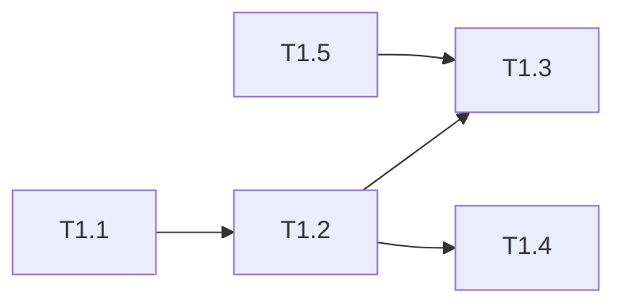

# 优惠券模块 Phase 1: 基础设施与领域模型 任务清单

> 日期: 2026-06-25 | 作者: huyongle | 关联: [../plans/README.md](../plans/README.md) | 下一阶段: [phase2-core-service.md](./phase2-core-service.md)

## 本阶段任务

- [ ] **T1.1**: 创建优惠券相关数据库表与迁移脚本
  - **描述**: 创建 `coupon_template` 和 `user_coupon` 两张表，含索引；编写 Flyway 迁移脚本
  - **产出物**: `src/main/resources/db/migration/V202606251__create_coupon_tables.sql`（新增）
  - **参考**: 遵循 `src/main/resources/db/migration/V20260101__create_order_tables.sql` 的迁移脚本风格
  - **复用**: 无
  - **验收**: 迁移脚本执行成功，表结构与 plans/README.md 数据模型一致，索引正确
  - **预估**: 2h
  - **依赖**: 无

- [ ] **T1.2**: 创建优惠券 Entity 与 Mapper
  - **描述**: 创建 `CouponTemplate`、`UserCoupon` 实体类（Lombok + MyBatis-Plus 注解）及对应 Mapper 接口
  - **产出物**: `src/main/java/com/example/coupon/entity/CouponTemplate.java`（新增）、`src/main/java/com/example/coupon/entity/UserCoupon.java`（新增）、`src/main/java/com/example/coupon/mapper/CouponTemplateMapper.java`（新增）、`src/main/java/com/example/coupon/mapper/UserCouponMapper.java`（新增）
  - **参考**: 遵循 `src/main/java/com/example/order/entity/Order.java` 的实体定义风格
  - **复用**: 调用 `common/util/IdGenerator.java`（已有）生成券码
  - **验收**: 实体字段与表结构一一对应，Mapper 可正常 CRUD
  - **预估**: 2h
  - **依赖**: T1.1

- [ ] **T1.3**: 实现优惠券类型策略模式
  - **描述**: 定义 `CouponType` 接口，实现满减券、折扣券、新人券三个策略类，通过 `CouponTypeFactory` 路由
  - **产出物**: `src/main/java/com/example/coupon/type/CouponType.java`（新增）、`src/main/java/com/example/coupon/type/FullReductionCoupon.java`（新增）、`src/main/java/com/example/coupon/type/DiscountCoupon.java`（新增）、`src/main/java/com/example/coupon/type/NewUserCoupon.java`（新增）、`src/main/java/com/example/coupon/type/CouponTypeFactory.java`（新增）
  - **参考**: 遵循 `src/main/java/com/example/order/discount/DiscountStrategy.java` 的策略模式风格
  - **复用**: 无
  - **验收**: 三种券类型的优惠计算逻辑正确（满减门槛校验、折扣率上限、新人首单校验），单元测试覆盖
  - **预估**: 4h
  - **依赖**: T1.2

- [ ] **T1.4**: 实现优惠券库存管理器
  - **描述**: 实现 `CouponStockManager`，封装 Redis Lua 原子扣减 + DB 乐观锁兜底 + 对账逻辑
  - **产出物**: `src/main/java/com/example/coupon/service/CouponStockManager.java`（新增）、`src/main/resources/lua/coupon_deduct.lua`（新增）
  - **参考**: 遵循 `src/main/java/com/example/common/cache/RedisUtil.java` 的 Redis 操作风格
  - **复用**: 调用 `common/cache/RedisUtil.java`（已有）执行 Lua 脚本
  - **验收**: 并发扣减无超发，Redis 故障时 DB 兜底生效，对账任务能发现不一致
  - **预估**: 4h
  - **依赖**: T1.2

- [ ] **T1.5**: 新增优惠券错误码与枚举
  - **描述**: 在 `ErrorCode` 枚举中新增优惠券相关错误码，新增 `CouponType`、`CouponStatus` 枚举
  - **产出物**: `src/main/java/com/example/common/exception/ErrorCode.java`（修改）、`src/main/java/com/example/coupon/enums/CouponTypeEnum.java`（新增）、`src/main/java/com/example/coupon/enums/CouponStatusEnum.java`（新增）
  - **参考**: 遵循 `src/main/java/com/example/common/exception/ErrorCode.java` 已有错误码定义风格
  - **复用**: 引用 `common/exception/BusinessException.java`（已有）
  - **验收**: 错误码与 API 契约一致，枚举值覆盖三种券类型与四种状态
  - **预估**: 1h
  - **依赖**: 无

## 本阶段预估

| 指标 | 值 |
|------|-----|
| 任务数 | 5 |
| 预估总工时 | 13h |
| 可并行任务 | T1.1 与 T1.5 可并行 |

## 本阶段内依赖

