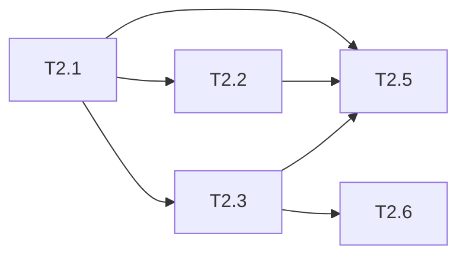

# 优惠券模块 Phase 2: 核心服务与接口集成 任务清单

> 日期: 2026-06-25 | 作者: huyongle | 关联: [../plans/README.md](../plans/README.md) | 上一阶段: [phase1-infrastructure.md](./phase1-infrastructure.md)

## 本阶段任务

- [ ] **T2.1**: 实现优惠券模板管理服务
  - **描述**: 实现 `CouponTemplateService` 接口与实现类，包含模板创建、查询、状态更新逻辑，集成审计日志
  - **产出物**: `src/main/java/com/example/coupon/service/CouponTemplateService.java`（新增）、`src/main/java/com/example/coupon/service/impl/CouponTemplateServiceImpl.java`（新增）、`src/main/java/com/example/coupon/dto/CouponTemplateDTO.java`（新增）
  - **参考**: 遵循 `src/main/java/com/example/order/service/OrderService.java` 的 Service 接口+实现风格
  - **复用**: 调用 `common/audit/AuditLogger.java`（已有）记录配置变更审计
  - **验收**: 创建模板参数校验生效（名称唯一、面额>0、时间合法），状态流转正确
  - **预估**: 3h
  - **依赖**: phase-1 全部完成

- [ ] **T2.2**: 实现优惠券批量发放服务
  - **描述**: 实现 `CouponIssueService`，按条件筛选用户异步批量发放，记录发放结果
  - **产出物**: `src/main/java/com/example/coupon/service/CouponIssueService.java`（新增）、`src/main/java/com/example/coupon/service/impl/CouponIssueServiceImpl.java`（新增）、`src/main/java/com/example/coupon/dto/IssueBatchDTO.java`（新增）
  - **参考**: 遵循 `src/main/java/com/example/marketing/service/BatchPushService.java` 的异步批量任务风格
  - **复用**: 调用 `user/service/UserService.java`（已有）查询目标用户列表
  - **验收**: 单次发放上限 10000 张，部分失败有记录，同一用户限领 1 张
  - **预估**: 4h
  - **依赖**: T2.1

- [ ] **T2.3**: 实现优惠券核心服务（领券、核销、查询、回退）
  - **描述**: 实现 `CouponService` 接口与实现类，包含领券、核销、查询、退款回退逻辑
  - **产出物**: `src/main/java/com/example/coupon/service/CouponService.java`（新增）、`src/main/java/com/example/coupon/service/impl/CouponServiceImpl.java`（新增）、`src/main/java/com/example/coupon/dto/ClaimResultDTO.java`（新增）、`src/main/java/com/example/coupon/dto/RedeemResultDTO.java`（新增）
  - **参考**: 遵循 `src/main/java/com/example/order/service/OrderService.java` 的领域服务风格
  - **复用**: 调用 `CouponTypeFactory`（phase-1 新增）、`CouponStockManager`（phase-1 新增）、`user/service/UserService.java`（已有，新人判断）
  - **验收**: 领券校验完整（库存/资格/重复），核销计算正确（三种券类型），退款回退未过期券
  - **预估**: 6h
  - **依赖**: T2.1, phase-1 全部完成

- [ ] **T2.4**: 实现优惠券过期处理任务
  - **描述**: 实现 `CouponExpireJob` XXL-Job 处理器，分页扫描过期券并标记失效；实现 Redis 过期事件监听器
  - **产出物**: `src/main/java/com/example/coupon/job/CouponExpireJob.java`（新增）、`src/main/java/com/example/coupon/listener/CouponExpireListener.java`（新增）
  - **参考**: 遵循 `src/main/java/com/example/order/job/OrderTimeoutJob.java` 的 XXL-Job 处理器风格
  - **复用**: 无
  - **验收**: 每 5 分钟扫描一次，单次批量上限 1000 条，已使用券不处理
  - **预估**: 3h
  - **依赖**: phase-1 全部完成

- [ ] **T2.5**: 实现 Controller 层与 API 接口
  - **描述**: 实现 `CouponController`（用户端领券/查询）与 `CouponAdminController`（运营端创建/发放），含参数校验与限流
  - **产出物**: `src/main/java/com/example/coupon/controller/CouponController.java`（新增）、`src/main/java/com/example/coupon/controller/CouponAdminController.java`（新增）、`src/main/java/com/example/coupon/dto/ClaimRequest.java`（新增）、`src/main/java/com/example/coupon/dto/RedeemRequest.java`（新增）
  - **参考**: 遵循 `src/main/java/com/example/order/controller/OrderController.java` 的 Controller 风格
  - **复用**: 引用 `common/dto/ApiResponse.java`（已有）统一响应体
  - **验收**: API 契约与 plans/README.md 一致，错误码正确返回，领券接口限流生效
  - **预估**: 3h
  - **依赖**: T2.1, T2.2, T2.3

- [ ] **T2.6**: 集成订单服务核销与退款回退
  - **描述**: 修改 `OrderService.createOrder()` 集成优惠券核销逻辑（同事务）；修改 `OrderRefundService.refund()` 集成券回退逻辑
  - **产出物**: `src/main/java/com/example/order/service/impl/OrderServiceImpl.java`（修改）、`src/main/java/com/example/order/service/impl/OrderRefundServiceImpl.java`（修改）
  - **参考**: 遵循 `src/main/java/com/example/order/service/impl/OrderServiceImpl.java` 已有事务管理风格
  - **复用**: 调用 `coupon/service/CouponService.java`（phase-2 新增）的 redeem/rollback 方法
  - **验收**: 下单核销在同一事务内，退款回退未过期券，幂等键防重复核销
  - **预估**: 3h
  - **依赖**: T2.3

## 本阶段预估

| 指标 | 值 |
|------|-----|
| 任务数 | 6 |
| 预估总工时 | 22h |
| 可并行任务 | T2.4 可与 T2.1/T2.2/T2.3 并行 |

## 本阶段内依赖

