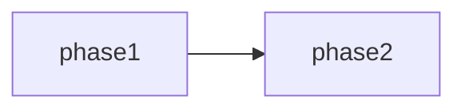
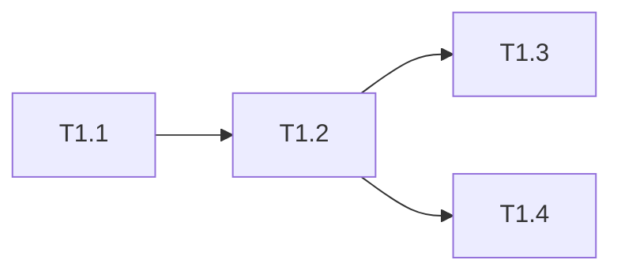
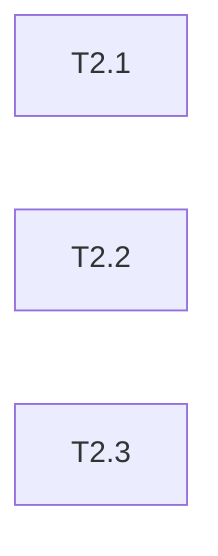

# 订单支付回调接口幂等性修复 任务清单

> 日期: 2026-06-25 | 作者: huyongle | 关联: [./spec.md](./spec.md)

## 全局统计

| 指标 | 值 |
|------|-----|
| 总任务数 | 7 |
| 总 phase 数 | 2 |
| 预估总工时 | 13h |
| 关键路径 | phase-1 → phase-2 |

## Phase 清单

| Phase | 任务数 | 预估 | 重点 |
|-------|--------|------|------|
| Phase 1: 核心修复（幂等 + 锁 + 记录表） | 4 | 8h | 阻塞式，必须先完成 |
| Phase 2: 测试与可观测性 | 3 | 5h | 验证修复有效性 |

## 跨阶段依赖

| 目标 Phase | 依赖 Phase | 说明 |
|-----------|-----------|------|
| phase-2 | phase-1 | 测试需要幂等校验和锁逻辑就绪 |

---

## Phase 1: 核心修复（幂等 + 锁 + 记录表）

> 阶段目标：消除回调重复处理的根因——幂等校验缺失、状态检查非原子、结算无锁。

- [ ] **T1.1**: 新增 `payment_callback_record` 表和实体

  - **描述**: 创建回调记录表 DDL 和 JPA 实体，作为幂等判断的数据基础。包含 `payment_id`（唯一索引）、`callback_id`、`status`、`process_thread`、`created_at`、`updated_at` 字段。
  - **产出物**: `payment/domain/PaymentCallbackRecord.java`（新增）、`payment/repository/PaymentCallbackRecordRepository.java`（新增）、`db/migration/V20260625_1__add_payment_callback_record.sql`（新增）
  - **参考**: 遵循 `order/domain/OrderRecord.java` 的实体定义风格（JPA 注解 + 审计字段）
  - **复用**: 继承 `base/domain/BaseEntity.java`（已有，含 `created_at`/`updated_at` 自动填充）
  - **验收**: 实体可被 Spring Data JPA 识别，`payment_id` 上有 `@Table(uniqueConstraints = ...)` 注解；DDL 在本地 MySQL 执行成功
  - **预估**: 2h
  - **依赖**: 无

- [ ] **T1.2**: 实现回调幂等校验逻辑

  - **描述**: 在 `PaymentCallbackService.handleCallback()` 入口处新增幂等校验。基于 `payment_id` 查询 `payment_callback_record`，若状态为 `PROCESSED` 直接返回 `SUCCESS`；若为 `PROCESSING` 且超时 30 秒则接管；否则插入 `PENDING` 记录后继续。
  - **产出物**: `payment/callback/PaymentCallbackService.java`（修改 `handleCallback` 方法）、`payment/callback/IdempotencyChecker.java`（新增）
  - **参考**: 参考 `order/service/OrderIdempotencyService.java` 的幂等校验模式（查询 + 状态机）
  - **复用**: 调用 `PaymentCallbackRecordRepository.findByPaymentId()`（T1.1 新增）；调用 `base/util/UuidGenerator.java`（已有）生成 `process_thread` 标识
  - **验收**: 单元测试覆盖 4 种场景：首次回调、重复回调（PROCESSED）、超时接管（PROCESSING > 30s）、失败重试（FAILED）；测试通过率 100%
  - **预估**: 3h
  - **依赖**: T1.1

- [ ] **T1.3**: 实现 Redis 分布式锁互斥

  - **描述**: 在幂等校验通过后、结算执行前，对 `payment_id` 加 Redis 分布式锁。使用 `SET payment:lock:{payment_id} {token} NX EX 10`，token 为 `threadId + uuid`。释放锁用 Lua 脚本校验 token 后删除。获取失败自旋等待 3 秒，仍失败返回 `RETRY_LATER`。
  - **产出物**: `payment/callback/DistributedPaymentLock.java`（新增）、`payment/callback/PaymentCallbackService.java`（修改，在 `handleCallback` 中调用锁）、`config/RedisLockConfig.java`（新增）
  - **参考**: 参考 `inventory/service/StockLockService.java` 的 Redis 锁实现（同样使用 SET NX EX + Lua 释放）
  - **复用**: 调用 `config/RedisTemplateConfig.java`（已有）的 `StringRedisTemplate`；调用 `base/util/LuaScriptLoader.java`（已有）加载释放锁脚本
  - **验收**: 锁获取和释放的单元测试通过；Lua 脚本经 `redis-cli --eval` 验证原子性；锁 TTL 可配置
  - **预估**: 3h
  - **依赖**: T1.2

- [ ] **T1.4**: 结算服务增加幂等断言

  - **描述**: 在 `SettlementService.settle(orderId)` 入口增加幂等断言——若订单状态已是 `SETTLED` 则直接返回，不重复打款。作为分布式锁失效时的兜底防线。
  - **产出物**: `payment/settlement/SettlementService.java`（修改 `settle` 方法）
  - **参考**: 遵循 `order/service/OrderStateMachine.java` 的状态断言模式（前置条件检查 + 抛出业务异常）
  - **复用**: 调用 `order/repository/OrderRepository.findById()`（已有）查询订单状态；抛出 `base/exception/BusinessException.java`（已有）
  - **验收**: 已结算订单再次调用 `settle()` 返回成功且不触发打款；单元测试覆盖 `PAID → SETTLED` 和 `SETTLED → SETTLED` 两种场景
  - **预估**: 1h
  - **依赖**: T1.2

### Phase 1 预估

| 指标 | 值 |
|------|-----|
| 任务数 | 4 |
| 预估总工时 | 9h |
| 可并行任务 | 无（严格串行：T1.1 → T1.2 → T1.3/T1.4） |

### Phase 1 依赖

---

## Phase 2: 测试与可观测性

> 阶段目标：通过并发测试验证幂等修复有效性，并接入监控告警确保线上可观测。

- [ ] **T2.1**: 编写并发回调集成测试

  - **描述**: 使用 JMeter 或 JUnit + CountDownLatch 模拟 100 并发对同一 `payment_id` 发起回调，验证仅 1 次进入结算，其余 99 次返回 `SUCCESS` 且不重复打款。
  - **产出物**: `payment/callback/__tests__/PaymentCallbackConcurrencyTest.java`（新增）、`payment/callback/__tests__/jmeter/payment-callback-concurrency.jmx`（新增）
  - **参考**: 参考 `order/service/__tests__/OrderConcurrencyTest.java` 的并发测试搭建方式（CountDownLatch + 线程池）
  - **复用**: 调用 `test/util/EmbeddedRedis.java`（已有）启动内嵌 Redis；调用 `test/util/TestDataFactory.java`（已有）构造测试订单
  - **验收**: 测试断言"结算调用次数 == 1"通过；JMeter 报告显示 100 请求中 1 个 200（首次处理）+ 99 个 200（幂等命中）
  - **预估**: 3h
  - **依赖**: T1.3, T1.4

- [ ] **T2.2**: 接入 Prometheus 监控指标

  - **描述**: 为幂等校验和分布式锁暴露 Micrometer 指标：`payment_callback_idempotent_hit_total`（幂等命中计数）、`payment_callback_lock_wait_seconds`（锁等待耗时直方图）、`payment_callback_lock_acquire_failed_total`（锁获取失败计数）。
  - **产出物**: `payment/callback/PaymentCallbackMetrics.java`（新增）、`payment/callback/IdempotencyChecker.java`（修改，埋点）、`payment/callback/DistributedPaymentLock.java`（修改，埋点）
  - **参考**: 参考 `inventory/service/InventoryMetrics.java` 的指标定义方式（Micrometer Counter + Timer）
  - **复用**: 调用 `config/MetricsConfig.java`（已有）的 `MeterRegistry`；使用 `io.micrometer.core.instrument.Timer`（已有依赖）
  - **验收**: `/actuator/prometheus` 端点可查到上述 3 个指标；Grafana 看板 JSON 导入后图表正常显示
  - **预估**: 2h
  - **依赖**: T1.3

- [ ] **T2.3**: 配置重复回调钉钉告警

  - **描述**: 当同一 `payment_id` 在 5 分钟内收到 ≥ 3 次回调时，触发钉钉告警通知支付运维群。使用滑动窗口计数实现。
  - **产出物**: `payment/callback/DuplicateCallbackAlerter.java`（新增）、`config/AlertConfig.java`（修改，新增告警规则）
  - **参考**: 参考 `order/service/OrderRiskAlerter.java` 的钉钉告警实现（HTTP 调用 + 限流去重）
  - **复用**: 调用 `base/alert/DingTalkClient.java`（已有）发送告警；调用 `base/util/RateLimiter.java`（已有）做告警限流
  - **验收**: 测试触发 3 次重复回调后，钉钉群收到告警消息，内容包含 `payment_id`、`callback_id` 列表、时间窗口；同一事件 5 分钟内不重复告警
  - **预估**: 2h
  - **依赖**: T1.2

### Phase 2 预估

| 指标 | 值 |
|------|-----|
| 任务数 | 3 |
| 预估总工时 | 7h |
| 可并行任务 | T2.2, T2.3（均依赖 Phase 1，彼此无依赖） |

### Phase 2 依赖

