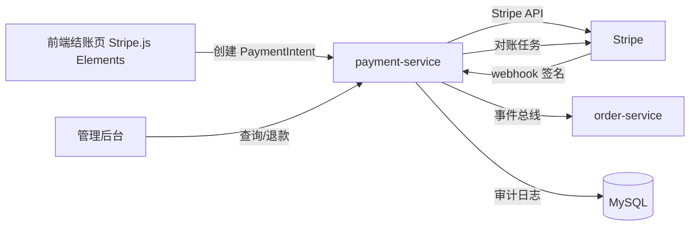

# Stripe 支付网关对接 执行计划

> 日期: 2026-06-25 | 作者: huyongle | 关联 spec: [../spec.md](../spec.md) | 子 plan: N/A（单 slice 后端方案）

## 架构概览

支付服务作为独立模块 `payment-service` 部署，通过 REST 与订单服务、前端、管理后台交互，通过事件总线异步通知订单服务。Stripe 调用全部在 payment-service 内完成，前端仅持有 client_secret 与 Stripe.js 通信，卡号不落我方服务器。



## 关键设计决策

### 决策 1: 采用 PaymentIntent 三步流程而非 Charge 一次性扣款

- **选择**: 使用 Stripe PaymentIntent（创建→前端确认→webhook 确认）流程
- **原因**: PaymentIntent 原生支持 3DS2/SCA 强认证，是 Stripe 官方推荐的接入方式；Charge 一次性扣款不支持 SCA，无法进入欧盟市场。调研报告 KG-2 确认 PaymentIntent 满足 PSD2 合规
- **替代方案**: Charge 一次性扣款——已排除，不支持 3DS2，欧盟市场无法使用
- **影响**: 前端需集成 Stripe.js Elements 收集卡号；订单表需新增 payment_intent_id 字段；支付流程从同步变为 webhook 驱动

### 决策 2: Webhook 处理采用状态机驱动 + 幂等表

- **选择**: 以 PaymentIntent 状态机为唯一事实来源，webhook 事件仅作触发；用 payment_event_log 表做幂等去重
- **原因**: 调研报告 KG-3 与已知风险指出 webhook 事件可能乱序到达（payment_intent.succeeded 早于 processing），若以事件顺序驱动订单状态会导致状态机错乱。状态机驱动 + 幂等表是业界标准模式（参考 stripe-samples）
- **替代方案**: 以 webhook 事件顺序直接更新订单状态——已排除，乱序事件会导致状态回退
- **影响**: 新增 payment_event_log 表（event_id 唯一索引）；订单状态机需扩展"支付中/已支付/退款中"状态与转换规则

### 决策 3: Stripe 密钥通过 KMS 注入，禁止入库

- **选择**: sk_live_ 与 webhook secret 存于 KMS/Vault，应用启动时拉取注入 Spring `@Value`，配置中心仅存引用路径
- **原因**: 调研报告 KG-1 与已知风险指出密钥泄露是高危风险，GitHub 代码扫描多次报告硬编码 Stripe 密钥事件。KMS 注入是 OWASP 推荐的密钥管理实践
- **替代方案**: 配置中心明文存储 + .env 文件——已排除，明文密钥易泄露且无审计
- **影响**: 部署流程新增 KMS 拉取步骤；本地开发用 sk_test_ + .env.local（gitignore）；日志需脱敏过滤 sk_ 前缀

### 决策 4: 退款通过 Stripe Refunds API 而非本地记录后手动处理

- **选择**: 退款直接调用 Stripe Refunds.create，由 webhook 确认最终状态
- **原因**: Stripe 退款有异步处理时延（最长 10 天到账），本地记录无法反映真实状态；webhook charge.refunded 是退款成功的唯一可信信号。调研报告 KG-6 确认 Stripe 退款 API 支持部分退款与退款反转
- **替代方案**: 本地记录退款请求后人工对账——已排除，无法实时反映退款状态，对账成本高
- **影响**: 退款操作需 RBAC 权限校验；退款金额需校验 ≤ 已支付金额；退款失败需提示客服重试

## 代码库分析

### 现有架构约束

| 层级 | 当前实现方式 | 新模块适配策略 |
|------|-------------|--------------|
| Controller | `@RestController` + 统一响应体 `ApiResponse<T>` | 沿用，新增 PaymentController |
| Service | 接口 + 实现类，`@Service` 注入 | 沿用，新增 PaymentService 接口与实现 |
| Repository | Spring Data JPA Repository | 沿用，新增 PaymentRecordRepository |
| Entity | Lombok `@Data` + JPA 注解 + Flyway 迁移脚本 | 沿用，新增 PaymentRecord、PaymentEventLog 实体 |
| 配置 | `@ConfigurationProperties` + 配置中心 | 沿用，新增 StripeProperties |
| 异常 | 全局 `@RestControllerAdvice` + 错误码枚举 | 沿用，新增 PaymentErrorCode 枚举 |

### 锚点模块分析

**参考模块**: `order-service/src/main/java/com/example/order/service/OrderService.java`

| 分析维度 | 发现 |
|---------|------|
| 目录结构 | 按层分包：`controller/service/repository/entity/dto/exception` |
| 命名规范 | 类名 PascalCase，方法名 camelCase，常量 UPPER_SNAKE |
| 错误处理 | `BusinessException(ErrorCode)` 抛出，全局 advice 转 ApiResponse |
| 日志/监控 | SLF4J + Logback，traceId 经 MDC 传递，关键操作 INFO 级 |
| 测试风格 | JUnit 5 + Mockito，测试类 `XxxTest` 后缀，方法 `should_xxx_when_yyy` |

### 可复用清单

| 已有模块/工具 | 路径 | 复用方式 |
|-------------|------|---------|
| ApiResponse 统一响应体 | `common/dto/ApiResponse.java` | 引用 |
| BusinessException | `common/exception/BusinessException.java` | 引用 |
| ErrorCode 错误码基类 | `common/exception/ErrorCode.java` | 继承扩展 PaymentErrorCode |
| OrderService.updateStatus | `order-service/.../OrderService.java` | 事件总线异步调用 |
| AuditLogger 审计工具 | `common/audit/AuditLogger.java` | 直接注入调用 |
| IdGenerator UUID 生成 | `common/util/IdGenerator.java` | 直接调用生成 Idempotency-Key |

### 需要变更的已有模块

| 模块 | 变更类型 | 原因 | 风险 |
|------|---------|------|------|
| OrderService | 新增方法 onPaymentResult | 接收支付结果事件更新订单状态 | 低——新增方法不改老逻辑 |
| OrderStatus 枚举 | 新增状态 PAYING/PAID/REFUNDING | 支付流程需要中间状态 | 中——需确认状态机转换不破坏现有流程 |
| 订单详情 DTO | 新增 paymentInfo 字段 | 前端展示支付详情 | 低——新增字段向后兼容 |

## 模块/组件设计

### PaymentController

- **职责**: 接收前端创建支付意图请求与 Stripe webhook 回调
- **对外接口**: `POST /api/v1/payments/intent`、`POST /api/v1/payments/webhook`
- **依赖**: PaymentService
- **数据流**: HTTP 请求 → PaymentService → ApiResponse

### PaymentService

- **职责**: 封装 Stripe 调用（创建 PaymentIntent、退款、查询），处理 webhook 事件
- **对外接口**: `createIntent(orderId)`, `handleWebhook(payload, signature)`, `refund(orderId, amount)`, `queryPayment(orderId)`
- **依赖**: Stripe SDK、PaymentRecordRepository、PaymentEventLogRepository、EventBus、AuditLogger
- **数据流**: 调用 Stripe → 落库 PaymentRecord → 发布事件 → 返回

### PaymentReconcileJob

- **职责**: 每日对账，拉取 Stripe Balance Transactions 与本地记录核对
- **对外接口**: `@Scheduled` 定时触发
- **依赖**: Stripe SDK、PaymentRecordRepository、ReportGenerator

## 数据模型

### 新增表

```sql
-- 表名: payment_record
CREATE TABLE payment_record (
    id BIGINT PRIMARY KEY AUTO_INCREMENT,
    payment_intent_id VARCHAR(64) NOT NULL,
    order_id BIGINT NOT NULL,
    amount BIGINT NOT NULL COMMENT '金额（最小货币单位，分）',
    currency VARCHAR(3) NOT NULL,
    status VARCHAR(32) NOT NULL COMMENT 'requires_payment_method/requires_action/processing/succeeded/canceled',
    client_secret VARCHAR(128) NOT NULL,
    created_at DATETIME NOT NULL DEFAULT CURRENT_TIMESTAMP,
    updated_at DATETIME NOT NULL DEFAULT CURRENT_TIMESTAMP ON UPDATE CURRENT_TIMESTAMP,
    UNIQUE KEY uk_payment_intent_id (payment_intent_id),
    KEY idx_order_id (order_id)
);
```

| 字段 | 类型 | 说明 | 约束 |
|------|------|------|------|
| id | BIGINT | 主键 | PK AUTO_INCREMENT |
| payment_intent_id | VARCHAR(64) | Stripe PaymentIntent id | UNIQUE NOT NULL |
| order_id | BIGINT | 关联订单 id | NOT NULL, INDEX |
| amount | BIGINT | 金额（分） | NOT NULL |
| currency | VARCHAR(3) | ISO 4217 币种 | NOT NULL |
| status | VARCHAR(32) | 支付状态 | NOT NULL |
| client_secret | VARCHAR(128) | 前端确认用密钥 | NOT NULL |

```sql
-- 表名: payment_event_log（幂等去重）
CREATE TABLE payment_event_log (
    id BIGINT PRIMARY KEY AUTO_INCREMENT,
    event_id VARCHAR(64) NOT NULL,
    event_type VARCHAR(64) NOT NULL,
    payment_intent_id VARCHAR(64) NOT NULL,
    payload JSON NOT NULL,
    processed_at DATETIME NOT NULL DEFAULT CURRENT_TIMESTAMP,
    UNIQUE KEY uk_event_id (event_id)
);
```

### 变更表/集合

| 表名 | 变更类型 | 说明 |
|------|---------|------|
| order_record | ADD COLUMN payment_intent_id VARCHAR(64) | 关联支付记录 |

## API 契约

### 创建支付意图

```http
POST /api/v1/payments/intent
```

**请求**:
```json
{
  "orderId": 123456
}
```
| 参数 | 类型 | 必填 | 说明 |
|------|------|------|------|
| orderId | number | 是 | 待支付订单 id |

**响应**:
```json
{
  "code": 0,
  "data": {
    "paymentIntentId": "pi_3OkL9H2eZvKYlo2C0xJZ8HqP",
    "clientSecret": "pi_3OkL9H2eZvKYlo2C0xJZ8HqP_secret_xKqM3pL9oQrT2wYz",
    "amount": 19999,
    "currency": "usd"
  }
}
```

**错误码**:
| 状态码 | 错误码 | 说明 |
|--------|--------|------|
| 400 | PAYMENT_ORDER_NOT_FOUND | 订单不存在 |
| 409 | PAYMENT_ORDER_ALREADY_PAID | 订单已支付 |
| 410 | PAYMENT_ORDER_CANCELED | 订单已取消 |
| 422 | PAYMENT_AMOUNT_INVALID | 金额非法 |
| 503 | PAYMENT_STRIPE_UNAVAILABLE | Stripe 服务不可用 |

### Stripe Webhook 回调

```http
POST /api/v1/payments/webhook
```

**请求**: Stripe 原始 payload（application/json），含 `Stripe-Signature` 头

**响应**:
```json
{
  "received": true
}
```

**错误码**:
| 状态码 | 错误码 | 说明 |
|--------|--------|------|
| 400 | PAYMENT_WEBHOOK_SIGNATURE_INVALID | 签名校验失败 |
| 400 | PAYMENT_WEBHOOK_PAYLOAD_INVALID | payload 解析失败 |

### 发起退款

```http
POST /api/v1/payments/refund
```

**请求**:
```json
{
  "orderId": 123456,
  "amount": 5000
}
```
| 参数 | 类型 | 必填 | 说明 |
|------|------|------|------|
| orderId | number | 是 | 已支付订单 id |
| amount | number | 是 | 退款金额（分），≤ 已支付金额 |

**响应**:
```json
{
  "code": 0,
  "data": {
    "refundId": "re_3OkL9H2eZvKYlo2C0xJZ8HqP",
    "status": "pending",
    "amount": 5000
  }
}
```

**错误码**:
| 状态码 | 错误码 | 说明 |
|--------|--------|------|
| 403 | PAYMENT_PERMISSION_DENIED | 无退款权限 |
| 404 | PAYMENT_RECORD_NOT_FOUND | 无支付记录 |
| 409 | PAYMENT_NOT_REFUNDABLE | 订单未支付 |
| 422 | PAYMENT_REFUND_AMOUNT_EXCEEDED | 退款金额超过已支付 |
| 503 | PAYMENT_STRIPE_UNAVAILABLE | Stripe 服务不可用 |

### 查询支付详情

```http
GET /api/v1/payments/{orderId}
```

**响应**:
```json
{
  "code": 0,
  "data": {
    "paymentIntentId": "pi_3OkL9H2eZvKYlo2C0xJZ8HqP",
    "status": "succeeded",
    "amount": 19999,
    "currency": "usd",
    "refunds": [
      {"refundId": "re_xxx", "amount": 5000, "status": "succeeded"}
    ]
  }
}
```

**错误码**:
| 状态码 | 错误码 | 说明 |
|--------|--------|------|
| 403 | PAYMENT_PERMISSION_DENIED | 无查询权限 |
| 404 | PAYMENT_RECORD_NOT_FOUND | 无支付记录 |

## 迁移策略

1. Flyway 脚本 `V20260625__add_payment_tables.sql` 创建 payment_record、payment_event_log 表
2. Flyway 脚本 `V20260625_2__add_order_payment_intent_id.sql` 为 order_record 新增 payment_intent_id 列
3. OrderStatus 枚举新增 PAYING/PAID/REFUNDING 状态，确认现有状态机转换兼容

## 测试策略

| 测试层级 | 覆盖范围 | 工具 |
|---------|---------|------|
| 单元测试 | PaymentService 业务逻辑、状态机转换、幂等去重 | JUnit 5 + Mockito |
| 集成测试 | Stripe SDK 调用（mock Stripe API）、webhook 签名校验、退款流程 | Spring Boot Test + WireMock |
| E2E 测试 | 前端结账→创建支付→3DS→支付成功→订单状态更新全链路 | Cypress + stripe-cli webhook 转发 |

## 时间/工作量估算

| 任务 | 预估工时 | 依赖 |
|------|---------|------|
| payment-service 骨架 + 数据模型 | 8h | 无 |
| PaymentIntent 创建 + Stripe SDK 集成 | 12h | 骨架 |
| Webhook 处理 + 幂等 + 状态机 | 12h | PaymentIntent |
| 退款 + 查询接口 | 8h | Webhook |
| 前端 Stripe.js Elements 集成 | 12h | PaymentIntent API |
| 对账定时任务 | 6h | 退款 |
| 监控告警 + 降级开关 | 4h | 全部 |
| 集成测试 + E2E | 8h | 全部 |

## 回滚方案

1. **功能开关降级**: 配置中心 `payment.stripe.enabled=false` 可在 1 分钟内关闭支付入口，前端展示"支付维护中"，订单仍可走线下转账
2. **数据库回滚**: payment_record 与 payment_event_log 为新增表，不影响现有逻辑；order_record.payment_intent_id 为可空新增列，回滚无需删除
3. **代码回滚**: payment-service 独立部署，可通过蓝绿发布回退到上一版本；OrderService.onPaymentResult 为新增方法，回退后订单状态不更新但不阻塞现有流程
4. **Stripe 侧清理**: 若需彻底停用，在 Stripe Dashboard 关闭 webhook 端点，已创建的 PaymentIntent 自动在 24 小时后过期
