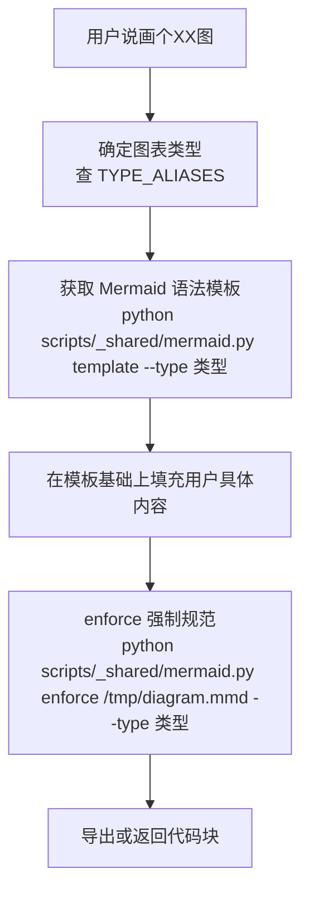
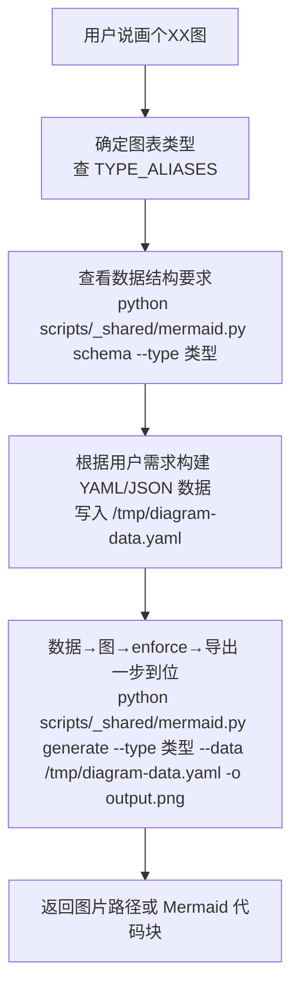
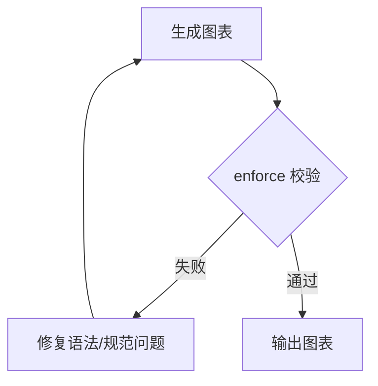

# Diagram Compiler

生成用于技术文档、论文、专利和工作汇报的图表。Python 脚本负责图种识别到导出全流程，AI 只负责选择并调用脚本。

## 核心原则

- **一类型一脚本**：flowchart.py、sequence.py、er.py、gantt.py、architecture.py ... 每个脚本只管自己类型的规则
- **后端按需选择**：语义图优先 Mermaid；论文/专利/汇报级静态图优先 Matplotlib/PIL 或专用 renderer
- **脚本即真理**：所有校验、模板、规则强制、主题和导出都由脚本完成，AI 只负责**选择并调用脚本**
- **先校验再输出**：Mermaid 类图表产出前必须通过 `enforce`；专用渲染图必须运行对应生成脚本并检查输出

## 软硬约束分工

| 约束 | 载体 | 适用 |
|------|------|------|
| 软约束 | SKILL.md + references/ | AI 行为指导、图种选择决策、工作流编排 |
| 硬约束 | scripts/ | 语法校验、模板生成、样式注入、图片导出 |

## AI 工作流（不可跳过）

**路径选择**：根据图表类型选择路径 A（模板）或路径 B（数据驱动）。

AI 根据不同图表类型选择**两条路径**之一：

### 路径 A：模板路径（过程式图表）

适用于 flowchart / sequence / class / state / er / git / mindmap —— 图表结构由流程逻辑决定，不适合结构化数据。



### 路径 B：数据驱动路径（结构化图表）⭐推荐

适用于 quadrant / sankey / c4 / radar / journey / swimlane / pie / gantt / timeline —— 图表由数据决定，Mermaid 只是序列化格式。**AI 不需要写 Mermaid 代码，只需要构建数据。**



**关键命令对应表**：

| 场景 | 命令 |
|------|------|
| 获取模板 | `python scripts/_shared/mermaid.py template --type flowchart` |
| 查看数据格式 | `python scripts/_shared/mermaid.py schema --type quadrant` |
| 数据→图表 | `python scripts/_shared/mermaid.py generate --type sankey --data data.yaml` |
| 数据→导出 | `python scripts/_shared/mermaid.py generate --type quadrant --data data.yaml -o out.png` |
| 校验语法 | `python scripts/_shared/mermaid.py validate doc.md --type sequence` |
| 强制规范 | `python scripts/_shared/mermaid.py enforce doc.md --type er` |
| 样式检查 | `python scripts/_shared/mermaid.py style doc.md` |
| 导出图片 | `python scripts/_shared/mermaid.py export doc.md -o out.png` |
| 导出透明背景 | `python scripts/_shared/mermaid.py export doc.md -o out.png --transparent` |
| 列出类型 | `python scripts/_shared/mermaid.py types` |

## 质量闸门

**enforce 校验**：任何 Mermaid 图表产出前必须通过 `python scripts/_shared/mermaid.py enforce` 校验。



- enforce 失败 → 回退到模板填充步骤修复 → 重新校验（loop）
- 专用渲染图（radar/sankey/swimlane）→ 运行对应生成脚本并检查输出文件存在性

## 图表类型→脚本对照

**类型映射**：用户自然语言 → 图表类型名 → 脚本文件 → 工作流路径。

| 用户说 | 类型名 | 脚本文件 | 工作流 |
|--------|--------|---------|--------|
| 流程图、业务逻辑、决策分支 | `flowchart` | `scripts/flowchart.py` | 路径A |
| 架构图、模块关系、组件拓扑 | `architecture` → `flowchart` | `scripts/flowchart.py` | 路径A |
| 分层图、DDD 分层、洋葱架构 | `layered` → `flowchart` | `scripts/flowchart.py` | 路径A |
| 分层技术架构图、毕设架构图、N-Tier 架构 | `layered-architecture` | `scripts/_shared/layered_architecture.py` | YAML数据 |
| 时序图、API 调用、消息交互 | `sequence` | `scripts/sequence.py` | 路径A |
| ER 图、实体关系、数据库设计 | `er` | `scripts/er.py` | 路径A |
| 类图、面向对象设计 | `class` | `scripts/class_diagram.py` | 路径A |
| 状态图、状态流转 | `state` | `scripts/state.py` | 路径A |
| 甘特图、项目排期 | `gantt` | `scripts/gantt.py` | 路径A |
| 饼图、数据占比 | `pie` | `scripts/pie.py` | 路径A |
| Git 图、分支合并 | `git` | `scripts/git_graph.py` | 路径A |
| 思维导图、脑图 | `mindmap` | `scripts/mindmap.py` | 路径A |
| 时间线、事件历程 | `timeline` | `scripts/timeline.py` | 路径A |
| 🆕 象限图、技术选型矩阵、风险评估 | `quadrant` | `scripts/quadrant.py` | **路径B** |
| 🆕 桑基图、流量分析、转化漏斗 | `sankey` | `scripts/sankey.py` | **路径B** |
| 🆕 C4架构图、系统上下文 | `c4` | `scripts/c4.py` | **路径B** |
| 🆕 雷达图、多维对比、能力评估 | `radar` | `scripts/radar.py` | **路径B** |
| 🆕 用户旅程图、体验路径 | `journey` | `scripts/journey.py` | **路径B** |
| 🆕 泳道图、跨职能流程 | `swimlane` | `scripts/swimlane.py` | **路径B** |

完整别名见 `scripts/__init__.py` 的 `TYPE_ALIASES`。

## 分层技术架构图 (N-Tier Architecture)

**特殊渲染**：使用 Matplotlib/PIL 精确排版的架构图类型，非 Mermaid 渲染。适用于论文、专利、技术方案和工作汇报的分层技术栈全景图。

特征：
- 黑色虚线分隔层级，低饱和淡彩背景区分每层
- 白色矩形模块 + 黑色细实线边框 + 无衬线文字
- 黑色箭头从上到下串联请求流向
- 模块撑满层宽，无多余留白

**数据驱动原则**：分层技术架构图必须数据驱动，不是固定模板。

| 规则 | 说明 |
|------|------|
| 禁止固定模板 | `_default_layout` 仅作默认示例和兜底 |
| 响应用户需求 | 根据用户描述生成或修改 YAML layout |
| 渲染方式 | 通过 `--layout` 参数渲染 |
| 支持类型 | 微服务/IoT/大数据/AI Agent/WebGIS/企业中台等 |

**使用方式**：

```bash
# 使用默认主题
python scripts/_shared/layered_architecture.py

# 切换主题
python scripts/_shared/layered_architecture.py --theme dark
python scripts/_shared/layered_architecture.py --theme business
python scripts/_shared/layered_architecture.py --theme warm

# 指定输出路径
python scripts/_shared/layered_architecture.py -o my-arch.png

# 导出透明背景（用于叠加到其他背景上）
python scripts/_shared/layered_architecture.py --transparent -o my-arch.png

# 使用自定义结构文件（推荐：按用户需求生成临时 YAML 后渲染）
python scripts/_shared/layered_architecture.py --layout /tmp/custom-architecture.yaml -o my-arch.png
```

**配色配置**：编辑 `assets/themes/architecture-themes.yaml` 中的 `themes` 部分或 `custom` 覆盖字段。详见 [references/config-system.md](references/config-system.md)。

## 配置系统

**配置集中**：所有配色和结构配置集中在 `assets/` 目录下。

按职责分子文件（themes/ 存放配色，layouts/ 存放结构定义）。支持 default/dark/warm/business 四套主题，可通过 `--theme` 参数或 `active_theme` 字段切换。详见 [references/config-system.md](references/config-system.md)。

## 样式规范

**默认样式**：所有图表必须注入 `DEFAULT_THEME_VARIABLES` 样式。

定义在 `scripts/_shared/core.py` 中。`enforce` 命令会自动检查和注入；用户指定其他样式时跳过默认注入。详见 [references/style-spec.md](references/style-spec.md)。

## 图片导出

**导出命令**：支持 PNG/SVG/PDF 三种格式导出。

当用户需要图片文件（非 Markdown 内嵌）时使用以下命令：

```bash
python scripts/_shared/mermaid.py export doc.md -o output.png
python scripts/_shared/mermaid.py export doc.md -o output.svg
python scripts/_shared/mermaid.py export doc.md -o output.pdf
```

依赖 `mmdc`。背景色策略（默认跟随主题、透明背景、自定义背景色等）详见 [references/export-guide.md](references/export-guide.md)。

## references 引用时机

| 场景 | 读取 |
|------|------|
| 查看配色/主题配置 | references/config-system.md |
| 查看样式规范 | references/style-spec.md |
| 图片导出/背景色策略 | references/export-guide.md |
| 依赖安装/故障排除 | references/troubleshooting.md |

## 禁止事项

- **禁止凭记忆写 Mermaid 语法**——路径A 必须先用 `template` 拿模板，路径B 必须先用 `schema` 看数据格式
- **禁止跳过 enforce**——任何图表产出前必须先 enforce
- **禁止手动注入样式**——让 enforce 命令自动处理
- **禁止在 sequenceDiagram 的 participant ID 中使用中文**——用 `participant U as 用户` 模式
- **禁止 flowchart 节点标签中使用小写 `end`**——用 `End` 或 `END`
- **禁止 subgraph 嵌套超过 3 层**
- **禁止节点数超过 40 不拆分**
- **禁止对路径B类型直接写 Mermaid 代码**——必须构建YAML/JSON数据，通过 `generate` 命令生成。AI 写 Mermaid 代码容易出错；脚本生成保证语法正确。

## 依赖与故障排除

**依赖清单**：mmdc（Mermaid 导出）、PyYAML（YAML 解析）、CJK 字体（中文渲染）。

| 依赖 | 用途 | 检查命令 |
|------|------|---------|
| mmdc | Mermaid → PNG/SVG/PDF | `python scripts/_shared/mermaid.py types` |
| PyYAML | YAML 数据解析 | 同上 |
| CJK 字体 | 中文渲染 | macOS 自带，Linux 需 `apt install fonts-noto-cjk` |

Mermaid CLI 不支持的类型（radar/sankey/swimlane）需使用 Matplotlib `render()` 直出。详见 [references/troubleshooting.md](references/troubleshooting.md)。

## 与 uluo-spec-driven 的集成

当同时使用 uluo-spec-driven skill 时：
- 架构图 → `plans/README.md`
- ER 图 → `plans/` (数据模型章节)
- 流程图 → `spec.md` 或 `plans/`
- 时序图 → `plans/` (模块交互章节)
- 状态图 → `spec.md` 或 `plans/`
