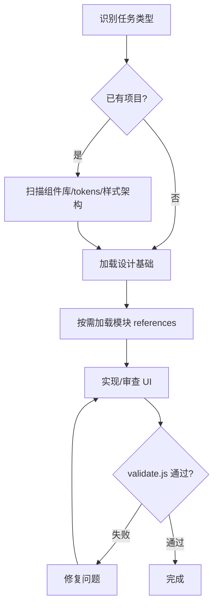

# 前端 UI 审美与产品化护栏

约束 AI 前端实现，使输出符合现代 UI/UX、项目设计系统、组件库、响应式布局、可访问性、国际化、主题切换和可维护样式架构。本 skill 是**编排器**——阻止低质量 AI 前端模式，让模型根据产品场景、组件生态和已有设计系统做出稳定、克制、可落地的 UI 判断。

## 工作流程

**流程编排**：先识别任务类型 → 扫描已有项目体系 → 加载设计基础 → 按需加载模块 → 实现/审查 → 硬约束校验。

## 质量闸门

**硬约束校验**：用户可见 UI 完成前必须运行 `node scripts/validate.js <files>`。

- 校验失败 → 修复问题 → 重新校验（loop）
- 校验通过 → 交付
- 项目无前端文件时跳过脚本校验，改用人工自检清单

## 强制工作协议

**工作协议**：9 步强制流程，从任务识别到自检纠偏。

1. **先识别任务类型**：判断当前任务是新建页面、改造 UI、组件开发、设计系统、响应式修复、主题/i18n、还是前端 review。
2. **已有项目先扫描**：实现前必须识别组件库、图标库、tokens、样式架构、布局范式和响应式规则。若项目已加载 uluo-web-standards，其已验证的硬约束默认不再重复确认，本 skill 专注于 uluo 未覆盖的视觉和交互层面。
   - 改造已有项目时先判定模式：Greenfield（全新）/ Redesign-Preserve（保留品牌，现代化 UI）/ Redesign-Overhaul（新视觉，保留内容和 IA）。若无法判断，问一次。
   - Redesign 必须先审计 brand tokens、IA、content blocks、patterns to preserve/retire、SEO baseline。
   - 现代化按 typography → spacing → color → motion → hero → full block 逐级加杠杆。
   - URL/nav label/form field name/brand logo/legal copy 不可沉默改变。
3. **默认加载设计基础**：任何前端任务都必须读取 `references/design-foundations.md`，保证设计判断不退化成纯工程清单。
4. **按需加载其他模块**：根据任务类型读取下方 reference 文件；不要把所有细则塞进当前上下文。
5. **优先沿用项目体系**：除非现有体系缺失或明显错误，否则不要另造一套视觉语言。
6. **使用设计语言判断**：实现和 review 时必须能从视觉层级、尺度、平衡、对比、分组、认知负荷、可供性、反馈等角度解释决策。
7. **少问但问准**：默认自主判断；确实缺少关键事实时，每次只问一个问题。
8. **完成前自检**：用户可见 UI 必须检查响应式、状态、图标、tokens、组件库使用、主题/i18n、文案和视觉主次。项目有前端文件时运行 `node scripts/validate.js <files>` 做硬约束检查。
9. **纠偏必须记录**：用户指出规则偏差后，立即写入工作记录或对应 skill 模块，避免后续遗忘。

## 模块加载表

- `references/design-foundations.md`：任何前端任务默认必读；提供视觉层级、尺度、平衡、对比、Gestalt、认知负荷、可供性、反馈等设计基础。
- `references/tokens.md`：三阶 Token 体系（Primitive → Semantic → Component）、语义层设计、主题切换机制、命名规范、颜色策略轴、最少起步集。
- `references/layout-responsive.md`：信息层级、路由内容区、响应式、移动端、长文本、布局验收。
- `references/i18n-accessibility.md`：国际化、可访问性、表单错误、键盘与 focus、状态反馈。
- `references/review-antipatterns.md`：前端 review、一票否决项、AI 常见 UI 反模式和修复方向（Hero/文案/布局/装饰/数据五类）。
- `references/copy-rules.md`：文案护栏，任何产生用户可见文案的任务加载。覆盖 copy self-audit、假精确数字、填充动词、按钮标签、文案语域。

## references 引用时机

| references 文件 | 何时读取 |
|----------------|---------|
| design-foundations.md | 任何前端任务默认必读 |
| tokens.md | 设计系统/tokens/主题切换任务 |
| layout-responsive.md | 布局/响应式/移动端任务 |
| i18n-accessibility.md | 国际化/可访问性/表单任务 |
| review-antipatterns.md | 前端 review/反模式检查 |
| copy-rules.md | 产生用户可见文案时 |

## 软硬约束分工

| 约束 | 载体 | 适用 |
|------|------|------|
| 软约束 | SKILL.md + references/ | 设计判断、审美方向、review 标准 |
| 硬约束 | scripts/ | emoji 检测、硬编码颜色、响应式、Tailwind 合规、状态完整性 |

## 一票否决项

**硬失败项**：以下问题视为硬失败，必须修正。

- 使用 emoji、表情符号或文本符号充当 UI 图标，而不是使用项目图标库。
- 移动端或窄屏出现横向溢出、内容裁切、元素重叠、控件不可操作或非预期双向滚动。
- 一般布局在没有项目需求或用户明确需要时超出视口，并产生非预期滚动条。
- 未建立 Design Tokens 或类似 token 的样式基线，就直接写页面级视觉样式。
- 项目已有成熟组件库，却手写 Button、Input、Select、Table、Dialog 等基础控件。
- 渐变、亮色、彩色边框、阴影、装饰效果过多，导致主次不清。
- 缺少关键状态：loading、error、empty、disabled、focus、hover、active、selected、validation 等。
- 在需要主题切换的项目中硬编码视觉颜色，导致主题无法扩展。
- 布局只适配单一语言长度，国际化文案变长后破版。
- 路由内容区机械重复“路由标题 + 描述”，挤压真实工作面。

## 默认审美方向

**审美优先级**：先产品任务后视觉装饰，先信息架构后视觉表现。

- 先产品任务，后视觉装饰。
- 先信息架构，后视觉表现。
- 先系统规则，后单页样式。
- 先组件完整性，后页面拼装。
- 先结构层级，后颜色效果。
- 先真实内容，后说明文案。
- 先响应式与状态底线，后个性化视觉表达。
- 一般情况先保证视口内布局成立，只有需求明确时才引入页面级或局部滚动。
- 信息过载时优先做渐进呈现：把高频核心任务留在主界面，把低频、高级、辅助内容放到分页、分段、折叠、标签页、抽屉、弹层或局部滚动区域中。

## 最小 AQ 规则

**提问原则**：需求模糊时一次只问一个关键问题。

需求模糊时不要展开长问卷。一次只问一个关键问题，例如：

- 当前项目使用哪个组件库和图标库？
- 是否已有 Design Tokens、主题文件或全局样式规范？
- 是否允许引入成熟组件库，还是只能做本地最小组件？
- 当前项目已有 Tailwind，是否继续新增 Tailwind，还是避免扩张？

得到答案后立即推进，并把明确约束沉淀到相关模块。
