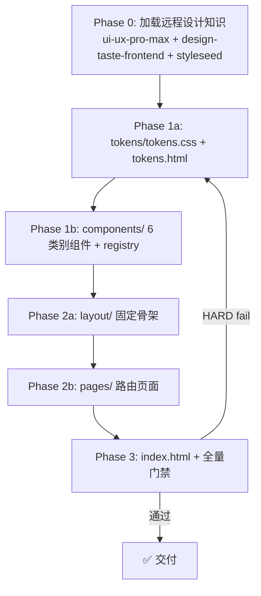

# html-blueprint — 设计系统产出编排器

**编排器**：流程由 `flow.js` 完全控制，清单在 `references/`，校验在 `scripts/`。

---

## 核心原则

**技能边界**：产出设计系统站点（tokens.css + tokens.html + components.html + pages + index.html）。不教 AI 怎么画——只告诉 AI 必须产出什么、脚本检查是否齐了。

**设计知识来源**：必须加载并使用 ui-ux-pro-max（配色/字体/风格）、design-taste-frontend（品味审查）、styleseed-design-review（品牌规则+设计评分）。

**流程驱动**：`flow.js` 控制每个 Phase 的产出边界和门禁，AI 必须通过 `next` → `complete` 逐步推进。禁止越过 flow.js 直接写文件。

---

## 流程控制（HARD）

```bash
node scripts/flow.js <design-dir> init --scenario multi-page
node scripts/flow.js <design-dir> next          # 当前 Phase 产出清单 + 边界约束 + 门禁
node scripts/flow.js <design-dir> complete <id>  # 门禁校验，失败修复 loop
node scripts/flow.js <design-dir> status
```

**flow.js 是所有流程控制的唯一真相源。AI 不自行判断 Phase 顺序，完全由 flow.js 驱动。**



**回退规则**：任一 Phase gate fail → 回退到该 Phase 修复 → 重新 `complete` → 门禁通过后继续。

---

## references 引用时机

| 文件 | Phase | 用途 |
|------|-------|------|
| tokens-checklist.md | phase1-tokens | 13 维清单 + 受控扩展规则 |
| atomic-components-checklist.md | phase1-components | 7 类组件清单 + 展示规格 |
| component-registry.md | phase1-components / phase2-pages | 查表复用规则 |
| remote-skills.md | phase0 | 远程 skill 加载命令与仓库地址 |
| requirement-extraction-guide.md | 提取 Spec 时 | 自然语言 → Design Spec 提取规则 |
| navigation-protocol.md | phase2-layout / phase2-pages | 导航结构定义 + 跨页一致性校验协议 |
| protocol-spec.md | 生成 HTML 时 | data-* 属性字典 |
| css-conventions.md | 写 CSS 时 | BEM + token 引用 |
| theme-consistency.md | 首次或追加时 | token 继承 |
| design-dimensions.md | 尺寸设定时 | 画布/容器/栅格 |
| constraint-tiers.md | 理解约束时 | HARD/SHOULD/WARN |
| code-generation-guide.md | 生成框架代码时 | Vue/React/Angular 代码生成指南 |
| design-spec.md | Spec-First 工作流 | Design Spec 完整字段定义 |

---

## 硬约束校验

| 脚本 | 用途 |
|------|------|
| `scripts/flow.js` | 流程状态控制（唯一的流程真相源） |
| `scripts/validate.js` | 12 项全量门禁 |
| `scripts/checks/design-tokens.js` | 13 维覆盖率 + 受控扩展 |
| `scripts/checks/component-registry.js` | 注册表覆盖率 + 跨页一致性 |
| `scripts/checks/design-structure.js` | 目录结构 + 标记覆盖率 |
| `scripts/checks/data-component.js` | PascalCase + 泛名检测 |

---

## 骨架 vs 路由页面协议

**layout/ = 固定骨架模板**，**pages/ = 自包含路由页面**。AI 必须区分这两个概念。

```
骨架模板 layout/                     自包含页面 pages/
┌──────────────────────────────┐  ┌──────────────────────────────┐
│ 参考模板 + 共享 CSS 文件       │  │ 嵌入完整 app-shell           │
│                              │  │ ┌──────────────────────────┐ │
│ layout/main-layout.html      │  │ │ .app-shell               │ │
│   └── layout.css (共享样式)   │  │ │ ├── .sidebar (导航链接)   │ │
│                              │  │ │ └── .main-area           │ │
│ sidebar 链接用相对路径:       │  │ │     ├── .header          │ │
│   href="../pages/*.html"    │  │ │     └── .page-content     │ │
│                              │  │ └──────────────────────────┘ │
│ 每个自包含页面复制 app-shell    │  │                              │
│ 结构，共享 CSS 来自 layout.css │  │ sidebar 链接用同级路径:        │
│                              │  │   href="dashboard.html"     │ │
└──────────────────────────────┘  └──────────────────────────────┘
```

**规则**：
- **一个项目通常只有一个主骨架模板**（main-layout），所有路由页面嵌入其 app-shell 结构
- 骨架先于页面生成（Phase 2a → 2b），页面不能定义自己的导航栏或 header
- **页面是自包含的完整 HTML 文档**，直接打开即可工作（无需构建工具注入）
- 页面通过 `<!-- @layout ../layout/main-layout.html -->` 注释声明引用哪个骨架模板
- `layout.css` 包含共享样式（.sidebar、.header、.page-content、.stat-card、.content-card、.btn 等），页面 CSS 只写本页唯一的 BEM 样式
- **导航一致性（HARD）**：`layout/nav-structure.json` 声明导航结构的唯一蓝本。所有页面的 sidebar 必须精确复制 layout 的结构，禁止自行增删。导航中出现的页面必须在 `pages/` 下有对应文件
- design-structure.js 校验：pages 有文件 → layout 必须有文件 + 每个 page 必须有 @layout 引用 + app-shell 结构完整 + sidebar 链接不是 `href="#"` + 跨页 sidebar 结构一致 + sidebar href 目标存在

---

## 产出清单

```
design/
├── index.html                 ← Phase 3
├── component-registry.json    ← Phase 1（脚本更新）
├── taste-review.md            ← Phase 0（品味审查）
├── tokens/                    ← Phase 1
│   ├── tokens.css             ← 13 维 token 面板
│   └── tokens.html            ← 展示页（6 个 @token-section）
├── icons/                     ← 按需增量（SVG，统一 currentColor）
│   ├── search.svg
│   ├── bell.svg
│   └── ...
├── components/                ← Phase 1（6 个类别组件）
│   ├── general.html           ← 通用类
│   ├── data-entry.html        ← 数据录入类
│   ├── data-display.html      ← 数据展示类
│   ├── feedback.html          ← 反馈类
│   ├── navigation.html        ← 导航类
│   └── layout.html            ← 布局类
├── layout/                    ← Phase 2（骨架模板 + 共享 CSS）
│   ├── main-layout.html       ← app-shell 骨架（导航结构唯一蓝本）
│   ├── layout.css             ← 共享骨架样式
│   └── nav-structure.json     ← 导航结构声明（跨页一致性校验依据）
├── blocks/                    ← Phase 2（可复用区块）
└── pages/                     ← Phase 2（自包含页面，嵌入 app-shell）
```

---

## 禁止事项

- 禁止绕过 flow.js 直接写文件
- 禁止 Phase 间越界——Phase 1 不画页面，Phase 2 不改 tokens/组件
- 禁止 tokens.html 不使用固定模板骨架
- 禁止使用 emoji 作为 UI 图标（全部使用 SVG，放 icons/ 目录）
- 禁止布局 CSS 只写在 layout/*.html 的内嵌 `<style>` 中而未抽离为独立文件（见 css-conventions.md「布局 CSS 共享机制」）
- 禁止页面自行决定导航项增减——所有 sidebar nav item 必须在 nav-structure.json 中声明，页面精确复制 layout 结构
