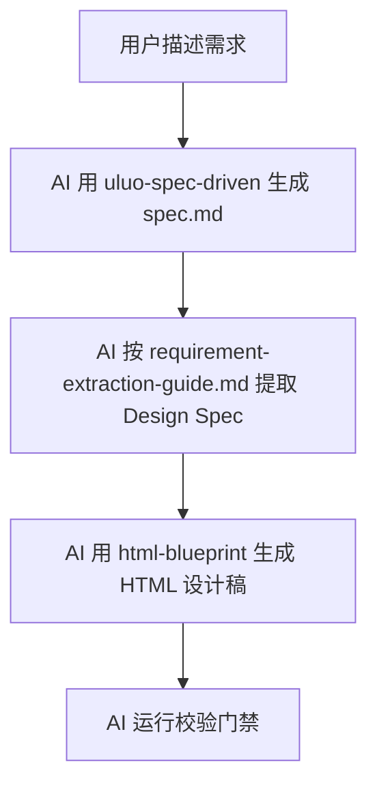
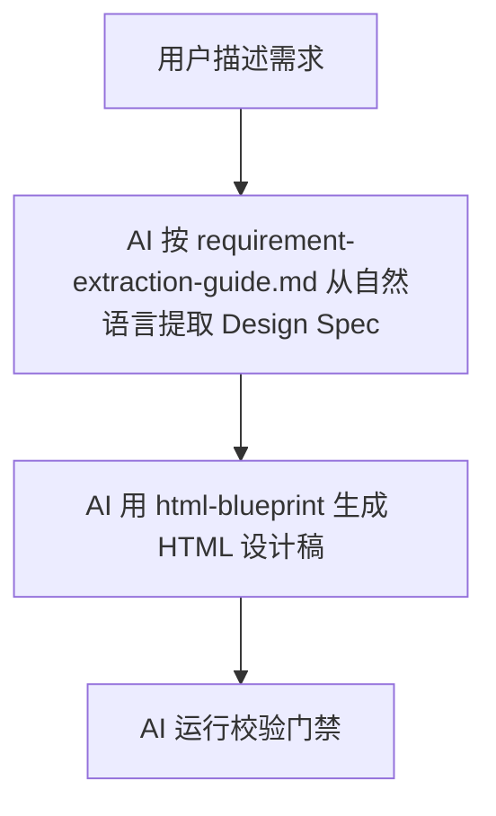
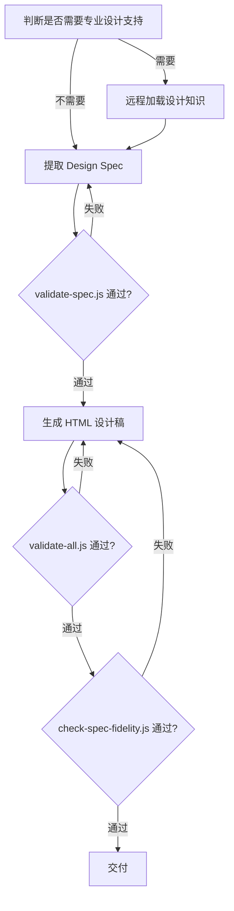

# HTML Blueprint — 需求到设计稿的 AI 转换协议

从需求提取 Design Spec，再从 Design Spec 生成可组件化 HTML 设计稿。HTML/CSS 保证视觉保真，`data-*` 属性标注组件语义。本 skill 是**编排器**——不发明 DSL，不替代 HTML，通过 `data-*` 注释让 HTML 从"只能看"变成"能转换"。

**Design Spec**：AI 提取的中间契约，用户不手写。AI 按提取规则从需求提取，用户确认后生成 HTML。

## 两条工作路径

**路径选择**：路径 A 对齐 uluo-spec-driven，路径 B 独立工作。

### 路径 A: AI 同时使用 uluo-spec-driven 和 html-blueprint（对齐口径）



### 路径 B: AI 只用 html-blueprint（独立工作）



两条路径下游流程一致：提取 Design Spec → 校验 → 生成 HTML → 校验。

## 远程设计知识加载（按需）

html-blueprint 内置了两个远程设计类 skill，**按需远程加载**，无需用户手动安装。首次使用时从 GitHub 拉取核心文件，缓存到项目本地复用。

### 已集成的远程 Skill

| 名称 | 作用 | 触发条件 |
|------|------|---------|
| **ui-ux-pro-max** | 设计系统生成：67 种风格、161 配色、57 字体、99 UX 规则 | 生成 Landing Page、营销页、作品集、仪表盘等视觉要求高的页面 |
| **design-taste-frontend** | 品味纠偏：AI TELLS 禁令、三旋钮配置、创意武器库 | 用户要求"高端设计"、"避免 AI 味"、"专业设计感" |

### 加载方式

```bash
# 加载指定远程 skill
node scripts/fetch-remote-skill.js <skill-name>

# 查看可用列表
node scripts/fetch-remote-skill.js --list

# 强制刷新缓存
node scripts/fetch-remote-skill.js <skill-name> --force
```

缓存位置：`<项目根>/.cache/html-blueprint/remote-skills/
缓存有效期：7 天

详细规则见 [remote-skills.md](references/remote-skills.md)。

### 设计系统生成流程

当需要专业设计支持时，在提取 Design Spec 之前，先加载远程设计知识：

1. **判断是否需要**：视觉要求高的页面（Landing、作品集、营销页、仪表盘）→ 加载 ui-ux-pro-max
2. **加载设计知识**：调用 `fetch-remote-skill.js` 拉取对应 skill 的 SKILL.md
3. **生成设计系统**：基于用户需求 + 远程 skill 知识，生成设计方案（风格/配色/字体/间距/圆角/阴影/动效）
4. **融入 Design Spec**：将设计系统写入 Design Spec 的 `visual` 字段
5. **生成 tokens.css**：将设计系统映射为标准 CSS 变量（见 [theme-consistency.md](references/theme-consistency.md)）
6. **品味纠偏**：加载 design-taste-frontend，检查 AI 味模式，替换为高级替代方案

设计系统 → tokens.css 映射规则：

| 设计系统项 | CSS 变量 |
|-----------|---------|
| 主色 | `--color-primary` |
| 主色悬停 | `--color-primary-hover` |
| 正文文字 | `--color-text-primary` |
| 次要文字 | `--color-text-secondary` |
| 页面背景 | `--color-bg-page` |
| 卡片背景 | `--color-bg-surface` |
| 成功/警告/错误色 | `--color-success` / `--color-warning` / `--color-error` |
| 正文字号 | `--font-size-base` |
| 标题字体 | `--font-family-heading` |
| 正文字体 | `--font-family-body` |
| ... | ... |

## 工作流程



**流程编排**：设计知识加载（按需）→ 提取 Spec → Spec 校验 → 生成 HTML → HTML 校验 → 一致性校验 → 交付。三道 HARD 门禁，任一失败回退修复。

## Spec-First 工作流

**七步流程**：提取 → 校验 → 生成 → 校验 → 一致性 → 代码 → 一致性。

### 1. 提取 Design Spec

AI 从需求提取 Design Spec，规则见 `references/requirement-extraction-guide.md`。

**当 spec.md 存在时（uluo-spec-driven 产出）**:
1. 读取 spec.md 的功能需求章节
2. 每个 FR 提取为一个 component（FR 标题的名词 → PascalCase）
3. FR 的预期行为提取为 props（展示数据）和 events（交互行为）
4. 边界条件提取为 states
5. 非功能性需求提取为 dataSource
6. 用验收标准验证提取的覆盖度

**当只有自然语言需求时**:
1. 识别需求中的展示数据 → props
2. 识别需求中的交互行为 → events
3. 识别需求中的状态 → states
4. 识别需求中的数据源 → dataSource
5. 识别图表/复杂交互 → convertMode: manual

### 2. 校验 Design Spec（HARD 门禁）

```bash
node scripts/validate-spec.js <spec.json>
```

Spec 必须通过校验才能生成 HTML。失败时修复后才能继续。

### 3. 生成 HTML 设计稿

```bash
node scripts/generate-html.js <spec.json> --out <output.html>
```

AI 基于 Spec.visual 和设计常识补充视觉细节。

### 4. 校验 HTML 协议合规（HARD 门禁）

```bash
node scripts/validate-all.js <output.html>
```

HARD 违规必须修复后才能交付。

### 5. 校验 Spec↔HTML 一致性（HARD 门禁）

```bash
node scripts/check-spec-fidelity.js <spec.json> <output.html>
```

校验 Spec 中的组件/props/events 与 HTML 中的 data-* 属性一致。HARD 违规必须修复后才能交付。

### 6. 生成代码（可选）

AI 参考 `references/code-generation-guide.md` 根据 Design Spec 生成任意框架代码（Vue/React/Angular/Svelte）。

### 7. 校验 Spec↔代码一致性（HARD 门禁，可选）

```bash
node scripts/check-spec-fidelity.js <spec.json> <output.html> <code-dir>
```

校验代码中是否存在 Spec 定义的 prop/event 名称（框架无关语义搜索）。HARD 违规必须修复后才能交付。

### 从 HTML 逆向生成 Spec

已有 HTML 设计稿可逆向生成 Spec：
```bash
node scripts/html-to-spec.js <input.html> --out <spec.json>
```
逆向生成的 Spec 会标记缺失字段为 `_todo`，需人工补充后进入 Spec-First 工作流。

## 强制工作协议

**工作协议**：12 步强制流程，从主题检查到三角校验。

0. **检查项目主题**：
   - 生成新设计稿前，先检查项目根目录是否存在 `tokens.css`
   - 存在则读取并继承其 token（颜色/间距/圆角/字号），HTML 通过 `<link>` 引入
   - 不存在且项目将有多页设计稿时，同步生成主题 CSS
   - 详见 `references/theme-consistency.md`
1. **识别任务类型**：判断是生成新设计稿、review 已有设计稿、还是从需求提取 Design Spec。
2. **生成前加载协议**：任何生成 HTML 设计稿的任务，必须先读取 `references/protocol-spec.md` 了解完整属性字典和组件分类规则。
3. **写 CSS 时加载约定**：任何涉及 CSS 的任务，读取 `references/css-conventions.md`。如果项目已有 `tokens.css`，还需读取 `references/theme-consistency.md`。
4. **理解约束分级**：读取 `references/constraint-tiers.md` 区分 HARD（阻断）/ SHOULD（建议）/ WARN（提示）。
5. **提取 Design Spec 时加载指南**：从需求提取 Design Spec 时，读取 `references/requirement-extraction-guide.md`。
6. **生成代码时加载指南**：AI 生成框架代码时，读取 `references/code-generation-guide.md`。
7. **HTML 负责视觉保真**：允许 flex、grid、gradient、box-shadow、backdrop-filter、animation。不要为了"好转换"而牺牲视觉效果。
8. **data-* 负责语义标注**：每个组件用 data-component（PascalCase）、动态数据用 data-prop、交互触发用 data-event（click/submit/change）、业务动作名用 data-action（camelCase，配合 data-event）、可替换区域用 data-slot、转换策略用 data-convert。
9. **生成后自检（HARD）**：HTML 输出后立即运行 `node scripts/validate-all.js <output.html>`，HARD 违规必须修复后才呈现给用户。
10. **跨蓝图一致性校验**：如果项目中有多个 HTML 设计稿，validate-all 会自动运行主题一致性检查（token 继承、var() 引用、主题 CSS 唯一性）。
11. **Spec 校验（HARD）**：Spec-First 工作流中，Spec 必须先通过 `validate-spec.js` 校验才能生成 HTML。
12. **三角校验（HARD）**：Spec-First 工作流完成后，必须运行 `check-spec-fidelity.js` 校验 Spec ↔ HTML（↔ 代码）一致性，HARD 违规必须修复后才能提交。

## 门禁保障

**三道 HARD 门禁**：Spec 合法性、HTML 协议合规、Spec↔HTML 一致性，任一失败必须修复后重新校验（loop）。

| 门禁 | 校验器 | 时机 | 失败处理 |
|------|--------|------|---------|
| Spec 合法性 | validate-spec.js | Design Spec 提取后 | 修复后才能生成 HTML |
| HTML 协议合规 | validate-all.js | HTML 生成后 | 修复后才能交付 |
| Spec↔HTML 一致 | check-spec-fidelity.js | HTML 交付前 | 修复后才能交付 |

## 软硬约束分工

| 约束 | 载体 | 适用 |
|------|------|------|
| 软约束 | SKILL.md + references/ | 提取规则、设计判断、代码生成指南、CSS 约定 |
| 硬约束 | scripts/ | Spec 校验、HTML 协议合规、Spec↔HTML 一致性、class 命名、data-* 属性 |

## 模块加载表

**按需加载**：7 个 references 文件，按任务类型加载。

| references 文件 | 内容 | 何时读取 |
|----------------|------|---------|
| protocol-spec.md | 完整属性字典、组件分类决策树、转换报告格式、禁止模式 | 生成或 review HTML 时必读 |
| css-conventions.md | BEM 命名、hybrid token 模式、禁止选择器、装饰元素样式、响应式声明 | 写 CSS 时加载 |
| theme-consistency.md | 项目主题 CSS 协议、token 继承规则、跨蓝图一致性校验 | 项目有多页设计稿或首次生成时 |
| constraint-tiers.md | HARD/SHOULD/WARN 三级约束体系与执行协议 | 需要理解规则严重程度时 |
| design-spec.md | Design Spec 格式规范（组件结构、props/events/states/dataSource/visual 完整字段定义） | Spec-First 工作流必读 |
| requirement-extraction-guide.md | 需求到 Design Spec 的提取规则（spec.md 对齐 + 自然语言模式） | 从需求提取 Design Spec 时必读 |
| code-generation-guide.md | AI 代码生成指南（框架无关，含 Vue/React/Angular/Svelte 示例） | AI 生成框架代码时必读 |

## 一票否决项

**硬失败项**：以下问题视为硬失败，必须修正。

- `data-component` 值不是 PascalCase（如 "card"、"组件A"）
- `data-component` 使用泛名（card/button/table/box/item/list/component/form/input/modal/header/footer...）
- `data-convert` 值不在合法枚举中（component/layout/static/decorative/manual）
- `data-convert="component"` 但没有 `data-component`
- 图表元素（data-chart/data-chart-lib）没有 `data-convert="manual"`
- 图表子元素包含 data-prop 或 data-component
- `<form>` 没有 `data-model` 和 `data-component`
- 表单控件（input/select/textarea）没有 `data-field`（除非 data-static="true"）
- `data-decorative="true"` 没有 `aria-hidden="true"`
- 装饰元素包含 data-prop/data-field/data-event/data-slot
- HTML 没有 `<!-- @viewport -->` 声明
- CSS 使用 `!important`
- class 使用盒模型位置名（.left/.right/.top/.bottom）或编号名（.box1/.text2）

### Spec-First 一票否决项

- Spec 未通过 `validate-spec.js` 校验就生成 HTML
- 生成的 HTML 与 Spec 的组件/props/events 不一致
- Spec-First 工作流完成后未运行 `check-spec-fidelity.js` 校验
- 生成的代码与 Spec 的 props/events 不一致（当提供 code-dir 时）

## 默认方向

**设计优先级**：先视觉保真后组件可维护性。

- 先保证视觉像，再保证能转换。视觉保真优先于组件可维护性。
- 不确定时标记 manual，不强行自动转换。
- 图表默认 manual，除非用户提供了真实数据结构。
- 不是所有元素都是组件——用 data-convert 显式区分 component/layout/static/decorative/manual。
- 装饰元素走 absolute + blur + aria-hidden，业务内容走正常文档流。
- 当视觉保真和组件可维护性冲突：保留视觉稿、标记 data-risk、不强行转换、输出人工处理建议。
- Design Spec 是 AI 提取的中间契约，用户不手写。AI 提取后展示给用户确认。
- Spec 是真相源，HTML 和代码都是生成物。Spec 变更时两者同步更新。
- 代码生成是框架无关的——AI 参考 code-generation-guide.md 生成任意框架代码，check-spec-fidelity.js 用语义搜索校验。

## 项目目录约定

**目录结构**：pages/ 放整页设计稿，components/ 放可复用模块。

```
<项目根>/
├── tokens.css           ← 项目唯一设计 token（:root 变量）
├── pages/                ← 整页布局设计稿（含 data-page 声明）
│   ├── dashboard.html
│   └── settings.html
└── components/           ← 可复用模块设计稿（弹窗、表单、通知等）
    ├── confirm-dialog.html
    └── notification-toast.html
```

- 整页设计稿（含 `data-page`）→ `pages/`
- 可复用模块（无 `data-page`）→ `components/`
- 两者均通过 `<link rel="stylesheet" href="../tokens.css">` 引入主题
- `<!-- @theme -->` 声明统一为 `../tokens.css`

## 最少提问规则

**提问原则**：需求模糊时只问一个问题，默认自主判断其余。

参考问题优先级：
1. "目标组件库是什么？（Vue 3 / React / 不确定）" → 生成中立 HTML，不做库特定映射
2. "需要响应式吗？目标画布尺寸？" → 默认 1440×900 单画布
3. "有现成的设计系统/tokens 吗？" → 有则沿用，无则生成 hybrid token
