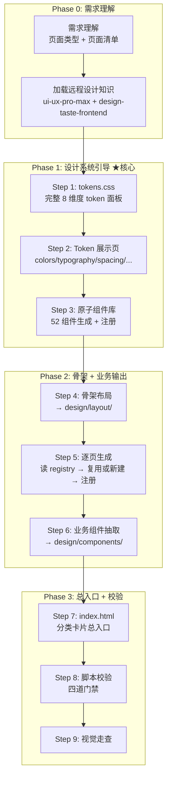

# HTML Blueprint — 设计系统驱动的 HTML 生成协议

从需求理解到**完整设计系统站点**的 AI 转换协议。产出不再是零散的 HTML 页面，而是以 `design/index.html` 为总入口的完整设计系统——包含 Token 展示、原子组件库、业务页面设计稿。

**核心原则**：系统先行，页面取用。tokens 和原子组件一次配齐，后续产出从池子取用，受控扩展。

---

## 四阶段流程



**串行约束（HARD）**：禁止跳步，禁止并行生成多个页面，所有产物输出到 `design/`。

**flow.js 强制使用（HARD）**：每个 Phase 必须通过 flow.js 门禁后才能进入下一 Phase。AI 必须用 `flow.js next` 获取阶段指引，用 `flow.js complete <phaseId>` 完成阶段（自动执行门禁校验），用 `flow.js status` 确认进度。禁止绕过 flow.js 直接写文件。`complete` 失败时必须修复后重新 `complete`，不得跳过门禁。

```bash
# 必须使用 flow.js 驱动整个流程（HARD，不可绕过）
node scripts/flow.js <design-dir> init --scenario multi-page
node scripts/flow.js <design-dir> next          # 读指引
node scripts/flow.js <design-dir> complete <id>  # 完成阶段（门禁不通过则修复loop）
node scripts/flow.js <design-dir> status         # 确认进度
```

---

## Phase 0: 需求理解

| 步骤 | 输入 | 输出 | 参考文档 |
|------|------|------|---------|
| 需求理解 | 用户需求 | 页面类型 + 页面清单 | requirement-extraction-guide.md |
| 加载远程知识 | — | ui-ux-pro-max + design-taste-frontend | remote-skills.md |

远程设计知识加载（HARD 约束，不可跳过）：
```bash
node scripts/_shared/load.js --all
```

---

## Phase 1: 设计系统引导

### Step 1: 生成完整 tokens.css

**不是从页面需求倒推**，而是基于 ui-ux-pro-max 生成**完整的 8 维度 token 面板**：

| 维度 | 覆盖 |
|------|------|
| Color | Primary 10色阶 + Neutral 10色阶 + Semantic + Text + Background + Border |
| Typography | Family + Size(h1-h6,body,caption) + Weight + Line-height + Letter-spacing |
| Spacing | 4px网格：4/8/12/16/20/24/32/40/48/56/64/72/80/96 |
| Radius | sm/md/lg/xl/2xl/full |
| Shadow | sm/md/lg/xl + focus-ring |
| Sizing | breakpoints + container + component-heights + icon-sizes + avatar-sizes |
| Border | width + style + color |
| Motion | duration(fast/medium/slow) + easing(in/out/in-out) |

完整清单见 [tokens-checklist.md](references/tokens-checklist.md)。

**受控扩展规则**（新增 token 时必须遵守）：
- 间距 → `--space-{n}`，n 为 4 的倍数
- 颜色 → `color-mix(in oklch, var(--color-X), white/black N%)` 派生，禁止裸 hex
- 字号 → 从已有字号按 type scale 比率（1.25）派生
- 圆角 → 从 sm/md/lg/xl/2xl/full 中选择
- 阴影 → 从已有阴影层级中选择

参考：[theme-consistency.md](references/theme-consistency.md)、[design-dimensions.md](references/design-dimensions.md)

### Step 2: 生成 Token 展示页

```
design/tokens/
├── colors.html       ← 色板墙：色阶 + 语义色标注
├── typography.html   ← 字号瀑布：h1→caption 实际渲染
├── spacing.html      ← 间距刻度：视觉化网格
├── radius.html       ← 圆角对照
├── shadow.html       ← 阴影层级对比
└── motion.html       ← 动效示例
```

### Step 3: 生成原子组件库

52 个原子组件全部生成，每个组件 HTML 按 [component-showcase-template.html](examples/component-showcase-template.html) 模板组织（Anatomy + Variants + States + Sizes + Usage）。全部注册到 `component-registry.json`（status: confirmed）。

完整清单见 [atomic-components-checklist.md](references/atomic-components-checklist.md)。

每个组件展示页必须包含：Anatomy（data-* 标注）、Variants（变体横向排列）、States（状态网格）、Sizes（尺寸对比）、Usage（使用指南）。

参考：[protocol-spec.md](references/protocol-spec.md)、[css-conventions.md](references/css-conventions.md)

---

## Phase 2: 骨架 + 业务输出

### 组件注册表查表（HARD）

生成每个页面前，必须先读 `design/component-registry.json`。注册表是跨页面组件**索引**——记录组件名、类型、位置、使用页面。详情见 [component-registry.md](references/component-registry.md)。

**AI 查表流程**：
1. 读 registry
2. 页面需要的每个组件 → name 匹配查表
3. 已存在 → 复用（`<!-- @component-ref -->`），追加 `usedInPages`
4. 不存在 → 新建为 business 组件（status: pending）
5. 页面生成后更新 registry（statistics + updatedAt）

| 步骤 | 输入 | 输出 | 参考文档 |
|------|------|------|---------|
| 骨架布局 | tokens.css + 页面类型 | design/layout/*.html | design-dimensions.md |
| 逐页生成 | registry + layout + blocks | design/pages/*.html | code-generation-guide.md |
| 业务组件抽取 | 跨页复用元素 | design/components/*.html | component-registry.md |

---

## Phase 3: 总入口 + 校验

### Step 7: 生成 index.html

基于 [index-template.html](examples/index-template.html) 生成总入口——分类卡片展示 Token / 原子组件 / 业务组件 / 页面。

### 四道 HARD 门禁

| 门禁 | 校验器 | 时机 | 失败处理 |
|------|--------|------|---------|
| Spec 合法性 | checks/spec.js | Design Spec 提取后 | 修复后才能生成 HTML |
| HTML 协议合规 | validate.js | HTML 生成后 | 修复后才能交付 |
| Spec↔HTML 一致 | checks/spec-fidelity.js | HTML 交付前 | 修复后才能交付 |
| 组件注册表完整 | checks/component-registry.js | 多页项目交付前 | 修复后才能交付 |

```bash
# 全部校验
node scripts/validate.js <design-dir>

# 流程状态控制（推荐）
node scripts/flow.js <design-dir> init --scenario multi-page
node scripts/flow.js <design-dir> next
node scripts/flow.js <design-dir> complete phase0
# ... (逐步推进)
```

---

## design/ 工作目录约定

```
<项目根>/design/
├── index.html                    ← 总入口：分类卡片（Phase 3 生成）
├── tokens.css                    ← 完整 token 面板（Phase 1 Step 1 生成，唯一真相源）
├── component-registry.json       ← 组件注册表（Phase 1 Step 3 初始，Phase 2 持续更新）
├── tokens/                       ← Token 展示页（Phase 1 Step 2 生成）
│   ├── colors.html
│   ├── typography.html
│   ├── spacing.html
│   ├── radius.html
│   ├── shadow.html
│   └── motion.html
├── layout/                       ← 骨架布局（Phase 2 生成）
├── blocks/                       ← 页面区块（Phase 2 生成）
├── components/                   ← 组件展示（Phase 1 + Phase 2）
│   ├── button.html               ← 原子组件（Phase 1，status: confirmed）
│   ├── input.html
│   └── ...
└── pages/                        ← 页面设计稿（Phase 2）
    ├── dashboard.html            ← 含 <!-- @layout ../layout/main-layout.html -->
    └── settings.html
```

**分层规则**：
- **tokens.css** 全局唯一，所有 HTML 通过 `<link rel="stylesheet" href="../tokens.css">` 引入
- **component-registry.json** 组件索引，不存完整 spec（详情从 HTML 的 data-* 读取），只做"谁在哪、被谁用"
- **components/** Phase 1 产出原子组件（confirmed），Phase 2 追加业务组件（pending → 跨页校验后 confirmed）
- 生成顺序约束：tokens.css → tokens/ → components/（原子） → layout/ → blocks/ → pages/ → components/（业务） → index.html

---

## Spec-First 工作流（保留）

配合 uluo-spec-driven 使用时的七步流程：

1. 提取 Design Spec（从 spec.md 或自然语言，见 requirement-extraction-guide.md）
2. 校验 Design Spec（`node scripts/checks/spec.js <spec.json>`）
3. 生成 HTML 设计稿（`node scripts/generate.js <spec.json> --out <output.html>`）
4. 校验 HTML 协议合规（`node scripts/validate.js <output.html>`）
5. 校验 Spec↔HTML 一致性（`node scripts/checks/spec-fidelity.js <spec.json> <output.html>`）
6. 生成代码（可选，参考 code-generation-guide.md）
7. 校验 Spec↔代码一致性（可选）

从 HTML 逆向生成 Spec：
```bash
node scripts/extract.js <input.html> --out <spec.json>
```

---

## 强制工作协议

0. **检查项目结构与主题**：
   - 检查 `<项目根>/design/` 目录结构是否存在
   - 检查 tokens.css，存在则继承，不存在则按 Phase 1 完整生成
   - 检查 component-registry.json，存在则查表复用
   - 详见 theme-consistency.md 和 component-registry.md
1. **识别任务类型**：新建设计系统 / 追加页面 / review / 提取 Spec；识别页面类型和清单
2. **加载远程设计知识（HARD）**：`_shared/load.js --all`，每次生成前必须执行
3. **加载协议文档**（HARD）：
   - 生成前 → protocol-spec.md（属性字典 + 组件分类）
   - 尺寸设定前 → design-dimensions.md
   - 写 CSS 前 → css-conventions.md
   - 提取 Spec 前 → requirement-extraction-guide.md
   - 生成代码前 → code-generation-guide.md
   - 生成 tokens 前 → tokens-checklist.md
   - 生成组件前 → atomic-components-checklist.md + component-registry.md
   - 理解约束 → constraint-tiers.md
4. **注册表先查后建（HARD）**：新页面前必须读 component-registry.json，已存在组件直接复用，不存在才新建并注册
5. **HTML 负责视觉保真**：允许 flex/grid/gradient/shadow/filter/animation
6. **data-* 负责语义标注**：data-component/data-prop/data-event/data-action/data-slot/data-convert
7. **生成后自检（HARD）**：`node scripts/validate.js <output.html>`，HARD 违规必须修复
8. **跨蓝图一致性校验**：多页项目自动检查主题一致性和注册表一致性
9. **Spec 校验（HARD）**：Spec-First 工作流中，Spec 必须先通过 checks/spec.js
10. **三角校验（HARD）**：Spec↔HTML↔代码 一致性校验

---

## 软硬约束分工

| 约束 | 载体 | 适用 |
|------|------|------|
| 软约束 | SKILL.md + references/ | 流程编排、设计判断、提取规则、代码生成指南、CSS 约定 |
| 硬约束 | scripts/ | Spec 校验、HTML 协议合规、Spec↔HTML 一致性、tokens 受控扩展、组件注册表完整性、class 命名、data-* 属性 |

**流程控制**：`flow.js` 提供门控驱动渐进式流程推进，确保系统引导流程被稳固执行。

```bash
node scripts/flow.js <design-dir> init --scenario multi-page
node scripts/flow.js <design-dir> next      # 获取当前阶段指引
node scripts/flow.js <design-dir> complete <phaseId>  # 完成阶段（自动门禁）
node scripts/flow.js <design-dir> status    # 查看进度
```

---

## 模块加载表

| 文件 | 何时读取 |
|------|---------|
| tokens-checklist.md | Phase 1 Step 1 生成 tokens.css 时必读 |
| atomic-components-checklist.md | Phase 1 Step 3 生成原子组件时必读 |
| component-registry.md | Phase 1 Step 3 注册 + Phase 2 每页生成前必读 |
| protocol-spec.md | 生成或 review HTML 时必读 |
| css-conventions.md | 写 CSS 时加载 |
| theme-consistency.md | 项目有多页或首次生成 tokens 时 |
| design-dimensions.md | 尺寸设定和生成 CSS 时必读 |
| constraint-tiers.md | 理解规则严重程度时 |
| design-spec.md | Spec-First 工作流必读 |
| requirement-extraction-guide.md | 从需求提取 Design Spec 时必读 |
| code-generation-guide.md | AI 生成框架代码时必读 |
| remote-skills.md | 加载远程设计知识时 |

---

## 一票否决项

- `data-component` 值不是 PascalCase
- `data-component` 使用泛名（card/button/table/box/item/list/...）
- `data-convert` 值不在合法枚举中
- `data-convert="component"` 但没有 `data-component`
- 图表元素没有 `data-convert="manual"`
- `<form>` 没有 `data-model` 和 `data-component`
- 表单控件没有 `data-field`
- `data-decorative="true"` 没有 `aria-hidden="true"`
- HTML 没有 `<!-- @viewport -->` 声明
- CSS 使用 `!important`
- class 使用盒模型位置名或编号名
- **有 pages 但无 component-registry.json**
- **新增间距不是 4 的倍数**
- **新增颜色使用裸 hex 值而非 color-mix() 派生**

---

## 默认方向

- 先保证视觉像，再保证能转换。视觉保真优先于组件可维护性
- 不确定时标记 manual，不强行自动转换
- 图表默认 manual
- 不是所有元素都是组件——用 data-convert 区分
- 装饰元素走 absolute + blur + aria-hidden
- Design Spec 是 AI 提取的中间契约，用户不手写
- Spec 是真相源，HTML 和代码都是生成物
- 代码生成是框架无关的
- **component-registry.json 是轻量索引**——只存"谁在哪、被谁用"，完整 spec 从 HTML data-* 读取

## 最少提问规则

**仅问一个问题**：
1. "目标组件库？（Vue 3 / React / 不确定）" → 生成中立 HTML
2. "需要响应式吗？目标画布尺寸？" → 默认 1440×900
3. "有现成的设计系统/tokens 吗？" → 有则沿用，无则完整生成
