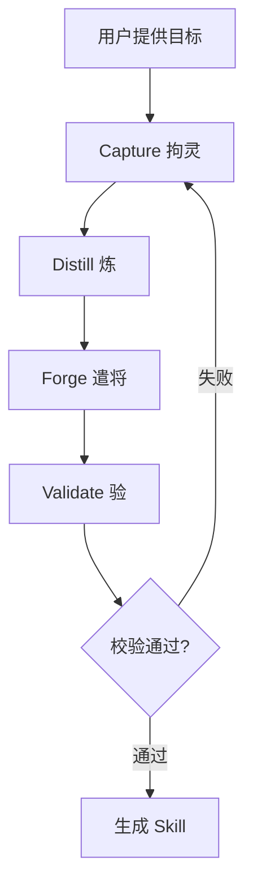

# Spirit Forge (拘灵遣将)

研究目标人物，捕获其专业模式和风格，生成可工作的 Claude Code skill 来模拟该人物。本 skill 是**编排器**——Python 脚本负责抓取、提取和生成，Claude 负责编排、决策和创意补充。

## Core Principles

**核心原则**：脚本固定骨架，Claude 做编排组合。

1. **Scripts fix the skeleton, Claude does composition**—deterministic Python scripts handle scraping, extraction, and generation. Claude orchestrates, decides what to research, and fills creative gaps.
2. **Gotchas are the highest-signal content**—the generated skill's gotchas section is always the most valuable and should be the richest.
3. **Progressive disclosure is essential**—deep persona knowledge goes in the generated skill's references/, not the main SKILL.md.
4. **Descriptions are written for the model**—the generated skill's frontmatter description must contain specific trigger phrases that cause Claude to activate it at the right time.
5. **Self-referential closure**—Spirit Forge can improve itself using its own Capture→Distill→Forge→Validate pipeline.

## 软硬约束分工

| 约束 | 载体 | 适用 |
|------|------|------|
| 软约束 | SKILL.md + references/ | 调研策略、提取规则、生成模板、验证标准 |
| 硬约束 | scripts/ | 网页抓取、正则提取、模板生成、结构校验 |

## Pipeline Overview

**四阶段管道**：Capture → Distill → Forge → Validate，失败时迭代。



All heavy lifting is done by deterministic Python scripts in `scripts/`. Claude's role is composition, edge-case research, and quality review.

## 质量闸门

**四阶段门禁**：每阶段有确定性脚本校验，失败时回退修复（loop）。

| 阶段 | 门禁 | 失败处理 |
|------|------|---------|
| Capture | raw-research/ 目录非空 | 补充 researcher agent 调研 |
| Distill | heuristics ≥ 3 且 gotchas ≥ 3 | 读取 extraction-tasks.md 人工补充 |
| Forge | SKILL.md < 500 行 + references ≥ 2 文件 | 回退 Distill 补充内容 |
| Validate | 10 项结构+内容检查 | 回退最弱维度修复 |

## Quick Start (Unified Pipeline)

**一键启动**：pipeline.py 统一入口，含质量门禁。

```bash
# One command, all 4 phases with quality gates:
python scripts/pipeline.py <target> [--depth L2] [--skill-name <name>]

# Examples:
python scripts/pipeline.py gaearon --depth L2
python scripts/pipeline.py "Dan Abramov, React" --depth L3 --skill-name dan-abramov
```

Or run phases individually for debugging:

## Phase 1: Capture (拘灵—Binding the Spirit)

**Capture（拘灵）**：多源抓取目标人物的代码、文章、决策和陷阱。

Run the deterministic capture script:

```bash
python scripts/capture.py <target> \
  --depth L2 \
  --output-dir .spirit-forge/<name>/raw-research/
```

**Target formats accepted:**
- GitHub URL or username: `gaearon`, `github.com/D4Vinci`
- Blog URL: `https://overreacted.io/`
- Twitter handle: `@dan_abramov`
- Name + domain: `"Dan Abramov, React"`

**Depth levels:**
- `L1`: Quick scan—profile pages, top 5 search results
- `L2`: Standard (default)—full blog crawl, deep GitHub, 15 search results
- `L3`: Exhaustive—everything discoverable

After capture runs, review the output in `raw-research/`:
- `meta.json`—what was found, which sources
- `code-patterns.md`—GitHub analysis results
- `writings.md`—blog/social content
- `decisions.md`—search results and deep scraped content
- `gotchas.md`—hints for gotcha extraction

**If the capture script missed important sources**, dispatch the [researcher agent](agents/researcher.md) to fill gaps:

> "Use the researcher agent to find additional sources for this target. Focus on [dimension: code/writing/decisions/gotchas]. Write findings to .spirit-forge/<name>/raw-research/<dimension>-extra.md"

### Phase 1a: MCP-Enhanced Research

MCP 工具可用时，优先使用结构化提取。详见 [references/mcp-research-guide.md](references/mcp-research-guide.md)。

## Phase 2: Distill (炼—Refining the Spirit)

**Distill（炼）**：正则提取 + Claude 语义提取，产出 persona-profile.json。

Run the deterministic distill script:

```bash
python scripts/distill.py .spirit-forge/<name>/raw-research/ \
  --output .spirit-forge/<name>/persona-profile.json
```

The script runs regex extraction for all dimensions, then checks for gaps. If heuristics < 3 or gotchas < 3, it writes `extraction-tasks.md` to the raw-research directory.

### Adversarial Verification

After extraction, verify each gotcha and heuristic:

1. **Claim**: "[Person] believes/practices X"
2. **Evidence**: Which source? What date?
3. **Counter-evidence**: Can you find a source where this person CONTRADICTS this? Did they change their mind? Does context change the meaning?
4. **Verdict**: High (multiple sources agree) / Medium (single source, plausible) / Low (uncorroborated) / Contested (found evidence both ways)

Mark contested gotchas in persona-profile.json with `"verification": "contested"`.

### Claude Semantic Extraction (when scripts are insufficient)

**IMPORTANT**: If `extraction-tasks.md` exists in raw-research/, YOU MUST read it and complete the extraction tasks:

1. Read the task file AND the raw-research/*.md files
2. Use your semantic understanding to extract heuristics, gotchas, style markers, and domain expertise
3. Write the results into persona-profile.json following the output format specified in each task
4. This is the PRIMARY extraction path for non-code domains (writing, design, teaching) where regex patterns fail

**User review gate:** Present the persona-profile to the user:
- Summarize what was found for each dimension
- Flag any confidence gaps
- Ask: "Does this capture the essence? Any dimensions I missed?"

## Phase 3: Forge (遣将—Deploying the General)

**Forge（遣将）**：模板驱动生成完整 skill 目录。

Run the deterministic forge script:

```bash
python scripts/forge.py .spirit-forge/<name>/persona-profile.json \
  --skill-name <desired-identifier> \
  --output-dir <target-path>
```

This generates a complete skill directory with `SKILL.md`, `references/` (domain-knowledge.md, communication-guide.md, tool-preferences.md), and `.claude-plugin/plugin.json`.

The generated SKILL.md follows all Anthropic best practices:
- Frontmatter description written for the model (not marketing copy)
- Core principles paired with rationale
- Gotchas section is the richest part of the skill
- Progressive disclosure via references/ table

## Phase 4: Validate (验—Testing the Forged Spirit)

**Validate（验）**：10 项结构+内容检查。

Run the deterministic validate script:

```bash
python scripts/validate.py <generated-skill-dir> \
  --persona-profile .spirit-forge/<name>/persona-profile.json
```

This checks:
- Frontmatter completeness (name, description)
- Gotcha count ≥ 5
- SKILL.md under 500 lines
- references/ directory has ≥ 2 files
- .claude-plugin/plugin.json present
- Optional: fidelity comparison with source profile

If validation fails, dispatch the [reviewer agent](agents/reviewer.md) for qualitative assessment and iterate on the weakest dimension.

## Workspace Convention

**工作目录**：.spirit-forge/<persona-name>/ 统一管理产出。

All outputs go to `.spirit-forge/<persona-name>/`:

| 路径 | 阶段 | 内容 |
|------|------|------|
| `raw-research/` | Phase 1 | meta.json, code-patterns.md, writings.md, decisions.md, gotchas.md |
| `persona-profile.json` | Phase 2 | 提取的 expertise/heuristics/style/gotchas |
| `generated-skill/` | Phase 3 | SKILL.md, references/, .claude-plugin/ |
| `validation-report.md` | Phase 4 | 校验报告（可选） |

## Setup

**依赖安装**：Scrapling 网页抓取框架。

First-time setup installs dependencies:

```bash
pip install -r requirements.txt
```

This installs [Scrapling](https://github.com/D4Vinci/Scrapling)—the adaptive web scraping framework used by `scripts/_shared/scraper.py`.

## Self-Improvement

**自我改进**：Spirit Forge 可用自身管道改进自己。

Spirit Forge is self-referential. To improve itself:

1. Collect usage data: what worked, what didn't, which phases needed manual intervention
2. Run Capture on itself: "research the spirit-forge skill's methodology"
3. Run Distill to extract patterns from the meta-analysis
4. Run Forge to generate improvements
5. Run Validate to verify the improvements

This is the "dogfooding loop"—Spirit Forge eating its own cooking.

## Architecture

**架构**：scripts/ 确定性脚本 + agents/ 子代理 + references/ 协议文档。

```
scripts/
├── pipeline.py          # Unified entry: runs all 4 phases
├── _shared/scraper.py   # Scrapling + GitHub API utilities
├── capture.py           # Phase 1: multi-source capture
├── distill.py           # Phase 2: regex + LLM extraction
├── forge.py             # Phase 3: template-driven skill generation
└── validate.py          # Phase 4: 10 structural + content checks

__tests__/               # Unit tests for extractors and validators
agents/                  # Sub-agents for gap filling
references/              # Protocol documentation (progressive disclosure L3)
examples/                # JSON Schema + generation templates
```

**Extraction strategy**: Regex baseline (fast, deterministic) → extraction-tasks.md output when regex insufficient → Claude reads tasks and does semantic extraction using its own understanding. No subprocess or API calls needed.

## Reference Files

Load these on demand for detailed protocols:

| File | When to Load |
|------|-------------|
| [capture-protocol.md](references/capture-protocol.md) | Designing research strategy, selecting sources |
| [distill-protocol.md](references/distill-protocol.md) | Debugging poor extraction quality |
| [forge-protocol.md](references/forge-protocol.md) | Debugging generated skill quality |
| [skill-anatomy.md](references/skill-anatomy.md) | Understanding what makes a skill good |
| [source-matrix.md](references/source-matrix.md) | Deciding which sources to use for a target |
| [mcp-research-guide.md](references/mcp-research-guide.md) | Using MCP tools for enhanced research |

## Agents

| Agent | When to Use |
|-------|-----------|
| [researcher.md](agents/researcher.md) | Capturing sources the scripts missed |
| [reviewer.md](agents/reviewer.md) | Qualitative review of generated skill quality |
