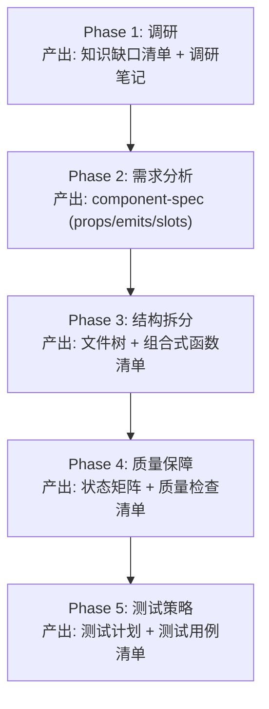
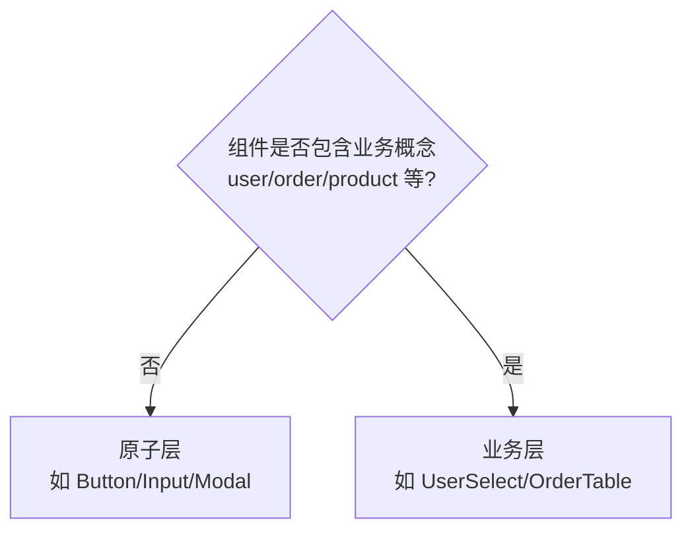
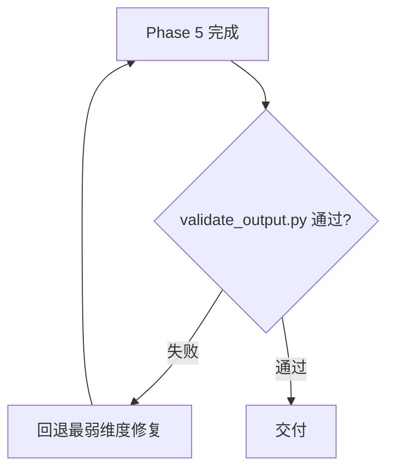

# ui-component-creator

UI 组件库组件创建工作流编排器。本文件定义**与框架无关的五阶段流程**，支持原子层（通用基础组件）和业务层（组合+业务语义组件）两层组件库。框架特定知识（Vue/React/Web Component）是领域化的，按需从 `references/frameworks/` 加载；样式架构和风格预设从 `references/style-architecture.md` 和 `references/style-presets/` 加载。

**核心原则**：工作流思想是通用的，框架知识是领域化的。先走流程，再选框架。

---

## 软硬约束分工

**约束分工**：md 写 AI 判断（软约束），scripts 写确定性校验（硬约束）。

| 约束 | 载体 | 适用 |
|------|------|------|
| 软约束 | SKILL.md + references/ | 工作流编排、API 设计原则、样式架构决策、质量检查清单 |
| 硬约束 | scripts/ | 目录结构校验、README 结构校验、四态完整性、禁令红线 |

---

## 工作流总览

**五阶段流程**：调研→需求分析→结构拆分→质量保障→测试策略。Phase 1-2 通用；Phase 3-5 进入框架特定流程时加载对应 `references/frameworks/<framework>.md`。

---

## Phase 1: 调研

**目标**：在写代码前建立足够的领域知识。加载 [references/research-protocol.md](references/research-protocol.md)。

### 两种调研模式

| 模式 | 适用场景 | 步骤 |
|------|---------|------|
| A 研究先行 | 领域不熟悉（首次做图表/编辑器/复杂表单） | 列知识缺口→WebSearch/MCP 检索→提炼约束→进 Phase 2 |
| B 分析先行 | 有基础但存疑 | 初步 API 设计→标记存疑（⚠️）→针对性检索补缺→修正设计 |

**选择规则**：不确定时选模式 A——宁可多调研，不可凭想象设计 API。

### 1.1 组件层次定位

调研阶段必须确定组件属于哪一层。加载 [references/component-layering.md](references/component-layering.md)。

**判定决策树**：

**层次影响后续阶段侧重点**：

| 层次 | Phase 2 侧重 | Phase 3 侧重 | Phase 4 侧重 |
|------|-------------|-------------|-------------|
| 原子层 | API 最小化、正交化 | 完整三层样式分离 | 完整四态 + a11y |
| 业务层 | 业务语义化 API | 原子组件组合策略 | 组合交互 a11y |

决策结果记录到 component-spec.md 的「组件层次定位」节。

---

## Phase 2: 需求分析 + API 设计

**目标**：定义组件的职责边界和对外契约。加载 [references/api-design.md](references/api-design.md)。

### 2.1 职责边界

回答三个问题：
- **这个组件是什么？**（一句话定义，不超过 20 字）
- **它做什么？**（列出核心职责，每条以动词开头）
- **它不做什么？**（明确非目标，防止职责蔓延）

### 2.2 用户故事

`作为 <角色>，我希望 <动作>，以便 <价值>`——覆盖所有受影响角色：最终用户、开发者（使用者）、设计师、运维。

### 2.3 API 契约设计

按以下顺序设计，**顺序不可调换**——先想清楚输入输出，再想内部状态：

| 维度 | 通用问题 | 框架特定（加载对应 reference） |
|------|---------|------------------------------|
| **输入** | 组件接受什么数据？数据形状？必选/可选？ | Vue: props / React: props / WC: attributes |
| **输出** | 组件向外部传递什么？何时传递？ | Vue: emits / React: callback props / WC: CustomEvent |
| **插槽** | 哪些内容需要由调用方注入？ | Vue: slots / React: render props / WC: slot |
| **双向绑定** | 哪些值需要 v-model / controlled？ | Vue: v-model / React: value+onChange / WC: 待定 |
| **状态** | 哪些状态内部管理，哪些交给外部？ | 通用：受控 vs 非受控 |

**API 设计原则**（详见 [references/api-design.md](references/api-design.md)）：最小 API 表面（能内部推导的不要做成 prop）；合理默认值（80% 场景零配置可用）；正交设计（props 之间不耦合）；向后兼容（新增可选，不破坏已有）。

### 2.4 产出 component-spec

加载 [examples/component-spec.md](examples/component-spec.md) 模板，填写后作为后续阶段的单一事实来源。

**产出路径**：`<组件目录>/docs/component-spec.md`——文档与组件代码同目录，不分离到 `specs/` 下。

---

## Phase 3: 结构拆分 + 复用识别

**目标**：确定文件结构和可复用模块。此时加载框架特定 reference。

### 加载框架知识

| 框架 | 加载文件 | 何时加载 |
|------|---------|---------|
| Vue 3 | [references/frameworks/vue.md](references/frameworks/vue.md) | 用户指定 Vue 或项目用 Vue |
| React | [references/frameworks/react.md](references/frameworks/react.md) | 用户指定 React 或项目用 React |
| Web Component | [references/frameworks/web-component.md](references/frameworks/web-component.md) | 用户指定 WC 或需要框架无关组件 |

### 3.1 复用识别

在写新代码前，先回答：
- [ ] 项目中是否已有类似组件？（搜索 `Grep` / `Glob`）
- [ ] 是否有可复用的 composable / hook / utility？
- [ ] 是否有第三方库已解决此问题？（Phase 1 调研应已覆盖）
- [ ] 能否抽取通用逻辑为独立模块，供当前和未来复用？

### 3.2 文件结构

通用原则（框架特定细节见对应 reference）：单一职责（一个文件一个组件/composable/类型）；就近放置（私有子组件放同目录）；类型先行（先定义类型，再写实现，最后写测试）；入口清晰（index 做唯一导出入口）；文档同目录（设计文档放 `<组件目录>/docs/`）。

#### 标准目录结构

- `ComponentName/`
  - `README.md` — 组件入口文档（Phase 5 产出）
  - `docs/` — 设计文档（与代码同目录）
    - `research-report.md`（Phase 1 调研笔记）
    - `component-spec.md`（Phase 2 组件设计规格）
    - `verification-report.md`（Phase 5 验收报告，可选）
  - `components/` — 私有子组件
  - `composables/` / `hooks/` — 组合式函数 / Hooks
  - `types.ts` — 类型定义
  - `__tests__/` — 测试
  - `index.vue` / `index.ts` — 入口

> 框架特定差异（如 Vue 的 `.vue`、React 的 `.tsx`、WC 的 `.ts`）见 `references/frameworks/` 对应文件。

### 3.3 组合式函数拆分

当组件逻辑超过 150 行，或包含 3 个以上不相关的关注点时，拆分：每个 composable / hook 管理一个关注点；命名以 `use` 开头，返回值结构清晰；可独立测试，不依赖组件实例。

### 3.4 样式架构决策

结构拆分后，确定三层样式划分。加载 [references/style-architecture.md](references/style-architecture.md)。

**三层模型**：

| 层 | 职责 | 示例 |
|----|------|------|
| 结构层 | 布局、尺寸、定位——与风格无关 | Modal 的居中定位、Table 的表格布局 |
| 语义层 | 语义化 token，组件代码只引用这一层 | `var(--color-primary)`、`var(--spacing-md)` |
| 风格层 | 具体 token 值，由预设文件提供 | Apple: `#007AFF`，Vercel: `#000000` |

**决策内容**：哪些样式属于结构层（不随风格变化）；哪些样式属于语义层（可被风格覆盖的 token 引用）；风格层由 `references/style-presets/` 预设文件提供，组件不实现。

**业务层额外决策**：如何继承原子层组件的语义 token；是否需要定义业务语义 token（如 `--color-user-avatar-border`，值仍引用语义层）。

**风格预设兼容性**：至少兼容 2 种预设（从 apple/vercel/github/material 中选择）。

---

## Phase 4: 完整状态 + 质量保障

**目标**：确保组件在各种状态下可用。加载 [references/state-quality.md](references/state-quality.md)。

### 4.1 四态矩阵

每个组件必须考虑四种状态——**缺一不可**：

| 状态 | 问题 | 设计要点 |
|------|------|---------|
| **Loading** | 数据加载中显示什么？ | 骨架屏 > spinner；保持布局稳定防 CLS |
| **Error** | 出错时显示什么？ | 明确错误信息 + 重试操作；不暴露技术细节 |
| **Empty** | 无数据时显示什么？ | 引导用户行动；不显示空白 |
| **Success** | 正常状态是否完整？ | 主流程 + 边界情况（极长文本、极多数据、极宽极窄） |

产出状态矩阵：列出每个状态的 UI 表现和触发条件。

### 4.2 质量检查清单

- [ ] **无障碍（a11y）**：语义化 HTML、ARIA 属性、键盘可达、焦点管理
- [ ] **i18n**：所有用户可见文本走 i18n，不硬编码中文/英文
- [ ] **样式分离验证**：三层分离 + 风格切换测试（至少 2 种预设）
- [ ] **响应式**：移动端 / 平板 / 桌面三档断点验证
- [ ] **性能**：避免不必要的 re-render / 重复计算；大列表虚拟化
- [ ] **安全**：用户输入转义；不信任外部数据

---

## Phase 5: 测试策略

**目标**：定义测试计划，确保组件可回归。

### 测试金字塔

| 层级 | 测试类型 | 数量 | 覆盖范围 |
|------|---------|------|---------|
| 顶层 | 视觉回归测试 | 少量 | 关键 UI 快照（四态 + 响应式断点） |
| 中层 | 可访问性测试 | 适量 | a11y 规则扫描（axe-core + 键盘导航） |
| 底层 | 单元测试 | 大量 | props/emits/slots/状态逻辑 |

### 5.1 单元测试

覆盖：每个 prop 的默认值和传入值；每个 emit / callback 的触发条件和 payload；每个插槽的渲染；四态的渲染；边界情况（空值、极值、非法值）。

### 5.2 可访问性测试

axe-core 自动扫描；键盘导航流程；屏幕阅读器关键路径。

### 5.3 视觉回归测试

仅对关键 UI 状态做快照：四态各一张快照；响应式断点各一张。

### 5.4 产出/更新 README

测试完成后，产出或更新组件 README.md，作为组件交付的最后一步。加载 [references/readme-convention.md](references/readme-convention.md) 了解结构规范，加载 [examples/README.template.md](examples/README.template.md) 模板填写。

**首次产出（v1.0.0）**：基于 component-spec 和实现填写 9 个 H2 节；API 参考表格覆盖全部 props/emits/slots/methods；变更记录初始化为 v1.0.0。

**迭代更新**：更新「元信息」节版本号（遵循 SemVer）；更新「API 参考」对应表格（新增项标注版本，废弃项加 `⚠️ [deprecated since vX.Y.Z]`）；在「变更记录」节顶部新增版本条目（倒序）。

---

## 文件索引

**按需加载**：references/frameworks/style-presets/examples 按阶段加载，避免一次性占用 token。

**references/ — 方法论**

| 文件 | 何时加载 |
|------|---------|
| [research-protocol.md](references/research-protocol.md) | Phase 1 必读——调研协议、知识缺口清单、两种调研模式 |
| [component-layering.md](references/component-layering.md) | Phase 1 必读——原子层/业务层模型、组合关系、判定流程 |
| [api-design.md](references/api-design.md) | Phase 2 必读——最小表面、正交设计、默认值、受控/非受控 |
| [style-architecture.md](references/style-architecture.md) | Phase 3 必读——三层样式架构、风格切换、业务层继承 |
| [state-quality.md](references/state-quality.md) | Phase 4 必读——四态矩阵、a11y/i18n/样式分离检查清单 |
| [checklist-bans.md](references/checklist-bans.md) | Phase 4-5 完成前必读——10 维度 60+ 项检查 + 14 条禁令 |
| [readme-convention.md](references/readme-convention.md) | Phase 5 必读——README 9 个 H2 节规范 + 版本迭代策略 |

**references/frameworks/ + style-presets/ + examples/**

| 文件 | 何时加载 |
|------|---------|
| [frameworks/vue.md](references/frameworks/vue.md) | 选定 Vue 时——SFC、props/emits/slots、composable、provide/inject |
| [frameworks/react.md](references/frameworks/react.md) | 选定 React 时——函数组件、hooks、props/children、context |
| [frameworks/web-component.md](references/frameworks/web-component.md) | 选定 WC 时——Custom Element、Shadow DOM、attributes/properties/events |
| [style-presets/apple.md](references/style-presets/apple.md) | 需要应用 Apple HIG 风格时（清晰/顺应/深度，系统色，毛玻璃） |
| [style-presets/vercel.md](references/style-presets/vercel.md) | 需要应用 Vercel 风格时（极简黑白，高对比度，Geist 字体） |
| [style-presets/github.md](references/style-presets/github.md) | 需要应用 GitHub 风格时（实用主义，信息密度，Mona Sans） |
| [style-presets/material.md](references/style-presets/material.md) | 需要应用 Material 风格时（材质隐喻，物理阴影，Roboto） |
| [examples/component-spec.md](examples/component-spec.md) | Phase 2 产出 spec 时——组件设计规格模板 |
| [examples/README.template.md](examples/README.template.md) | Phase 5 产出/更新 README 时——9 个 H2 节骨架 + 填写指南 |

---

## 质量闸门

**五阶段门禁**：每阶段有确定性脚本校验，失败时回退修复（loop）。完整检查项（10 维度、60+ 检查点）见 [references/checklist-bans.md](references/checklist-bans.md)。

| 阶段 | 门禁 | 失败处理 |
|------|------|---------|
| Phase 1 | 调研笔记覆盖知识缺口清单 | 补充调研 |
| Phase 2 | component-spec 含职责边界 + API 契约 | 回退 Phase 1 补调研 |
| Phase 3 | 文件结构 + 三层样式分离完整 | 回退 Phase 2 修正设计 |
| Phase 4 | 四态矩阵完整 + 质量检查清单通过 | 回退 Phase 3 补结构 |
| Phase 5 | validate_output.py 全部通过 | 回退最弱维度修复 |

---

## 禁止事项

**硬失败项**：12 条禁令及反例见 [references/checklist-bans.md](references/checklist-bans.md) 的「二、禁止事项」模块，每条附 ❌ 错误示例、✅ 正确示例和判定标准。
