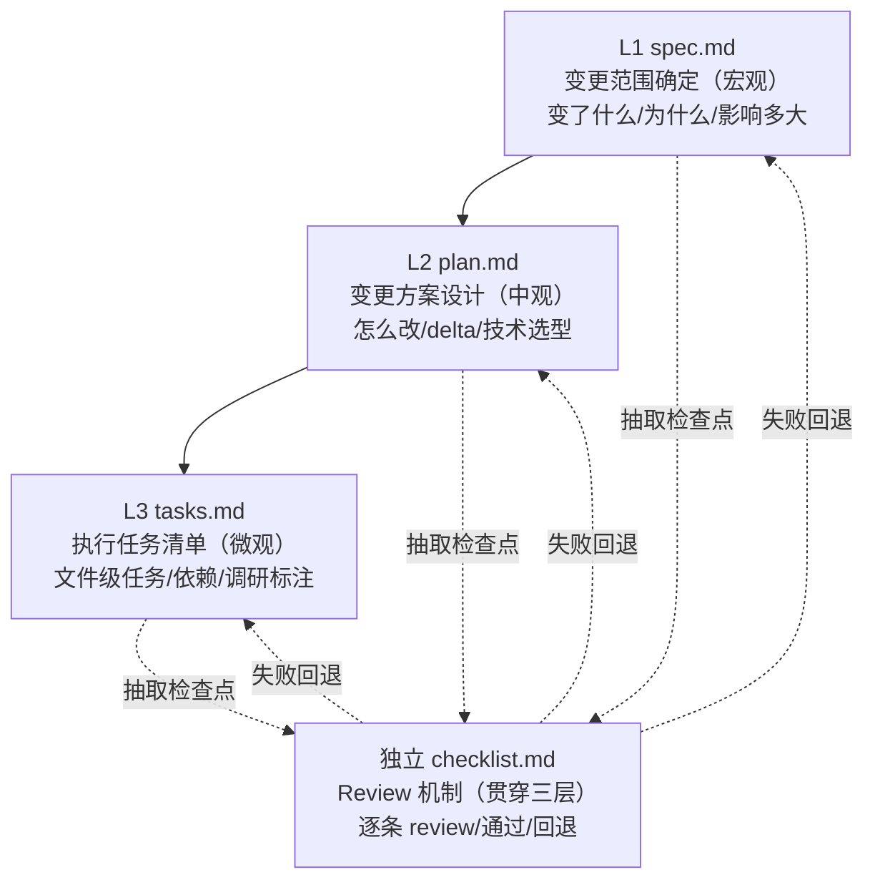
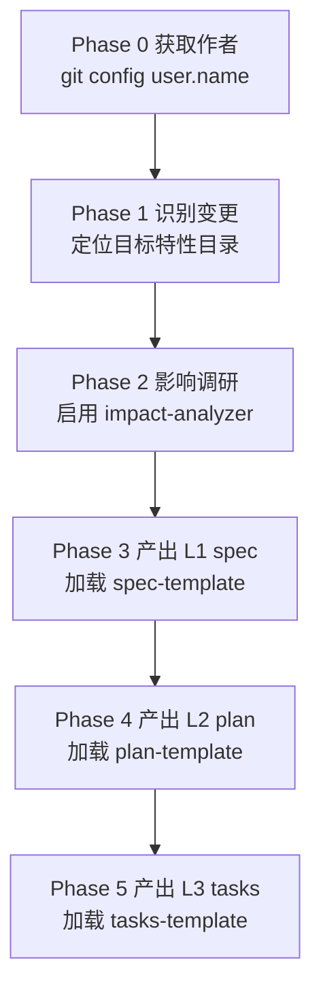
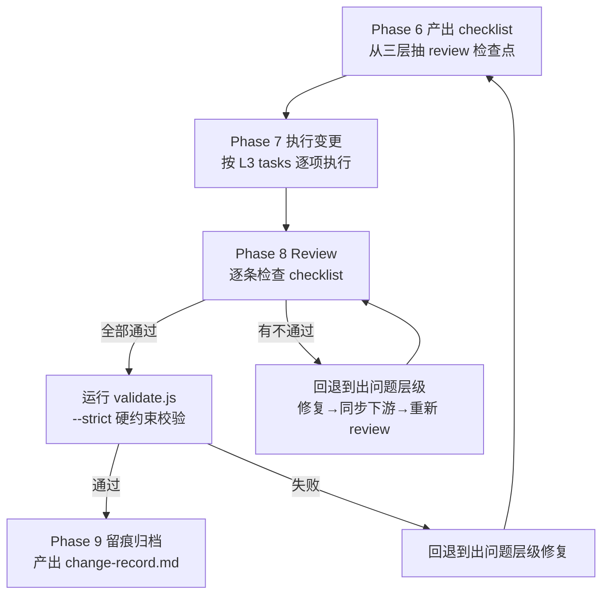

# uluo-change-flow

**编排器**：三级递进变更文档（spec/plan/tasks）+ 独立 checklist review。细节见 `references/`，模板见 `examples/`，硬约束校验见 `scripts/`。

---

## 三级递进 + 独立验收模型

**四文档模型**：spec（范围）→plan（方案）→tasks（执行）+checklist（验收）。



**关键关系链：**
- **spec → plan → tasks** 是粒度递进链：范围 → 方案 → 执行
- **checklist 独立于三层**：不重复内容，只抽检查点；失败则回退，不绕过
- **三层职责严格隔离**：spec 不写怎么改、plan 不写文件路径、tasks 不写验收检查点

---

## 三层职责边界

**职责隔离**：每层只回答一个问题，不越界。

| 级别 | 文件 | 职责 | 粒度 | 不做的事 |
|------|------|------|------|---------|
| L1 | spec.md | 范围确定 + 决策 | 模块/章节级 | 不写具体怎么改 |
| L2 | plan.md | 方案设计 + delta | 章节级 | 不写文件路径、行号 |
| L3 | tasks.md | 执行任务 | 文件/模块级 | 不写验收检查点 |
| 独立 | checklist.md | Review 机制（通过/回退） | 贯穿三层 | 不重复各层内容，只抽 review 检查点 |

---

## 软硬约束分工

**约束分工**：md 写 AI 判断，scripts 写确定性校验。

| 约束 | 载体 | 适用 |
|------|------|------|
| 软约束 | SKILL.md + references/ + examples/ | 变更流程编排、三级文档模型、场景跳过规则、质量检查清单 |
| 硬约束 | scripts/ | 目录结构校验、L1/L2/L3/checklist 格式校验、同步一致性校验 |

---

## 查询与流程控制脚本

- **query.js**：无状态一次性查询脚本，AI/agent 可通过命令行快速获取 meta/workflow/scenario/references/agents/scripts/constraints 等结构化数据
- **flow.js**：有状态流程控制脚本，AI/agent 通过 CLI 命令（init/next/complete/rollback/gates/skip）逐步推进流程，门控自动校验阶段前置条件

```bash
# 查询元信息
node scripts/query.js <chg-dir> --type meta

# 查询工作流
node scripts/query.js <chg-dir> --type workflow

# 查询场景配置
node scripts/query.js <chg-dir> --type scenario --scenario small

# 人类可读格式（加 --pretty）
node scripts/query.js <chg-dir> --type workflow --pretty
```

**执行变更流程时**：在 CHG-<NNN>/ 目录下使用 flow.js 进行渐进式流程推进。

---

## 执行协议

**十阶段流程**：Phase 0-9 递进执行，Phase 8 review 失败回退。

### Phase 0-5：产出文档



- Phase 0：禁止使用占位符或字面量 "git config user.name"
- Phase 1：目标特性不存在 → 提示用户目标特性目录不存在，需先创建
- Phase 2：扫描已有 spec/plan/tasks + 相关代码，产出影响清单（受影响章节 + 模块 + 风险）
- Phase 3-5：每层只回答本层问题，不越界；允许标注"需调研"任务（WebSearch/MCP/Context7/官网资料）

### Phase 6-9：执行 + Review + 归档



- Phase 6：checklist 独立于三层，逐条可 review
- Phase 7：修改 spec.md / plan.md / tasks.md / 代码 / 设计稿
- Phase 8：回退时修复该层级文档 + 同步更新下游 + 重新执行相关任务
- Phase 9：记录 review 通过结论 + 回退历史（如有），归档到 `changes/CHG-<NNN>/`

### 流程执行协议（flow.js）

**有状态流程控制**：执行变更流程时，在 `CHG-<NNN>/` 目录下使用 `flow.js` 进行渐进式流程推进。flow.js 通过状态文件（`.skill-state.json`）追踪进度，门控自动校验前置条件，确保流程稳固。

#### 命令协议

```bash
node scripts/flow.js <chg-dir> <command> [options]
```

| 命令 | 用途 | 关键选项 |
|------|------|---------|
| `init` | 初始化流程状态 | `--scenario <small/medium/large/urgent>` |
| `next` | 获取当前阶段指引（含门控项、参考文档、必需动作、预期产出） | — |
| `complete <phaseId>` | 完成当前阶段（自动执行门控校验） | `--note <备注>` |
| `status` | 查看流程概览（进度、已完成/已跳过阶段） | `--pretty` |
| `rollback <phaseId>` | 回退到指定阶段（继续从该阶段推进） | — |
| `gates` | 列出当前阶段的门控项 | — |
| `skip <phaseId>` | 手动跳过阶段（需说明理由） | `--reason <理由>` |

#### 执行流程

1. **初始化**：`node scripts/flow.js <chg-dir> init --scenario <级别>`，选择变更规模场景
2. **循环推进**：
   - `next` → 获取当前阶段指引
   - 执行阶段必需动作（阅读 references、创建文件、编写内容等）
   - `complete <phaseId>` → 门控自动校验，失败则修复后重试，通过则进入下一阶段
3. **错误恢复**：review 不通过需要回退时用 `rollback <phaseId>`；需要跳过阶段用 `skip <phaseId> --reason`
4. **状态查询**：随时用 `status` 查看进度

#### 门控类型

| 类型 | 校验内容 | 示例 |
|------|---------|------|
| `file-exists` | 文件必须存在 | spec.md、plan.md、tasks.md、checklist.md、change-record.md |
| `script-exit-code` | 脚本执行退出码为 0 | validate.js --strict 必须通过 |

**门控失败时**：complete 命令返回 `success: false` 和 `gateFailures` 详情，修复后重新 complete 即可，无需回退（除非需要回到之前层级重新产出文档）。

#### 与 query.js 的关系

- **query.js**：无状态、一次性查询，返回完整结构化数据，适合快速了解变更流程概况
- **flow.js**：有状态、逐步控制，每次只返回当前阶段信息，适合实际执行变更流程时使用
- 两者共用相同的 WORKFLOW/SCENARIOS 配置，flow.js 在 query 的静态数据基础上增加了状态管理和门控执行

---

## 场景跳过规则

**按规模跳过**：小/中/大/紧急四档，默认走中变更方案。

| 变更规模 | 跳过 | 文档产出 |
|---------|------|---------|
| 小变更（单字段/单样式） | Phase 2 可从简 | spec + tasks + checklist（L2 合并到 L1） |
| 中变更（单模块功能调整） | 无 | 完整 spec + plan + tasks + checklist |
| 大变更（跨模块/架构调整） | 无 | 完整四文档 + 复盘 |
| 紧急修复 | Phase 2/3 跳过 | tasks + checklist + 事后补 spec |

**默认走中变更方案。** 不确定时走完整流程——宁可多写文档，不可事后补。

---

## 文件存放约定

**目录结构**：原始文档在顶层，变更归档到 changes/CHG-<NNN>/。

- `specs/<feature-name>/`
  - `spec.md` / `plan.md` / `tasks.md` ← 原始文档（被变更修改）
  - `changes/`
    - `CHG-001/` → spec.md / plan.md / tasks.md / checklist.md / change-record.md
    - `CHG-002/` → ...
    - `CHANGELOG-changes.md` ← 变更历史索引
  - `verification-report.md`

**关键约定：**
- 原始 spec/plan/tasks 位于特性目录顶层，变更时被修改（不是只读）
- 每次变更归档到独立的 `CHG-<NNN>/` 目录，编号递增（CHG-001、CHG-002...）
- `CHANGELOG-changes.md` 汇总所有变更摘要
- `change-record.md` 在 Phase 9 执行后产出，记录 review 结论和回退历史

---

## checklist review 状态约定

**三态标记**：`[ ]`待review / `[x]`通过 / `[-]`不通过（标注回退）。

回退标注格式：

| 字段 | 示例 |
|------|------|
| 检查点 | `[-] 检查点描述` |
| 回退层级 | L2 plan |
| 原因 | delta 规格遗漏了 REMOVED 项 |
| 处理 | 修复 plan.md → 同步 tasks.md → 重新 review |

---

## 文档产出后校验

**硬约束校验**：validate.js 七步管线。

```bash
node scripts/validate.js specs/<feature>/changes/CHG-<NNN>/ --strict
```

| 步骤 | 校验内容 |
|------|---------|
| 1 目录结构 | changes/CHG-<NNN>/ 目录结构合规 |
| 2 L1 spec | 变更背景 / 影响范围 / 决策结论 |
| 3 L2 plan | delta 格式 / 字段完整性 |
| 4 L3 tasks | 任务字段 / 动词开头 / 调研标注 |
| 5 checklist | 三分组 / 检查点格式 / 结论一致性 |
| 6 同步一致性 | spec→plan→tasks→checklist 对齐 + 代码对齐 |
| 7 change-record | 归档文档完整性（如存在） |

---

## references 引用时机

**按需加载 + flow.js 命令驱动**：

| Phase | 读取 / 执行 |
|-------|------------|
| Phase 0 | `flow.js init --scenario <级别>`（初始化流程状态）；`query.js --type scenario`（查询场景配置） |
| Phase 1 | `flow.js next`（获取阶段指引）；完成后 `flow.js complete 1` |
| Phase 2 | `flow.js next`；impact-analysis-protocol.md；agents/impact-analyzer.md（中变更以上）；完成后 `flow.js complete 2` |
| Phase 3 | `flow.js next`；spec-template.md；完成后 `flow.js complete 3`（校验 spec.md 门控） |
| Phase 4 | `flow.js next`；plan-template.md；完成后 `flow.js complete 4`（校验 plan.md 门控） |
| Phase 5 | `flow.js next`；tasks-template.md；完成后 `flow.js complete 5`（校验 tasks.md 门控） |
| Phase 6 | `flow.js next`；checklist-template.md；完成后 `flow.js complete 6`（校验 checklist.md 门控） |
| Phase 7 | `flow.js next`；sync-protocol.md；完成后 `flow.js complete 7` |
| Phase 8 | `flow.js complete 8`（自动执行 validate.js --strict 门控） |
| Phase 9 | `flow.js next`；change-record-template.md；完成后 `flow.js complete 9`（校验 change-record.md 门控） |

---

## 子代理调度

**并行调研**：中变更以上启用 impact-analyzer 子代理。

| 子代理 | 指令文件 | 触发阶段 | 用途 |
|--------|---------|---------|------|
| **impact-analyzer** | [agents/impact-analyzer.md](agents/impact-analyzer.md) | Phase 2 | 影响调研——扫描已有 spec/plan/tasks + 相关代码，产出受影响章节、模块、风险清单 |

**调度规则：**
- **impact-analyzer**：中变更及以上必启，大变更建议拆分模块分派多个并行
- 小变更和紧急修复可跳过子代理，直接在主循环中完成影响调研

---

## 质量闸门

**自检清单**：文档产出后逐条核对，失败项回退对应层级修复。

| 分组 | 检查点 |
|------|--------|
| 通用 | 四文档齐全（紧急修复除外）/ 编号连续 / 职责边界清晰 / 原始文档已同步修改 / change-record 记录 review 结论 |
| spec | 变更背景说明 why / 影响范围全覆盖 / 决策结论明确 |
| plan | delta 区分 MODIFIED/ADDED/REMOVED / 技术选型有对比 |
| tasks | 任务有文件路径+动词 / 调研任务标注方式 / 依赖关系明确 |
| checklist | 检查点覆盖三层 / 可独立 review / 回退标注完整 |
| change-record | 元数据完整 / 数字一致 / Review 结论一致 / Diff 引用完整 |

---

## 禁止事项

**七条禁令**：跳过checklist/不通过却推进/只归档不更新/职责越界/重复内容/编号跳号/事后补record。

- **禁止跳过 checklist 直接执行**——checklist 是变更质量的最后一道闸门
- **禁止 checklist 不通过却继续推进**——必须回退到对应层级修复
- **禁止只归档不更新原始文档**——原始 spec/plan/tasks 必须同步修改
- **禁止三层职责越界**——spec 不写怎么改、plan 不写文件路径、tasks 不写验收点
- **禁止 checklist 重复三层内容**——checklist 只抽 review 检查点，不复制文档正文
- **禁止变更编号跳号**——CHG-001 → CHG-002 连续递增
- **禁止事后补 change-record**——Phase 9 留痕归档在 review 通过后立即执行
