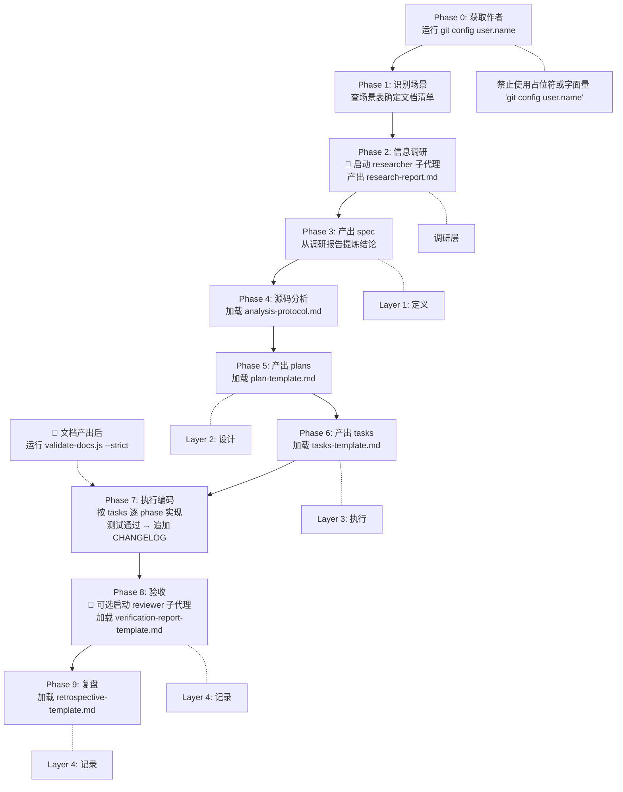

# uluo-doc-standards

AI 辅助编程的文档产出规范。本文件是**编排器**——定义七种文档的概念模型、产出时机、执行流程、子代理调度和加载策略。方法论见 `references/`，模板见 `examples/`，子代理指令见 `agents/`，硬约束校验见 `scripts/`。

---

## 文档概念模型

七种文档构成五层结构，每层职责明确：

| 层级 | 文档 | 职责 | 产出物 |
|------|------|------|--------|
| 调研层 | research-report | 信息采集与综合 | 多渠道信息综合、多方案对比、记录探索过程和死胡同 |
| Layer 1: 定义层 | spec.md | What & Why | 背景与动机 → 用户故事 → 目标/非目标 → 功能需求 → 非功能性需求 → 验收标准 → 调研依据 |
| Layer 2: 设计层 | plans/ | How | 架构概览 → 关键设计决策 → 代码库分析 → 模块设计 → 数据模型 → API 契约 → 测试策略 → 回滚方案 |
| Layer 3: 执行层 | tasks/ | Steps | 按 phase 拆分，每任务标注产出路径、参考代码、复用模块 |
| Layer 4: 记录层 | CHANGELOG / verification / retrospective | Record & Learn | CHANGELOG 面向下游开发者；验收报告对照 spec 逐条验证；复盘做 What Went Well / Better / Lessons / Action Items |

**关键关系链：**
- **research-report → spec** 是提炼链：调研报告记录探索过程（多方案、死胡同），spec 只保留结论
- **spec + plan = 需求设计文档**：合起来是传统 Design Doc，分开因为评审受众不同
- **spec → verification** 是 1:1 验证链：验收报告逐条对照 spec 的验收标准
- **plan → tasks** 是拆解链：plan 的模块设计决定 tasks 的 phase 划分
- **CHANGELOG 对外，verification 对内，retrospective 闭环**

---

## 执行协议

AI 接到实现任务后，按五层递进执行。中功能及以上建议在 Phase 2 和 Phase 8 启用子代理（见 [子代理调度](#子代理调度)）：

**各场景的阶段跳过规则：**
- **Bug 修复**：跳过 Phase 4/5/6（不写 plan），tasks 简化为 2 phase；调研从简（不产 research-report）
- **小功能**：调研从简（research-report 可选），Phase 4/5/6 简化执行（源码分析可从简，plan 单文件，tasks 2-3 phase）
- **技术方案评审**：跳过 Phase 6/7/8/9（不执行编码）；产 research-report + spec + plans/(README)
- **事后复盘**：仅执行 Phase 8/9（已有代码和 CHANGELOG）

---

## 场景选择表

| 场景 | 涉及层 | 文档产出 | 子代理 | 变体 |
|------|--------|---------|--------|------|
| **Bug 修复** | L1+L4 | spec + tasks(2 phase) + CHANGELOG | 无 | 简化 |
| **小功能新增** | 调研+L1+L2+L3+L4 | research-report(可选) + spec + plan(单文件) + tasks(2-3 phase) + CHANGELOG | researcher(可选) | 简化 |
| **中功能新增** | 调研+L1+L2+L3+L4 | research-report + spec + plans/(README+子plan) + tasks(3-4 phase) + CHANGELOG + 验收 | researcher + reviewer(验收) | 标准 |
| **大功能/重构** | 全五层 | 中功能全部 + 复盘 | researcher + reviewer(验收+复盘) | 标准 |
| **技术方案评审** | 调研+L1+L2 | research-report + spec + plans/(README) | researcher | 简化 |
| **事后复盘** | L4 | CHANGELOG + 验收 + 复盘（如缺失则补） | reviewer(可选) | N/A |

---

## 简化 vs 标准 决策规则

**标准方案是默认，简化方案是例外。** 不确定时走标准——宁可多写文档，不可事后补。

简化方案触发条件（满足任一即可）：

| 条件 | 阈值 |
|------|------|
| 预估开发时间 | ≤ 2 天 |
| 影响模块数 | ≤ 2 个 |
| 跨端范围 | 纯后端或纯前端（不跨栈） |
| plan 复杂度 | 不涉及多 slice（无多子系统协作） |

满足标准方案的条件（满足任一即触发）：预估 >2 天、影响模块 ≥3、跨前后端/跨服务、涉及 DB schema 变更、涉及外部 API 对接。

详细目录结构（标准/简化两种树）见 [references/file-conventions.md](references/file-conventions.md)。

---

## 文件存放约定

顶层规则。完整细节见 [references/file-conventions.md](references/file-conventions.md)。

- **research-report** → `specs/<feature>/research-report.md`（调研层产出，spec 的前置输入）
- **spec** → `specs/<feature>/spec.md`（永远单文件）
- **plans** → `specs/<feature>/plans/README.md`（总入口必在）+ 子 plan（按需）
- **tasks** → `specs/<feature>/tasks/phase*.md`（必须按 phase 拆分，≥2 个文件）
- **验收报告** → `specs/<feature>/verification-report.md`
- **复盘** → `specs/<feature>/retrospective.md`
- **CHANGELOG** → 项目根 `./CHANGELOG.md`（全局唯一，追加写入）

`specs/` 独立于 `docs/`；CHANGELOG 位于项目根。

---

## 文件索引

### references/ — 方法论与约定

| 文件 | 内容 | 何时加载 |
|------|------|---------|
| [research-protocol.md](references/research-protocol.md) | 信息调研协议：知识缺口清单、信息源矩阵、调研深度 L1-L3、spec 前复盘 | 启动调研前必读 |
| [analysis-protocol.md](references/analysis-protocol.md) | 源码分析协议：四层分析、锚点模块法、调用链追踪、复用识别 | plan 产出前必读 |
| [file-conventions.md](references/file-conventions.md) | 详细目录结构（标准/简化两棵树）、粒度规则、简化 vs 标准决策矩阵 | 首次建目录时参考 |

### examples/ — 模板与填写指南

| 文件 | 内容 | 何时加载 |
|------|------|---------|
| [research-report-template.md](examples/research-report-template.md) | 调研报告模板 + 填写指南 | Phase 2 产出调研报告时加载 |
| [spec-template.md](examples/spec-template.md) | spec.md 模板 + 填写指南 | Phase 3 产出 spec 时加载 |
| [plan-template.md](examples/plan-template.md) | plans/README.md 模板 + 填写指南 | Phase 5 产出 plan 时加载 |
| [tasks-template.md](examples/tasks-template.md) | tasks/ 模板（phase 拆分）+ 填写指南 | Phase 6 产出 tasks 时加载 |
| [changelog-template.md](examples/changelog-template.md) | CHANGELOG 模板（Keep a Changelog） | Phase 7 追加 CHANGELOG 时加载 |
| [verification-report-template.md](examples/verification-report-template.md) | 验收报告模板 + 填写指南 | Phase 8 验收时加载 |
| [retrospective-template.md](examples/retrospective-template.md) | 总结复盘模板 + 填写指南 | Phase 9 复盘时加载 |

### scripts/ — 硬约束校验

| 文件 | 内容 | 何时运行 |
|------|------|---------|
| [validate-docs.js](scripts/validate-docs.js) | 文档规范校验（5 步管线：结构→章节→格式→链接→CHANGELOG） | 文档产出后运行 |
| [lib/utils.js](scripts/lib/utils.js) | 校验工具函数 | validate-docs.js 依赖 |

---

## 子代理调度

中功能及以上场景，建议在关键阶段启动子代理执行专项任务。子代理独立运行，有自己的上下文窗口和工具权限：

| 子代理 | 指令文件 | 触发阶段 | 用途 |
|--------|---------|---------|------|
| **researcher** | [agents/researcher.md](agents/researcher.md) | Phase 2 | 多源信息调研——接收知识缺口清单，跨 Context7/GitHub/WebSearch/SO 并行搜索，综合为调研报告 |
| **reviewer** | [agents/reviewer.md](agents/reviewer.md) | Phase 8（及任意文档产出后） | 文档质量审查——对抗性审查 spec/plan/tasks/report，检查信息源支撑、逻辑自洽、结构完整 |

**调度规则：**
- **researcher**：中功能及以上必启，大功能建议拆分知识缺口分派多个 researcher 并行
- **reviewer**：文档产出后可选启动做对抗性审查。中功能验收阶段至少启动一次审查 verification-report
- 简化场景（Bug 修复、小功能）可跳过子代理，直接在主循环中完成

---

## 质量闸门

任何文档产出后必须自检：

- [ ] 文件命名和路径符合约定？
- [ ] 每个章节回答了一个明确的问题？
- [ ] 关键决策附带原因（why），而不只是结果（what）？
- [ ] 纯 Markdown，无特殊语法；代码块标注了语言？
- [ ] 流程图用 Mermaid，目录树用 plain text？
- [ ] 链接使用相对路径；关联文档之间有链接？
- [ ] 读一遍：能独立理解吗？
- [ ] 不适用章节标注 "N/A"，不编造内容？

### spec 专项
- [ ] 核心结论有信息源支撑？参考资料列出了调研来源？
- [ ] 用户故事覆盖了所有受影响角色（不只"用户"——运维/合规/客服常被遗漏）？
- [ ] 验收标准可验证（不是"用户体验好"这种）？

### plan 专项
- [ ] 每个设计决策有源码依据或业界基准？
- [ ] 涉及多 slice 时拆分了子 plan？

### tasks 专项
- [ ] 按 phase 拆分为多个文件（禁止单文件巨型清单）？
- [ ] 每个任务有明确的产出路径、参考代码、复用模块？

---

## 禁止事项

- **禁止凭想象写 spec**——任何影响核心判断的结论必须有信息源支撑
- **禁止不读源码写 plan**——不分析项目现有架构就出方案，会导致方案无法落地
- **禁止把所有 plan 塞一个文件**——多 slice 必须拆分子 plan，README.md 做索引
- **禁止把所有 tasks 放一个文件**——必须按 phase 拆分（简化方案也至少 2 phase 分节）
- **禁止事后补文档**——文档和代码同步产出，不事后回忆
- **禁止堆砌无意义内容**——不适用章节标注 "N/A"，不编造
