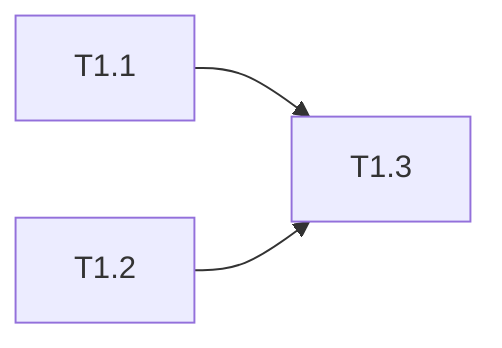

# tasks/ 模板（phase 拆分）

任务分解——将 plan 拆解为多个 phase，每个 phase 一个独立文件。tasks 最小粒度是 phase，禁止把全部任务塞进一个文件。

---

## tasks/ 目录结构

```
tasks/
├── phase1-infrastructure.md    ← 基础设施/数据层
├── phase2-core-logic.md         ← 核心业务逻辑
├── phase3-api-integration.md    ← 接口/集成层
└── phase4-testing-docs.md       ← 测试/文档/收尾
```

每个 phase 文件包含该阶段的任务清单 + 阶段内依赖。全局依赖图和总览放在独立的 `tasks/README.md` 中。

### tasks/README.md 模板（全局总览，可选）

```markdown
# [特性名称] 任务总览

> 日期: YYYY-MM-DD | 作者: [运行 git config user.name 获取] | 关联: [../plans/README.md](../plans/README.md)

## 全局统计

| 指标 | 值 |
|------|-----|
| 总任务数 | [N] |
| 总 phase 数 | [M] |
| 预估总工时 | [Xh] |
| 关键路径 | phase1 → phase2 → phase3 → phase4 |

## Phase 清单

| Phase | 文件 | 任务数 | 预估 |
|-------|------|--------|------|
| Phase 1: 基础设施 | [phase1-infrastructure.md](./phase1-infrastructure.md) | [N] | [Xh] |
| Phase 2: 核心逻辑 | [phase2-core-logic.md](./phase2-core-logic.md) | [N] | [Xh] |
| Phase 3: 接口集成 | [phase3-api-integration.md](./phase3-api-integration.md) | [N] | [Xh] |
| Phase 4: 测试收尾 | [phase4-testing-docs.md](./phase4-testing-docs.md) | [N] | [Xh] |

## 跨阶段依赖图


| 目标 Phase | 依赖 Phase | 说明 |
|-----------|-----------|------|
| phase2 | phase1 | 需要数据表创建完成 |
| phase3 | phase2 | 需要核心服务可用 |
| phase4 | phase2, phase3 | 所有功能完成后收尾 |

## 全局风险任务

| Phase | 任务 | 风险 | 应对 |
|-------|------|------|------|
| [phase] | [T编号] | [风险描述] | [预案] |
```

---

## 单个 phase 文件模板

```markdown
# [特性名称] Phase [N]: [阶段名称] 任务清单

> 日期: YYYY-MM-DD | 作者: [运行 git config user.name 获取] | 关联: [../plans/README.md](../plans/README.md) | 上一阶段: [phase<N-1>.md](./phase<N-1>.md)

## 本阶段任务

- [ ] **T1.1**: [任务标题]
  - **描述**: [详细说明要做什么]
  - **产出物**: `[完整包路径/文件名]`（新增/修改）
  - **参考**: 遵循 `[已有模块路径]` 的实现风格
  - **复用**: 调用 `[已有类.方法]`（已有）
  - **验收**: [如何判断完成]
  - **预估**: [Xh]
  - **依赖**: 无 / T[编号]

- [ ] **T1.2**: [任务标题]
  ...

## 本阶段预估

| 指标 | 值 |
|------|-----|
| 任务数 | [N] |
| 预估总工时 | [Xh] |
| 可并行任务 | [T1.x, T1.y] |

## 本阶段内依赖



---

## 填写指南

### 任务粒度
- 一个任务应该在 0.5h ~ 4h 内完成。超过 4h 的拆分不够细，低于 0.5h 的太碎
- 任务标题用动词短语开头："创建..."、"实现..."、"重构..."、"编写测试..."

### 每个任务的"参考"和"复用"字段
这两个字段是 tasks 与传统任务清单的关键区别——它们把 plan 的源码分析落到具体执行中：

- **产出物**：必须写完整包路径，不是"新建 Service"而是"新建 `coupon/domain/CouponValidator.java`"
- **参考**：标注新代码应该模仿哪个已有模块的风格——不是泛泛的"参考项目规范"，而是"参考 `order/domain/OrderValidator.java`"
- **复用**：如果某个能力已有（查过源码确认了的），直接标注调用方式——"直接调用 `UserService.findById()`"而非"自己再封装一个查询"

### Phase 划分（决定拆几个文件）
推荐四 phase 拆分：
1. **phase1-infrastructure.md**: 新增表、配置、工具函数等"没有业务逻辑"的东西先做
2. **phase2-core-logic.md**: domain service、业务规则等——最重要的阶段
3. **phase3-api-integration.md**: API、controller、与外部服务对接
4. **phase4-testing-docs.md**: 补测试、CHANGELOG、验收报告、复盘

小功能可以合并为 2-3 个 phase（如 phase1 基础设施、phase2 核心+接口、phase3 测试收尾），但禁止全部合并为一个文件。

### tasks/README.md 何时需要
- 4 个 phase 文件时建议写 README.md 放全局依赖图和风险清单
- 2-3 个 phase 时全局信息可以放在 phase1 文件开头，省略 README
- 只有 1 个 phase（bug 修复）不需要 README

### 依赖关系
- 阶段内依赖放在每个 phase 文件中，跨阶段依赖放在 tasks/README.md 全局依赖图
- 宁可多标注依赖不能遗漏——漏了会导致执行顺序错误
- 使用 Mermaid flowchart 展示依赖关系，一目了然

### 并行建议
- 每个 phase 文件中标注本阶段内可并行的任务
- 跨 phase 的并行度在 tasks/README.md 中标注——哪些 phase 可以同时执行

### 风险任务
- 识别不确定性高的任务
- 给出应对预案，减少 AI 执行时卡住的可能性
