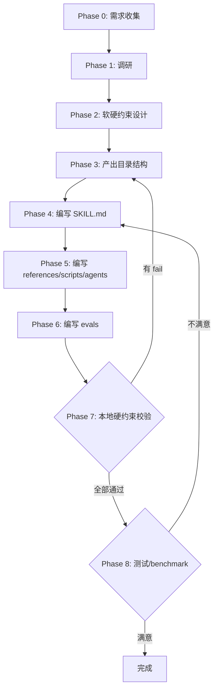
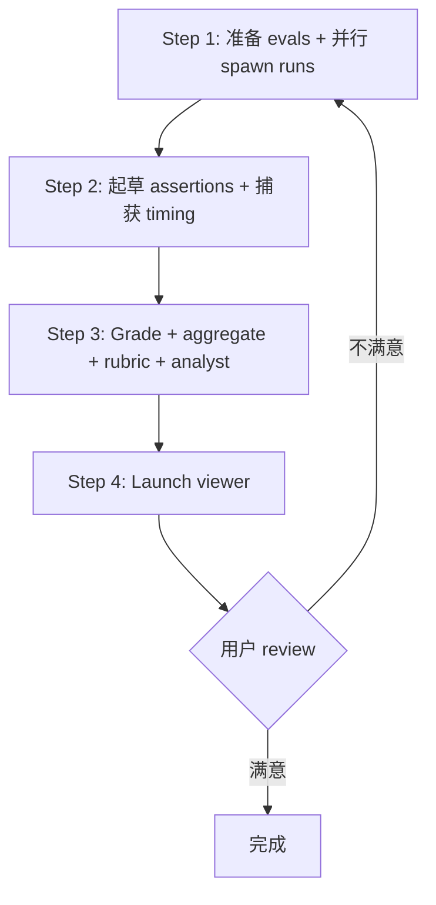

# uluo-skill-creator

**编排器**：只写流程、决策、引用，细节见 `references/`。

---

## 职能边界

**核心职能**：规范化创建 + 流程编排 + 质量评分。执行类工具引用 skill-creator。

| 做（核心职能） | 不做（引用 skill-creator） |
|--------------|-------------------------|
| 规范化创建流程（Phase 0-8） | eval 运行器（引用 run_eval.py） |
| 软硬约束分工设计 | benchmark 聚合器（引用 aggregate_benchmark.py） |
| 本地硬约束校验（validate-skill.js） | viewer（引用 generate_review.py） |
| 测试/benchmark 流程编排（Phase 8） | description optimization（引用 run_loop.py） |
| 质量评分标准（rubric） | package 工具（引用 package_skill.py） |

---

## 软约束 + 硬约束分工

**分工原则**：md 写 AI 判断（决策逻辑、流程编排），scripts 写确定性校验（结构、格式、固定流程）。

| 约束 | 载体 | 适用 |
|------|------|------|
| 软约束 | md | AI 行为指导、决策逻辑、流程编排 |
| 硬约束 | scripts/ | 结构校验、格式校验、固定流程自动化 |

详见 [references/hard-soft-constraint.md](references/hard-soft-constraint.md)。

---

## 九阶段创建流程

**Phase 0-8 递进**，含校验回退 loop。简单 skill 可跳过部分 Phase。



### 场景跳过规则

| 复杂度 | 跳过 | 产出 |
|-------|------|------|
| 简单 | Phase 2、5 | SKILL.md + evals |
| 中等 | 无 | 完整目录 + 本地校验 |
| 复杂 | 无 | 完整目录 + 本地校验 + benchmark |
| 紧急 | Phase 1、8 | SKILL.md + 目录 + 本地校验 |

**默认走中等方案。**

### Phase 1 调研

Phase 1 调研：使用 [agents/researcher.md](agents/researcher.md) 进行综合调研（现有 skill、技术方案、最佳实践）。

---

## 质量闸门

**Phase 7**：本地校验必须通过。
**Phase 8**：benchmark 需用户 review。

### Phase 7 本地硬约束校验

```bash
node scripts/validate-skill.js <skill-path>
```

- 有 fail → 回退 Phase 3-6 修复 → 重新校验（loop）
- 全部通过 → 进入 Phase 8

### Phase 8 测试/benchmark 流程

**使用 skill-creator 的脚本**，额外评估 skill 规范质量（rubric）。



详见 [references/benchmark-workflow.md](references/benchmark-workflow.md)。

---

## agents 目录决策

**按需评估**：按 [references/agents-decision.md](references/agents-decision.md) 的决策规则区分三类场景——运行时 agent（能力提效，自建）、benchmark agent（测试用，引用 skill-creator）、无需求（不创建）。

**当前运行时 agent**：
- [agents/researcher.md](agents/researcher.md)——Phase 1 调研 agent（综合调研现有 skill、技术方案、最佳实践）
- [agents/grader.md](agents/grader.md)——Phase 8 评分 agent（skill 规范质量评分）

**自建运行时 agent 时**：按 [references/agent-creation-guide.md](references/agent-creation-guide.md) 的写作规范编写 agent md 文件，模板见 [examples/agent-template.md](examples/agent-template.md)。

---

## references 引用时机

**按需加载**：

| Phase | 读取 |
|-------|------|
| Phase 1 | agents/researcher.md（调研 agent） |
| Phase 2 | hard-soft-constraint.md |
| Phase 3 | skill-anatomy.md |
| Phase 4 | skillmd-spec.md |
| Phase 5 | agents-decision.md + agent-creation-guide.md |
| Phase 8 | benchmark-workflow.md + skill-quality-rubric.md |

**规范适用范围**：references/ 中的设计规范适用于**用户使用本 skill 创建的所有 skill**。Phase 7 校验时检查产出 skill 是否符合写作规范（指令式、边界约束保留、加粗规则）。

---

## 禁止事项

- **禁止用 md 写能用脚本确定的校验**——目录结构、frontmatter、脚本可执行性必须用 scripts/ 硬约束
- **禁止 SKILL.md 包含细节**——具体校验逻辑、长代码示例抽离到 references/
- **禁止 plain text art**——流程图、决策树用 mermaid
- **禁止跳过 Phase 7 本地校验**——这是质量底线
- **禁止 SKILL.md 超过 800 行**——300 行正常，300-500 警告，500-799 强警告，≥ 800 必须拆分
- **禁止 description 缺少"Use when"触发条件**
- **禁止 frontmatter 缺少 version 字段**——语义化版本号（如 `0.1.0`）
- **禁止纯设计理由解释**——只写指令/最佳实践/禁止事项，边界约束条件依据可保留
- **禁止修改本地 skill-creator**——两者并存
