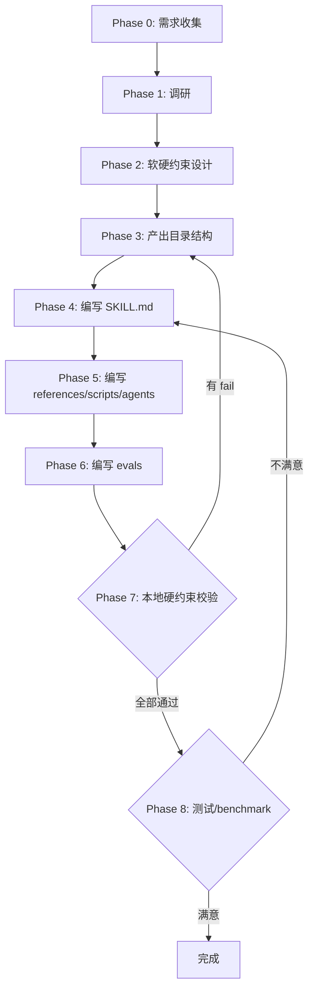
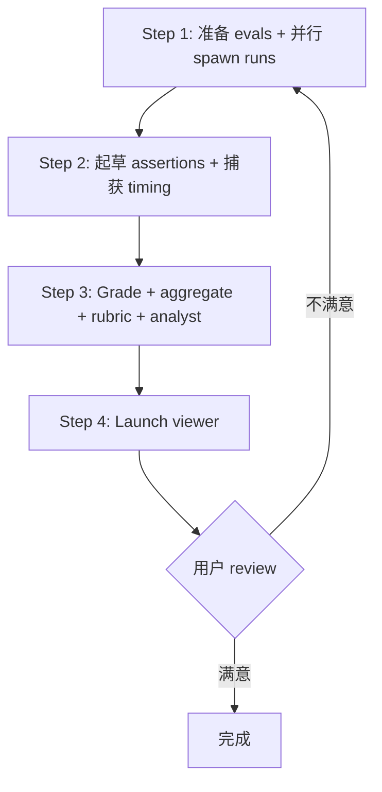

# uluo-skill-creator

**编排器**：只写流程、决策、引用，细节见 `references/`。

---

## 职能边界

**核心职能**：规范化创建 + 流程编排 + 质量评分。执行类工具引用 skill-creator。

| 做（核心职能） | 不做（引用 skill-creator） |
|--------------|-------------------------|
| 规范化创建流程（Phase 0-8） | eval 运行器（引用 run_eval.py） |
| 软硬约束分工设计 | benchmark 聚合器（引用 aggregate_benchmark.py） |
| 本地硬约束校验（validate.js） | viewer（引用 generate_review.py） |
| 测试/benchmark 流程编排（Phase 8） | description optimization（引用 run_loop.py） |
| 质量评分标准（rubric） | package 工具（引用 package_skill.py） |

---

## 软约束 + 硬约束分工

**分工原则**：md 写 AI 判断（决策逻辑、流程编排），scripts 写确定性校验（结构、格式、固定流程）。

| 约束 | 载体 | 适用 |
|------|------|------|
| 软约束 | md | AI 行为指导、决策逻辑、流程编排 |
| 硬约束 | scripts/ | 结构校验、格式校验、固定流程自动化 |

详见 [references/hard-soft-constraint.md](references/hard-soft-constraint.md)。

---

## 流程查询

**梯度判断优先调用查询脚本**：做场景/复杂度判断、了解 Phase 配置、查询子代理调度时，优先调用 `query.js` 获取结构化数据，而非通读 SKILL.md 全文。

```bash
# 查询元信息
node scripts/query.js <skill-path> --type meta

# 查询工作流（Phase 配置）
node scripts/query.js <skill-path> --type workflow

# 按场景查询流程配置（跳过的 Phase、需要的文档、启用的子代理）
node scripts/query.js <skill-path> --type scenario --scenario simple
node scripts/query.js <skill-path> --type scenario --scenario medium
node scripts/query.js <skill-path> --type scenario --scenario complex
node scripts/query.js <skill-path> --type scenario --scenario urgent

# 按复杂度查询
node scripts/query.js <skill-path> --type complexity --level simple

# 查询 references/agents/scripts 清单
node scripts/query.js <skill-path> --type references
node scripts/query.js <skill-path> --type agents
node scripts/query.js <skill-path> --type scripts

# 查询约束分级
node scripts/query.js <skill-path> --type constraints

# 人类可读格式（加 --pretty）
node scripts/query.js <skill-path> --type workflow --pretty
```

**创建新 skill 时**：Phase 3 产出目录结构后，从 `examples/skill-template/scripts/` 复制 `query.js` 和 `flow.js` 模板，填充本 skill 的流程数据。

- **query.js**：无状态一次性查询脚本，AI/agent 可通过命令行快速获取 meta/workflow/scenario/references/agents/scripts/constraints 等结构化数据
- **flow.js**：有状态流程控制脚本，AI/agent 通过 CLI 命令（init/next/complete/rollback/gates/skip）逐步推进流程，门控自动校验阶段前置条件

---

## 九阶段创建流程

**Phase 0-8 递进**，含校验回退 loop。简单 skill 可跳过部分 Phase。



### 场景跳过规则

| 复杂度 | 跳过 | 产出 |
|-------|------|------|
| 简单 | Phase 2、5 | SKILL.md + evals |
| 中等 | 无 | 完整目录 + 本地校验 |
| 复杂 | 无 | 完整目录 + 本地校验 + benchmark |
| 紧急 | Phase 1、8 | SKILL.md + 目录 + 本地校验 |

**默认走中等方案。**

### Phase 1 调研

Phase 1 调研：使用 [agents/researcher.md](agents/researcher.md) 进行综合调研（现有 skill、技术方案、最佳实践）。

---

## 质量闸门

**Phase 7**：本地校验必须通过。
**Phase 8**：benchmark 需用户 review。

### Phase 7 本地硬约束校验

```bash
node scripts/validate.js <skill-path>
```

- 有 fail → 回退 Phase 3-6 修复 → 重新校验（loop）
- 全部通过 → 进入 Phase 8

### Phase 8 测试/benchmark 流程

**使用 skill-creator 的脚本**，额外评估 skill 规范质量（rubric）。



详见 [references/benchmark-workflow.md](references/benchmark-workflow.md)。

---

## 流程执行协议（flow.js）

**有状态流程控制**：创建新 skill 时，使用 `flow.js` 进行渐进式流程推进，替代纯自然语言流程描述。flow.js 通过状态文件（`.skill-state.json`）追踪进度，门控自动校验前置条件，确保流程稳固。

### 命令协议

```bash
node scripts/flow.js <skill-path> <command> [options]
```

| 命令 | 用途 | 关键选项 |
|------|------|---------|
| `init` | 初始化流程状态 | `--scenario <simple/medium/complex/urgent>` |
| `next` | 获取当前阶段指引（含门控项、参考文档、必需动作、预期产出） | — |
| `complete <phaseId>` | 完成当前阶段（自动执行门控校验） | `--note <备注>` |
| `status` | 查看流程概览（进度、已完成/已跳过阶段） | `--pretty` |
| `rollback <phaseId>` | 回退到指定阶段（继续从该阶段推进） | — |
| `gates` | 列出当前阶段的门控项 | — |
| `skip <phaseId>` | 手动跳过阶段（需说明理由） | `--reason <理由>` |

### 执行流程

1. **初始化**：`node scripts/flow.js <skill-path> init --scenario <级别>`，选择复杂度场景
2. **循环推进**：
   - `next` → 获取当前阶段指引
   - 执行阶段必需动作（阅读 references、创建文件、编写内容等）
   - `complete <phaseId>` → 门控自动校验，失败则修复后重试，通过则进入下一阶段
3. **错误恢复**：需要回退时用 `rollback <phaseId>`；需要跳过阶段用 `skip <phaseId> --reason`
4. **状态查询**：随时用 `status` 查看进度

### 门控类型

| 类型 | 校验内容 | 示例 |
|------|---------|------|
| `file-exists` | 文件必须存在 | SKILL.md、plugin.json |
| `dir-exists` | 目录必须存在 | references/、scripts/ |
| `script-exit-code` | 脚本执行退出码为 0 | validate.js 必须通过 |

**门控失败时**：complete 命令返回 `success: false` 和 `gateFailures` 详情，修复后重新 complete 即可，无需回退。

### 与 query.js 的关系

- **query.js**：无状态、一次性查询，返回完整结构化数据，适合快速了解 skill 概况
- **flow.js**：有状态、逐步控制，每次只返回当前阶段信息，适合实际执行流程时使用
- 两者共用相同的 WORKFLOW/SCENARIOS 配置，flow.js 在 query 的静态数据基础上增加了状态管理和门控执行

---

## agents 目录决策

**按需评估**：按 [references/agents-decision.md](references/agents-decision.md) 的决策规则区分三类场景——运行时 agent（能力提效，自建）、benchmark agent（测试用，引用 skill-creator）、无需求（不创建）。

**当前运行时 agent**：
- [agents/researcher.md](agents/researcher.md)——Phase 1 调研 agent（综合调研现有 skill、技术方案、最佳实践）
- [agents/grader.md](agents/grader.md)——Phase 8 评分 agent（skill 规范质量评分）

**自建运行时 agent 时**：按 [references/agent-creation-guide.md](references/agent-creation-guide.md) 的写作规范编写 agent md 文件，模板见 [examples/agent-template.md](examples/agent-template.md)。

---

## references 引用时机

**按需加载**：

| Phase | 读取 / 执行 |
|-------|------|
| Phase 0 | `flow.js init --scenario <级别>`（初始化流程状态）；`query.js --type scenario`（查询场景配置） |
| Phase 1 | `flow.js next`（获取阶段指引）；agents/researcher.md（调研 agent） |
| Phase 2 | `flow.js next`；hard-soft-constraint.md |
| Phase 3 | `flow.js next`；skill-anatomy.md；完成后 `flow.js complete <id>` 校验门控 |
| Phase 4 | `flow.js next`；skillmd-spec.md；完成后 `flow.js complete <id>` |
| Phase 5 | `flow.js next`；agents-decision.md + agent-creation-guide.md；完成后 `flow.js complete <id>` |
| Phase 6 | `flow.js next`；完成后 `flow.js complete <id>` |
| Phase 7 | `flow.js complete <id>`（自动执行 validate.js 门控） |
| Phase 8 | `flow.js next`；benchmark-workflow.md + skill-quality-rubric.md；`flow.js complete <id>` |

**规范适用范围**：references/ 中的设计规范适用于**用户使用本 skill 创建的所有 skill**。Phase 7 校验时检查产出 skill 是否符合写作规范（指令式、边界约束保留、加粗规则）。

---

## 禁止事项

- **禁止用 md 写能用脚本确定的校验**——目录结构、frontmatter、脚本可执行性必须用 scripts/ 硬约束
- **禁止 SKILL.md 包含细节**——具体校验逻辑、长代码示例抽离到 references/
- **禁止 plain text art**——流程图、决策树用 mermaid
- **禁止跳过 Phase 7 本地校验**——这是质量底线
- **禁止 SKILL.md 超过 800 行**——300 行正常，300-500 警告，500-799 强警告，≥ 800 必须拆分
- **禁止 description 缺少"Use when"触发条件**
- **禁止 frontmatter 缺少 version 字段**——语义化版本号（如 `0.1.0`）
- **禁止纯设计理由解释**——只写指令/最佳实践/禁止事项，边界约束条件依据可保留
- **禁止修改本地 skill-creator**——两者并存
