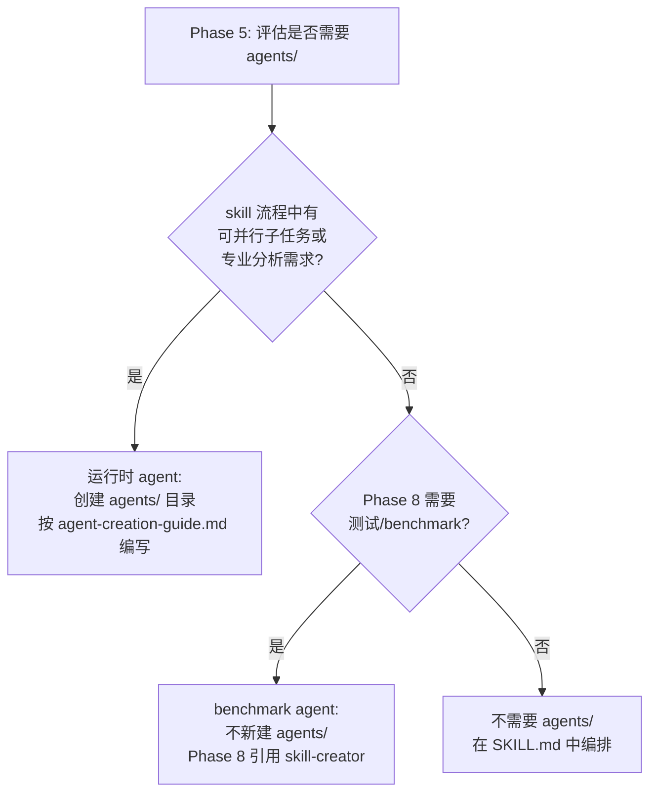

# agents 目录决策规则（Agents Decision）

## 目的

定义 skill 是否需要 `agents/` 子目录的决策规则，区分运行时 agent（能力提效）与 benchmark agent（测试用）两类场景。Phase 5 编写 agents 时按本规范决策——**先判断属于哪类场景，再决定自建、引用或不创建**。

---

## 核心原则

- **区分两类 agent**——运行时 agent（能力提效）与 benchmark agent（测试用）决策路径不同
- **agents/ 不是必需的**——避免过度设计，简单 skill 不应创建
- **运行时 agent 按需自建**——skill 流程中有并行子任务或专业分析需求时创建 agent md 文件
- **benchmark agent 引用 skill-creator**——测试用 agent 仅需 Phase 8 引用 skill-creator 的 grader/analyzer/comparator，不自建
- **每个 agent 必须有独立上下文**——若逻辑可在 SKILL.md 中线性编排，则不需要 agent

### 两类 agent 对比

| 维度 | 运行时 agent（能力提效） | benchmark agent（测试用） |
|------|------------------------|-------------------------|
| **目的** | skill 流程中的并行子任务/专业分析（如调研、评分） | Phase 8 测试/benchmark 流程的评分与分析 |
| **触发时机** | Phase 1 调研 / Phase 5 编写 / Phase 8 评分 | Phase 8 测试/benchmark 时 |
| **创建方式** | 自建 agent md 文件，放 `agents/` 目录 | 引用 skill-creator 的标准 agents，不新建 |
| **示例** | researcher（调研）、grader（评分） | grader/analyzer/comparator（引用 skill-creator） |
| **写作规范** | 遵循 [agent-creation-guide.md](agent-creation-guide.md) | 无需自建，直接引用 |

---

## 决策树：是否需要 agents 目录

> **说明**：Q1 中的"专业分析需求"已覆盖调研场景。例如 Phase 1 调研环节需要综合调研现有 skill、技术方案、最佳实践——属于专业分析需求，可引用 **researcher** 运行时 agent（自建，放 `agents/` 目录）。调研工作消耗大量 token 并污染主流程上下文，适合用子代理隔离。

### 三类场景决策

| 场景 | 判定条件 | 决策 |
|------|---------|------|
| **运行时 agent**（能力提效） | skill 流程中有可并行子任务或专业分析需求 | 创建 `agents/` 目录，按 [agent-creation-guide.md](agent-creation-guide.md) 编写 agent md 文件 |
| **benchmark agent**（测试用） | 仅 Phase 8 测试/benchmark 需要评分与分析 | 不新建 `agents/`，Phase 8 引用 skill-creator 的 grader/analyzer/comparator |
| **无并行/专业需求** | 简单线性流程，无并行、无独立上下文、无角色协作 | 不创建 `agents/`，所有逻辑在 SKILL.md 中编排 |

---

## 何时不需要 agents 目录

满足以下**全部**条件时，不需要创建 agents/，所有逻辑在 SKILL.md 中编排：

- 简单的线性流程（无分支、无并行）
- 无并行执行需求
- 无独立上下文需求（主流程上下文足够）
- 所有决策逻辑可在 SKILL.md 中用流程图/表格表达
- 单一角色即可完成（无需 grader/analyzer 分工）

---

## 子代理设计规范

如果决定创建运行时 `agents/`，每个 agent `.md` 文件的**写作规范详见 [agent-creation-guide.md](agent-creation-guide.md)**。

本文件仅列出设计要点，完整章节结构与写作风格参考上述规范。

### 设计要点

- **单一职责**：一个 agent 只做一件事（grader 只评分，analyzer 只分析）
- **输入/输出契约化**：用 JSON schema 明确输入输出，便于编排
- **避免指令膨胀**：单一模式 200-230 行，多模式 270-300 行，细节放 `## Field Descriptions`
- **明确依赖关系**：在 Process 中标注前置 agent 和后续 agent
- **路径用占位符**：`{outputs_dir}`、`{output_path}`，编排器调用时替换

---

## 引用现有 agents（benchmark agent 场景）

### benchmark agent 引用 skill-creator 的 agents

当 skill 仅在 Phase 8 测试/benchmark 时需要评分与分析（即 benchmark agent 场景），**不新建 `agents/` 目录**，直接引用 anthropics skill-creator 已提供的三个规范化 agent：

| agent | 职责 | 适用场景 |
|-------|------|---------|
| `grader.md` | 评估 expectations 是否通过，输出 grading.json | Phase 8 校验审计的评分环节 |
| `analyzer.md` | 分析 benchmark 结果，输出 freeform notes | Phase 8 benchmark 模式分析 |
| `comparator.md` | 盲对比两个 skill 输出，决定胜者 | skill 对比评测 |

### 引用方式

| 方式 | 命令 | 适用场景 |
|------|------|---------|
| **GitHub raw 读取**（主推） | `WebFetch raw.githubusercontent.com/anthropics/skills/main/skills/skill-creator/agents/<name>.md` | 只需读取 agent 指令内容 |
| **npx skills 加载**（备选） | `npx skills add anthropics/skills/skill-creator` | 需要完整安装运行 agent 测试管线 |

### 运行时 agent 自建判断

当 skill 流程中有并行子任务或专业分析需求（即运行时 agent 场景），且 skill-creator 的 benchmark agents 无法覆盖时，自建 agent md 文件，遵循 [agent-creation-guide.md](agent-creation-guide.md) 写作规范：

- ✅ 自建：uluo-skill-creator 需要校验"skill 规范质量"——skill-creator 的 grader 评分 expectations，不覆盖 skill 结构/流程/约束分工等规范维度
- ✅ 自建：uluo-skill-creator 需要调研现有 skill 和技术方案——skill-creator 的 agents 不覆盖此环节
- ❌ 不自建：需要"评分 expectations"——直接引用 skill-creator 的 grader.md

---

## 正反示例

### ✅ 正例 1：运行时 agent（能力提效）

uluo-skill-creator 需要校验"skill 规范质量"——skill-creator 的 grader 评分 expectations，不覆盖 skill 结构/流程/约束分工等规范维度：

- **grader**（自建运行时 agent）：校验 skill 规范质量并评分（5 维度：结构合规/流程编排/约束分工/文档质量/测试覆盖），放 `agents/` 目录，按 [agent-creation-guide.md](agent-creation-guide.md) 编写

理由：skill 流程中有独立的专业分析需求（skill 规范质量评分），需要独立上下文避免污染主流程。

### ✅ 正例 2：运行时 agent（调研）

uluo-skill-creator 需要在 Phase 1 调研现有类似 skill、技术方案、最佳实践——skill-creator 的 agents 不覆盖此环节：

- **researcher**（自建运行时 agent）：综合调研现有 skill、技术方案、最佳实践，输出结构化调研报告，放 `agents/` 目录，按 [agent-creation-guide.md](agent-creation-guide.md) 编写

理由：调研工作需要大量信息收集，会消耗大量 token 并污染主流程上下文，适合用子代理隔离。调研渠道采用分层策略（L1 通用脚本固化 + L2 专业 agent 推荐 + L3 按需扩展）。

### ✅ 正例 3：benchmark agent（测试用）

uluo-skill-creator 的 Phase 8 测试/benchmark 流程：

- **grader**（引用 skill-creator）：评分 expectations 是否通过
- **analyzer**（引用 skill-creator）：分析 benchmark 模式

理由：测试用 agent 无需自建，Phase 8 直接引用 skill-creator 的标准 agents。

### ❌ 反例：无并行/专业需求，不需要 agents

简单 markdown 格式化 skill：

- 单一职责：格式化 markdown
- 线性流程：读取 → 格式化 → 输出
- 无并行需求、无专业分析需求、无角色协作需求
- 所有逻辑在 SKILL.md 中用流程图表达即可

---

## references 引用时机

| 触发条件 | 何时读取本文件 |
|---------|--------------|
| Phase 5 编写 agents 时 | 决策是否创建 agents/ 目录，区分运行时/benchmark/无需求三类 |
| Phase 8 测试/benchmark 时 | 查阅 benchmark agent 引用 skill-creator 的方式 |
| 自建运行时 agent 时 | 查阅设计要点，并跳转 [agent-creation-guide.md](agent-creation-guide.md) 查看完整写作规范 |
