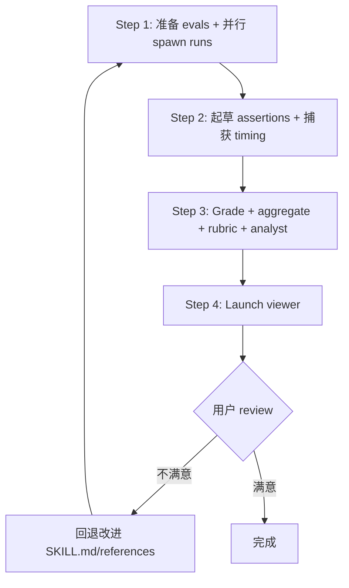

# 测试/审计 Benchmark 流程规范（Benchmark Workflow）

## 目的

**流程定义**：Phase 8 测试/benchmark 流程，对齐 skill-creator 的 4 步结构，增加 rubric 质量评分作为 benchmark.json 扩展字段。

---

## 测试流程（4 步，对齐 skill-creator）



### Step 1: 准备 evals + 并行 spawn runs

**并行 spawn**：同一轮并行 spawn with-skill + baseline 子代理（禁止串行）。

- 加载 `evals/evals.json`（Phase 6 产出），确保有 assertions；如无，先起草
- 创建 workspace 目录：`<skill-name>-workspace/iteration-N/<eval-ID>/`
- 为每个 eval 写 `eval_metadata.json`（含 `eval_id`、`eval_name`、`prompt`、`assertions`）
- **同一轮**并行 spawn 两个子代理：
  - **with-skill**：加载 skill 执行任务，输出到 `with_skill/outputs/`
  - **baseline**：
    - 新建 skill → 不加载 skill（`without_skill/outputs/`）
    - 改进 skill → 加载旧版本快照（`old_skill/outputs/`）

### Step 2: 起草 assertions + 捕获 timing

**并行工作**：runs 进行中并行执行以下任务。

- **起草 assertions**（如 evals.json 中无）：为每个 test case 起草可客观验证的 assertions，更新 `eval_metadata.json` 和 `evals/evals.json`
- **捕获 timing**：每个子代理任务完成后，立即从任务通知中捕获 `total_tokens` 和 `duration_ms`，写入 `timing.json`（此数据不持久化，错过即丢失）

### Step 3: Grade + aggregate + rubric + analyst

**四阶段聚合**：grade → aggregate → rubric → analyst。

#### 3.1 Grade each run

- 使用 skill-creator 的 `agents/grader.md` 作为 grader 子代理指令
- 评估每个 assertion 是否通过，保存 `grading.json`
- **字段必须为** `text`、`passed`、`evidence`（viewer 依赖精确字段名，禁用 `name`/`met`/`details`）
- 可程序化校验的 assertion 优先写脚本，而非人工 eyeball

#### 3.2 Aggregate into benchmark

- 使用 skill-creator 的 `scripts/aggregate_benchmark.py`：

```bash
python -m scripts.aggregate_benchmark <workspace>/iteration-N --skill-name <name>
```

- 产出：`benchmark.json` + `benchmark.md`（含 pass_rate、time、tokens 的 mean ± stddev 和 delta）
- with_skill 配置排在 baseline 之前

#### 3.3 Rubric 评分（uluo-skill-creator 扩展）

**质量评分**：使用 `scripts/grade-skill.js` 评估 skill 本身的规范质量，作为 benchmark.json 扩展字段。

```bash
node scripts/grade-skill.js <skill-path>
```

产出 `rubric-report.json`，覆盖 5 个维度（每项 0-20 分，总分 100）：

| 维度 | 评估内容 |
|------|---------|
| 结构合规 | SKILL.md / 目录命名规范 |
| 流程编排 | Phase 模型 / mermaid / loop / 质量闸门 |
| 约束分工 | 软硬约束分类 / 脚本承载 / md 精简 / 脚本可执行 |
| 文档质量 | frontmatter / 行数 / references 引用 / 内容结构化 |
| 测试覆盖 | evals.json / 用例数 / assertions / 测试通过 |

rubric 评分结果写入 `benchmark.json` 的 `rubric_score` 字段。

#### 3.4 Analyst pass

- 使用 skill-creator 的 `agents/analyzer.md` 作为 analyzer 指令
- 识别非区分性 assertion（两个配置都 100% 通过）、高方差 eval、delta 异常
- 分析结果写入 `benchmark.json` 的 `notes` 字段

### Step 4: Launch viewer

**启动 viewer**：使用 skill-creator 的 `eval-viewer/generate_review.py`。

```bash
nohup python <skill-creator-path>/eval-viewer/generate_review.py \
  <workspace>/iteration-N \
  --skill-name <name> \
  --benchmark <workspace>/iteration-N/benchmark.json \
  > /dev/null 2>&1 &
```

- iteration 2+ 加 `--previous-workspace <workspace>/iteration-<N-1>`
- 无显示环境（Cowork/headless）用 `--static <output_path>` 生成独立 HTML
- 用户 review 后点击 "Submit All Reviews" 产出 `feedback.json`

---

## skill-creator 脚本清单

**直接使用**：使用 skill-creator 的脚本执行测试/benchmark 管线。本地有则用本地，无则从 GitHub raw 获取（详见 [remote-skill-creator.md](remote-skill-creator.md)）。

| 脚本 | 用途 |
|------|------|
| `agents/grader.md` | grader 评分指令 |
| `agents/analyzer.md` | 分析指令（识别非区分性 assertion、高方差 eval） |
| `agents/comparator.md` | 盲比较指令（可选，进阶） |
| `scripts/aggregate_benchmark.py` | 聚合 benchmark.json + benchmark.md |
| `eval-viewer/generate_review.py` | 启动 eval viewer |
| `scripts/run_eval.py` / `run_loop.py` | 运行 eval / description 优化 |
| `references/schemas.md` | JSON Schema 定义 |

---

## benchmark.json 产出规范

**字段约束**：对齐 skill-creator 的 `references/schemas.md`，uluo-skill-creator 额外增加 `rubric_score` 字段。

```json
{
  "metadata": {
    "skill_name": "<name>",
    "iteration": 1,
    "timestamp": "2026-06-25T10:30:00Z",
    "evals_run": [1, 2, 3],
    "runs_per_configuration": 1
  },
  "configurations": ["with_skill", "without_skill"],
  "runs": [
    {
      "eval_id": 1, "eval_name": "descriptive-name",
      "configuration": "with_skill", "run_number": 1,
      "result": {"pass_rate": 0.85, "passed": 6, "failed": 1, "total": 7, "time_seconds": 42.5, "tokens": 3800}
    }
  ],
  "run_summary": {
    "with_skill": {"pass_rate": {"mean": 0.85, "stddev": 0.05}, "time_seconds": {"mean": 42.5, "stddev": 8.0}, "tokens": {"mean": 3800, "stddev": 400}},
    "without_skill": {"pass_rate": {"mean": 0.35, "stddev": 0.08}},
    "delta": {"pass_rate": "+0.50", "time_seconds": "+10.5", "tokens": "+1700"}
  },
  "rubric_score": {
    "structure": 18, "workflow": 15, "constraint": 20,
    "documentation": 17, "testing": 15, "total": 85, "grade": "B"
  },
  "notes": [
    "Assertion 'Output is a file' 在两个配置都 100% 通过——非区分性，考虑替换",
    "Eval 3 方差高（±40%）——可能 flaky，建议固化输入"
  ]
}
```

**字段约束**：
- `configuration` 必须为 `with_skill` 或 `without_skill`（viewer 依赖精确字符串分组）
- `result` 必须嵌套在 run 内（不可放到顶层）
- `rubric_score` 为 uluo-skill-creator 扩展字段，skill-creator viewer 会忽略未知字段，不破坏兼容性

---

## workspace 目录结构

**目录组织**：workspace 与 skill 目录平级（sibling），按 iteration 组织，iteration 内按 eval-ID 组织。

```
<skill-name>-workspace/
├── iteration-1/
│   ├── eval-0/
│   │   ├── with_skill/{outputs/, grading.json, timing.json}
│   │   ├── without_skill/{outputs/, grading.json, timing.json}
│   │   └── eval_metadata.json
│   ├── benchmark.json
│   ├── benchmark.md
│   └── rubric-report.json
└── iteration-2/
    └── ...
```

- 目录按需创建，不预先建空目录

---

## 内部 loop 机制

**迭代 loop**：用户 review 不满意 → 回退到 Step 1 重新运行。

1. 根据 `feedback.json` 改进 SKILL.md / references / scripts
2. 重新运行 Step 1-4，产出 `iteration-<N+1>/`
3. 启动 viewer 时传 `--previous-workspace <workspace>/iteration-<N>`，viewer 展示上次输出和 feedback 供对比
4. 退出条件（满足其一）：用户明确满意 / `feedback.json` 全空 / 连续两轮无实质改进

**回退范围**：Phase 8 内部 loop 只回退到 Step 1（重跑测试）。若发现 skill 本身需大改，退出 loop 回到 Phase 4。

---

## 参考

- [skill-creator SKILL.md](https://raw.githubusercontent.com/anthropics/skills/main/skills/skill-creator/SKILL.md)：上游测试流程（4 步）
- [skill-creator schemas.md](https://raw.githubusercontent.com/anthropics/skills/main/skills/skill-creator/references/schemas.md)：benchmark.json 完整 schema
- [remote-skill-creator.md](remote-skill-creator.md)：skill-creator 脚本获取方式
- [skill-quality-rubric.md](skill-quality-rubric.md)：rubric 5 维度评分卡
