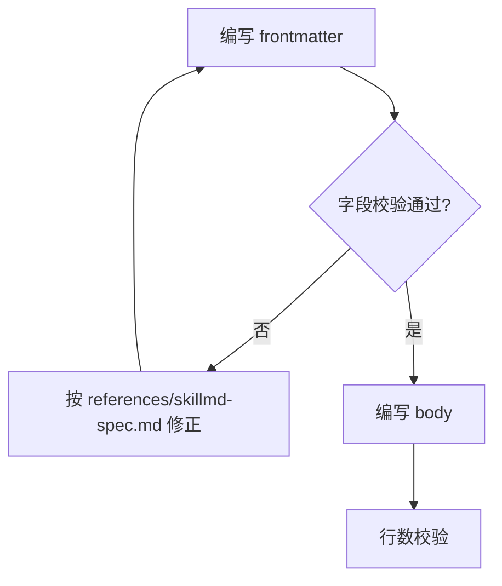
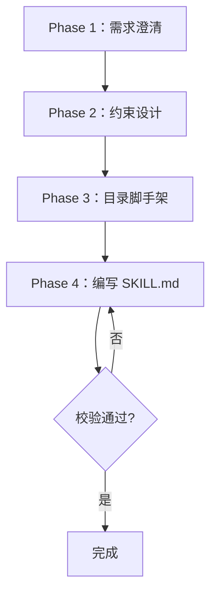

# SKILL.md 内容规范（SKILL.md Spec）

## 目的

**规范范围**：定义 SKILL.md 的 YAML frontmatter 字段、description 写法、progressive disclosure 三层模型、行数约束、references 引用规范。Phase 4 编写 SKILL.md 时按本规范执行。

权威来源：[anthropics/skills 仓库的 skill-creator/SKILL.md](https://github.com/anthropics/skills/blob/main/skills/skill-creator/SKILL.md)。

---

## 适用范围

**适用对象**：本规范适用于用户使用 uluo-skill-creator 创建的所有 skill 的 SKILL.md，不仅适用于 uluo-skill-creator 自身。

| 对象 | 是否受约束 | 说明 |
|------|-----------|------|
| uluo-skill-creator 自身的 SKILL.md | ✅ 是 | 作为规范实现者，必须以身作则 |
| 用户创建的每个 skill 的 SKILL.md | ✅ 是 | 产出的 skill 必须遵循本规范 |
| references/ 下的文档 | ⚠️ 部分 | 行数约束不适用，但结构化描述规则建议遵循 |

**Phase 7 校验时会检查产出 skill 的 SKILL.md 是否符合本规范**（frontmatter 字段、description 写法、行数约束、结构化描述等）。不符合则 fail，要求修正后重新校验。

---

## YAML frontmatter 字段规范

**结构要求**：SKILL.md 顶部必须是 YAML frontmatter（`---` 包裹）。

### 必需字段

| 字段 | 类型 | 约束 | 说明 |
|------|------|------|------|
| `name` | string | 非空，与目录名一致 | skill 标识符，小写+连字符 |
| `version` | string | 非空，semver 格式 | 语义化版本号（如 `0.1.0`），便于追踪迭代 |
| `description` | string | 非空，含"Use when"触发条件 | skill 触发机制，决定 Claude 是否调用本 skill |

### 字段写法

```yaml
---
name: uluo-skill-creator
version: 0.1.0
description: >-
  规范化+流程化的 skill 创建器。Use this skill whenever the user wants to create a new skill,
  build a skill from scratch, or scaffold a skill directory. Also use when the user mentions
  any of: 创建 skill, skill 创建, skill 规范, create skill, build skill. 即使没有明确说
  "uluo-skill-creator" 也应使用本 skill。
---
```

**约束**：
- `name` 必须与 skill 目录名完全一致（如目录 `uluo-skill-creator/` → name: `uluo-skill-creator`）
- `version` 必须符合 semver 格式（`MAJOR.MINOR.PATCH`，如 `0.1.0`、`1.2.3`）
- `description` 必须包含 "Use when" 或 "Use this skill when" 触发条件短语
- `description` 可使用 YAML 的 `>-` 折叠多行，保持单段落

---

## description 写法指南

**触发机制**：description 是 skill 的唯一触发机制，所有"何时使用"的信息必须写在 description 里，禁止放在 body。

### 写法要求

1. **做什么**：明确说明 skill 的功能
2. **何时触发**：列出具体的触发场景和关键词
3. **可适当"pushy"**：鼓励触发，对抗 Claude 的"undertrigger"倾向

### 好/坏示例

**❌ 坏示例（过窄，undertrigger）**：
```yaml
description: How to build a simple fast dashboard to display internal data.
```
问题：无触发条件、无关键词。

**✅ 好示例（pushy，含触发条件）**：
```yaml
description: >-
  How to build a simple fast dashboard to display internal data. Make sure to use this skill
  whenever the user mentions dashboards, data visualization, internal metrics, or wants to
  display any kind of company data, even if they don't explicitly ask for a 'dashboard.'
```

**✅ 好示例（多语言触发词）**：
```yaml
description: >-
  规范化+流程化的 skill 创建器。Use this skill whenever the user wants to create a new skill
  or scaffold a skill directory. Also use when the user mentions any of: 创建 skill, skill 创建,
  skill 规范, skill 流程, create skill, build skill, scaffold skill. 即使没有明确说
  "uluo-skill-creator" 也应使用本 skill。
```

### description 检查清单

- [ ] 包含"做什么"说明
- [ ] 包含"Use when"触发条件
- [ ] 列出具体触发关键词（中英文均可）
- [ ] 适当"pushy"（鼓励触发，覆盖近义词）
- [ ] 长度适中（~100 词，不超过 200 词）

---

## Progressive Disclosure 三层模型

**三层加载**：Skill 采用三层渐进式加载。

| 层级 | 内容 | 加载时机 | token 预算 |
|------|------|---------|-----------|
| **L1** | frontmatter（name + description） | 始终在上下文 | ~100 词 |
| **L2** | SKILL.md body | skill 触发时加载 | <300 行理想 |
| **L3** | references/ / scripts/ / agents/ | 按需加载 | 无限制 |

### 设计原则

- **L1 必须自包含**：所有触发逻辑必须在 L1
- **L2 是编排器**：SKILL.md body 定义流程编排和引用指针，不堆细节
- **L3 按需加载**：规范细节、脚本、子代理指令放 references/scripts/agents，SKILL.md 明确标注何时读取

### L2 → L3 引用规范

**引用规范**：在 SKILL.md body 中明确标注何时读取哪个 references 文件。

```markdown
## references 引用时机（progressive disclosure）

| references 文件 | 何时读取 |
|----------------|---------|
| [skill-anatomy.md](references/skill-anatomy.md) | Phase 3 产出目录结构时 |
| [skillmd-spec.md](references/skillmd-spec.md) | Phase 4 编写 SKILL.md 时 |
| [hard-soft-constraint.md](references/hard-soft-constraint.md) | Phase 2 软硬约束设计时 |
```

**要求**：
- 每个 references 文件必须在 SKILL.md 中有明确的引用指针
- 引用指针必须标注"何时读取"（绑定到具体 Phase 或场景）
- 禁止"孤儿 references"——未被 SKILL.md 引用的文件

---

## 行数约束

**约束对象**：SKILL.md body（frontmatter 之后的 Markdown 内容）。

| 行数 | 状态 | 处理 |
|------|------|------|
| < 300 行 | ✅ 正常 | 无需处理 |
| 300-500 行 | ⚠️ 警告 | 建议拆分到 references/，SKILL.md 只保留编排逻辑 |
| 500-799 行 | ⚠️⚠️ 强警告 | 必须拆分，编排信号已被稀释 |
| ≥ 800 行 | ❌ Fail | 必须拆分，Phase 7 硬约束校验会 fail |

### 拆分策略

当 SKILL.md 接近或超过 300 行时：
1. 识别可独立的规范细节（如目录结构规范、frontmatter 字段规范）
2. 移到 `references/<topic>.md`
3. 在 SKILL.md 保留简短摘要 + 引用指针
4. 重新校验行数

---

## SKILL.md body 结构模板

```markdown
---
name: <skill-name>
description: >-
  <做什么>。Use this skill when <触发条件>. Also use when the user mentions
  any of: <关键词列表>. <pushy 鼓励触发语句>.
---

# <skill-name>

<一句话定位>。本文件是**编排器**——<核心职责>。规范细节见 `references/`，硬约束校验见 `scripts/`。

---

## 核心理念 / 工作流概述

<流程编排，绑定 Phase>

---

## references 引用时机

| references 文件 | 何时读取 |
|----------------|---------|
| ... | ... |

---

## 质量闸门

<本地硬约束校验 + 远程审计闸门>

---

## 禁止事项

- <硬性禁止项>
```

---

## 参考

- [anthropics/skills - skill-creator/SKILL.md](https://github.com/anthropics/skills/blob/main/skills/skill-creator/SKILL.md)：权威来源
- [anthropics/skills - skill-creator/references/schemas.md](https://github.com/anthropics/skills/blob/main/skills/skill-creator/references/schemas.md)：JSON Schema 参考

---

## SKILL.md 是流程编排，禁止细节

**编排器定位**：SKILL.md body 只写流程编排（Phase 流程图、决策点、引用指针、禁止事项），具体细节一律抽离到 references/ 或 scripts/。

### 禁止清单

| 禁止项 | 原因 | 去向 |
|--------|------|------|
| 具体校验逻辑（如 frontmatter 字段校验规则） | 属于规范细节，L2 不该承载 | `references/<topic>.md` |
| 长代码示例（超过 3 行） | 拉高 token、模糊流程主线 | `references/` 或 `examples/` |
| 超过 3 行的描述性段落 | 稀释编排信号，读者跳过 | 精简或抽离到 `references/` |
| 具体的命令行用法 | 属于工具细节 | `references/` 或 `scripts/` 注释 |

### 允许清单

- Phase 流程图（mermaid `flowchart TD/LR`）
- 决策点（如"校验通过？"→ 是/否分支）
- 引用指针（如"详见 `references/skillmd-spec.md`"）
- 禁止事项（简短列表，每项一行）

### 边界澄清：禁止的是"长段落细节"，不是"所有细节"

重点内容可以放 SKILL.md，但要结构化呈现（表格/列表/mermaid），而非长段落。

| 内容类型 | 是否可放 SKILL.md | 呈现要求 |
|----------|------------------|---------|
| 核心规则（如字段约束、行数阈值） | ✅ 可以 | 表格或列表，禁长段落 |
| 关键命令（如 `claude plugin install`） | ✅ 可以 | 代码块，单行或短示例 |
| 决策分支（如校验通过/失败处理） | ✅ 可以 | mermaid 流程图 |
| 简短禁止事项清单 | ✅ 可以 | 列表，每项一行 |
| 详细校验逻辑（多步骤规则展开） | ❌ 禁止 | 抽离到 `references/` |
| 长代码示例（超过 3 行） | ❌ 禁止 | 抽离到 `references/` 或 `examples/` |
| 长段落描述性说明 | ❌ 禁止 | 精简或抽离到 `references/` |

**判断标准**：能用表格/列表/mermaid 表达的 → 可留 SKILL.md；需要多段文字展开的 → 抽离 references/。

### 正反示例对比

**❌ 反例（细节堆砌在 SKILL.md）**：

```
## Phase 4：编写 SKILL.md

校验 frontmatter 字段：
- name 必须非空，与目录名一致
- description 必须含 "Use when"
- name 长度 3-64 字符
- description 长度 10-200 词
- 不允许 tab 缩进
- 不允许重复字段
...（继续 20 行字段校验细节）
```

**✅ 正例（编排 + 引用指针）**：

Phase 4 章节只写编排，细节指向 references：



---

## mermaid 优先

**强制 mermaid**：表述图表和逻辑时优先使用 mermaid 代码块，禁止 plain text 字符画（├ └ │ 等）。所有流程图、决策树、状态转换、时序图一律用 mermaid。

### 适用场景与语法推荐

| 场景 | mermaid 语法 | 示例用途 |
|------|-------------|---------|
| 流程图 | `flowchart TD` / `flowchart LR` | Phase 编排、决策分支 |
| 时序图 | `sequenceDiagram` | agent 调用顺序、API 交互 |
| 状态图 | `stateDiagram-v2` | 文件状态、任务状态转换 |
| 决策树 | `flowchart TD` + 菱形节点 | 校验分支、路由选择 |

### 禁止

- ❌ plain text art：`├`、`└`、`│`、`─` 等字符画
- ❌ emoji 箭头（→⇒⇨）拼凑的伪流程图
- ❌ 表格模拟流程图

### 正反示例对比

**❌ 反例（plain text art）**：

```
Phase 流程：
├── Phase 1：需求澄清
│   ├── 收集需求
│   └── 输出 spec
├── Phase 2：约束设计
│   └── 输出 constraints
└── Phase 3：目录脚手架
```

问题：不可渲染、难编辑、无语义。

**✅ 正例（mermaid flowchart）**：



---

## 重点先行写作模式

**写作模式**：每个章节开头用 `**关键词**：展开描述` 结构，关键词为具体主题（如"触发机制"、"编排器"），先概括核心结论，再用表格/列表/mermaid 展开细节。

### 结构模板

```markdown
## 章节标题

**关键词**：核心结论或关键信息（1-2 句）。

后续用表格/列表/mermaid 展开细节...
```

### 规则

| 规则 | 约束 |
|------|------|
| 章节开头 | `**关键词**：展开描述` 结构，关键词为具体主题 |
| 单章节总行数 | 不超过 20 行；超过则抽离到 `references/` |
| 段落长度 | 每段不超过 3 行 |
| 表达优先级 | 表格 > 列表 > mermaid 图 > 长段落 |
| 禁止 | 长篇大话、铺垫性废话、重复强调、机械贴 `**短重点**：` 等无意义标签 |

### 正反示例对比

**❌ 反例（无重点先行，长段落）**：

```
SKILL.md body 的行数控制非常重要，因为 token 消耗直接影响 Claude 的处理效率和成本。
经过大量实践，我们总结出 300 行是一个合理的阈值，超过这个阈值会导致流程编排信号被
细节淹没。当行数在 300-500 行之间时，我们建议进行拆分；当超过 800 行时，必须强制
拆分，否则 Phase 7 硬约束校验会 fail。
```

**❌ 反例（机械贴无意义标签）**：

```
**短重点**：body 行数有阈值约束。

（后续展开...）
```

问题：`**短重点**：` 是无意义标签，应使用具体关键词如 `**行数约束**：`。

**✅ 正例（关键词 + 展开描述 + 表格）**：

```
**行数约束**：body < 300 行正常；300-500 警告；500-799 强警告；≥ 800 必须拆分。

| 行数 | 状态 | 处理 |
|------|------|------|
| < 300 | ✅ 正常 | 无需处理 |
| 300-500 | ⚠️ 警告 | 拆分到 references/ |
| 500-799 | ⚠️⚠️ 强警告 | 必须拆分 |
| ≥ 800 | ❌ Fail | 必须拆分 |
```

---

## 内容结构化描述

**结构化优先**：内容用表格/列表/代码块/mermaid 呈现，禁止长段落。

### 优先使用的结构化格式

| 格式 | 适用场景 | 示例 |
|------|---------|------|
| 表格 | 对比、清单、映射、字段说明 | 行数约束表、frontmatter 字段表 |
| 列表 | 步骤、规则、禁止事项、检查清单 | 拆分策略步骤、description 检查清单 |
| 代码块 | 命令、示例、frontmatter 模板 | YAML 示例、mermaid 代码 |
| mermaid 图 | 流程、决策、状态转换 | Phase 流程图、校验决策树 |

### 规则

| 规则 | 约束 |
|------|------|
| 段落长度 | 避免超过 3 行的纯文本段落 |
| 写作模式 | 重点先行 + 结构化展开 |
| 信息分层 | 概览 → 详情 → 示例，逐层展开 |
| 表达优先级 | 表格 > 列表 > mermaid 图 > 代码块 > 长段落 |
| 禁止 | 超过 3 行的纯文本描述、铺垫性段落、重复强调、机械贴标签 |

### 正反示例对比

**❌ 反例（纯文本段落，无结构化）**：

```
## 行数约束

SKILL.md body 的行数应当控制在合理范围内。当行数小于 300 行时属于正常情况，
无需任何处理。当行数在 300 到 500 行之间时，会产生警告，建议将部分内容拆分到
references 目录。当行数在 500 到 799 行之间时，会产生强警告，必须进行拆分。
当行数超过 800 行时，Phase 7 硬约束校验会 fail，必须强制拆分。
```

问题：纯文本段落，难扫描，关键阈值淹没在文字中。

**✅ 正例（关键词 + 表格结构化）**：

```
## 行数约束

**行数约束**：body < 300 行正常；300-500 警告；500-799 强警告；≥ 800 必须拆分。

| 行数 | 状态 | 处理 |
|------|------|------|
| < 300 | ✅ 正常 | 无需处理 |
| 300-500 | ⚠️ 警告 | 建议拆分 |
| 500-799 | ⚠️⚠️ 强警告 | 必须拆分 |
| ≥ 800 | ❌ Fail | 必须拆分 |
```
