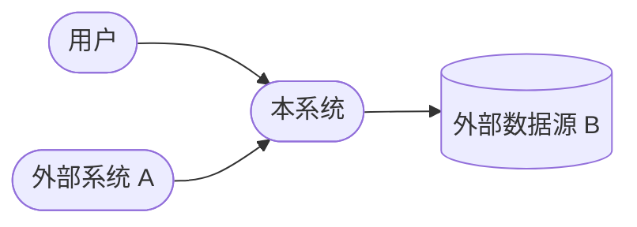
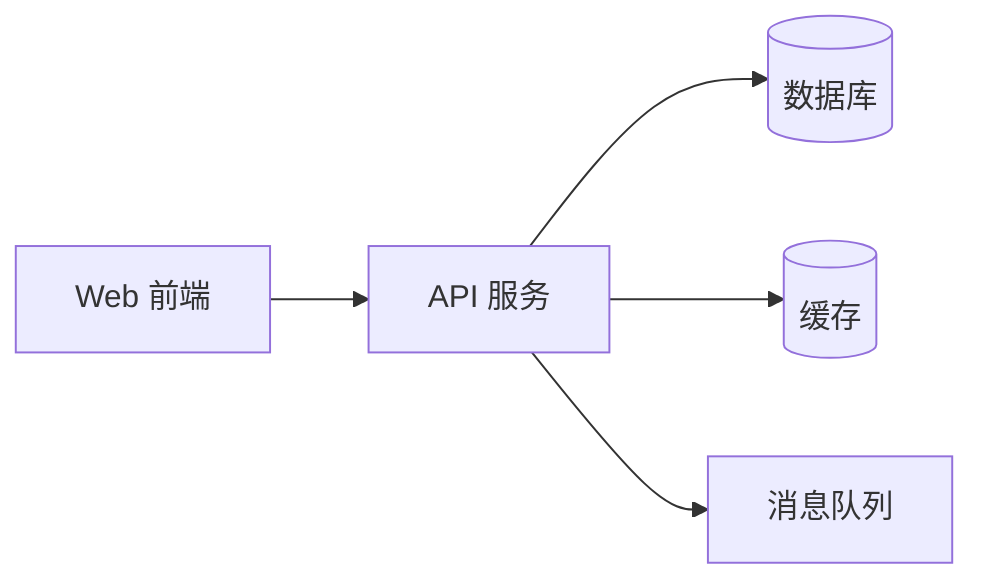
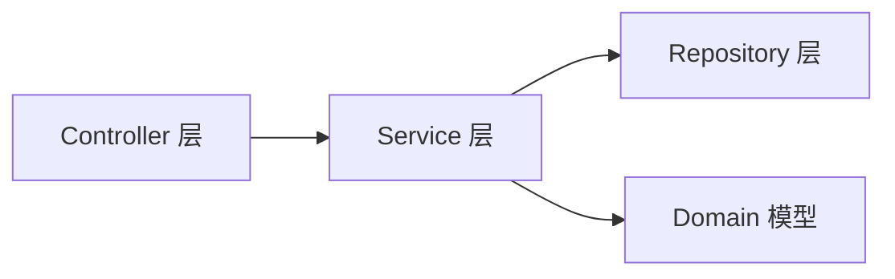
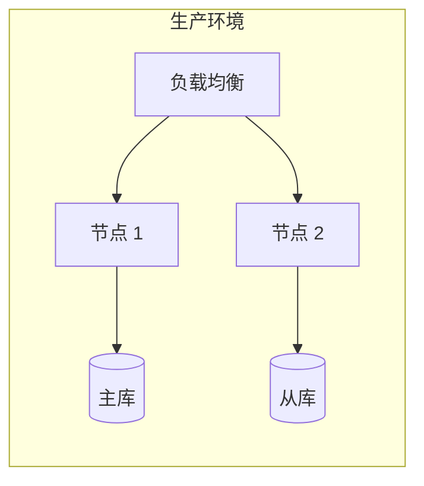

# architecture.md 模板

架构文档——回答"系统怎么组成"和"为什么这样组成"。用 C4 模型描述系统从上下文到部署的多个视角，并记录关键架构决策。

> 产出路径：`specs/architecture/`（设计目录，含 README.md 索引 + 多子文档）
>
> 本模板本身是单文件示例，实际产出时按子文档拆分。

---

## 模板

```markdown
# [系统名称] 架构文档

> 日期: YYYY-MM-DD | 作者: [运行 git config user.name 获取] | 版本: [v1.0] | 状态: 草稿/评审中/已确认

## 文档索引

| 子文档 | 内容 |
|--------|------|
| [context.md](./context.md) | 系统上下文（C4 L1） |
| [containers.md](./containers.md) | 容器图（C4 L2） |
| [components.md](./components.md) | 组件图（C4 L3） |
| [deployment.md](./deployment.md) | 部署图 |
| [adr/](./adr/) | 架构决策记录 |

## 系统上下文（C4 Level 1）

<!-- 系统作为黑盒，与外部角色/系统的关系 -->



| 角色/系统 | 类型 | 关系 |
|----------|------|------|
| [用户/角色] | 人 | [与本系统的交互] |
| [外部系统] | 系统 | [接口/协议] |

## 容器图（C4 Level 2）

<!-- 系统内的容器（部署单元）：Web 应用、API、数据库、消息队列等 -->



| 容器 | 技术 | 职责 |
|------|------|------|
| [Web 前端] | [技术栈] | [一句话职责] |
| [API 服务] | [技术栈] | [一句话职责] |
| [数据库] | [技术栈] | [一句话职责] |

## 组件图（C4 Level 3）

<!-- 单个容器内部的组件拆分 -->



| 组件 | 所属容器 | 职责 |
|------|---------|------|
| [组件名] | [容器名] | [一句话职责] |

## 部署图



| 节点 | 部署内容 | 环境 |
|------|---------|------|
| [节点名] | [容器/服务] | [生产/预发/测试] |

## 架构决策记录（ADR）

| 编号 | 标题 | 状态 | 日期 | 背景 | 决策 | 后果 |
|------|------|------|------|------|------|------|
| ADR-001 | [决策标题] | 提议/接受/废弃 | YYYY-MM-DD | [为什么需要决策] | [选择了什么] | [带来的影响] |
| ADR-002 | [决策标题] | 提议/接受/废弃 | YYYY-MM-DD | [为什么需要决策] | [选择了什么] | [带来的影响] |

## 技术栈清单

| 层级 | 技术 | 版本 | 用途 | 选型依据 |
|------|------|------|------|---------|
| 前端 | [技术] | [版本] | [用途] | [link to tech-selection] |
| 后端 | [技术] | [版本] | [用途] | [link to tech-selection] |
| 数据存储 | [技术] | [版本] | [用途] | [link to tech-selection] |
| 基础设施 | [技术] | [版本] | [用途] | [link to tech-selection] |
```

---

## 填写指南

### C4 模型分层
- **Level 1 系统上下文**：最高视角，给非技术人员也能看懂。只画系统边界和外部交互
- **Level 2 容器图**：拆分部署单元。一个"容器"是一个可独立部署的进程（Web 应用、API、DB）
- **Level 3 组件图**：拆分单个容器内部的模块/组件。开发人员最关注这层
- **部署图**：物理/虚拟节点拓扑，关注高可用、扩缩容、环境隔离

### Mermaid 图
- 所有架构图用 Mermaid，Markdown 原生渲染
- Level 1/2 用 flowchart 即可，Level 3 复杂时可拆多张图
- 图配合表格使用——图看关系，表看详情

### ADR（架构决策记录）
- 每个有争议或不可逆的决策都该有一条 ADR
- "状态"字段跟踪生命周期：提议 → 接受 → 废弃
- "后果"必须写——既包括好处也包括代价
- 复杂 ADR 可单独成文放在 `adr/` 子目录，主表只放索引

### 技术栈清单
- "选型依据"列链接到对应的 tech-selection 文档
- 没有选型文档的标注"项目默认"或"N/A"

### 拆分策略
- 小系统：单文件包含全部内容
- 中大型系统：按 README.md 索引 + 子文档拆分
- 拆分时每个子文档保留自己的 frontmatter

### 大小控制
- 单文件版本控制在 200 行以内
- 拆分版每个子文档 50-100 行
