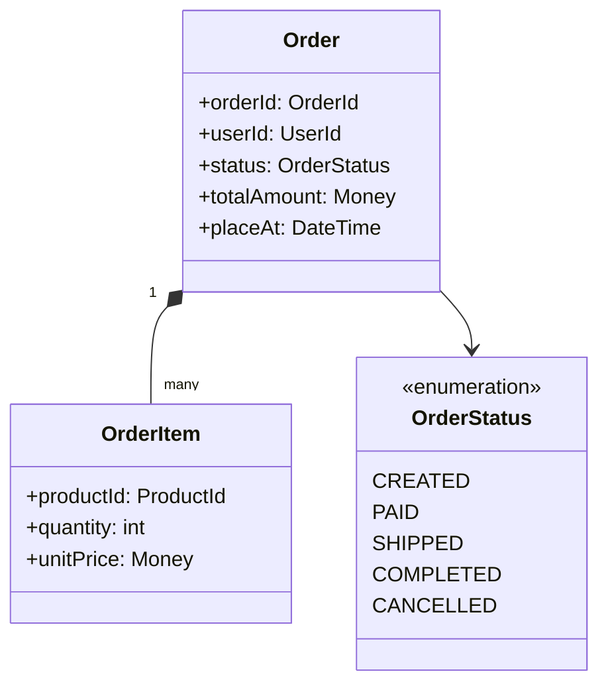
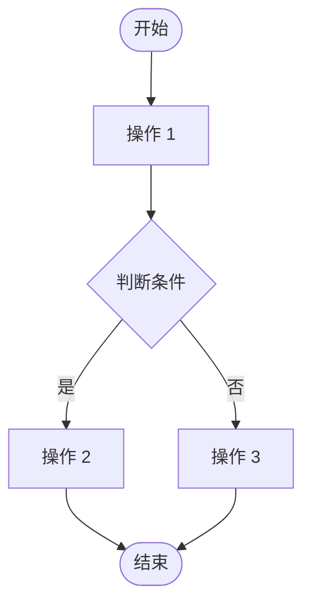
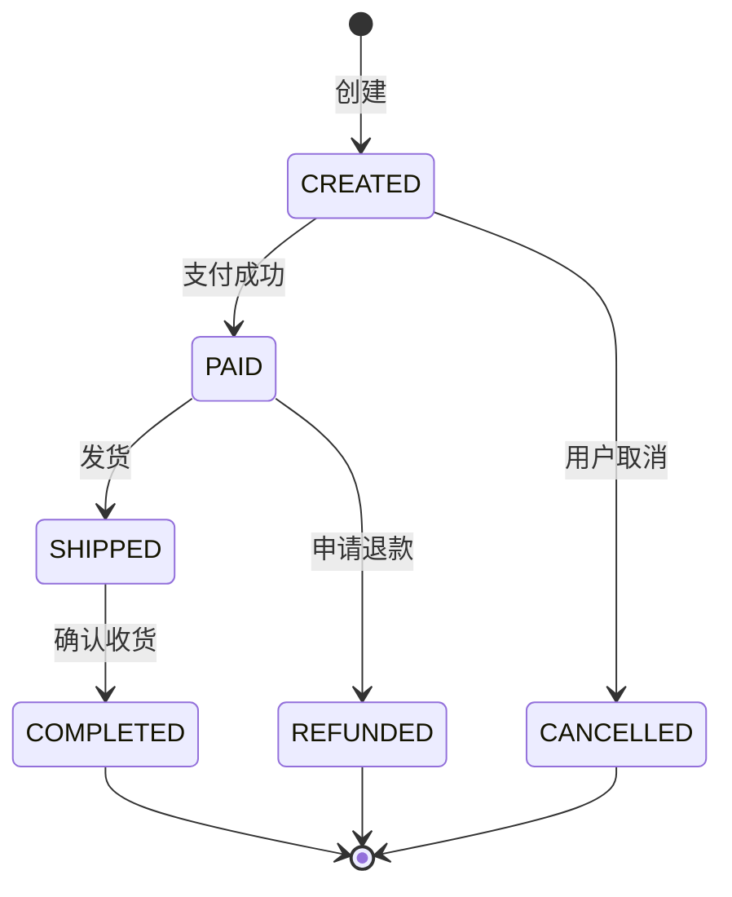

# feature-domain.md 模板

功能领域——回答"业务概念怎么建模"和"业务流程怎么跑"。聚焦一个领域内某功能的概念模型、状态流转与业务规则，是后端领域建模的核心文档。

> 产出路径：`specs/<domain>/feature-<name>.md`（单文件）

---

## 模板

```markdown
# [领域名] / [功能名] 领域模型

> 日期: YYYY-MM-DD | 作者: [运行 git config user.name 获取] | 领域: [如：订单] | 功能: [如：订单状态流转] | 状态: 草稿/评审中/已确认

## 领域模型

<!-- 用 mermaid class diagram 描述实体、值对象、聚合根及其关系 -->



| 类型 | 名称 | 说明 |
|------|------|------|
| 聚合根 | [名称] | [一句话职责] |
| 实体 | [名称] | [一句话职责] |
| 值对象 | [名称] | [一句话职责] |
| 枚举 | [名称] | [可选值清单] |

## 业务流程

<!-- 主流程用 mermaid flowchart 描述 -->



- **触发条件**: [什么情况下启动此流程]
- **参与角色**: [哪些角色/系统参与]
- **关键步骤**:
  1. [步骤说明]
  2. [步骤说明]

## 状态机

<!-- 关键实体的状态流转，用 mermaid state diagram -->



| 当前状态 | 事件 | 目标状态 | 守卫条件 | 副作用 |
|---------|------|---------|---------|--------|
| CREATED | 支付成功 | PAID | [条件] | [如：扣减库存] |
| PAID | 用户取消 | REFUNDED | [条件] | [如：发起退款] |

## 业务规则

| 编号 | 规则 | 触发条件 | 后果 |
|------|------|---------|------|
| BR-1 | [如：单笔订单金额不超过 10 万] | [下单时] | [拒绝创建] |
| BR-2 | [如：已发货订单不可取消] | [取消请求] | [返回错误] |
| BR-3 | [如：退款金额不可超过实付金额] | [退款时] | [拒绝退款] |

## 术语表

| 术语 | 英文 | 定义 |
|------|------|------|
| [术语] | [English] | [明确定义，消除歧义] |
| [术语] | [English] | [明确定义] |

## 关联文档

- 关联 spec: [link to spec.md]
- 关联 plan: [link to plan]
- 关联 layout: [link to layout.md]
```

---

## 填写指南

### 领域模型
- 用 mermaid class diagram 描述——比文字直观
- 区分聚合根（一致性边界）、实体（有唯一标识）、值对象（无标识，不可变）
- 表格列出每个类的"类型"和"职责"——图看关系，表看语义
- 不要把数据库字段直接当领域模型——领域模型是业务概念，不是表结构

### 业务流程
- 一张图一个流程——不要把多个流程塞进一张图
- 判断分支用菱形节点，明确标出"是/否"或具体条件
- "关键步骤"用编号列出，是对图的文字补充，不是重复

### 状态机
- 只对"有复杂状态流转"的实体画状态机——简单 CRUD 不需要
- 状态转换表是状态机的可执行版本——每行对应一条转换边
- "守卫条件"列说清什么时候才能转——这是业务规则的载体
- "副作用"列说清转换时还要做什么——发事件、扣库存、记日志等

### 业务规则
- 每条规则唯一编号（BR-N），可被其他文档引用
- "触发条件"要具体——"下单时"比"用户操作时"有用
- "后果"要可验证——"拒绝"还是"警告"还是"自动修正"

### 术语表
- 不要省略——不同角色对同一个词的理解可能完全不同
- 中英文对照，方便代码命名时统一

### 大小控制
- 单功能领域文档控制在 150-200 行
- 一个领域多个功能时，每个功能一个 `feature-<name>.md` 文件
