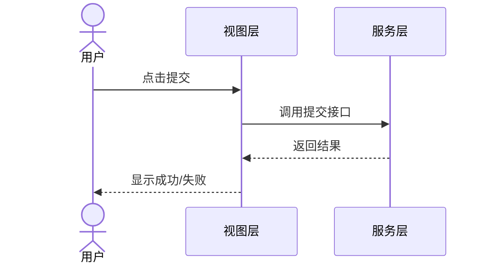

# layout-interaction.md 模板

布局交互——回答"页面怎么排"和"用户怎么操作"。覆盖一个领域内所有页面的布局结构、交互流程、响应式与无障碍要求。

> 产出路径：`specs/<domain>/layout.md`（单文件）或 `specs/<domain>/layout/`（设计目录，领域页面多时拆分）

---

## 模板

```markdown
# [领域名] 布局与交互

> 日期: YYYY-MM-DD | 作者: [运行 git config user.name 获取] | 领域: [如：订单管理 / 用户中心] | 状态: 草稿/评审中/已确认

## 页面清单

| 页面名 | 路由 | 布局类型 | 备注 |
|--------|------|---------|------|
| [页面名] | [路径] | [列表/详情/表单/仪表盘/向导] | [特殊说明] |

## 页面布局

### [页面名 1]

<!-- 用 ASCII art 或 mermaid 描述布局结构 -->

```
+------------------+
|     Header       |
+------------------+
| Side |  Main     |
| bar  |  Content  |
|      |           |
+------+-----------+
|     Footer       |
+------------------+
```

- **布局类型**: [列表/详情/表单/...]
- **关键区域**: [区域名 → 内容说明]
- **特殊约束**: [如：固定表头、侧边栏可折叠]

### [页面名 2]
...

## 交互流

### [场景名：如"用户提交订单"]



- **触发**: [用户操作]
- **正常流程**: [步骤]
- **异常处理**: [边界情况]

## 响应式断点

| 断点 | 宽度 | 布局变化 |
|------|------|---------|
| mobile | < 768px | [如：侧边栏隐藏，改为抽屉] |
| tablet | 768-1024px | [如：侧边栏折叠为图标] |
| desktop | > 1024px | [完整布局] |

## 无障碍要求

- **WCAG 级别**: [A / AA / AAA]
- **键盘导航**:
  - [如：所有可交互元素可通过 Tab 访问]
  - [如：模态框遵循焦点陷阱]
- **屏幕阅读器**:
  - [如：表单字段必须有 label 关联]
  - [如：图标按钮必须有 aria-label]
- **颜色对比度**: [如：文本对比度 ≥ 4.5:1]
- **动效**: [如：尊重 prefers-reduced-motion]

## 设计约束

- [如：遵循项目 Design System 的间距/字号/颜色 token]
- [如：禁止使用未在组件库登记的第三方组件]
```

---

## 填写指南

### 页面清单
- 一个领域通常 3-8 个页面，超过 10 个考虑拆分到 `layout/` 子目录
- "布局类型"列帮助快速识别同类页面，便于复用布局骨架

### 页面布局
- ASCII art 比 mermaid 更适合表达"区块划分"——简单直观
- 复杂布局可用 mermaid flowchart，但不要画成数据流图
- "关键区域"列说清每个区块承载什么内容，避免布局空有形无内容

### 交互流
- 用 mermaid sequence diagram 描述用户操作 → 系统响应的时序
- 一个场景一张图，不要把多个场景塞进一张图
- 异常处理单独列出——这是交互设计最容易遗漏的部分

### 响应式断点
- 断点值与项目 Design System 对齐，不要自定义
- "布局变化"列具体说明每个断点下什么变了——"侧边栏隐藏"比"适配移动端"有用得多

### 无障碍要求
- WCAG 级别按项目合规要求确定，AA 是常见基准
- 键盘导航和屏幕阅读器是最低要求，不能省
- 动效相关要求容易被忽略——`prefers-reduced-motion` 是基本素养

### 大小控制
- 单页面领域：单文件 100-150 行
- 多页面领域：拆 `layout/` 目录，每页一个子文件
