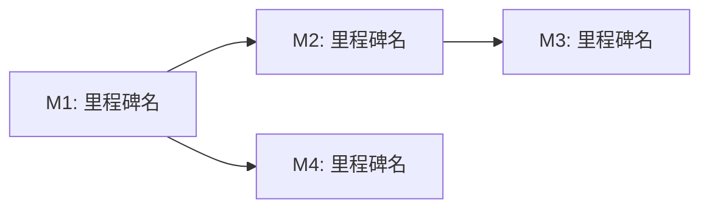

# roadmap.md 模板

路线图——回答"什么时候做"和"按什么节奏做"。规划一年（或一个长周期）内的里程碑、优先级与依赖关系，是 spec/plan 之上的时间维度总览。

> 产出路径：`specs/roadmap-<year>.md`（单文件）

---

## 模板

```markdown
# [项目/产品名] [年份] 路线图

> 日期: YYYY-MM-DD | 作者: [运行 git config user.name 获取] | 年份: [YYYY] | 状态: 草稿/评审中/已确认

## 战略目标

<!-- 本年度要达成的 3-5 个最高目标。一句话一个，可衡量 -->
- [目标 1]
- [目标 2]
- [目标 3]

## 时间线

| 时间窗口 | 里程碑 | 状态 |
|---------|--------|------|
| Q1 / [月份] | [里程碑名称] | 未开始/进行中/已完成 |
| Q2 / [月份] | [里程碑名称] | 未开始/进行中/已完成 |
| Q3 / [月份] | [里程碑名称] | 未开始/进行中/已完成 |
| Q4 / [月份] | [里程碑名称] | 未开始/进行中/已完成 |

## 里程碑详情

### M1: [里程碑名称]
- **目标**: [本里程碑要达成什么]
- **交付物**: [可验收的产出清单]
- **负责人**: [负责人/团队]
- **依赖**: [前置里程碑或外部依赖]
- **预估窗口**: [起始周 - 结束周]

### M2: [里程碑名称]
...

## 优先级矩阵

| 优先级 | 含义 | 包含的里程碑/特性 |
|--------|------|------------------|
| P0 | 必做，本年度必交付 | [列表] |
| P1 | 应做，资源允许就做 | [列表] |
| P2 | 可做，时间充裕再做 | [列表] |

## 依赖关系图



## 风险与缓解

| 风险 | 概率 | 影响 | 缓解措施 |
|------|------|------|---------|
| [风险描述] | 高/中/低 | 高/中/低 | [措施] |

## 假设与约束

- [假设 1：路线图成立的前提条件]
- [约束 1：固定的资源/时间/合规约束]
```

---

## 填写指南

### 战略目标
- 一年 3-5 个，多了就失去焦点
- 必须可衡量——"提升性能"不算，"P99 降到 200ms"算
- 这些目标是后续里程碑优先级排序的依据

### 时间线
- 按季度划分最少，按月划分更细
- 一个时间窗口可以包含多个里程碑，但宁缺勿滥
- "状态"列在执行过程中持续更新，是路线图的活指标

### 里程碑详情
- 交付物必须可验收——"完成用户系统"不算，"用户注册/登录/权限三个功能上线"算
- 负责人写具体的人或团队名，不要写"全员"
- 依赖要写清楚——前置里程碑没完成会怎样

### 优先级矩阵
- P0 是底线——本年度没做完就算失败
- P1 是加分项——做完锦上添花，没做完不致命
- P2 是探索——做了赚，不做也不亏

### 依赖关系图
- 用 Mermaid flowchart 画里程碑间依赖
- 标出关键路径（最长依赖链）——这是延期风险最高的路径

### 风险与缓解
- 风险不只写技术风险——人员变动、外部依赖、合规变化都要考虑
- 缓解措施要可执行，不要写"加强沟通"这种空话

### 大小控制
- 单年路线图控制在 150 行以内
- 详细任务拆解不在这里——交给 spec 和 tasks
