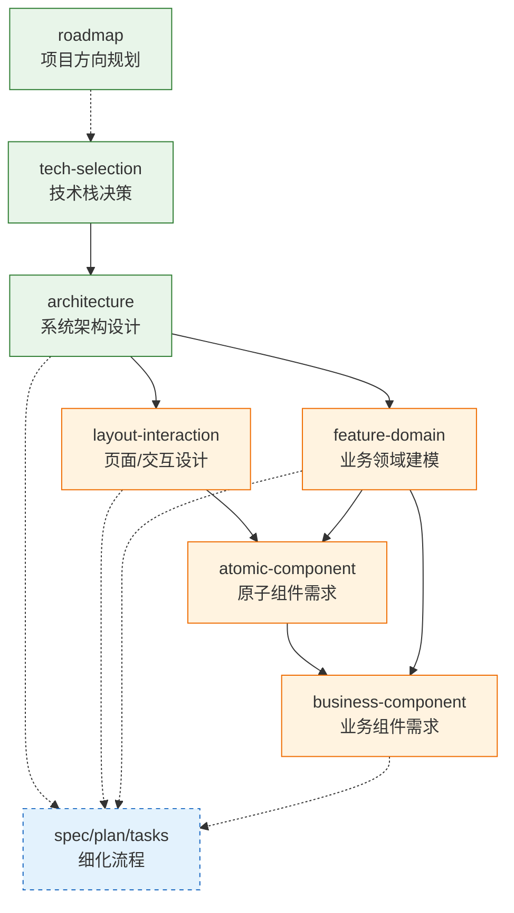

# 设计文档产出协议

设计文档（roadmap/tech-selection/architecture/layout/component）是 spec/plan/tasks 三层递进**之上**的设计探索产出。它们回答"项目往哪走""用什么技术栈""整体如何分层""页面如何布局""需要哪些组件"等战略/领域问题——这些问题的结论会被后续的细化流程（spec → plan → tasks）引用为调研依据。

> 本文件是 SKILL.md "场景选择表" 中**设计探索类产出**的统一协议。产出设计文档前必读。

---

## 1. 场景→文档类型映射

不是所有任务都需要走 spec→plan→tasks 三层递进。先按场景判定文档类型与流程深度：

| 场景 | 文档类型 | 路径 | 流程深度 |
|------|---------|------|---------|
| 项目方向规划 | roadmap | `specs/roadmap-<year>.md` | 仅 Phase 0/1 |
| 技术栈决策 | tech-selection | `specs/tech-selection-<topic>.md` | Phase 0/1 + 可选 Phase 2 调研 |
| 系统架构设计 | architecture | `specs/architecture/` | Phase 0/1 + Phase 2 调研 |
| 页面/交互设计 | layout-interaction | `specs/<domain>/layout.md` | 仅 Phase 0/1 |
| 业务领域建模 | feature-domain | `specs/<domain>/feature-<name>.md` | 仅 Phase 0/1 |
| 原子组件需求 | atomic-component | `specs/components/atomic.md` | 仅 Phase 0/1 |
| 业务组件需求 | business-component | `specs/components/business.md` | 仅 Phase 0/1 |
| 功能进一步细化 | spec/plan/tasks | `specs/<feature>/` | Phase 0-9 完整流程 |

> 路径约定遵循 [file-conventions.md](./file-conventions.md) 的结构 2（单文件）与结构 3（设计目录）。冲突隔离时前加 `specs/designs/`。

### 各文档类型的内容焦点

| 文档类型 | 核心回答 | 关键产出 |
|---------|---------|---------|
| roadmap | 什么时候做什么、按什么节奏 | 战略目标、时间线、里程碑、依赖关系 |
| tech-selection | 用什么技术栈、为什么 | 对比矩阵、候选方案评估、最终选型与理由 |
| architecture | 系统如何分层、模块如何协作 | C4 模型图、分层结构、通信方式、技术约束 |
| layout-interaction | 页面如何布局、交互如何流转 | 页面结构、交互流程、无障碍要点 |
| feature-domain | 业务领域如何建模 | 领域模型、聚合根、限界上下文、核心实体 |
| atomic-component | 项目需要哪些原子组件 | 组件清单 + 简短特殊要求（不写详细 API） |
| business-component | 项目需要哪些业务组件 | 组件清单 + 业务语义说明（不写详细 API） |

---

## 2. 信息源要求

每类设计文档的调研深度不同。设计文档不强制产出 research-report.md，但关键结论必须有信息源支撑：

- **roadmap**：参考业界路线图模板，结合项目实际里程碑节奏；时间线需可执行
- **tech-selection**：必须有对比矩阵，候选方案 ≥2 个，关键结论需 Context7 或 GitHub 交叉验证
- **architecture**：需调研业界同类系统架构（GitHub/WebSearch），C4 模型图必须
- **layout-interaction**：参考业界布局规范，无障碍需对照 WCAG
- **feature-domain**：领域模型需对照业界 DDD 实践
- **atomic-component / business-component**：需参考既有组件库（如 Ant Design/Element UI）避免重复造轮子
- **spec/plan/tasks**：保持既有调研深度要求（L1-L3，详见 [research-protocol.md](./research-protocol.md)）

> 信息源矩阵与 L1-L3 调研深度判断沿用 [research-protocol.md](./research-protocol.md)，此处不再重复。

---

## 3. 依赖关系

设计文档之间存在依赖链——上游结论是下游前提。产出顺序应遵循依赖关系，避免下游文档引用不存在的上游结论。



**依赖说明：**

- **architecture 依赖 tech-selection**：架构设计基于技术选型（用 Spring Boot 还是 Nest.js 决定了分层方式）
- **layout-interaction 依赖 architecture**：布局基于架构（前后端分离 vs SSR 决定布局文档形态）
- **feature-domain 依赖 architecture**：领域基于架构（领域模型落到哪一层、如何通信受架构约束）
- **atomic-component 依赖 layout-interaction + feature-domain**：组件基于布局规范和领域语义
- **business-component 依赖 atomic-component + feature-domain**：业务组件由原子组件组合并承载业务语义
- **spec/plan/tasks（细化流程）依赖上述任意设计稿结论**：设计稿是 spec 的"调研依据"
- **roadmap 是时间维度的总览**，弱依赖（虚线）——它约束"什么时候做技术选型/架构"，不约束内容

---

## 4. 与细化流程（spec/plan/tasks）的衔接

设计文档与三层递进不是替代关系，而是**上下游**关系：

- 设计稿（roadmap/tech-selection/architecture/layout/component）的结论可被 spec.md 引用为"调研依据"
- 当设计稿中某个功能/需求需要进一步细化到可执行时，才启用 spec → plan → tasks 三层递进
- 某些情况下可能不适用——只需要一个 md 文档就能产出的设计探索（如 ADR、概念验证），就不强制走三层递进
- spec.md 的"参考资料"章节应引用相关设计文档路径，形成可溯源链条

**衔接判断原则：**

> 这份设计文档会被 tasks.md 引用并驱动编码吗？
> - 会 → 该功能点启动三层递进，spec.md 引用本设计稿为调研依据
> - 不会 → 保持设计文档单文件/设计目录形态，不进入三层递进

---

## 5. 组件需求清单与 ui-component-creator 的边界

组件相关的设计文档存在两个 skill 的职责边界，必须划清：

| 职责 | skill | 产出 |
|------|-------|------|
| 组件**需求清单** | uluo-spec-driven | 设计稿阶段，列举项目需要哪些组件 + 简短特殊要求 |
| 组件**详细实现** | ui-component-creator | 编码阶段，产出 Props/事件/样式 API 等 |

**边界规则：**

- 两者可独立使用，不强关联——可以只列需求清单不实现，也可以直接用 ui-component-creator 创建组件
- 组件需求清单的结论可被 ui-component-creator 在实现阶段引用作为需求输入
- **uluo-spec-driven 的组件清单禁止写详细 Props/事件/状态/样式 API**——这是 ui-component-creator 的职责

**合格 vs 不合格的组件需求清单：**

```markdown
# ✅ 合格——只列需求与特殊要求
## 原子组件清单
- Button：需要 loading 态、支持图标位
- Modal：需要可拖拽、esc 关闭
- Table：需要虚拟滚动（数据量 >1w 行）

# ❌ 不合格——越界写详细 API
## Button
- props: { type: 'primary'|'default', size: 'sm'|'md'|'lg', loading: boolean }
- emits: { click: (e: MouseEvent) => void }
- slots: { default, icon }
```

> 详细的 Props/事件/状态/样式 API 设计，交由 ui-component-creator 在 Phase 2（需求分析）产出 component-spec。

---

## 6. 设计文档自检

设计文档定稿前，确认以下问题：

- [ ] 文档类型与场景匹配（参考第 1 节映射表）？
- [ ] 路径符合 [file-conventions.md](./file-conventions.md) 的结构 2/3 约定？
- [ ] 关键结论是否有信息源支撑（参考第 2 节深度要求）？
- [ ] 上游依赖文档是否已存在（参考第 3 节依赖关系）——若引用了不存在的上游结论，需补产或标注待定？
- [ ] 该设计文档是否需要进入三层递进（参考第 4 节衔接原则）——判断有据，不凭感觉？
- [ ] 组件类设计文档是否越界写了详细 API（参考第 5 节边界规则）？
- [ ] 流程图用 Mermaid，目录树用 plain text，纯 Markdown 无特殊语法？

---

## 相关文件

- [research-protocol.md](./research-protocol.md) — 信息调研协议（设计稿与 spec 共用调研方法论）
- [file-conventions.md](./file-conventions.md) — 文件存放约定（设计文档结构 2/3 的路径规则）
- [analysis-protocol.md](./analysis-protocol.md) — 源码分析协议（plan 的前置步骤）
