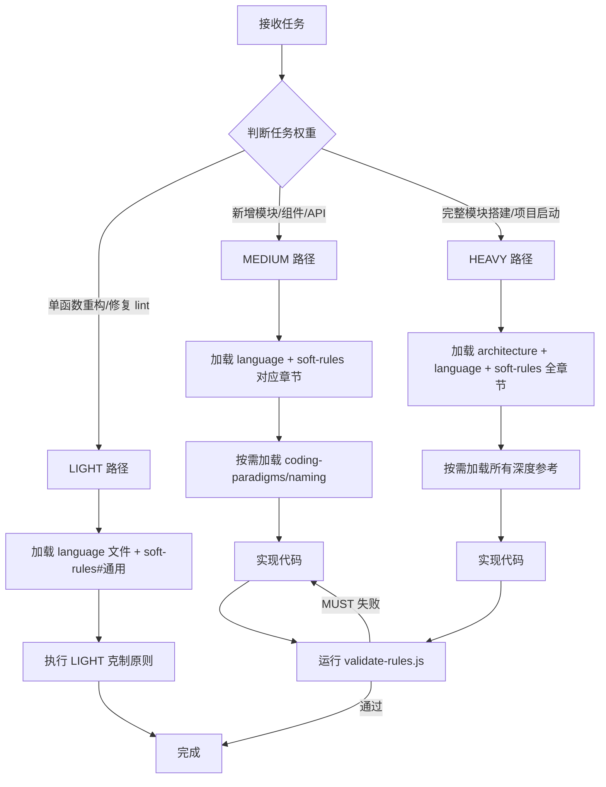

# uluo-web-standards

Web 工程规范工具链。按任务规模分级加载规则，按需深入。

---

## 执行流程



---

## 质量闸门

MEDIUM/HEAVY 任务完成后，必须通过以下闸门：

| 闸门 | 工具 | 失败处理 |
|------|------|---------|
| **stylelint --fix** | `assets/stylelint.config.mjs` | 自动修复后重跑 |
| **stylelint** | 同上 | 手动修复 → 重跑 |
| **eslint** | `assets/eslint.config.mjs` | 修复 → 重跑 |
| **tsc --noEmit** | TypeScript 编译器 | 修复类型错误 → 重跑 |
| **DDD 层边界检查** | `check-layer-boundary.js` | 修复跨层依赖 → 重跑 |

**回退闭环**：任一闸门失败 → 修复 → 从该闸门重新执行。全部通过后才算完成。

```bash
node scripts/validate-rules.js <files>
```

---

## 规则优先级

1. **用户显式需求**和安全约束（最高优先）
2. **当前项目已有**的架构、风格、lint 规则
3. 本 skill 的 **MUST** 规则（eslint + 自定义检查 + 自检清单）
4. 本 skill 的 **SHOULD/MAY** 规则

> 用户给定的命名/结构优先于 skill 规范，除非明显错误（如 `x`、`tmp`、`data`）。

---

## 执行策略

先判断任务规模，再决定加载多少规则。**不是所有任务都需要全套规范。**

### 任务权重

| 权重 | 判定条件 | 加载策略 |
|------|---------|---------|
| **LIGHT** | 单函数重构、单段代码修改、修复 lint 错误 | 只读 language 文件 + soft-rules.md#general-rules。不改结构、不改命名（除非明显错误）。不输出过程信息。 |
| **MEDIUM** | 新增小模块（单文件）、组件实现（单组件）、API 函数 | 读 language + soft-rules.md 对应章节。按需读 coding-paradigms（见 §按需加载）。 |
| **HEAVY** | 完整模块搭建（多文件）、项目启动、架构设计 | 读 architecture.md + language + soft-rules.md 全章节。按需加载所有深度参考。 |

### LIGHT 路径克制原则

- ❌ 不创建新目录结构、不新建文件夹
- ❌ 不改变用户已使用的命名约定
- ❌ 不把一个函数拆成多个文件
- ✅ 只做：消除嵌套、提取魔法值、修复歧义命名、Guard Clause 化

---

## 场景→文件映射

按场景+语言组合加载。加载指向**章节**而非整个文件。加载后**不用**向用户输出确认信息。

| 场景 | 权重 | 核心加载 | 按需加载 |
|------|------|---------|---------|
| **单函数重构** | LIGHT | `languages/<lang>.md`#函数/声明 + `soft-rules.md`#通用规则 | 嵌套深→`coding-paradigms.md`#guard-clause；参数多→#avoid-flag-arguments |
| **代码 Review** | MEDIUM | `languages/<lang>.md` + `soft-rules.md`#通用+#Review | `naming.md`；`coding-paradigms.md` 相关章节 |
| **新增小模块** | MEDIUM | `languages/<lang>.md` + `soft-rules.md`#通用 | `naming.md`；`coding-paradigms.md`#fail-fast,#immutable-update |
| **Vue 组件** | MEDIUM | `languages/vue.md`#§1-§5 + `languages/<lang>.md` + `soft-rules.md`#组件Vue | `ui-states.md`（四态）；`accessibility.md`（表单/图片时） |
| **React 组件** | MEDIUM | `languages/react.md`#§1-§5 + `languages/<lang>.md` + `soft-rules.md`#组件React | `ui-states.md`（四态）；`accessibility.md`（表单/图片时） |
| **搭建完整模块** | HEAVY | `architecture.md`#垂直切片+#水平分层 + `languages/<lang>.md` + `soft-rules.md`#通用+#架构 | `ui-states.md`；`coding-paradigms.md`；`naming.md` |
| **项目启动** | HEAVY | `architecture.md` + `infrastructure-setup.md`#P0 + `languages/<lang>.md` + `soft-rules.md`#全部 | `api-design.md`；`observability-design.md`；`performance.md`；`security.md` |
| **CSS/SCSS** | MEDIUM | `languages/css.md` + `soft-rules.md`#通用 | `infrastructure-setup.md`#design-tokens |
| **HTML 模板** | MEDIUM | `languages/html.md` + `accessibility.md`#语义+#表单 | `accessibility.md`#键盘+#颜色 |

---

## 按需加载触发表

以下文件**不在任何场景预加载**，仅在遇到对应问题时读取对应章节：

| 触发条件 | 加载 |
|---------|------|
| 函数嵌套 >2 层 | `coding-paradigms.md`#guard-clause |
| 函数参数 >3 个 | `coding-paradigms.md`#avoid-flag-arguments |
| 需要命名函数/变量/文件 | `naming.md` |
| 要提交代码 | `git-conventions.md` |
| 生成表单/图片/导航 | `accessibility.md` |
| 设计 API 接口 | `api-design.md` |
| 涉及日志/埋点/链路追踪 | `observability-design.md` |
| 处理用户输入/XSS/认证 | `security.md` |
| 性能优化/打包/加载 | `performance.md` |
| 搭建项目基础设施 | `infrastructure-setup.md` |
| 需要看完整范式列表 | `coding-paradigms.md`#目录 |

---

## 自提升协议

遇到无法直接解决的问题时，按层级查找：

| 层级 | 信息源 | 擅长场景 |
|------|--------|----------|
| L0 | 项目源码上下文 | 既有模块结构、编码惯例、工具函数 |
| L1 | Context7 MCP | 官方 SDK/API 参考（React/Vue/Next.js 等） |
| L2 | MDN Web Docs | JS 语言规范、DOM/Web API、HTML/CSS 权威定义 |
| L3 | WebSearch | 最新技术趋势、未收入 MDN 的框架 |
| L4 | GitHub | 开源实现参考、issue/PR 讨论 |
| L5 | Stack Overflow | 具体报错、疑难杂症、踩坑经验 |

查找策略：Web API/JS 问题→L2 MDN 优先；框架 API→L1 Context7 优先；具体报错→L5 SO 优先。

---

## 规则分级

| 级别 | 含义 | 验证方式 |
|------|------|---------|
| **MUST** | 硬约束，阻断级 | eslint/stylelint/tsc 工具阻断 + DDD 层边界检查 + 模型自检 |
| **SHOULD** | 默认遵守，可被项目风格覆盖 | 偏离需说明理由 |
| **MAY** | 建议项 | 不阻断 |

---

## 文件索引

| 内容 | 路径 |
|------|------|
| eslint 规则配置 | `assets/eslint.config.mjs` |
| stylelint 规则配置 | `assets/stylelint.config.mjs` |
| 验证编排脚本 | `scripts/validate-rules.js` |
| 软规则自检清单 | `references/soft-rules.md` |
| 项目组织法（DDD 分层+垂直切片） | `references/architecture.md` |
| 基础设施清单（P0/P1/P2） | `references/infrastructure-setup.md` |
| 编码范式（11 个） | `references/coding-paradigms.md` |
| 命名规范 | `references/naming.md` |
| Git 提交规范 | `references/git-conventions.md` |
| 组件状态模式（四态+Error Boundary） | `references/ui-states.md` |
| 无障碍（WCAG 2.2 AA） | `references/accessibility.md` |
| 性能优化（Core Web Vitals） | `references/performance.md` |
| 安全规范（XSS/CSRF/Auth） | `references/security.md` |
| API 设计规范 | `references/api-design.md` |
| 可观测性设计（日志+埋点+追踪） | `references/observability-design.md` |
| HTML 风格 | `references/languages/html.md` |
| CSS/SCSS 风格 | `references/languages/css.md` |
| JavaScript 风格 | `references/languages/javascript.md` |
| TypeScript 风格 | `references/languages/typescript.md` |
| Vue 风格 | `references/languages/vue.md` |
| React 风格 | `references/languages/react.md` |
