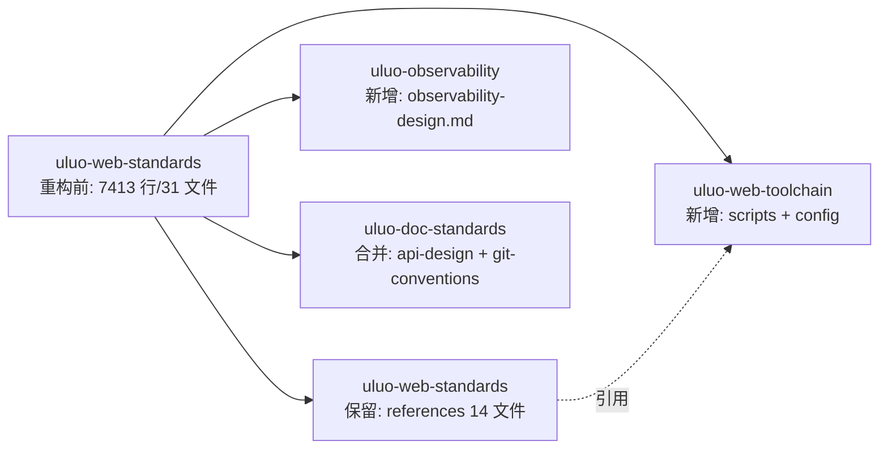

# uluo-web-standards 架构重构 执行计划

> 日期: 2026-06-25 | 作者: huyongle | 关联 spec: [../spec.md](../spec.md)

## 架构概览

将 `uluo-web-standards` 拆分为 3 个职责单一的 skill，并合并 2 个弱耦合文件到 `uluo-doc-standards`。工具链独立成 `uluo-web-toolchain`，可观测性独立成 `uluo-observability`，API 设计和 Git 约定合并到 `uluo-doc-standards`。

## 关键设计决策

### 决策 1: 工具链独立成 skill 而非保留为子目录
- **选择**: 将 scripts/ + config/ 独立为 `uluo-web-toolchain` skill
- **原因**: 数据证明 scripts 与 references 零硬编码引用（grep "references/" 在 scripts/ 下 0 处匹配），工具链可独立运行。独立后可在非 Web 项目中复用
- **替代方案**: 保留为 uluo-web-standards 的子目录——放弃，因为无法独立复用
- **影响**: uluo-web-standards 的 SKILL.md 需引用 uluo-web-toolchain 执行检查

### 决策 2: observability-design.md 独立成 skill
- **选择**: 新建 `uluo-observability` skill
- **原因**: 被引 3 次属中耦合，但概念上独立性很强（可观测性可复用于后端/移动端）。独立后可在非 Web 项目中复用
- **替代方案**: 保留在 uluo-web-standards——放弃，因为可观测性与 Web 工程规范概念不同
- **影响**: infrastructure-setup.md（引用 2 次）和 performance.md（引用 1 次）需更新引用路径

### 决策 3: api-design.md 和 git-conventions.md 合并到 uluo-doc-standards
- **选择**: 合并而非独立成 skill
- **原因**: api-design（404 行）属"设计文档"范畴，git-conventions（96 行）属"流程规范"范畴，与 uluo-doc-standards 职责相关。避免新增 skill 数量膨胀
- **替代方案**: 独立成 uluo-api-design 和 uluo-git-conventions——放弃，体量小不值得独立
- **影响**: uluo-doc-standards 的 references 从 3 文件/296 行增至 5 文件/796 行；coding-paradigms.md 引用 api-design 需更新

### 决策 4: performance.md 和 security.md 保留
- **选择**: 保留在 uluo-web-standards
- **原因**: performance 被引 6 次（高耦合核心）；security 虽被引 0 次但 XSS/CSRF/CSP 与 Web 工程强相关，独立会导致 web 项目需双装
- **替代方案**: 移出——放弃，破坏耦合关系或增加安装负担
- **影响**: 无

## 代码库分析

### 现有架构约束

| 层级 | 当前实现方式 | 新模块适配策略 |
|------|-------------|--------------|
| skill 结构 | `.claude-plugin/plugin.json` + `SKILL.md` + `references/` + `scripts/` + `config/` | 沿用 |
| marketplace 注册 | `marketplace.json` 中 plugins 数组 | 新增条目 |
| CLAUDE.md 表格 | 已注册 skill 表格 | 新增行 |

### 锚点模块分析

**参考模块**: `skills/uluo-doc-standards/`（已注册 skill 的标准结构）

| 分析维度 | 发现 |
|---------|------|
| 目录结构 | `.claude-plugin/plugin.json` + `SKILL.md` + `references/` + `examples/` + `scripts/` + `agents/` |
| plugin.json 字段 | name, version, description, author, skills 数组 |
| SKILL.md 结构 | Description + Details + 文件索引 + 执行协议 |
| marketplace.json 条目 | name, source, description |

### 可复用清单

| 已有模块/工具 | 路径 | 复用方式 |
|-------------|------|---------|
| plugin.json 模板 | `skills/uluo-web-standards/.claude-plugin/plugin.json` | 复制修改 |
| SKILL.md 结构 | `skills/uluo-web-standards/SKILL.md` | 参考编写 |
| marketplace 注册 | `marketplace.json` | 新增条目 |

### 需要变更的已有模块

| 模块 | 变更类型 | 原因 | 风险 |
|------|---------|------|------|
| `skills/uluo-web-standards/SKILL.md` | 修改 | 移除工具链和 3 个 references 的引用 | 低 |
| `skills/uluo-web-standards/references/infrastructure-setup.md` | 修改 | 更新对 observability-design.md 的引用 | 低 |
| `skills/uluo-web-standards/references/performance.md` | 修改 | 更新对 observability-design.md 的引用 | 低 |
| `skills/uluo-web-standards/references/coding-paradigms.md` | 修改 | 更新对 api-design.md 的引用 | 低 |
| `skills/uluo-doc-standards/SKILL.md` | 修改 | 新增 api-design 和 git-conventions 到文件索引 | 低 |
| `marketplace.json` | 修改 | 注册 2 个新 skill | 低 |
| `CLAUDE.md` | 修改 | 更新已注册表格 | 低 |

## 模块/组件设计

### uluo-web-toolchain skill
- **职责**: Web 工程工具链——eslint + stylelint + tsc + DDD 层边界检查
- **对外接口**: `node scripts/validate-rules.js <project-root>`
- **依赖**: 外部 bin（eslint, stylelint, tsc）
- **数据流**: 项目根路径 → 收集文件 → 运行 4 个检查 → 汇总报告

### uluo-observability skill
- **职责**: 可观测性设计规范——日志、埋点、链路追踪
- **对外接口**: SKILL.md + references/observability-design.md
- **依赖**: 无
- **数据流**: N/A（文档型 skill）

### uluo-web-standards（重构后）
- **职责**: Web 工程代码规范——架构、语言、组件、安全、性能
- **对外接口**: SKILL.md + 14 个 references
- **依赖**: 引用 uluo-web-toolchain 执行检查
- **数据流**: N/A（文档型 skill）

### uluo-doc-standards（合并后）
- **职责**: AI 编程文档产出规范 + API 设计 + Git 约定
- **对外接口**: SKILL.md + 5 个 references
- **依赖**: 无
- **数据流**: N/A（文档型 skill）

## 测试策略

| 测试层级 | 覆盖范围 | 工具 |
|---------|---------|------|
| 工具链功能测试 | validate-rules.js 在示例项目上运行 | node |
| 引用完整性检查 | 移出文件后无断链引用 | grep |
| skill 注册检查 | marketplace.json 和 CLAUDE.md 一致 | 人工 |

## 回滚方案

所有变更通过 git 管理，出问题可 `git revert`。无数据迁移，无灰度需求。
