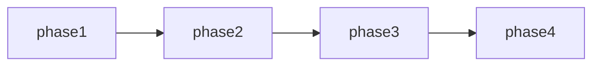

# uluo-web-standards 架构重构 任务总览

> 日期: 2026-06-25 | 作者: huyongle | 关联: [../plans/README.md](../plans/README.md)

## 全局统计

| 指标 | 值 |
|------|-----|
| 总任务数 | 18 |
| 总 phase 数 | 4 |
| 关键路径 | phase1 → phase2 → phase3 → phase4 |

## Phase 清单

| Phase | 文件 | 任务数 | 重点 |
|-------|------|--------|------|
| Phase 1: 工具链独立 | [phase1-toolchain-extraction.md](./phase1-toolchain-extraction.md) | 5 | 移动 scripts/config，修复 P0 bug |
| Phase 2: references 移出 | [phase2-references-extraction.md](./phase2-references-extraction.md) | 4 | 创建 uluo-observability，合并到 uluo-doc-standards |
| Phase 3: SKILL.md 更新与注册 | [phase3-skill-update-registration.md](./phase3-skill-update-registration.md) | 4 | 更新 SKILL.md，注册新 skill，修复 P1 问题 |
| Phase 4: 验证与收尾 | [phase4-verification.md](./phase4-verification.md) | 5 | 验证验收标准，产出验收报告 |

## 跨阶段依赖图

| 目标 Phase | 依赖 Phase | 说明 |
|-----------|-----------|------|
| phase2 | phase1 | 工具链移出后才能更新 references 引用 |
| phase3 | phase2 | references 移出后才能更新 SKILL.md |
| phase4 | phase3 | 所有变更完成后才能验证 |

## 全局风险任务

| Phase | 任务 | 风险 | 应对 |
|-------|------|------|------|
| phase1 | T1.4 | ESM 兼容性修复可能在旧 Node 版本失败 | 测试 Node 18+ |
| phase2 | T2.4 | 引用更新可能遗漏 | grep 全局搜索确认 |
| phase3 | T3.1 | SKILL.md 编辑可能破坏现有结构 | 对比原文件逐项检查 |
