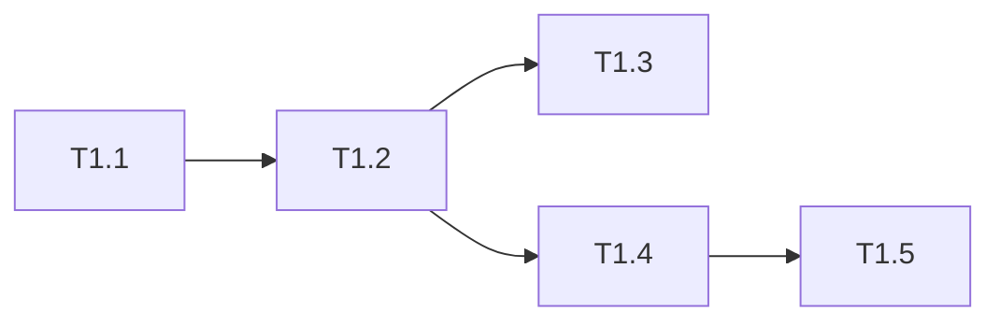

# uluo-web-standards 架构重构 Phase 1: 工具链独立 任务清单

> 日期: 2026-06-25 | 作者: huyongle | 关联: [../plans/README.md](../plans/README.md)

## 本阶段任务

- [ ] **T1.1**: 创建 uluo-web-toolchain skill 目录结构
  - **描述**: 新建 `skills/uluo-web-toolchain/` 目录，包含 `.claude-plugin/plugin.json`、`SKILL.md`、`scripts/`、`config/`
  - **产出物**: `skills/uluo-web-toolchain/.claude-plugin/plugin.json`（新增）
  - **参考**: 遵循 `skills/uluo-web-standards/.claude-plugin/plugin.json` 的结构
  - **验收**: 目录结构完整，plugin.json 字段正确
  - **依赖**: 无

- [ ] **T1.2**: 移动 scripts/ 和 config/ 到 uluo-web-toolchain
  - **描述**: 将 `skills/uluo-web-standards/scripts/` 和 `skills/uluo-web-standards/config/` 移动到 `skills/uluo-web-toolchain/`
  - **产出物**: `skills/uluo-web-toolchain/scripts/`（移动）、`skills/uluo-web-toolchain/config/`（移动）
  - **参考**: 保持文件内容不变
  - **验收**: uluo-web-standards 下不再有 scripts/ 和 config/；uluo-web-toolchain 下文件完整
  - **依赖**: T1.1

- [ ] **T1.3**: 编写 uluo-web-toolchain 的 SKILL.md
  - **描述**: 编写工具链 skill 的入口文档，说明触发条件、使用方式、依赖
  - **产出物**: `skills/uluo-web-toolchain/SKILL.md`（新增）
  - **参考**: 参考 `skills/uluo-web-standards/SKILL.md` 的结构，但聚焦工具链
  - **验收**: SKILL.md 说明清楚如何运行 validate-rules.js
  - **依赖**: T1.2

- [ ] **T1.4**: 修复 P0 代码缺陷（ESM 兼容、Windows 分隔符、正则误判）
  - **描述**: 修复之前审阅发现的 3 个 P0 bug：run-command.js 的 ESM 兼容性、NODE_PATH 的 Windows 分隔符、check-layer-boundary.js 的正则误判
  - **产出物**: `skills/uluo-web-toolchain/scripts/lib/run-command.js`（修改）、`skills/uluo-web-toolchain/scripts/check-layer-boundary.js`（修改）
  - **参考**: 见 spec 之前的审阅结果
  - **验收**: 在 macOS 和 Windows 上均能运行 validate-rules.js
  - **依赖**: T1.2

- [ ] **T1.5**: 验证工具链独立运行
  - **描述**: 在示例项目上运行 `node skills/uluo-web-toolchain/scripts/validate-rules.js <project-root>`，确认功能完整
  - **产出物**: 无（验证步骤）
  - **参考**: 使用 evals/workspaces/ 下的示例项目
  - **验收**: validate-rules.js 运行无报错，4 个检查步骤均执行
  - **依赖**: T1.4

## 本阶段预估

| 指标 | 值 |
|------|-----|
| 任务数 | 5 |
| 可并行任务 | 无（严格顺序） |

## 本阶段内依赖

