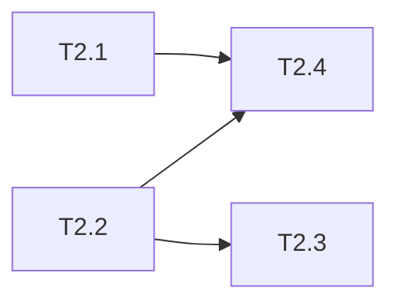

# uluo-web-standards 架构重构 Phase 2: references 移出与合并 任务清单

> 日期: 2026-06-25 | 作者: huyongle | 关联: [../plans/README.md](../plans/README.md) | 上一阶段: [phase1-toolchain-extraction.md](./phase1-toolchain-extraction.md)

## 本阶段任务

- [ ] **T2.1**: 创建 uluo-observability skill
  - **描述**: 新建 `skills/uluo-observability/` 目录，将 `observability-design.md` 移入，编写 plugin.json 和 SKILL.md
  - **产出物**: `skills/uluo-observability/.claude-plugin/plugin.json`（新增）、`skills/uluo-observability/SKILL.md`（新增）、`skills/uluo-observability/references/observability-design.md`（移动）
  - **参考**: 遵循 `skills/uluo-web-standards/.claude-plugin/plugin.json` 的结构
  - **验收**: uluo-observability skill 结构完整，observability-design.md 内容不变
  - **依赖**: 无

- [ ] **T2.2**: 合并 api-design.md 和 git-conventions.md 到 uluo-doc-standards
  - **描述**: 将 `api-design.md` 和 `git-conventions.md` 从 uluo-web-standards 移动到 `skills/uluo-doc-standards/references/`
  - **产出物**: `skills/uluo-doc-standards/references/api-design.md`（移动）、`skills/uluo-doc-standards/references/git-conventions.md`（移动）
  - **参考**: 保持文件内容不变
  - **验收**: uluo-doc-standards/references/ 下有这两个文件；uluo-web-standards/references/ 下不再有
  - **依赖**: 无

- [ ] **T2.3**: 更新 uluo-doc-standards 的 SKILL.md 文件索引
  - **描述**: 在 uluo-doc-standards/SKILL.md 的 references 文件索引中新增 api-design.md 和 git-conventions.md 条目
  - **产出物**: `skills/uluo-doc-standards/SKILL.md`（修改）
  - **参考**: 遵循现有文件索引表格格式
  - **验收**: 文件索引包含两个新条目，说明清楚何时加载
  - **依赖**: T2.2

- [ ] **T2.4**: 更新 uluo-web-standards 中对移出文件的引用
  - **描述**: 更新以下文件中对移出 references 的引用：
    - `infrastructure-setup.md`：更新对 observability-design.md 的引用（2 处）
    - `performance.md`：更新对 observability-design.md 的引用（1 处）
    - `coding-paradigms.md`：更新对 api-design.md 的引用（1 处）
  - **产出物**: `skills/uluo-web-standards/references/infrastructure-setup.md`（修改）、`skills/uluo-web-standards/references/performance.md`（修改）、`skills/uluo-web-standards/references/coding-paradigms.md`（修改）
  - **参考**: 改为跨 skill 引用说明，如"可观测性设计详见 uluo-observability skill"
  - **验收**: grep 搜索无断链引用
  - **依赖**: T2.1, T2.2

## 本阶段预估

| 指标 | 值 |
|------|-----|
| 任务数 | 4 |
| 可并行任务 | T2.1, T2.2 可并行 |

## 本阶段内依赖

