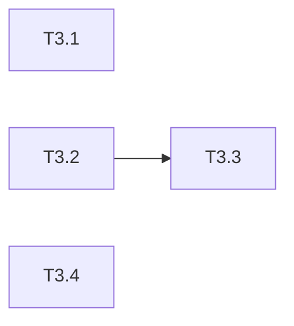

# uluo-web-standards 架构重构 Phase 3: SKILL.md 更新与注册 任务清单

> 日期: 2026-06-25 | 作者: huyongle | 关联: [../plans/README.md](../plans/README.md) | 上一阶段: [phase2-references-extraction.md](./phase2-references-extraction.md)

## 本阶段任务

- [ ] **T3.1**: 更新 uluo-web-standards 的 SKILL.md
  - **描述**: 更新 SKILL.md，移除对 scripts/config 的引用说明，移除场景映射表和按需加载触发表中 api-design/observability/git-conventions 条目，新增对 uluo-web-toolchain 的依赖说明，新增与 component-creator 的边界声明
  - **产出物**: `skills/uluo-web-standards/SKILL.md`（修改）
  - **参考**: 现有 SKILL.md 结构
  - **验收**: 
    - 场景映射表无 api-design/observability/git-conventions 条目
    - 按需加载触发表无对应条目
    - 有"依赖 uluo-web-toolchain 执行检查"的说明
    - 有"本 skill 针对常规业务组件开发，不覆盖 UI 组件库创建场景"的声明
  - **依赖**: T2.1, T2.2

- [ ] **T3.2**: 注册新 skill 到 marketplace.json
  - **描述**: 在 marketplace.json 的 plugins 数组中新增 uluo-web-toolchain 和 uluo-observability 条目
  - **产出物**: `marketplace.json`（修改）
  - **参考**: 现有 uluo-web-standards 条目格式
  - **验收**: marketplace.json 包含两个新条目，JSON 格式有效
  - **依赖**: T2.1

- [ ] **T3.3**: 更新 CLAUDE.md 已注册表格
  - **描述**: 在 CLAUDE.md 的已注册 skill 表格中新增 uluo-web-toolchain 和 uluo-observability 行
  - **产出物**: `CLAUDE.md`（修改）
  - **参考**: 现有表格格式
  - **验收**: 表格包含两个新行，类型和路径正确
  - **依赖**: T3.2

- [ ] **T3.4**: 修复 P1 代码质量问题
  - **描述**: 修复之前审阅发现的 P1 问题：eslint.config.mjs 的 TS 规则重复、report.js 的死代码、validate-rules.js 的注释编号、lint-eslint.js 等文件的入口判断脆弱
  - **产出物**: `skills/uluo-web-toolchain/config/eslint.config.mjs`（修改）、`skills/uluo-web-toolchain/scripts/lib/report.js`（修改）、`skills/uluo-web-toolchain/scripts/validate-rules.js`（修改）、`skills/uluo-web-toolchain/scripts/lint-eslint.js`（修改）、`skills/uluo-web-toolchain/scripts/lint-stylelint.js`（修改）、`skills/uluo-web-toolchain/scripts/check-tsc.js`（修改）、`skills/uluo-web-toolchain/scripts/check-layer-boundary.js`（修改）
  - **参考**: 见 spec 之前的审阅结果
  - **验收**: 代码无重复，无死代码，入口判断用 fileURLToPath
  - **依赖**: T1.4

## 本阶段预估

| 指标 | 值 |
|------|-----|
| 任务数 | 4 |
| 可并行任务 | T3.2, T3.3, T3.4 可并行 |

## 本阶段内依赖

