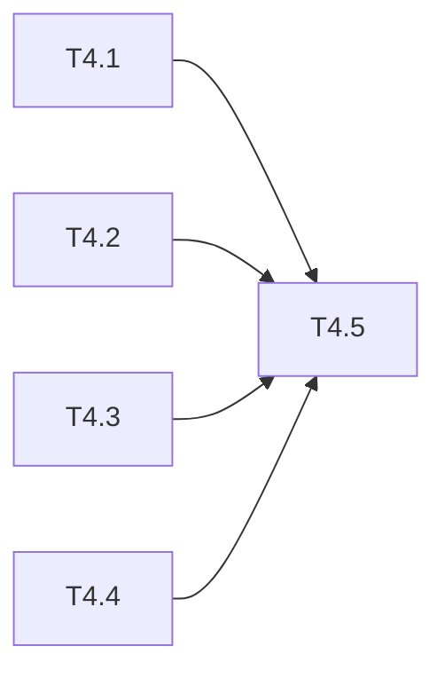

# uluo-web-standards 架构重构 Phase 4: 验证与收尾 任务清单

> 日期: 2026-06-25 | 作者: huyongle | 关联: [../plans/README.md](../plans/README.md) | 上一阶段: [phase3-skill-update-registration.md](./phase3-skill-update-registration.md)

## 本阶段任务

- [ ] **T4.1**: 验证 references 文件数和行数
  - **描述**: 统计 uluo-web-standards/references/ 的文件数和行数，确认达到验收标准
  - **产出物**: 无（验证步骤）
  - **验收**: 
    - 文件数 = 14（从 18 降至 14）
    - 行数 ≤ 4200（移出约 774 行）
  - **依赖**: T3.1

- [ ] **T4.2**: 验证引用完整性
  - **描述**: grep 搜索 uluo-web-standards/references/ 下所有 .md 文件，确认无对 api-design.md、observability-design.md、git-conventions.md 的断链引用
  - **产出物**: 无（验证步骤）
  - **参考**: 搜索 `api-design.md`、`observability-design.md`、`git-conventions.md` 字符串
  - **验收**: 无断链引用（已更新的引用除外）
  - **依赖**: T3.1

- [ ] **T4.3**: 验证工具链独立运行
  - **描述**: 在示例项目上运行 `node skills/uluo-web-toolchain/scripts/validate-rules.js <project-root>`，确认 4 个检查步骤均执行
  - **产出物**: 无（验证步骤）
  - **验收**: validate-rules.js 运行无报错
  - **依赖**: T3.4

- [ ] **T4.4**: 验证 marketplace.json 和 CLAUDE.md 一致性
  - **描述**: 检查 marketplace.json 的 plugins 数组和 CLAUDE.md 的已注册表格是否一致，均包含 uluo-web-toolchain 和 uluo-observability
  - **产出物**: 无（验证步骤）
  - **验收**: 两个文件均包含两个新 skill，信息一致
  - **依赖**: T3.3

- [ ] **T4.5**: 产出验收报告
  - **描述**: 对照 spec.md 的验收标准逐条验证，产出验收报告
  - **产出物**: `specs/uluo-web-standards-refactor/verification-report.md`（新增）
  - **参考**: uluo-doc-standards 的验收报告模板
  - **验收**: 所有验收标准通过或标注未通过原因
  - **依赖**: T4.1, T4.2, T4.3, T4.4

## 本阶段预估

| 指标 | 值 |
|------|-----|
| 任务数 | 5 |
| 可并行任务 | T4.1, T4.2, T4.3, T4.4 可并行 |

## 本阶段内依赖

